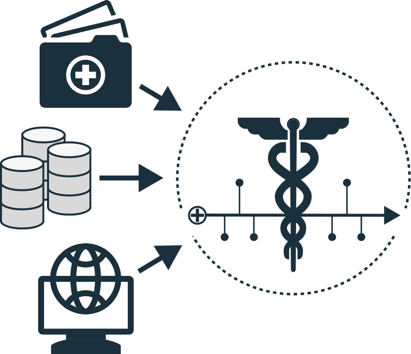

<p align="center">
  <picture>
    <source media="(prefers-color-scheme: dark)" srcset="static/logo_dark.svg">
    <source media="(prefers-color-scheme: light)" srcset="static/logo_light.svg">
    
  </picture>
</p>

# MEDS-Extract

[](https://pypi.org/project/MEDS-extract/)

[](https://medical-event-data-standard.github.io/)
[](https://meds-extract.readthedocs.io/en/latest/?badge=latest)
[](https://codecov.io/gh/mmcdermott/MEDS_extract)
[](https://github.com/mmcdermott/MEDS_extract/actions/workflows/tests.yml)
[](https://github.com/mmcdermott/MEDS_extract/actions/workflows/code-quality-main.yaml)
[](https://hydra.cc/)
[](https://github.com/mmcdermott/MEDS_extract#license)
[](https://github.com/mmcdermott/MEDS_extract/pulls)
[](https://github.com/mmcdermott/MEDS_extract/graphs/contributors)

MEDS Extract is a Python package that leverages the MEDS-Transforms framework to build efficient, reproducible
ETL (Extract, Transform, Load) pipelines for converting raw electronic health record (EHR) data into the
standardized [MEDS format](https://medical-event-data-standard.github.io/). If your dataset consists of files
containing patient observations with timestamps, codes, and values, MEDS Extract can automatically convert
your raw data into a compliant MEDS dataset in an efficient, scalable, and communicable way.

## 🚀 Quick Start

### 1. Install via `pip`:

```bash
pip install MEDS-extract
```

> [!NOTE]
> MEDS Extract v0.2.0 uses meds v0.3.3 and MEDS transforms v0.4.0. MEDS Extract v0.3.0 uses meds v0.4.0 and
> MEDS v0.5.0. Hotfixes will be released within those namespaces as required. Older versions may be supported
> in the v0.1.0 namespace.

### 2. Prepare your raw data

Ensure your data meets these requirements:

- **File-based**: Data stored in `.csv`, `.csv.gz`, or `.parquet` files. These may be stored locally or in the
    cloud, though intermediate processing currently must be done locally.
- **Comprehensive Rows**: Each file contains a dataframe structure where each row contains all required
    information to produce one or more MEDS events at full temporal granularity, without additional joining or
    merging.
- **Integer subject IDs**: The `subject_id` column must contain integer values (`int64`). Convert string IDs to
    integers before running the pipeline.

If these requirements are not met, you may need to perform some pre-processing steps to convert your raw data
into an accepted format, though typically these are very minor (e.g., joining across a join key, converting
time deltas into timestamps, etc.).

### 3. Create a MESSY file for your messy data!

The secret sauce of MEDS-Extract is how you configure it to identify events within your raw data files. This
is done by virtue of the "MEDS-Extract Specification Syntax YAML" (MESSY) file. Let's see an example of this
event configuration file in action:

```yaml
# Global subject ID column (can be overridden per file)
subject_id_col: patient_id

# File-level configurations
patients:
  subject_id_col: MRN # This file has a different subject ID column
  demographics: # One kind of event in this file.
    code:
      - DEMOGRAPHIC
      - col(gender)
    time:       # Static event
    race: race
    ethnicity: ethnicity

admissions:
  admission: # One kind of event in this file.
    code:
      - HOSPITAL_ADMISSION
      - col(admission_type)
    time: col(admit_datetime)
    time_format: '%Y-%m-%d %H:%M:%S'
    department: department # Extra columns get tracked
    insurance: insurance

  discharge: # A different kind of event in this file.
    code:
      - HOSPITAL_DISCHARGE
      - col(discharge_location)
    time: col(discharge_datetime)
    time_format: '%Y-%m-%d %H:%M:%S'

lab_results:
  lab:
    code:
      - LAB
      - col(test_name)
      - col(units)
    time: col(result_datetime)
    time_format: '%Y-%m-%d %H:%M:%S'
    numeric_value: result_value # This will get converted to a numeric
    text_value: result_text # This will get converted to a string
```

This file is also called the "Event conversion configuration file" and is the heart of the MEDS Extract
system.

### 4. Assemble your pipeline configuration

Beyond your extraction event configuration file, you also need to specify what pipeline stages you want to
run. You do this through a typical [MEDS-Transforms](https://meds-transforms.readthedocs.io/en/latest/)
pipeline configuration file. Here is a typical pipeline configuration file example.
Values like `$RAW_INPUT_DIR` are placeholders for your own paths or environment
variables and should be replaced with real values:

```yaml
input_dir: $RAW_INPUT_DIR
output_dir: $PIPELINE_OUTPUT

description: This pipeline extracts a dataset to MEDS format.

etl_metadata:
  dataset_name: $DATASET_NAME
  dataset_version: $DATASET_VERSION

# Points to the event conversion yaml file defined above.
event_conversion_config_fp: ???
# The shards mapping is stored in the root of the final output directory.
shards_map_fp: ${output_dir}/metadata/.shards.json

# Used if you need to load input files from cloud storage.
cloud_io_storage_options: {}

stages:
  - shard_events:
      data_input_dir: ${input_dir}
  - split_and_shard_subjects
  - convert_to_subject_sharded
  - convert_to_MEDS_events
  - merge_to_MEDS_cohort
  - extract_code_metadata
  - finalize_MEDS_metadata
  - finalize_MEDS_data
```

Save it on disk to `$PIPELINE_YAML` (e.g., `pipeline_config.yaml`).

> [!NOTE]
> A pipeline with these defaults is provided in `MEDS_extract.configs._extract`.
> You can reference it directly using the package path with the `pkg://` prefix
> in the runner command:
> `MEDS_transform-pipeline pipeline_config_fp=pkg://MEDS_extract.configs._extract`
> This avoids needing a local copy on disk.

### 5. Run the extraction pipeline

MEDS-Extract does not have a stand-alone CLI runner; instead, you run it via the default MEDS-Transforms
pipeline, but you specify your own pipeline configuration file via the package syntax.

```bash
MEDS_transform-pipeline pipeline_config_fp="$PIPELINE_YAML"
```

The result of this will be an extracted MEDS dataset in the specified output directory!

## 📊 Real-World Examples

MEDS Extract has been successfully used to convert several major EHR datasets, including
[MIMIC-IV](https://github.com/Medical-Event-Data-Standard/MIMIC_IV_MEDS).

## 📖 Event Configuration Deep Dive

The event configuration file is the heart of MEDS Extract. Here's how it works:

### Basic Structure

```yaml
relative_table_file_stem:
  event_name:
    code: [required] How to construct the event code
    time: [required] Timestamp column (set to null for static events)
    time_format: [optional] Format string for parsing timestamps
    property_name: column_name  # Additional properties to extract
```

### Code Construction

Event codes can be built in several ways:

```yaml
# Simple string literal
vitals:
  heart_rate:
    code: "HEART_RATE"

# Column reference
vitals:
  heart_rate:
    code: col(measurement_type)

# Composite codes (joined with "//")
vitals:
  heart_rate:
    code:
      - "VITAL_SIGN"
      - col(measurement_type)
      - col(units)
```

### Time Handling

```yaml
# Simple datetime column
lab_results:
  lab:
    time: col(result_time)

# Custom time format
lab_results:
  lab:
    time: col(result_time)
    time_format: "%m/%d/%Y %H:%M"

# Multiple format attempts
lab_results:
  lab:
    time: col(result_time)
    time_format:
      - "%Y-%m-%d %H:%M:%S"
      - "%m/%d/%Y %H:%M"

# Static events (no time)
demographics:
  gender:
    time: null
```

### Subject ID Configuration

```yaml
# Global default
subject_id_col: patient_id

# File-specific override
admissions:
  subject_id_col: hadm_id
  admission:
    code: ADMISSION
    # ...
```

### Joining Tables

Sometimes subject identifiers are stored in a separate table from the events
you wish to extract. You can specify a join within the event configuration so
that the necessary columns are merged before extraction.

```yaml
vitals:
  join:
    input_prefix: stays
    left_on: stay_id
    right_on: stay_id
    columns_from_right:
      - subject_id
  subject_id_col: subject_id
  HR:
    code: HR
    time: col(charttime)
    time_format: '%m/%d/%Y %H:%M:%S'
    numeric_value: HR
```

### Metadata Linking

For datasets with separate metadata tables:

```yaml
lab_results:
  lab:
    code:
      - LAB
      - col(itemid)
    time: col(charttime)
    numeric_value: valuenum
    _metadata:
      input_file: d_labitems
      code_columns:
        - itemid
      properties:
        label: label
        fluid: fluid
        category: category
```

## 🛠️ Troubleshooting

### Performance Optimization

- **Manually pre-shard your input data** if you have very large files. You can then configure your pipeline to
    skip the row-sharding stage and start directly with the `convert_to_subject_sharded` stage.
- **Use parallel processing** for faster extraction via the typical MEDs-Transforms parallelization
    options.

## Future Roadmap

1. Incorporating more of the pre-MEDS and joining logic that is common into this repository.
2. Automatic support for running in "demo mode" for testing and validation.
3. Better examples and documentation for common use cases, including incorporating data cleaning stages
    after the core extraction.
4. Providing a default runner or multiple default pipeline files for user convenience.

## 🤝 Contributing

We welcome contributions! Please see our [Contributing Guide](CONTRIBUTING.md) for more details.

## 📄 License

This project is licensed under the MIT License - see the [LICENSE](LICENSE) file for details.

## 🙏 Acknowledgments

MEDS Extract builds on the [MEDS-Transforms](https://github.com/mmcdermott/MEDS_transforms) framework and the [MEDS standard](https://medical-event-data-standard.github.io/). Special thanks to:

- The MEDS community for developing the standard
- Contributors to MEDS-Transforms for the underlying infrastructure
- Healthcare institutions sharing their data for research

## 📖 Citation

If you use MEDS Extract in your research, please cite:

```bibtex
@software{meds_extract2024,
  title={MEDS Extract: ETL Pipelines for Converting EHR Data to MEDS Format},
  author={McDermott, Matthew and contributors},
  year={2024},
  url={https://github.com/mmcdermott/MEDS_extract}
}
```

______________________________________________________________________

**Ready to standardize your EHR data?** Start with our [Quick Start](#-quick-start) guide or explore our [examples](./examples/) directory for real-world configurations.
