# AbstractLLM Architecture Diagrams

## Level 1: High-Level Package Architecture

### 1.1 Three-Package Overview
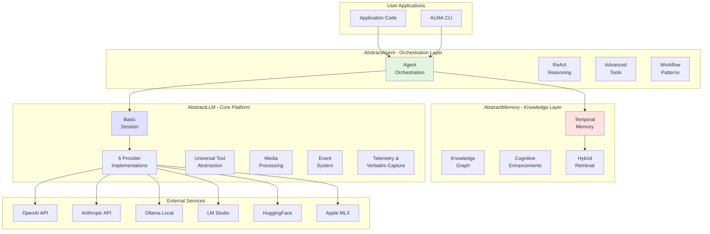

### 1.2 Dependency Relationships
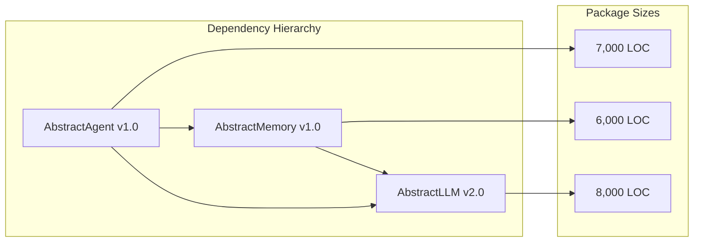

## Level 2: Component Architecture

### 2.1 AbstractLLM Core Components
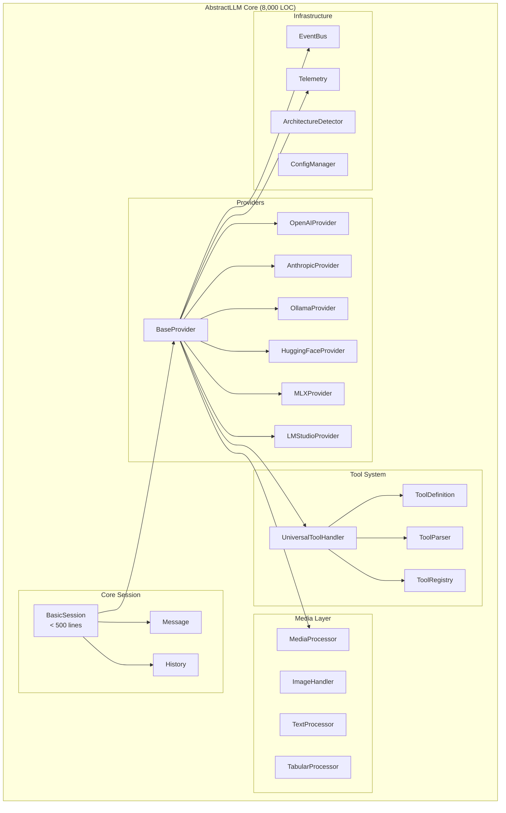

### 2.2 AbstractMemory Components
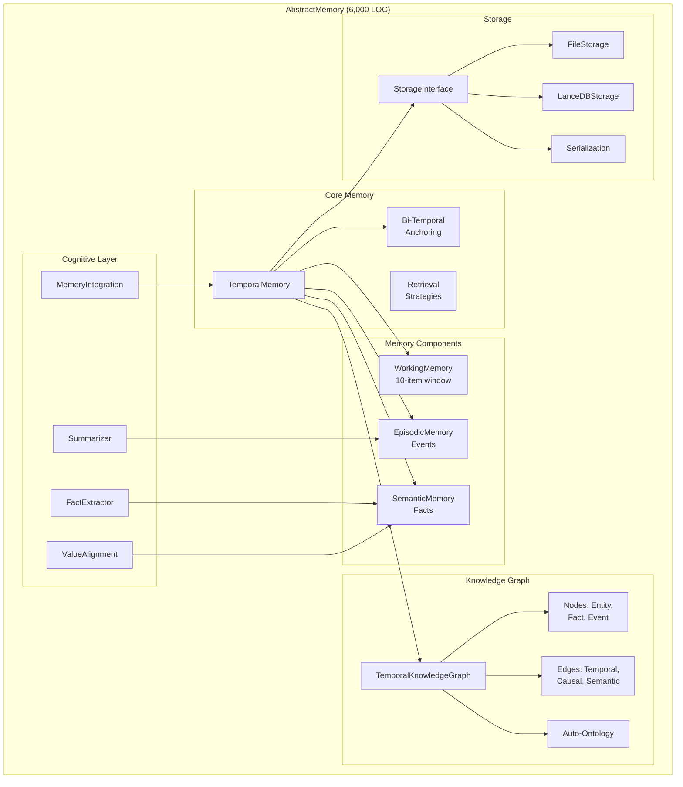

### 2.3 AbstractAgent Components
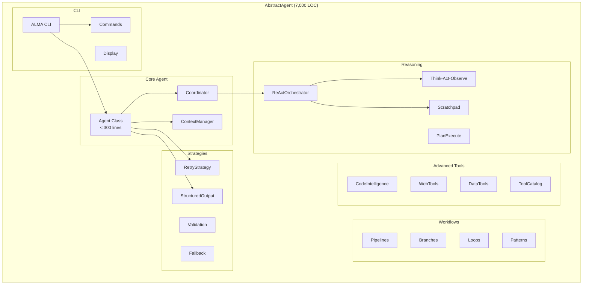

## Level 3: Query Flow Architecture

### 3.1 Simple Query Flow (No Tools, No Memory)
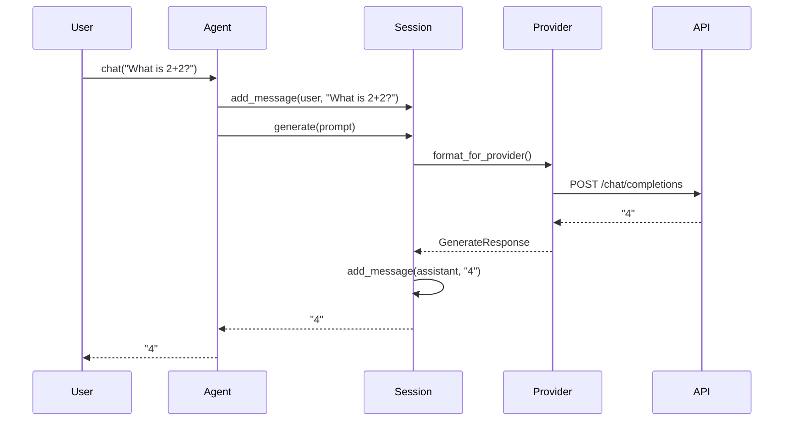

### 3.2 Query with Memory Context
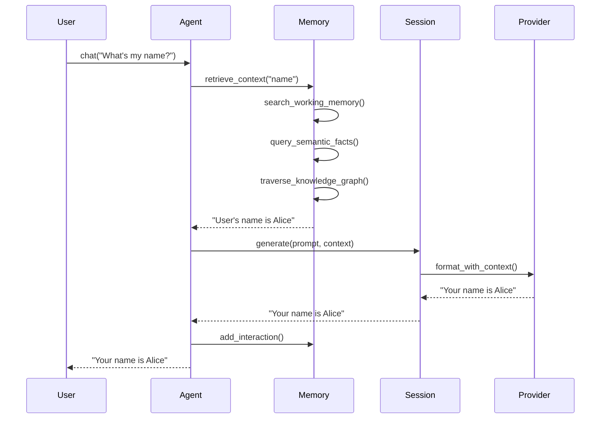

### 3.3 Query with Tool Execution
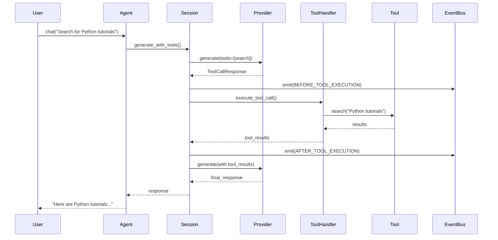

### 3.4 ReAct Reasoning Flow
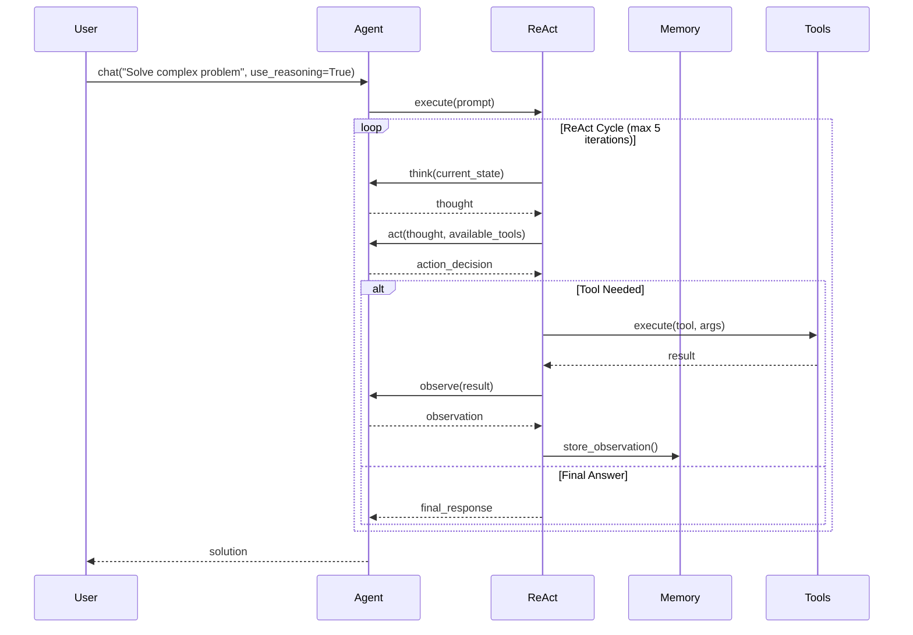

## Level 4: Detailed Component Interactions

### 4.1 Provider Tool Handling Differences
```mermaid
graph TB
    subgraph "Tool Request from User"
        REQ[User Request:<br/>"Search for X"]
    end

    subgraph "AbstractLLM UniversalToolHandler"
        UTH[Universal<br/>Tool Handler]
        DETECT[Architecture<br/>Detection]
    end

    subgraph "Provider-Specific Formatting"
        subgraph "OpenAI"
            OAI_FMT["{type: 'function',<br/>function: {...}}"]
        end

        subgraph "Anthropic"
            ANT_FMT["&lt;tool_call&gt;<br/>...&lt;/tool_call&gt;"]
        end

        subgraph "Ollama (Qwen)"
            QWEN_FMT["&lt;|tool_call|&gt;<br/>...&lt;|tool_call|&gt;"]
        end

        subgraph "Ollama (Llama)"
            LLAMA_FMT["&lt;function_call&gt;<br/>...&lt;/function_call&gt;"]
        end
    end

    REQ --> UTH
    UTH --> DETECT

    DETECT -->|provider=openai| OAI_FMT
    DETECT -->|provider=anthropic| ANT_FMT
    DETECT -->|model=qwen| QWEN_FMT
    DETECT -->|model=llama| LLAMA_FMT
```

### 4.2 Memory Bi-Temporal Model
```mermaid
graph TB
    subgraph "Fact Addition"
        FACT["Alice visited Paris"]
        EVT_TIME[Event Time:<br/>2024-01-15 10:00]
        ING_TIME[Ingestion Time:<br/>2024-01-16 14:30]
    end

    subgraph "Temporal Knowledge Graph"
        subgraph "Time T1: Before Event"
            T1[No knowledge of visit]
        end

        subgraph "Time T2: Event Occurs"
            T2[Alice visits Paris<br/>(not yet known)]
        end

        subgraph "Time T3: Knowledge Added"
            T3[System learns:<br/>Alice visited Paris]
        end

        subgraph "Time T4: Query Time"
            T4_Q1[Query: "What happened on Jan 15?"<br/>→ Alice visited Paris]
            T4_Q2[Query: "What did we know on Jan 15?"<br/>→ Nothing about visit]
        end
    end

    FACT --> EVT_TIME
    FACT --> ING_TIME

    T1 -->|Time passes| T2
    T2 -->|Time passes| T3
    T3 -->|Time passes| T4_Q1
    T3 -->|Time passes| T4_Q2
```

### 4.3 Event System Architecture
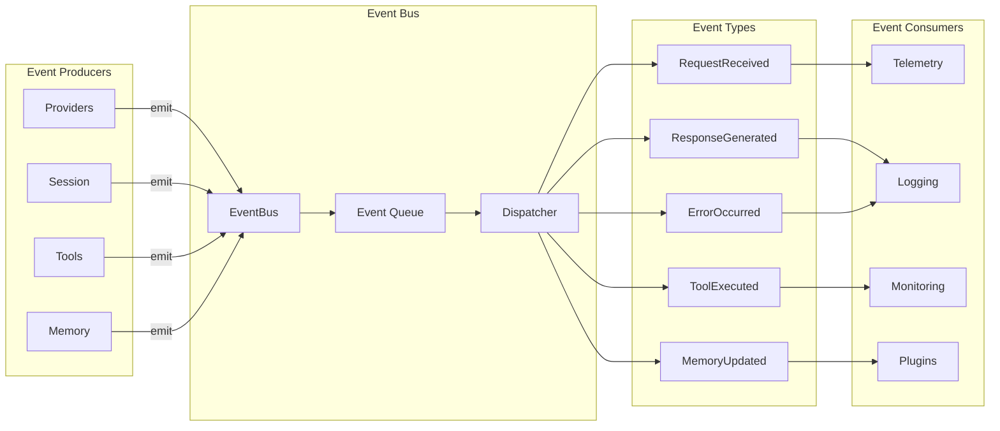

## Level 5: Migration Strategy

### 5.1 Compatibility Layer
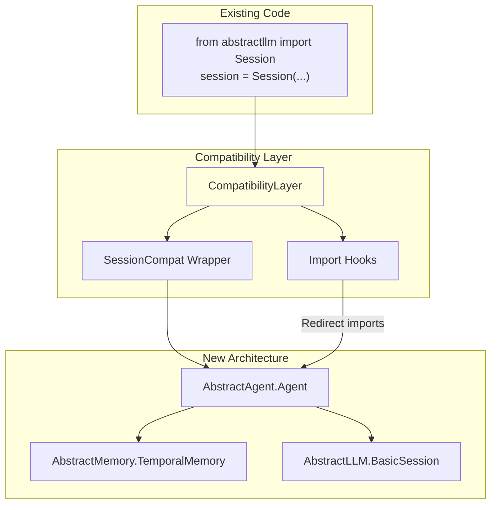

### 5.2 Phased Migration Path
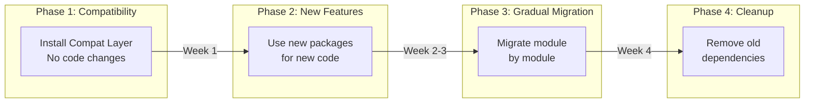

## Level 6: Performance Architecture

### 6.1 Streaming Response Flow
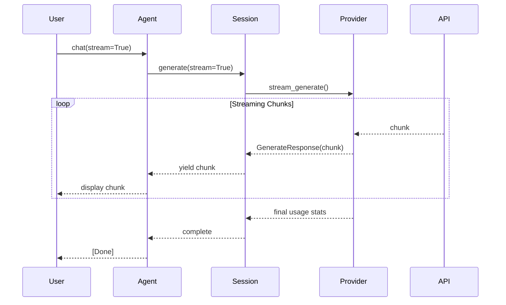

### 6.2 Async Operation Flow
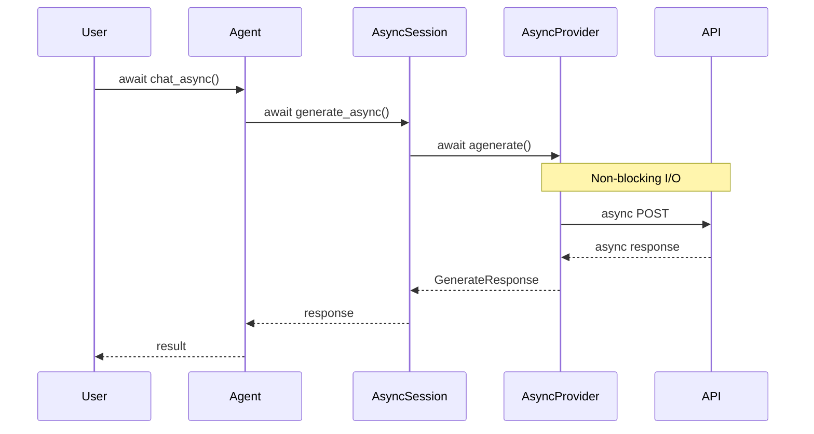

## Level 7: Storage Architecture

### 7.1 Memory Storage Options
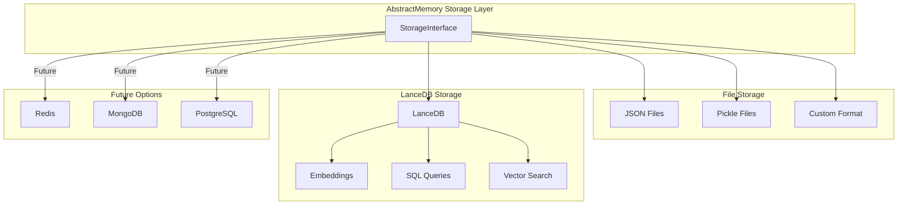

## Level 8: Complete Query Lifecycle

### 8.1 End-to-End Query Processing
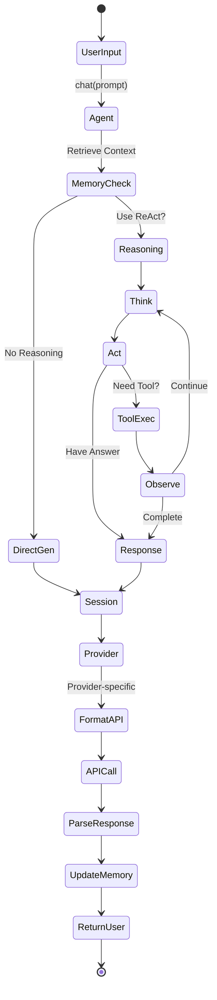

## Key Architectural Principles

### 1. **Separation of Concerns**
- AbstractLLM: Provider abstraction only
- AbstractMemory: Knowledge persistence only
- AbstractAgent: Orchestration only

### 2. **Clean Interfaces**
- Each package has clear entry points
- No circular dependencies
- Well-defined APIs between packages

### 3. **Provider Abstraction**
- All provider complexity hidden in AbstractLLM
- Unified interface for tools, media, streaming
- Architecture detection for model-specific handling

### 4. **Temporal Knowledge**
- Bi-temporal model for accurate history
- Hybrid retrieval for best results
- Auto-ontology for relationship discovery

### 5. **Extensibility**
- Event system for plugins
- Storage interface for backends
- Tool registry for capabilities

### 6. **Performance**
- Streaming support throughout
- Async operations where needed
- Efficient memory retrieval (<100ms)

### 7. **Backward Compatibility**
- Compatibility layer for migration
- Import hooks for old paths
- Gradual migration support

## Validation: Query Flow After Refactoring

The refactored architecture maintains all current capabilities while improving:

1. **Maintainability**: No more 4,099-line God classes
2. **Performance**: Clean separation enables optimization
3. **Extensibility**: Event system and clear interfaces
4. **Testability**: Each package can be tested independently
5. **Scalability**: Can evolve packages independently

The query flow remains smooth:
- User → Agent → Memory + Session → Provider → Response
- Tools integrate naturally through UniversalToolHandler
- Memory provides context without coupling
- ReAct reasoning orchestrates complex queries

This architecture successfully achieves our goals of:
- Lightweight unified LLM interface (AbstractLLM)
- Advanced memory system (AbstractMemory)
- Autonomous agent capabilities (AbstractAgent)

All while maintaining the same functionality as the current `abstractllm/cli.py` implementation.