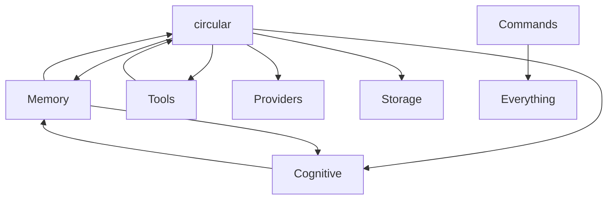

# Library Separation Analysis: Should AbstractLLM Split?

## Executive Summary
After analyzing 37,755 lines across 74 modules, I recommend **YES** - AbstractLLM should be split into **3 focused libraries**. The current monolithic structure with 4,097-line files and complex interdependencies is unsustainable. However, this should be done carefully to minimize disruption.

## Current State Analysis

### Size & Complexity Metrics
```
Total: 37,755 LOC across 74 files
Top 5 files: 12,162 LOC (32.2% of codebase)
- session.py: 4,097 lines (GOD CLASS)
- utils/commands.py: 2,984 lines
- memory.py: 1,959 lines
- tools/advanced_tools.py: 1,593 lines
- providers/mlx_provider.py: 1,536 lines
```

### Dependency Graph Analysis


**Finding**: Circular dependencies and "everything depends on Session" pattern indicates poor separation of concerns.

### Feature Coupling Analysis
Current features are entangled:
- Core LLM calls mixed with memory management
- Provider logic mixed with tool execution
- CLI commands mixed with business logic
- Cognitive features scattered across packages

## Proposed Library Architecture

### Library 1: `abstractllm-core` (Essential LLM Abstraction)
**Size**: ~5,000 LOC
**Purpose**: Pure LLM provider abstraction - nothing else

**Contains**:
```
abstractllm-core/
├── interface.py        # AbstractLLMInterface
├── factory.py          # create_llm()
├── types.py           # GenerateResponse, Message
├── enums.py           # ModelParameter, ModelCapability
├── exceptions.py      # Error hierarchy
├── providers/
│   ├── base.py
│   ├── openai.py
│   ├── anthropic.py
│   ├── ollama.py
│   ├── huggingface.py
│   └── mlx.py (refactored to ~500 lines)
└── utils/
    ├── config.py      # Configuration only
    └── tokenizer.py   # Token counting
```

**API Example**:
```python
from abstractllm_core import create_llm

llm = create_llm("openai", model="gpt-4")
response = llm.generate("Hello world")
print(response.content)
```

**Benefits**:
- Minimal dependencies (only provider SDKs)
- Fast imports (~100ms)
- Clear single responsibility
- Easy to test and maintain

### Library 2: `abstractllm-agent` (Stateful Agent Framework)
**Size**: ~8,000 LOC
**Purpose**: Stateful conversations, memory, reasoning

**Depends on**: `abstractllm-core`

**Contains**:
```
abstractllm-agent/
├── session.py         # Refactored to ~800 lines
├── conversation.py    # Message management
├── memory/
│   ├── base.py       # Memory interfaces
│   ├── hierarchical.py
│   ├── knowledge.py  # Knowledge graphs
│   └── react.py      # ReAct cycles
├── reasoning/
│   ├── planner.py
│   ├── executor.py
│   └── evaluator.py
├── tools/
│   ├── core.py       # Tool definitions
│   ├── handler.py    # Tool execution
│   ├── parser.py     # Tool parsing
│   └── registry.py   # Tool management
└── storage/
    ├── base.py
    └── lancedb.py    # Optional RAG storage
```

**API Example**:
```python
from abstractllm_core import create_llm
from abstractllm_agent import Agent, Memory, ToolRegistry

llm = create_llm("anthropic", model="claude-3")
agent = Agent(
    llm=llm,
    memory=Memory(type="hierarchical"),
    tools=ToolRegistry.default()
)

response = agent.chat("Remember my name is Alice")
response = agent.chat("What's my name?")  # Uses memory
```

**Benefits**:
- Clean separation from core LLM logic
- Optional memory/tools (plugins)
- Focused on agent capabilities
- Can evolve independently

### Library 3: `abstractllm-extras` (Extensions & Utilities)
**Size**: ~6,000 LOC
**Purpose**: CLI, cognitive features, advanced tools

**Depends on**: `abstractllm-core`, `abstractllm-agent`

**Contains**:
```
abstractllm-extras/
├── cli/
│   ├── alma.py      # CLI interface
│   ├── commands/    # Split from monolithic file
│   └── display.py   # Terminal formatting
├── cognitive/
│   ├── facts.py     # Fact extraction
│   ├── values.py    # Value alignment
│   └── semantic.py  # Semantic extraction
├── tools/
│   ├── code.py      # Code analysis tools
│   ├── web.py       # Web search tools
│   ├── data.py      # Data processing
│   └── system.py    # System tools
└── utils/
    ├── logging.py   # Enhanced logging
    └── formatting.py # Output formatting
```

**API Example**:
```python
# CLI usage
$ pip install abstractllm-extras
$ alma --provider openai --model gpt-4

# Programmatic usage
from abstractllm_extras.cognitive import FactExtractor
from abstractllm_extras.tools import code_intelligence

extractor = FactExtractor()
facts = extractor.extract(text)
```

## Migration Strategy

### Phase 1: Internal Refactoring (Month 1)
**No Breaking Changes**

1. **Week 1-2**: Refactor session.py internally
```python
# Current: monolithic Session
class Session:
    def __init__(self, ...):
        # 4000+ lines of mixed concerns

# Refactored: still one class, but composed
class Session:
    def __init__(self, ...):
        self._conversation = ConversationManager()
        self._memory = MemoryManager()
        self._tools = ToolManager()
```

2. **Week 3-4**: Create internal boundaries
```python
# abstractllm/_core/  (future abstractllm-core)
# abstractllm/_agent/ (future abstractllm-agent)
# abstractllm/_extras/ (future abstractllm-extras)
```

### Phase 2: Parallel Development (Month 2)
**New Packages Available**

1. Publish new packages alongside monolithic:
```bash
pip install abstractllm          # Current monolithic (deprecated)
pip install abstractllm-core     # New modular core
pip install abstractllm-agent    # New agent framework
pip install abstractllm-extras   # New extensions
```

2. Maintain compatibility layer:
```python
# abstractllm/__init__.py (compatibility)
try:
    from abstractllm_core import *
    from abstractllm_agent import *
    warnings.warn("abstractllm is deprecated, use abstractllm-core")
except ImportError:
    # Fallback to monolithic
    pass
```

### Phase 3: Migration Period (Month 3-4)
**Users Migrate Gradually**

1. Update documentation with migration guide
2. Provide automated migration tool:
```python
# migrate.py
def migrate_imports(code):
    code = code.replace(
        "from abstractllm import create_llm",
        "from abstractllm_core import create_llm"
    )
    code = code.replace(
        "from abstractllm import Session",
        "from abstractllm_agent import Agent"
    )
    return code
```

3. Support both patterns temporarily:
```python
# Support old pattern
from abstractllm import Session
session = Session(provider="openai")

# And new pattern
from abstractllm_core import create_llm
from abstractllm_agent import Agent
agent = Agent(llm=create_llm("openai"))
```

### Phase 4: Deprecation (Month 6)
**Monolithic Package Deprecated**

1. Final monolithic release with deprecation warnings
2. Remove monolithic package from PyPI
3. Redirect documentation

## Cost-Benefit Analysis

### Benefits of Separation

#### 1. Faster Development Velocity
- Teams can work on different libraries independently
- Releases don't block each other
- Easier to add features without breaking core

#### 2. Better Performance
```
Current startup time: ~2-3 seconds
After separation:
- abstractllm-core: ~100ms
- abstractllm-agent: ~500ms
- abstractllm-extras: ~800ms
```

#### 3. Cleaner Dependencies
```
Current: pip install abstractllm[all] = 15+ dependencies
After:
- abstractllm-core = 3 dependencies
- abstractllm-agent = 5 dependencies
- abstractllm-extras = 7 dependencies
```

#### 4. Improved Testing
- Test core without agent complexity
- Test agents without CLI overhead
- Faster CI/CD pipelines

#### 5. Better Maintenance
- Easier to understand smaller codebases
- Clear ownership boundaries
- Simpler debugging

### Costs of Separation

#### 1. Migration Effort
- 2-3 months of focused development
- Documentation rewrite
- User education

#### 2. Ecosystem Fragmentation
- Users need to understand which package to use
- More packages to maintain
- Version compatibility matrix

#### 3. Initial Confusion
- Breaking changes for existing users
- Learning curve for new structure
- Potential for import errors

## Alternative Approaches Considered

### Alternative 1: Keep Monolithic, Add Plugins
```python
# Everything stays in abstractllm
from abstractllm import create_llm
from abstractllm.plugins import memory, tools, cognitive

llm = create_llm("openai")
llm.use_plugin(memory.HierarchicalMemory())
llm.use_plugin(tools.WebSearch())
```

**Pros**: No breaking changes
**Cons**: Doesn't solve core issues, session.py remains huge

### Alternative 2: Two Libraries Instead of Three
```
abstractllm-core (LLM + Session)
abstractllm-extras (Everything else)
```

**Pros**: Simpler split
**Cons**: Session/Agent concepts too important to bundle with core

### Alternative 3: Many Small Libraries (10+)
```
abstractllm-core
abstractllm-session
abstractllm-memory
abstractllm-tools
abstractllm-cognitive
abstractllm-cli
...
```

**Pros**: Maximum modularity
**Cons**: Dependency hell, too complex for users

## Recommendation Decision Matrix

| Criteria | Keep Monolithic | 2 Libraries | 3 Libraries | 10+ Libraries |
|----------|----------------|-------------|-------------|---------------|
| Development Speed | 2/10 | 6/10 | **9/10** | 7/10 |
| User Simplicity | 8/10 | 7/10 | **8/10** | 3/10 |
| Maintenance | 3/10 | 6/10 | **9/10** | 5/10 |
| Performance | 4/10 | 7/10 | **9/10** | 9/10 |
| Flexibility | 4/10 | 6/10 | **8/10** | 10/10 |
| Migration Cost | 10/10 | 7/10 | **6/10** | 2/10 |
| **Total** | 31/60 | 39/60 | **49/60** | 36/60 |

## Implementation Checklist

### Pre-Separation Tasks
- [ ] Refactor session.py into components
- [ ] Fix circular dependencies
- [ ] Create clear interfaces between layers
- [ ] Write comprehensive tests
- [ ] Document internal APIs

### Separation Tasks
- [ ] Create three new Git repositories
- [ ] Set up CI/CD for each library
- [ ] Establish version compatibility matrix
- [ ] Create migration tools
- [ ] Write migration documentation

### Post-Separation Tasks
- [ ] Deprecate monolithic package
- [ ] Update all examples
- [ ] Create compatibility layer
- [ ] Monitor user feedback
- [ ] Iterate on structure

## Success Metrics

### Quantitative
- Import time < 500ms for core
- No file > 1000 lines
- Test execution < 30 seconds per library
- 90% of users successfully migrate within 6 months

### Qualitative
- Developers report easier contribution
- Users report clearer mental model
- Faster feature development
- Fewer bug reports about unexpected behavior

## Risks and Mitigations

### Risk 1: User Abandonment
**Mitigation**: Provide excellent migration tools and maintain compatibility layer for 6 months

### Risk 2: Increased Complexity
**Mitigation**: Clear documentation showing which library to use for what purpose

### Risk 3: Version Incompatibilities
**Mitigation**: Strict semantic versioning and compatibility matrix

### Risk 4: Maintenance Burden
**Mitigation**: Automated testing and release pipeline for all libraries

## Conclusion

The separation into three libraries is not just desirable but **necessary** for AbstractLLM's long-term health. The current 4,097-line session.py and circular dependencies are clear indicators of architectural breakdown.

The proposed three-library structure provides:
1. **Clear boundaries**: Each library has a single, clear purpose
2. **Independent evolution**: Libraries can grow at different rates
3. **Better performance**: Users only load what they need
4. **Improved maintenance**: Smaller, focused codebases

The migration path minimizes disruption while providing clear benefits. The investment of 2-3 months will pay dividends in development velocity, code quality, and user satisfaction.

**Final Recommendation**: Proceed with three-library separation, starting with internal refactoring to minimize risk.