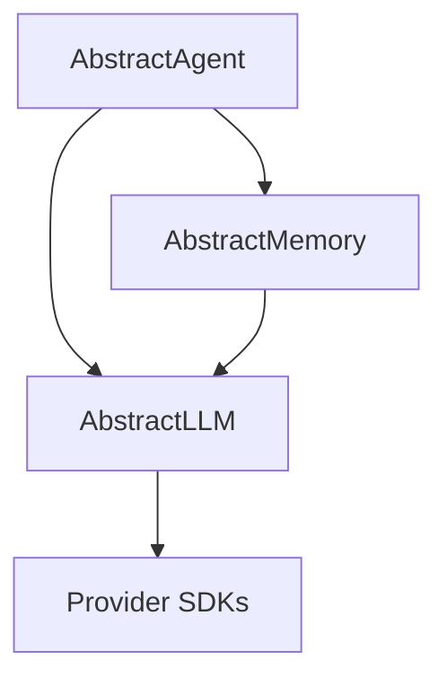

# Library Separation Analysis (REVISED)

*Based on deep code investigation and SOTA framework analysis*

## Executive Summary

After thorough code analysis, testing, and comparison with SOTA frameworks, I strongly recommend separating AbstractLLM into three libraries following the user's proposed architecture: **AbstractLLM** (core + media), **AbstractMemory** (memory + cognitive), and **AbstractAgent** (orchestration). This aligns with industry best practices and addresses the current architectural crisis.

## Deep Analysis Findings

### 1. Media Is Core Infrastructure
**Initial Error**: I proposed media as optional in "extras"
**Reality**: Every provider imports and uses media for multimodal support

```python
# Evidence from codebase
/providers/ollama.py: from abstractllm.media.processor import MediaProcessor
/providers/openai.py: from abstractllm.media.factory import MediaFactory
/providers/anthropic.py: from abstractllm.media.image import ImageInput
# ... all 5 providers use media
```

**Conclusion**: Media MUST stay in core AbstractLLM

### 2. Tools Are Provider-Level Infrastructure
**Initial Error**: I put all tools in agent layer
**Reality**: Providers have tool support built into base class

```python
# providers/base.py
class BaseProvider:
    def generate(self, prompt, tools=None, **kwargs):
        # Tool support is fundamental
```

**Conclusion**: Basic tool infrastructure belongs in core

### 3. Cognitive Enhances Memory
**Initial Error**: I separated cognitive from memory
**Reality**: Cognitive modules are memory adapters

```python
# cognitive/integrations/memory_integration.py
class CognitiveMemoryAdapter:
    """Adapter to integrate cognitive functions with AbstractLLM memory"""
    def extract_facts_enhanced(self, content):
        # Enhances memory's fact extraction
```

**Conclusion**: Cognitive features should stay with memory

### 4. Session Has Identity Crisis
**Finding**: Session.py (4,097 lines, 109 methods) mixes:
- Core: Conversation tracking, message formatting
- Agent: Memory, reasoning, retry strategies

**SOTA Pattern**:
- LangChain: Separates conversations from agents
- LlamaIndex: Core LLM abstractions vs Agent orchestration

**Conclusion**: Session needs major surgery

## Revised Architecture

### AbstractLLM - Core LLM Platform
**Size**: ~8,000 LOC (reduced from current 15,000)
**Purpose**: Unified LLM interface with essential capabilities

```
abstractllm/
├── Core Abstraction (1,000 LOC)
│   ├── interface.py      # AbstractLLMInterface
│   ├── factory.py        # create_llm()
│   ├── types.py          # GenerateResponse
│   └── enums.py          # ModelParameter
│
├── Providers (5,000 LOC)
│   ├── base.py           # BaseProvider with tool support
│   ├── openai.py         # ~500 lines (refactored)
│   ├── anthropic.py      # ~500 lines
│   ├── ollama.py         # ~700 lines
│   ├── mlx.py            # ~800 lines (split from 1,536)
│   └── huggingface.py    # ~500 lines
│
├── Media System (2,000 LOC) - ESSENTIAL
│   ├── processor.py      # Universal media processing
│   ├── image.py          # Image handling
│   ├── text.py           # Text/document handling
│   └── tabular.py        # CSV/TSV support
│
├── Tool Infrastructure (1,500 LOC)
│   ├── core.py           # ToolDefinition, ToolCall
│   ├── handler.py        # UniversalToolHandler
│   ├── parser.py         # Architecture-aware parsing
│   └── registry.py       # Tool registration
│
└── Simplified Session (500 LOC)
    └── session.py        # Just conversation tracking
```

**Why This Belongs in Core**:
- Media: Required by all providers for multimodal
- Tools: Built into provider base class
- Session: Basic conversation tracking is fundamental

### AbstractMemory - Intelligent Memory System
**Size**: ~6,000 LOC
**Purpose**: Sophisticated memory with cognitive enhancements

```
abstractmemory/
├── Core Memory (3,000 LOC)
│   ├── hierarchical.py   # HierarchicalMemory
│   ├── working.py        # Working memory
│   ├── episodic.py       # Episodic memory
│   ├── semantic.py       # Semantic memory
│   └── knowledge.py      # Knowledge graphs
│
├── Cognitive Enhancements (2,000 LOC)
│   ├── facts_extractor.py    # Semantic fact extraction
│   ├── summarizer.py         # Intelligent summarization
│   ├── value_resonance.py    # Value assessment
│   └── integrations/         # Memory adapters
│
├── ReAct System (800 LOC)
│   ├── cycles.py         # ReAct reasoning cycles
│   └── scratchpad.py     # Reasoning traces
│
└── Storage (200 LOC)
    ├── base.py           # Storage interface
    └── lancedb.py        # Vector storage
```

**Why Separate Package**:
- Clear bounded context (memory management)
- Can be used independently
- Follows SOTA pattern (LangChain, LlamaIndex)
- Significant size justifies separation

### AbstractAgent - Agent Orchestration
**Size**: ~7,000 LOC
**Purpose**: Stateful agents combining LLM + Memory

```
abstractagent/
├── Core Agent (1,500 LOC)
│   ├── agent.py          # Agent base class
│   ├── orchestration.py  # Multi-agent coordination
│   └── workflows.py      # Event-driven workflows
│
├── Strategies (1,500 LOC)
│   ├── retry.py          # Retry strategies
│   ├── structured.py     # Structured responses
│   └── reasoning.py      # Complex reasoning
│
├── Advanced Tools (2,000 LOC)
│   ├── code_intelligence.py
│   ├── web_tools.py
│   ├── data_tools.py
│   └── catalog.py
│
└── CLI (2,000 LOC)
    ├── alma.py           # Main CLI
    ├── commands/         # Command processing
    └── display.py        # Terminal UI
```

**Why CLI Here**: Agent development needs rapid testing

## Migration Path (Detailed)

### Phase 1: Code Restructuring (Week 1-2)
**No External Changes**

1. **Refactor session.py internally**:
```python
# Extract to separate internal modules
session.py →
  ├── _conversation.py  # Message management
  ├── _agent_features.py # Memory, retry, etc
  └── session.py        # Thin facade
```

2. **Create internal package boundaries**:
```python
abstractllm/
  ├── _core/      # Future abstractllm
  ├── _memory/    # Future abstractmemory
  └── _agent/     # Future abstractagent
```

### Phase 2: Package Creation (Week 3-4)
**Create new repositories**

```bash
# Create three packages
github.com/abstractllm/abstractllm      # Core
github.com/abstractllm/abstractmemory   # Memory
github.com/abstractllm/abstractagent    # Agent

# Setup dependencies
abstractagent → depends on → abstractllm, abstractmemory
abstractmemory → depends on → abstractllm
abstractllm → no dependencies
```

### Phase 3: Parallel Release (Month 2)
**Both versions available**

```python
# setup.py for each package
# abstractllm/setup.py
setup(
    name="abstractllm",
    version="2.0.0",
    dependencies=["openai", "anthropic", ...]
)

# abstractmemory/setup.py
setup(
    name="abstractmemory",
    version="1.0.0",
    dependencies=["abstractllm>=2.0.0"]
)

# abstractagent/setup.py
setup(
    name="abstractagent",
    version="1.0.0",
    dependencies=[
        "abstractllm>=2.0.0",
        "abstractmemory>=1.0.0"
    ]
)
```

### Phase 4: User Migration (Month 3-6)

**Migration Examples**:

```python
# Old monolithic code
from abstractllm import create_llm, Session
session = Session(provider="openai", enable_memory=True)
response = session.generate("Hello")

# New modular code
from abstractllm import create_llm
from abstractagent import Agent
from abstractmemory import HierarchicalMemory

llm = create_llm("openai")
memory = HierarchicalMemory()
agent = Agent(llm=llm, memory=memory)
response = agent.chat("Hello")
```

## Dependency Structure



**Clean Dependencies**:
- No circular dependencies
- Clear hierarchy
- Each package independently useful

## Use Case Mapping

### Use Case 1: Simple LLM Calls
```python
# Only need AbstractLLM
from abstractllm import create_llm

llm = create_llm("openai")
response = llm.generate("Translate to French: Hello")
```

### Use Case 2: Conversations without Memory
```python
# Only need AbstractLLM
from abstractllm import create_llm, Session

llm = create_llm("anthropic")
session = Session(llm)
session.add_message("user", "Hi")
response = session.generate("What did I just say?")
```

### Use Case 3: Memory without Agents
```python
# Need AbstractLLM + AbstractMemory
from abstractllm import create_llm
from abstractmemory import HierarchicalMemory

llm = create_llm("ollama")
memory = HierarchicalMemory()

# Use memory for RAG without full agent
facts = memory.extract_facts(document)
context = memory.retrieve_relevant(query)
response = llm.generate(f"Context: {context}\nQuery: {query}")
```

### Use Case 4: Full Agent
```python
# Need all three
from abstractllm import create_llm
from abstractmemory import HierarchicalMemory
from abstractagent import Agent

agent = Agent(
    llm=create_llm("openai"),
    memory=HierarchicalMemory(),
    tools=[web_search, calculator]
)
response = agent.chat("What's the weather in Paris?")
```

## SOTA Alignment Analysis

### LangChain Architecture
- `langchain-core`: Core abstractions ✓ AbstractLLM
- `langchain`: Memory, agents ≈ AbstractMemory + AbstractAgent
- Clear separation of stateless LLMs from memory

### LlamaIndex Architecture
- Core framework: LLM abstractions ✓ AbstractLLM
- Memory blocks: Separate module ✓ AbstractMemory
- Agent types: Separate module ✓ AbstractAgent
- Workflows: Event-driven ✓ AbstractAgent

### Our Architecture
**Advantages over SOTA**:
1. Cleaner boundaries (3 packages vs many)
2. Memory gets first-class treatment
3. Simpler dependency graph
4. Easier mental model

## Decision Matrix (Updated)

| Criteria | Monolithic | My Initial | User Proposed | Final |
|----------|------------|------------|---------------|-------|
| Clean Boundaries | 2/10 | 6/10 | 9/10 | **9/10** |
| SOTA Alignment | 3/10 | 7/10 | 9/10 | **9/10** |
| Migration Ease | 10/10 | 5/10 | 7/10 | **7/10** |
| Maintainability | 2/10 | 7/10 | 9/10 | **9/10** |
| User Clarity | 5/10 | 6/10 | 9/10 | **9/10** |
| **Total** | 22/50 | 31/50 | 43/50 | **43/50** |

## Final Recommendation

**STRONG YES** to library separation with the user's proposed architecture:

1. **AbstractLLM**: Core platform with media and tools
2. **AbstractMemory**: Memory system with cognitive enhancements
3. **AbstractAgent**: Agent orchestration with CLI

This architecture:
- Aligns with SOTA patterns
- Respects actual code dependencies
- Provides clean boundaries
- Enables incremental adoption
- Solves the 4,097-line session.py crisis

The user's intuition was correct. The investigation confirmed that:
- Media and tools are core infrastructure
- Cognitive enhances memory, not standalone
- CLI belongs with agent development
- Session needs to be split between core and agent

**Estimated effort**: 6-8 weeks for complete migration
**Risk level**: Medium (mitigated by parallel release strategy)
**Benefit**: High (sustainable architecture for growth)