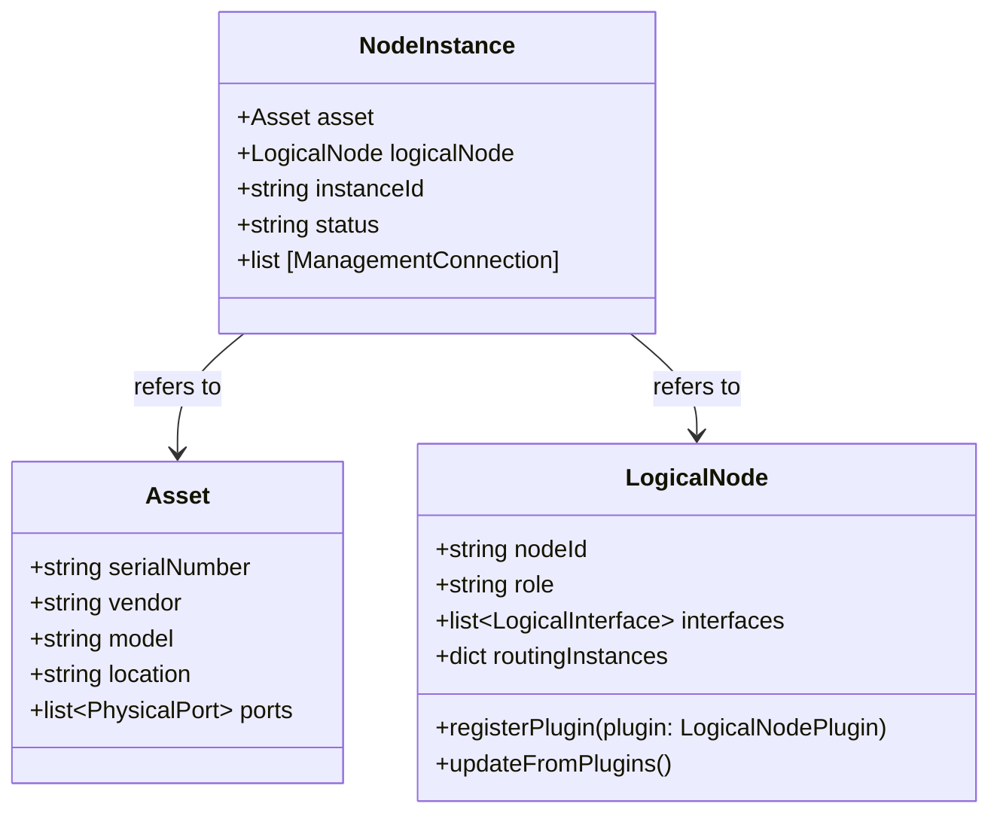

This project is licensed under the GNU Affero General Public License v3.0. See LICENSE for details.

# Extendable Automation & Control Ecosystem - ACE-X

## Model Description for ACEx

This chapter describes three core classes in the network device configuration automation framework: **Asset**, **LogicalNode**, and **NodeInstance**. The purpose is to explain their roles and how they interconnect to enable a flexible and scalable network management model.

---
### Asset

`Asset` represents the physical network device present in the infrastructure. It holds information related to the actual hardware.

**Typical attributes:**
- Serial number (`serialNumber`)
- Vendor (`vendor`)
- Model (`model`)
- Physical location, e.g., datacenter and rack (`location`)
- Physical ports and other hardware-specific details

**Purpose:**  
To track hardware inventory and its characteristics, independent of the logical function the device performs in the network.

---

### LogicalNode

`LogicalNode` is an abstract representation of a network node or function, completely independent of physical hardware or vendor-specific details.

**Typical attributes:**
- Node identifier (`nodeId`)
- Network role or function (e.g., "core-router", "access-switch") (`role`)
- Complete configuration such as Interfaces, protocol configurations

**Purpose:**  
To describe the network design and functional architecture without being tied to specific hardware or syntax.

**External Data**
One of the most important parts of ACE is its pluggable nature, the LogicalNode is pluggable and can fetch and include data from external datasources.

---

### NodeInstance

`NodeInstance` links a `LogicalNode` with a concrete `Asset`. It therefore represents a physical instantiation of a network node with a specific configuration.

This is implemented using an Adapter/Driver pattern where a specific driver is configured for a given instance to enable rendering and commmunication for the given device type.

**Typical attributes:**
- Reference to an `Asset` (the physical hardware)
- Reference to a `LogicalNode` (the logical design)
- Unique instance identifier (`instanceId`)
- Status and management info (e.g., active, standby)
- Link to connection details for management.

**Purpose:**  
To enable multiple physical devices (`Asset`) to run the same logical function (`LogicalNode`), supporting redundancy, replacement, and scaling. It acts as the interface where configuration is generated and managed.

---

### Relationships and Context

- **A `LogicalNode` can have multiple `NodeInstance` objects**, allowing the same logical network function to run on several physical devices.
- **Each `NodeInstance` is linked to exactly one `Asset`**, i.e., a physical device in the network.
- This separation clearly distinguishes network design (`LogicalNode`) from physical hardware (`Asset`), while `NodeInstance` bridges these two domains.

---

### Illustration (class relationships)

## 

# Thanks to
Special thanks to our main partners <3
- Essity.com - Getting things real