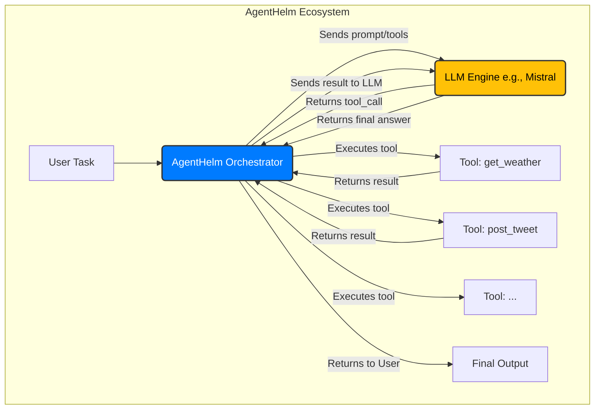

[](https://freepalestine.dev)

# AgentHelm

**Production-Ready Orchestration for AI Agents.**

---

AgentHelm is a lightweight Python framework for building AI agents with a focus on production-readiness. It provides the essential orchestration layer to make your agents observable, reliable, and safe.

In the rapidly evolving world of AI agents, many frameworks focus on rapid prototyping. AgentHelm is different. It's built on the premise that for agents to be trusted in real-world, production environments, they need the same level of observability and control as traditional software.

If you've ever struggled to debug a failing agent or worried about deploying an agent that interacts with real-world systems, AgentHelm is for you.

## Key Features

-   **Traceable Execution**: Automatically log every tool call, its inputs, outputs, errors, and execution time. Get a complete, structured audit trail of your agent's actions.
-   **Human-in-the-Loop**: Mark sensitive tools (e.g., `charge_credit_card`) with a `@tool(requires_approval=True)` decorator to ensure a human must approve the action before it runs.
-   **Resilient Workflows**: Define automatic retries for flaky tools that might fail due to transient network errors.
-   **Transactional Safety**: Implement automatic rollbacks for multi-step workflows. If a step fails, AgentHelm can run compensating actions to undo the previous steps.



## Quick Start

### 1. Installation

```bash
pip install agenthelm
```

### 2. Create your Tools

Create a Python file (e.g., `tools.py`) and define your functions with the `@tool` decorator. AgentHelm automatically parses the function signature to build the contract.

```python
# tools.py
from orchestrator import tool

@tool()
def get_weather(city: str) -> str:
    """Gets the current weather for a given city."""
    if city == "New York":
        return "It is 24°C and sunny in New York."
    else:
        return f"Sorry, I don't know the weather for {city}."

@tool(requires_approval=True)
def post_tweet(message: str) -> dict:
    """Posts a message to a social media feed."""
    print(f"TWEETING: {message}")
    return {"status": "posted"}
```

### 3. Environment Variables

AgentHelm requires API keys for the Large Language Models (LLMs) it interacts with. Set these as environment variables:

-   **Mistral AI**: Set `MISTRAL_API_KEY`. Optionally, set `MISTRAL_MODEL_NAME` (defaults to `mistral-small-latest`).
    ```bash
    export MISTRAL_API_KEY="your_mistral_api_key_here"
    # export MISTRAL_MODEL_NAME="mistral-large-latest"
    ```
-   **OpenAI**: Set `OPENAI_API_KEY`. Optionally, set `OPENAI_MODEL_NAME` (defaults to `gpt-4`).
    ```bash
    export OPENAI_API_KEY="your_openai_api_key_here"
    # export OPENAI_MODEL_NAME="gpt-3.5-turbo"
    ```

### 4. Run the Agent

Use the `agenthelm` command-line tool (or `python -m main`) to run your agent. The CLI handles everything from setting up the agent to running the reasoning loop and logging the traces.

```bash
# Run the agent from your terminal
agenthelm run \
  --agent-file examples/cli_tools_example/my_agent_tools.py \
  --task "What is the weather in New York?"

# For verbose output, add the -v or --verbose flag
agenthelm run \
  --agent-file examples/cli_tools_example/my_agent_tools.py \
  --task "What is the weather in New York?" \
  --llm-type mistral \
  --verbose
```

This will produce a detailed `cli_trace.json` file, giving you a perfect record of the agent's execution.

## Documentation

For comprehensive guides, tutorials, and API reference, please visit our official documentation site: [https://hadywalied.github.io/agenthelm/](https://hadywalied.github.io/agenthelm/)

## Contributing

We welcome contributions! Please feel free to open an issue or submit a pull request.
