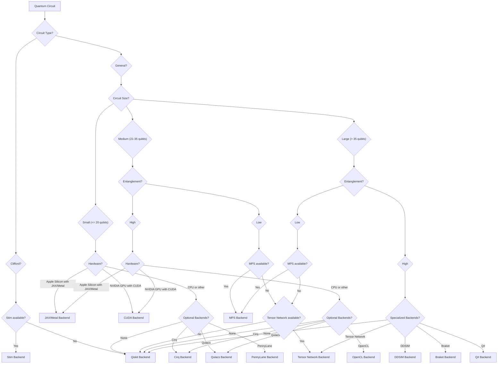

<div align="center">

# Ariadne

**Intelligent Quantum Simulator Router**

Automatic backend selection for quantum circuit simulation based on circuit analysis.

[](https://pypi.org/project/ariadne-router/)
[](https://www.python.org/downloads/)
[](https://opensource.org/licenses/Apache-2.0)
[](https://github.com/Hmbown/ariadne/actions/workflows/ci.yml)
[](https://codecov.io/gh/Hmbown/ariadne)

[Quick Start](#quick-start) •
[Documentation](docs/README.md) •
[Examples](examples/) •
[Contributing](CONTRIBUTING.md)

</div>

---

## What is Ariadne?

Ariadne automatically selects the optimal quantum simulation backend for your circuits. Instead of manually choosing between different simulators (Stim, Qiskit Aer, MPS, Tensor Networks, etc.), Ariadne analyzes your circuit and routes it to the most appropriate backend.

**Simple usage:**

```python
from ariadne import simulate
from qiskit import QuantumCircuit

# Create any quantum circuit
qc = QuantumCircuit(3, 3)
qc.h(0)
qc.cx(0, 1)
qc.cx(1, 2)
qc.measure_all()

# Ariadne automatically selects the best backend
result = simulate(qc, shots=1000)

print(f"Backend used: {result.backend_used}")
print(f"Execution time: {result.execution_time:.3f}s")
print(f"Results: {dict(result.counts)}")
```

### Key Features

- **Automatic Backend Selection**: Analyzes circuit properties and routes to optimal simulator
- **Multiple Backend Support**: Stim, Qiskit Aer, MPS, Tensor Networks, and more
- **Educational Tools**: Interactive circuit builder and algorithm library (15+ algorithms)
- **Hardware Acceleration**: Optional support for Apple Silicon (Metal) and NVIDIA GPUs (CUDA)
- **Cross-Platform**: Works on Windows, macOS, and Linux
- **Transparent Routing**: Understand why each backend was selected

---

## Why Use Ariadne?

### For Students & Educators
- Focus on learning quantum computing without worrying about simulator configuration
- Consistent interface across different simulation methods
- Interactive tutorials and educational tools included

### For Researchers
- Automatic optimization for different circuit types
- Compare results across multiple backends easily
- Reproduce published results with minimal configuration

### For Developers
- Single consistent API for quantum simulation
- Integrate quantum algorithms without backend expertise
- Production-ready with comprehensive testing

---

## Quick Start

### Installation

```bash
pip install ariadne-router
```

**Optional Hardware Acceleration:**
```bash
# Apple Silicon (M1/M2/M3/M4)
pip install ariadne-router[apple]

# NVIDIA GPUs
pip install ariadne-router[cuda]

# All quantum platform backends
pip install ariadne-router[quantum_platforms]
```

> **Note:** The package installs as `ariadne-router` but imports as `ariadne`. This conflicts with the [Ariadne GraphQL library](https://ariadnegraphql.org/) at the import level. If you use both libraries, use separate virtual environments or consider importing as:
> ```python
> import ariadne_router as ariadne  # Alternative import style
> # Or use separate venvs for each project
> ```

### Basic Example

```python
from ariadne import simulate, explain_routing
from qiskit import QuantumCircuit

# Create a 40-qubit GHZ state
qc = QuantumCircuit(40, 40)
qc.h(0)
for i in range(39):
    qc.cx(i, i + 1)
qc.measure_all()

# Simulate with automatic backend selection
result = simulate(qc, shots=1000)

print(f"Backend: {result.backend_used}")
print(f"Time: {result.execution_time:.3f}s")
print(f"Explanation: {explain_routing(qc)}")
```

**Output:**
```
Backend: stim
Time: 0.023s
Explanation: Clifford circuit detected → routed to Stim (stabilizer circuit optimization)
```

---

## Common Pitfalls

### ✗ Import Name Confusion

**Problem:** The package is named `ariadne-router` but imports as `ariadne`
```python
# ✗ Wrong
import ariadne-router  # This won't work

# ✓ Correct
import ariadne
from ariadne import simulate
```

**Solution:** Always use `ariadne` in imports, not `ariadne-router`.

### ✗ Conflict with Ariadne GraphQL

**Problem:** Both `ariadne` (GraphQL) and `ariadne-router` use the same import name
```python
# ✗ This creates conflicts if both packages are installed
import ariadne  # Which package is this?
```

**Solutions:**
```python
# ✓ Option 1: Use separate virtual environments (recommended)
pip install ariadne-router  # In quantum project venv

# ✓ Option 2: Qualified imports
import ariadne.router as quantum_router
result = quantum_router.simulate(circuit)

# ✓ Option 3: Direct function imports
from ariadne import simulate
```

### ✗ Wrong Backend Installation

**Problem:** Installing wrong packages for hardware acceleration
```bash
# ✗ Wrong - this tries to install GraphQL extras that don't exist
pip install ariadne[metal]

# ✓ Correct - this installs quantum router with hardware acceleration
pip install ariadne-router[apple]  # For Apple Silicon
pip install ariadne-router[cuda]   # For NVIDIA GPUs
```

### ✗ Missing Measurements

**Problem:** Forgetting to add measurements to circuits
```python
# ✗ Circuit with no measurements
qc = QuantumCircuit(2)
qc.h(0)
qc.cx(0, 1)
result = simulate(qc)  # This will give a warning

# ✓ Circuit with measurements
qc = QuantumCircuit(2, 2)
qc.h(0)
qc.cx(0, 1)
qc.measure_all()  # or qc.measure(0, 0), qc.measure(1, 1)
result = simulate(qc)
```

**Note:** Ariadne will automatically add `measure_all()` if no measurements are present, but it's better to be explicit.

### ✗ Manual Backend Selection Overuse

**Problem:** Always specifying backends manually defeats the purpose of Ariadne
```python
# ✗ Misses the point - you're doing the routing manually
result = simulate(qc, backend_type='qiskit')

# ✓ Let Ariadne choose the optimal backend
result = simulate(qc)  # Ariadne will pick the best backend
print(f"Ariadne chose: {result.backend_used}")
```

**When to manually specify backends:**
- Debugging specific backend behavior
- Benchmarking backend performance
- Reproducing results that require a specific simulator

### ✗ Platform-Specific Issues

**Problem:** Installing Metal backend on non-Apple Silicon
```bash
# ✗ This will install but won't work on Intel/AMD
pip install ariadne-router[apple]  # On non-Apple Silicon

# Check your system first
ariadne doctor  # This shows what acceleration is available
```

**Fix:** Use `ariadne doctor` to see what backends work on your system.

---

## How It Works

Ariadne analyzes your quantum circuit using:

1. **Circuit Type Detection**: Identifies Clifford circuits, parameterized circuits, etc.
2. **Topology Analysis**: Examines qubit connectivity patterns (chain, grid, heavy-hex, etc.)
3. **Entanglement Analysis**: Estimates entanglement growth using information theory
4. **Resource Estimation**: Considers circuit depth, width, and gate count
5. **Hardware Detection**: Checks for available accelerators (Apple Silicon, CUDA)

### Routing Decision Tree

Here's how Ariadne's intelligent routing engine makes decisions:



### Backend Selection Summary

Based on this analysis, Ariadne selects the optimal backend:

| Circuit Type | Backend | When Used | Typical Performance |
|-------------|---------|-----------|-------------------|
| **Clifford** | Stim | H, S, CNOT, Pauli gates only | Fast for stabilizer circuits |
| **Low Entanglement** | MPS | Entanglement grows slowly | Efficient for χ < 100 |
| **Structured** | Tensor Networks | Specific topology patterns | Varies by structure |
| **General** | Qiskit Aer | Universal fallback | Reliable baseline |
| **Hardware Accelerated** | JAX-Metal / CUDA | When available (experimental) | Platform dependent |

**Performance varies by hardware, circuit type, and available backends.**

### Supported Backends

Ariadne integrates with multiple quantum simulators:

- **[Stim](https://github.com/quantumlib/Stim)**: Fast stabilizer circuit simulator for Clifford circuits
- **[Qiskit Aer](https://qiskit.github.io/qiskit-aer/)**: General-purpose quantum circuit simulator
- **[Matrix Product States (MPS)](https://pennylane.ai/qml/glossary/matrix_product_state.html)**: Efficient for low-entanglement circuits
- **[Tensor Networks](https://pennylane.ai/qml/demos/tutorial_How_to_simulate_quantum_circuits_with_tensor_networks.html)**: For circuits with specific structural properties
- **[PennyLane](https://pennylane.ai/)**: Differentiable quantum computing framework
- **Optional**: Cirq, Qulacs, DDSIM, Braket, Q#, and more

For detailed capabilities, see [Backend Capabilities](docs/capability_matrix.md).

---

## Educational Features

### Interactive Circuit Builder

```python
from ariadne import InteractiveCircuitBuilder, simulate

# Build circuits with step-by-step explanations
builder = InteractiveCircuitBuilder(2, "Bell State")
builder.add_hadamard(0, "Create superposition", "Apply H gate to qubit 0")
builder.add_cnot(0, 1, "Create entanglement", "Apply CNOT to entangle qubits")

circuit = builder.get_circuit()
result = simulate(circuit, shots=1000)
print(f"Bell state results: {dict(result.counts)}")
```

### Algorithm Library

```python
from ariadne import list_algorithms, get_algorithm

# Explore 15+ quantum algorithms
algorithms = list_algorithms()
print(f"Available: {algorithms}")
# ['bell', 'deutsch_jozsa', 'grover', 'qft', 'simon', 'vqe', ...]

# Get algorithm details
algo_info = get_algorithm('grover')
print(f"Description: {algo_info['metadata'].description}")
```

For more examples, see the [examples directory](examples/) and [educational tutorials](examples/education/).

---

## Advanced Usage

### Manual Backend Selection

```python
# Override automatic selection when needed
result = simulate(qc, backend='stim', shots=1000)
```

### Routing Strategies

```python
from ariadne import RoutingStrategy, ComprehensiveRoutingTree

router = ComprehensiveRoutingTree()

# Use specific routing strategies
result = router.simulate(qc, strategy=RoutingStrategy.SPEED_FIRST)
```

### Backend Comparison

```python
from ariadne.enhanced_benchmarking import EnhancedBenchmarkSuite

suite = EnhancedBenchmarkSuite()
comparison = suite.benchmark_backend_comparison(
    circuit=qc,
    backends=['auto', 'qiskit', 'stim'],
    shots=1000
)

for backend, result in comparison.items():
    print(f"{backend}: {result.execution_time:.3f}s")
```

For more advanced features, see the [Advanced Guide](docs/guides/developer_guide.md).

---

## Docker Support

```bash
# Pull and run
docker pull ghcr.io/hmbown/ariadne-router:latest
docker run --rm ghcr.io/hmbown/ariadne-router:latest \
  python -c "import ariadne; print('Ready!')"

# Full quantum environment (10+ backends)
docker build --target quantum-full -t ariadne-quantum-full .
docker run -it ariadne-quantum-full
```

---

## Documentation

- **[Getting Started Guide](docs/GETTING_STARTED.md)** - Comprehensive installation and first steps
- **[API Reference](docs/source/)** - Complete API documentation
- **[Performance Guide](docs/PERFORMANCE_GUIDE.md)** - Optimization tips and benchmarks
- **[Troubleshooting](docs/troubleshooting.md)** - Common issues and solutions
- **[Configuration Options](docs/options.md)** - Advanced configuration
- **[Developer Guide](docs/guides/developer_guide.md)** - Contributing and extending Ariadne

### For Specific Audiences

- **Students**: [Educational Examples](examples/education/learning_tutorial.py)
- **Researchers**: [Research Use Cases](docs/getting-started/for-researchers.md)
- **Educators**: [Instructor Guide](docs/getting-started/for-instructors.md)
- **DevOps**: [Deployment Guide](docs/getting-started/for-devops.md)

---

## Reproducibility

Ariadne includes tools for reproducible quantum computing research:

```bash
# Validate circuits across backends
python -m ariadne repro --circuit ghz_20 \
  --backends qiskit,stim --shots 1024 \
  --output results.json --export-csv results.csv

# Manage benchmark datasets
python -m ariadne datasets list
python -m ariadne datasets generate --family all --sizes 10,20,30
```

See [benchmarks/datasets/README.md](benchmarks/datasets/README.md) for details.

---

## Contributing

We welcome contributions! See [CONTRIBUTING.md](CONTRIBUTING.md) for:

- Bug reports and feature requests
- Adding new backends
- Improving documentation
- Performance improvements

**Quick setup:**

```bash
git clone https://github.com/Hmbown/ariadne.git
cd ariadne
pip install -e .[dev]
pre-commit install
pytest  # Run tests
```

---

## Project Status

**Current Version:** 0.4.4 (Active Development)

- **Test Coverage**: 319 tests passing (32 skipped due to optional dependencies)
- **Core Functionality**: Stable routing with multiple backend support
- **Platform Support**: Windows, macOS, Linux
- **Backend Support**: Stim, Qiskit Aer, MPS, Tensor Networks, and more
- **Experimental Features**: JAX-Metal and CUDA acceleration (marked as experimental)

See [CHANGELOG.md](CHANGELOG.md) for detailed release notes.

---

## When to Use Ariadne

**Good fit:**
- Learning quantum algorithms without simulator expertise
- Teaching quantum computing (consistent interface)
- Research requiring cross-backend validation
- Prototyping where "fast enough" matters more than maximum performance

**Not recommended:**
- Fine-grained simulator parameter control needed
- Researching simulator algorithms themselves
- Production workloads with strict latency requirements
- When you already have an optimal simulator setup

---

## Troubleshooting

| Problem | Solution |
|---------|----------|
| **Import errors** | Run `pip install -e .[dev]` |
| **Backend not found** | Check [troubleshooting guide](docs/troubleshooting.md) |
| **Slow performance** | See [performance guide](docs/PERFORMANCE_GUIDE.md) |
| **Memory errors** | Use `RoutingStrategy.MEMORY_EFFICIENT` |

For detailed help, see our [Troubleshooting Guide](docs/troubleshooting.md) or [open an issue](https://github.com/Hmbown/ariadne/issues).

---

## License

Apache 2.0 - see [LICENSE](LICENSE) for details.

## Trademarks

All product names, logos, and brands are property of their respective owners. This project is an independent open source effort and is not affiliated with or endorsed by any quantum computing company or framework mentioned in this documentation.

---

<div align="center">

**[⭐ Star on GitHub](https://github.com/Hmbown/ariadne)** • **[📦 PyPI Package](https://pypi.org/project/ariadne-router/)** • **[📖 Documentation](docs/README.md)**

Made with ❤️ for the quantum computing community

</div>
