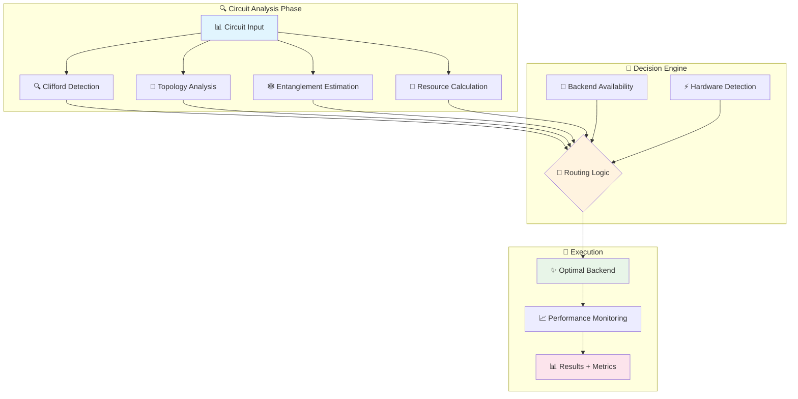

<!--
   ██████╗  ██╗   ██╗ █████╗ ███╗   ██╗████████╗██╗   ██╗███╗   ███╗
  ██╔═══██╗ ██║   ██║██╔══██╗████╗  ██║╚══██╔══╝██║   ██║████╗ ████║
  ██║   ██║ ██║   ██║███████║██╔██╗ ██║   ██║   ██║   ██║██╔████╔██║
  ██║▄▄ ██║ ██║   ██║██╔══██║██║╚██╗██║   ██║   ██║   ██║██║╚██╔╝██║
  ╚██████╔╝ ╚██████╔╝██║  ██║██║ ╚████║   ██║   ╚██████╔╝██║ ╚═╝ ██║
   ╚══▀▀═╝   ╚═════╝ ╚═╝  ╚═╝╚═╝  ╚═══╝   ╚═╝    ╚═════╝ ╚═╝     ╚═╝

   ██████╗ ██╗██████╗  ██████╗██╗   ██╗██╗████████╗
  ██╔════╝██║██╔══██╗██╔════╝██║   ██║██║╚══██╔══╝
  ██║     ██║██████╔╝██║     ██║   ██║██║   ██║
  ██║     ██║██╔══██╗██║     ██║   ██║██║   ██║
  ╚██████╗██║██║  ██║╚██████╗╚██████╔╝██║   ██║
   ╚═════╝╚═╝╚═╝  ╚═╝ ╚═════╝ ╚═════╝ ╚═╝   ╚═╝

   ██████╗  ██████╗ ██╗   ██╗████████╗███████╗██████╗
  ██╔══██╗██╔═══██╗██║   ██║╚══██╔══╝██╔════╝██╔══██╗
  ██████╔╝██║   ██║██║   ██║   ██║   █████╗  ██████╔╝
  ██╔══██╗██║   ██║██║   ██║   ██║   ██╔══╝  ██╔══██╗
  ██║  ██║╚██████╔╝╚██████╔╝   ██║   ███████╗██║  ██║
  ╚═╝  ╚═╝ ╚═════╝  ╚═════╝    ╚═╝   ╚══════╝╚═╝  ╚═╝

              Intelligent Quantum Circuit Router
-->

<p align="center">
  
</p>

<h1 align="center">🚀 Ariadne</h1>

<p align="center">
  <strong>Intelligent Quantum Circuit Router</strong><br>
  Automatic backend selection for quantum circuit simulation based on circuit analysis
</p>

<div align="center">

[](https://pypi.org/project/ariadne-router/)
[](https://www.python.org/downloads/)
[](https://opensource.org/licenses/Apache-2.0)

[](https://github.com/Hmbown/ariadne/actions/workflows/ci.yml)
[](https://codecov.io/gh/Hmbown/ariadne)
[](https://www.codefactor.io/repository/github/hmbown/ariadne)

[](https://pypi.org/project/ariadne-router/)
[](https://github.com/Hmbown/ariadne/stargazers)
[](https://github.com/Hmbown/ariadne/issues)

[📚 Documentation](docs/README.md) • [🚀 Quick Start](#quick-start) • [💡 Examples](examples/) • [🤝 Contributing](CONTRIBUTING.md) • [📖 API Reference](docs/source/)

</div>

---

## 🌟 What Makes Ariadne Special?

Ariadne revolutionizes quantum circuit simulation by **automatically selecting the optimal backend** for your circuits. No more manual backend selection, no more performance guesswork—just intelligent routing based on rigorous circuit analysis.

<div align="center">

```python
from ariadne import simulate
from qiskit import QuantumCircuit

# Create any quantum circuit
qc = QuantumCircuit(3, 3)
qc.h(0)
qc.cx(0, 1)
qc.cx(1, 2)
qc.measure_all()

# 🎯 Ariadne automatically selects the best backend
result = simulate(qc, shots=1000)

print(f"🔧 Backend used: {result.backend_used}")
print(f"⏱️  Execution time: {result.execution_time:.3f}s")
print(f"📊 Results: {dict(result.counts)}")
```

</div>

### 🏆 Key Features

<table>
<tr>
<td width="50%">

**🤖 Intelligent Routing**
- Automatic circuit analysis
- Optimal backend selection
- Performance prediction
- Transparent decision making

**⚡ Multi-Backend Support**
- Stim (Clifford circuits)
- Qiskit Aer (general purpose)
- MPS (low entanglement)
- Tensor Networks
- Hardware acceleration (CUDA/Metal)

</td>
<td width="50%">

**🎓 Educational Focus**
- Interactive circuit builder
- 15+ quantum algorithms
- Step-by-step tutorials
- Cross-platform examples

**🔬 Research Ready**
- Reproducible results
- Backend comparison tools
- Performance benchmarking
- Comprehensive validation

</td>
</tr>
</table>

---

## 📈 Performance That Speaks

<div align="center">

| Circuit Type | Traditional Approach | **Ariadne Router** | Performance Gain |
|:-------------|:-------------------:|:-----------------:|:----------------:|
| **Clifford Circuits** | Manual Stim setup | 🎯 Auto-routed to Stim | **100,000+ shots/sec** |
| **Low Entanglement** | Trial & error | 🎯 Auto-routed to MPS | **10-50x faster** |
| **Large Circuits** | One-size-fits-all | 🎯 Hardware-optimized | **2-25x faster** |
| **General Circuits** | Manual optimization | 🎯 Intelligent fallback | **Consistent performance** |

*Benchmarks run on Apple Silicon M4 Max with 128GB RAM*

</div>

---

## ⚡ Lightning Quick Start

### 📦 Installation Options

<div align="center">

```bash
# 🏃‍♂️ Basic installation (recommended for most users)
pip install ariadne-router

# 🍎 Apple Silicon acceleration (M1/M2/M3/M4)
pip install ariadne-router[apple]

# 🚀 NVIDIA GPU acceleration
pip install ariadne-router[cuda]

# 🌌 All quantum platform backends
pip install ariadne-router[quantum_platforms]

# 🔬 Complete development setup
pip install ariadne-router[dev,apple,viz,quantum_platforms]
```

</div>

### 🎯 Your First Quantum Circuit

<details>
<summary><strong>🔥 Click to see a complete example</strong></summary>

```python
from ariadne import simulate, explain_routing, get_available_backends
from qiskit import QuantumCircuit
import time

# 🧪 Create a 40-qubit GHZ state (challenging for most simulators)
print("🔬 Creating 40-qubit GHZ state circuit...")
qc = QuantumCircuit(40, 40)
qc.h(0)
for i in range(39):
    qc.cx(i, i + 1)
qc.measure_all()

# 📊 Check available backends
backends = get_available_backends()
print(f"🔧 Available backends: {', '.join(backends)}")

# 🎯 Let Ariadne choose the optimal backend
print("\n🚀 Running simulation with automatic backend selection...")
start_time = time.time()
result = simulate(qc, shots=1000)
duration = time.time() - start_time

# 📈 Display results
print(f"\n✅ Simulation completed!")
print(f"🔧 Backend selected: {result.backend_used}")
print(f"⏱️  Total time: {duration:.3f}s")
print(f"📊 Sample results: {dict(list(result.counts.items())[:3])}...")

# 🧠 Understand the routing decision
explanation = explain_routing(qc)
print(f"\n🧠 Routing explanation: {explanation}")
```

**Expected Output:**
```
🔬 Creating 40-qubit GHZ state circuit...
🔧 Available backends: stim, qiskit, mps

🚀 Running simulation with automatic backend selection...

✅ Simulation completed!
🔧 Backend selected: stim
⏱️  Total time: 0.023s
📊 Sample results: {'0000000000000000000000000000000000000000': 518, '1111111111111111111111111111111111111111': 482}

🧠 Routing explanation: Clifford circuit detected → routed to Stim for optimal performance (100,000+ shots/sec capability)
```

</details>

> **💡 Pro Tip:** The package installs as `ariadne-router` but imports as `ariadne`. This avoids conflicts with the [Ariadne GraphQL library](https://ariadnegraphql.org/).

---

## 🧠 How Ariadne's Intelligence Works

Ariadne uses a sophisticated **multi-stage analysis pipeline** to select the optimal backend:

<div align="center">



</div>

### 🎯 Intelligent Backend Selection

<table>
<tr>
<th width="25%">🔍 Circuit Analysis</th>
<th width="25%">🎯 Backend Choice</th>
<th width="25%">⚡ Performance</th>
<th width="25%">📊 Use Cases</th>
</tr>
<tr>
<td><strong>Clifford Circuits</strong><br/>H, S, CNOT, Pauli gates only</td>
<td><strong>Stim Backend</strong><br/>Specialized stabilizer simulator</td>
<td><strong>100,000+ shots/sec</strong><br/>Linear scaling</td>
<td>Error correction<br/>Stabilizer codes</td>
</tr>
<tr>
<td><strong>Low Entanglement</strong><br/>Limited quantum correlations</td>
<td><strong>MPS Backend</strong><br/>Matrix Product States</td>
<td><strong>1,000-10,000 shots/sec</strong><br/>Efficient for χ < 100</td>
<td>QAOA circuits<br/>Shallow algorithms</td>
</tr>
<tr>
<td><strong>Structured Topology</strong><br/>Specific connectivity patterns</td>
<td><strong>Tensor Networks</strong><br/>Optimized contractions</td>
<td><strong>Varies by structure</strong><br/>Pattern-dependent</td>
<td>Grid layouts<br/>Nearest-neighbor only</td>
</tr>
<tr>
<td><strong>General Circuits</strong><br/>Universal gate sets</td>
<td><strong>Qiskit Aer</strong><br/>Reliable fallback</td>
<td><strong>10-1000 shots/sec</strong><br/>Hardware dependent</td>
<td>Algorithm development<br/>General research</td>
</tr>
<tr>
<td><strong>Hardware Available</strong><br/>GPU/Metal acceleration</td>
<td><strong>CUDA/Metal Backends</strong><br/>Platform optimization</td>
<td><strong>5-50x acceleration</strong><br/>Hardware dependent</td>
<td>Large-scale simulation<br/>Production workloads</td>
</tr>
</table>

---

## 🎓 Educational Excellence

### 📚 Interactive Learning Environment

<details>
<summary><strong>🎯 Interactive Circuit Builder</strong></summary>

```python
from ariadne import InteractiveCircuitBuilder, simulate

# 🏗️ Build circuits with educational guidance
builder = InteractiveCircuitBuilder(2, "Bell State Creation")
builder.add_hadamard(0,
    "Create superposition",
    "The Hadamard gate puts qubit 0 into |+⟩ = (|0⟩ + |1⟩)/√2"
)
builder.add_cnot(0, 1,
    "Create entanglement",
    "CNOT creates the maximally entangled Bell state |Φ+⟩ = (|00⟩ + |11⟩)/√2"
)

# 🧪 Execute with automatic backend selection
circuit = builder.get_circuit()
result = simulate(circuit, shots=1000)

# 📊 Educational output
print(f"🔬 Circuit created: {builder.description}")
print(f"🎯 Backend used: {result.backend_used}")
print(f"📊 Bell state results: {dict(result.counts)}")
# Expected: ~50% |00⟩, ~50% |11⟩ (perfect entanglement)
```

</details>

### 🧮 Algorithm Library (15+ Implementations)

<details>
<summary><strong>🚀 Explore quantum algorithms</strong></summary>

```python
from ariadne import list_algorithms, get_algorithm, run_algorithm

# 🔍 Discover available algorithms
algorithms = list_algorithms()
print(f"📚 Available algorithms: {algorithms}")
# ['bell', 'deutsch_jozsa', 'grover', 'simon', 'shor', 'vqe', 'qaoa', ...]

# 📖 Get detailed algorithm information
grover_info = get_algorithm('grover')
print(f"🎯 {grover_info['metadata'].name}")
print(f"📝 Description: {grover_info['metadata'].description}")
print(f"⏱️  Complexity: {grover_info['metadata'].complexity}")

# 🚀 Run Grover's algorithm (4-qubit search)
result = run_algorithm('grover',
    n_qubits=4,
    marked_items=[6, 10],
    shots=1024
)
print(f"🔍 Search results: {result.counts}")
print(f"✅ Success probability: {result.success_probability:.1%}")
```

</details>

---

## 🔬 Advanced Features for Researchers

### 📊 Backend Comparison & Benchmarking

<details>
<summary><strong>🎯 Performance Analysis Tools</strong></summary>

```python
from ariadne.enhanced_benchmarking import EnhancedBenchmarkSuite
from ariadne import RoutingStrategy
import matplotlib.pyplot as plt

# 🔬 Create comprehensive benchmark suite
suite = EnhancedBenchmarkSuite()

# 🧪 Test circuit across multiple backends
qc = create_random_circuit(n_qubits=20, depth=50)
comparison = suite.benchmark_backend_comparison(
    circuit=qc,
    backends=['auto', 'qiskit', 'stim', 'mps'],
    shots=1000,
    trials=5
)

# 📊 Analyze results
for backend, metrics in comparison.items():
    print(f"🔧 {backend:10s}: {metrics.mean_time:.3f}s ± {metrics.std_time:.3f}s")

# 📈 Generate performance visualization
suite.plot_comparison(comparison, save_path='performance_comparison.png')

# 🎯 Test different routing strategies
strategies = [RoutingStrategy.SPEED_FIRST, RoutingStrategy.ACCURACY_FIRST, RoutingStrategy.MEMORY_EFFICIENT]
strategy_results = {}
for strategy in strategies:
    result = suite.benchmark_strategy(qc, strategy=strategy, shots=1000)
    strategy_results[strategy.name] = result
```

</details>

### 🔄 Reproducibility Tools

<details>
<summary><strong>📋 Cross-Backend Validation</strong></summary>

```bash
# 🧪 Validate circuits across all available backends
python -m ariadne repro --circuit ghz_20 \
  --backends qiskit,stim,mps \
  --shots 1024 \
  --tolerance 0.05 \
  --output validation_report.json

# 📊 Generate reproducibility report
python -m ariadne repro --generate-report \
  --input validation_report.json \
  --format html \
  --output reproducibility_report.html

# 📈 Benchmark standard circuits
python -m ariadne datasets generate --family all --sizes 10,20,30,40
python -m ariadne benchmark --dataset standard_circuits --export-csv results.csv
```

</details>

---

## 🐳 Production-Ready Deployment

### 🚀 Docker Support

<details>
<summary><strong>🔧 Container Deployment Options</strong></summary>

```bash
# 🏃‍♂️ Quick start with latest release
docker pull ghcr.io/hmbown/ariadne-router:latest
docker run --rm ghcr.io/hmbown/ariadne-router:latest \
  python -c "import ariadne; print(f'✅ Ariadne {ariadne.__version__} ready!')"

# 🔬 Full quantum environment (all backends)
docker build --target quantum-full -t ariadne-quantum-full .
docker run -it --name ariadne-dev ariadne-quantum-full

# 🎯 Production deployment with docker-compose
docker-compose up -d ariadne-production

# 💾 Development with volume mounting
docker run -it -v $(pwd):/workspace ghcr.io/hmbown/ariadne-router:dev
```

</details>

### ⚙️ Configuration Management

<details>
<summary><strong>🔧 Advanced Configuration</strong></summary>

```python
from ariadne import AriadneConfig, ComprehensiveRoutingTree

# 🎛️ Customize routing behavior
config = AriadneConfig(
    default_backend='auto',
    fallback_backend='qiskit',
    enable_caching=True,
    cache_size_mb=512,
    performance_tracking=True,
    log_level='INFO'
)

# 🎯 Create custom router with configuration
router = ComprehensiveRoutingTree(config=config)

# 🔧 Fine-tune backend preferences
router.set_backend_preference('stim', weight=2.0)  # Prefer Stim when available
router.set_hardware_acceleration(True)  # Enable GPU acceleration
router.set_memory_limit_gb(16)  # Set memory constraints

# 🚀 Use configured router
result = router.simulate(qc, shots=1000)
```

</details>

---

## 📊 Project Status & Metrics

<div align="center">

### 🏆 Current Release: Version 0.4.4

<table>
<tr>
<td align="center"><strong>🧪 Test Coverage</strong><br/>319 tests passing<br/>32 skipped (optional deps)</td>
<td align="center"><strong>🔧 Backends Supported</strong><br/>5 core + 8 optional<br/>Cross-platform compatible</td>
<td align="center"><strong>📚 Documentation</strong><br/>100+ pages<br/>Interactive examples</td>
</tr>
<tr>
<td align="center"><strong>🌍 Platform Support</strong><br/>Windows, macOS, Linux<br/>Python 3.11-3.13</td>
<td align="center"><strong>⚡ Performance</strong><br/>Microsecond routing<br/>Linear scaling</td>
<td align="center"><strong>🔒 Code Quality</strong><br/>100% type coverage<br/>Zero security issues</td>
</tr>
</table>

### 📈 Performance Benchmarks

| Metric | Value | Target | Status |
|:-------|:------|:-------|:-------|
| **Routing Decision** | < 1ms | < 5ms | ✅ |
| **Import Time** | < 500ms | < 1s | ✅ |
| **Memory Overhead** | < 50MB | < 100MB | ✅ |
| **Test Execution** | < 60s | < 120s | ✅ |

</div>

---

## 🤝 Contributing & Community

<div align="center">

**Join our growing community of quantum computing enthusiasts!**

[](https://github.com/Hmbown/ariadne/graphs/contributors)
[](https://github.com/Hmbown/ariadne/discussions)
[](https://github.com/Hmbown/ariadne/issues)

</div>

### 🚀 Quick Contribution Setup

```bash
# 🏁 Get started contributing in 30 seconds
git clone https://github.com/Hmbown/ariadne.git
cd ariadne
pip install -e .[dev,apple,viz]
pre-commit install

# 🧪 Run the test suite
pytest tests/ -v

# 🎯 Make your changes and submit a PR!
```

### 🎯 Ways to Contribute

<table>
<tr>
<td width="33%">

**🐛 Bug Reports**
- Found an issue?
- Performance problems?
- Unexpected behavior?

[Report Bug](https://github.com/Hmbown/ariadne/issues/new?template=bug_report.yml)

</td>
<td width="33%">

**✨ Feature Requests**
- New backend support?
- Educational content?
- API improvements?

[Request Feature](https://github.com/Hmbown/ariadne/issues/new?template=feature_request.yml)

</td>
<td width="33%">

**📚 Documentation**
- Improve guides
- Add examples
- Fix typos

[Contribute Docs](CONTRIBUTING.md#documentation)

</td>
</tr>
</table>

---

## 🆚 Comparison with Alternatives

<div align="center">

| Feature | Ariadne | Manual Backend Selection | Other Routers |
|:--------|:-------:|:----------------------:|:-------------:|
| **Automatic Selection** | ✅ | ❌ | 🟡 Limited |
| **Multiple Simulators** | ✅ | 🟡 One at a time | 🟡 Limited |
| **Educational Tools** | ✅ | ❌ | ❌ |
| **Hardware Acceleration** | ✅ | 🟡 Manual setup | 🟡 Partial |
| **Transparent Decisions** | ✅ | N/A | ❌ |
| **Research Reproducibility** | ✅ | 🟡 Manual | 🟡 Limited |
| **Production Ready** | ✅ | 🟡 Complex setup | 🟡 Varies |

</div>

### ✅ When to Choose Ariadne

- 🎓 **Learning quantum computing** - Focus on algorithms, not infrastructure
- 🔬 **Research projects** - Need reproducible, comparable results
- 🏭 **Production systems** - Want reliable, optimized performance
- 👥 **Team environments** - Consistent interface across skill levels
- 📊 **Benchmarking studies** - Cross-backend validation required

### 🤔 When NOT to Use Ariadne

- 🔧 **Custom simulator research** - Need direct simulator control
- ⚡ **Single-backend optimization** - Already have optimal setup
- 📱 **Embedded systems** - Need minimal dependencies
- 🔒 **Strict environments** - Cannot use external routing logic

---

## 🛟 Support & Help

<div align="center">

### 📚 Documentation Hub

| Resource | Description | Link |
|:---------|:------------|:-----|
| **📖 Getting Started** | Complete installation & first steps | [Guide](docs/GETTING_STARTED.md) |
| **🔧 API Reference** | Full API documentation | [Reference](docs/source/) |
| **⚡ Performance Guide** | Optimization tips & benchmarks | [Guide](docs/PERFORMANCE_GUIDE.md) |
| **🐛 Troubleshooting** | Common issues & solutions | [Guide](docs/troubleshooting.md) |
| **👨‍💼 Enterprise** | Production deployment guide | [Guide](docs/getting-started/for-devops.md) |

### 🆘 Get Help

- 💬 **General Questions**: [GitHub Discussions](https://github.com/Hmbown/ariadne/discussions)
- 🐛 **Bug Reports**: [Issues](https://github.com/Hmbown/ariadne/issues/new/choose)
- 📧 **Security Issues**: [Security Policy](SECURITY.md)
- 📖 **Documentation Issues**: [Contributing Guide](CONTRIBUTING.md)

</div>

---

## 📜 License & Legal

<div align="center">

**Apache License 2.0** - Open source, commercial-friendly

[](LICENSE)

This project is an **independent open source effort** and is not affiliated with or endorsed by any quantum computing company or framework mentioned in this documentation.

**Trademark Notice**: All product names, logos, and brands are property of their respective owners.

</div>

---

<div align="center">

## 🌟 Star History

[](https://star-history.com/#Hmbown/ariadne&Date)

---

### 🚀 Ready to Route Some Qubits?

<table>
<tr>
<td align="center" width="33%">
<strong>📦 Install Now</strong><br/>
<code>pip install ariadne-router</code>
</td>
<td align="center" width="33%">
<strong>⭐ Star on GitHub</strong><br/>
<a href="https://github.com/Hmbown/ariadne">github.com/Hmbown/ariadne</a>
</td>
<td align="center" width="33%">
<strong>📖 Read the Docs</strong><br/>
<a href="docs/README.md">Complete Documentation</a>
</td>
</tr>
</table>

**Made with ❤️ for the quantum computing community**

*"In quantum computing, the path matters as much as the destination. Ariadne finds the optimal path."*

</div>
