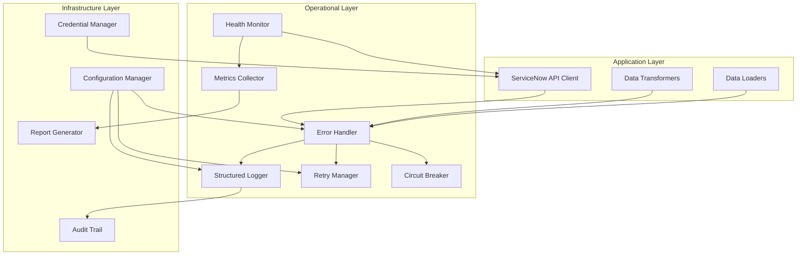

# Design Document: Operational Resilience and Error Handling

## Overview

This design transforms the beast-dream-snow-loader from a functional MVP into a production-ready system with comprehensive error handling, monitoring, and operational resilience. The design follows beast principles and integrates with the existing architecture while adding robust operational capabilities.

## Architecture

### Core Components



### Integration Points

The operational layer integrates with existing components:
- **ServiceNow API Client**: Enhanced with retry logic, circuit breaker, and structured error handling
- **Data Transformers**: Wrapped with validation and error context capture
- **Data Loaders**: Enhanced with batch failure handling and relationship validation
- **Credential Management**: Upgraded to follow beast canonical source principles

## Components and Interfaces

### 1. Error Handler (`beast_dream_snow_loader/operations/error_handler.py`)

```python
from typing import Any, Dict, Optional, Type
from dataclasses import dataclass
from enum import Enum
import traceback
from datetime import datetime

class ErrorSeverity(Enum):
    LOW = "low"
    MEDIUM = "medium"
    HIGH = "high"
    CRITICAL = "critical"

class ErrorCategory(Enum):
    AUTHENTICATION = "authentication"
    NETWORK = "network"
    DATA_VALIDATION = "data_validation"
    SERVICENOW_API = "servicenow_api"
    TRANSFORMATION = "transformation"
    CONFIGURATION = "configuration"

@dataclass
class ErrorContext:
    operation: str
    category: ErrorCategory
    severity: ErrorSeverity
    timestamp: datetime
    error_message: str
    stack_trace: Optional[str]
    input_data: Optional[Dict[str, Any]]
    environment_info: Dict[str, Any]
    correlation_id: str

class OperationalError(Exception):
    def __init__(self, context: ErrorContext):
        self.context = context
        super().__init__(context.error_message)

class ErrorHandler:
    def capture_error(
        self, 
        operation: str,
        exception: Exception,
        category: ErrorCategory,
        severity: ErrorSeverity,
        input_data: Optional[Dict[str, Any]] = None
    ) -> ErrorContext: ...
    
    def handle_servicenow_error(self, response: requests.Response, operation: str) -> ErrorContext: ...
    
    def handle_authentication_error(self, auth_method: str, details: str) -> ErrorContext: ...
    
    def aggregate_errors(self, time_window_minutes: int = 60) -> Dict[str, int]: ...
```

### 2. Structured Logger (`beast_dream_snow_loader/operations/logger.py`)

```python
import logging
import json
from typing import Any, Dict, Optional
from datetime import datetime

class StructuredLogger:
    def __init__(self, name: str, level: str = "INFO"):
        self.logger = logging.getLogger(name)
        self._setup_handlers(level)
    
    def log_operation_start(self, operation: str, context: Dict[str, Any]): ...
    
    def log_operation_complete(self, operation: str, duration_ms: int, success: bool, context: Dict[str, Any]): ...
    
    def log_error(self, error_context: ErrorContext): ...
    
    def log_credential_access(self, method: str, success: bool, details: Optional[str] = None): ...
    
    def log_data_quality_issue(self, issue_type: str, affected_records: int, details: Dict[str, Any]): ...
    
    def log_performance_metric(self, metric_name: str, value: float, unit: str, context: Dict[str, Any]): ...
```

### 3. Retry Manager (`beast_dream_snow_loader/operations/retry.py`)

```python
from typing import Callable, Any, Optional, Type
import time
import random
from dataclasses import dataclass

@dataclass
class RetryPolicy:
    max_attempts: int = 3
    base_delay_seconds: float = 1.0
    max_delay_seconds: float = 60.0
    exponential_base: float = 2.0
    jitter: bool = True
    retryable_exceptions: tuple = (requests.exceptions.RequestException,)

class RetryManager:
    def __init__(self, default_policy: Optional[RetryPolicy] = None):
        self.default_policy = default_policy or RetryPolicy()
    
    def execute_with_retry(
        self,
        operation: Callable[[], Any],
        policy: Optional[RetryPolicy] = None,
        operation_name: str = "unknown"
    ) -> Any: ...
    
    def is_retryable_error(self, exception: Exception, policy: RetryPolicy) -> bool: ...
    
    def calculate_delay(self, attempt: int, policy: RetryPolicy) -> float: ...
    
    def handle_rate_limit(self, response: requests.Response) -> float: ...
```

### 4. Circuit Breaker (`beast_dream_snow_loader/operations/circuit_breaker.py`)

```python
from enum import Enum
from typing import Callable, Any
from datetime import datetime, timedelta
import threading

class CircuitState(Enum):
    CLOSED = "closed"
    OPEN = "open"
    HALF_OPEN = "half_open"

class CircuitBreaker:
    def __init__(
        self,
        failure_threshold: int = 5,
        recovery_timeout_seconds: int = 60,
        expected_exception: Type[Exception] = Exception
    ):
        self.failure_threshold = failure_threshold
        self.recovery_timeout = timedelta(seconds=recovery_timeout_seconds)
        self.expected_exception = expected_exception
        self._state = CircuitState.CLOSED
        self._failure_count = 0
        self._last_failure_time: Optional[datetime] = None
        self._lock = threading.Lock()
    
    def call(self, operation: Callable[[], Any], operation_name: str = "unknown") -> Any: ...
    
    def _should_attempt_reset(self) -> bool: ...
    
    def _on_success(self): ...
    
    def _on_failure(self): ...
```

### 5. Health Monitor (`beast_dream_snow_loader/operations/health.py`)

```python
from typing import Dict, Any, Optional
from dataclasses import dataclass
from enum import Enum
import asyncio

class HealthStatus(Enum):
    HEALTHY = "healthy"
    DEGRADED = "degraded"
    UNHEALTHY = "unhealthy"

@dataclass
class HealthCheck:
    name: str
    status: HealthStatus
    message: str
    response_time_ms: Optional[float]
    details: Dict[str, Any]

class HealthMonitor:
    def __init__(self, client: ServiceNowAPIClient):
        self.client = client
        self.checks: Dict[str, Callable[[], HealthCheck]] = {}
    
    def register_check(self, name: str, check_func: Callable[[], HealthCheck]): ...
    
    async def run_all_checks(self) -> Dict[str, HealthCheck]: ...
    
    def check_servicenow_connectivity(self) -> HealthCheck: ...
    
    def check_credential_availability(self) -> HealthCheck: ...
    
    def check_system_resources(self) -> HealthCheck: ...
    
    def get_overall_status(self, checks: Dict[str, HealthCheck]) -> HealthStatus: ...
```

### 6. Enhanced ServiceNow API Client

The existing `ServiceNowAPIClient` will be enhanced with operational capabilities:

```python
# Additions to existing ServiceNowAPIClient class

class ServiceNowAPIClient:
    def __init__(self, ...):
        # Existing initialization
        self.error_handler = ErrorHandler()
        self.logger = StructuredLogger("servicenow.api")
        self.retry_manager = RetryManager()
        self.circuit_breaker = CircuitBreaker()
        self.metrics = MetricsCollector()
    
    def _execute_request(
        self,
        method: str,
        url: str,
        **kwargs
    ) -> requests.Response:
        """Enhanced request execution with operational capabilities."""
        operation_name = f"{method.upper()} {url}"
        
        def make_request():
            start_time = time.time()
            try:
                response = self.circuit_breaker.call(
                    lambda: self.session.request(method, url, **kwargs),
                    operation_name
                )
                duration_ms = (time.time() - start_time) * 1000
                self.metrics.record_request(method, url, response.status_code, duration_ms)
                self.logger.log_operation_complete(operation_name, duration_ms, True, {})
                return response
            except Exception as e:
                duration_ms = (time.time() - start_time) * 1000
                error_context = self.error_handler.capture_error(
                    operation_name, e, ErrorCategory.SERVICENOW_API, ErrorSeverity.HIGH
                )
                self.logger.log_error(error_context)
                self.metrics.record_error(method, url, str(e))
                raise OperationalError(error_context)
        
        return self.retry_manager.execute_with_retry(make_request, operation_name=operation_name)
```

### 7. Configuration Manager (`beast_dream_snow_loader/operations/config.py`)

```python
from enum import Enum
from typing import Optional
from pydantic import BaseModel

class Environment(Enum):
    DEVELOPMENT = "development"
    TESTING = "testing"
    STAGING = "staging"
    PRODUCTION = "production"
    UNKNOWN = "unknown"

class ConfigurationManager:
    def load_configuration(
        self, 
        config_file: Optional[str] = None,
        environment: Optional[Environment] = None
    ) -> OperationalConfig:
        """Load configuration with explicit environment specification.
        
        Environment Detection Strategy:
        1. Use explicitly provided environment parameter
        2. Check BEAST_ENVIRONMENT environment variable
        3. Fail fast if no environment specified (no auto-detection)
        
        This approach ensures:
        - Predictable behavior across deployments
        - Testable configuration without mocks
        - No side effects from filesystem artifacts
        - Clear failure modes when misconfigured
        """
        if environment is None:
            env_var = os.getenv("BEAST_ENVIRONMENT")
            if not env_var:
                raise ValueError(
                    "Environment must be explicitly specified via BEAST_ENVIRONMENT "
                    "environment variable or load_configuration(environment=...) parameter"
                )
            try:
                environment = Environment(env_var.lower())
            except ValueError:
                raise ValueError(
                    f"Invalid BEAST_ENVIRONMENT value: {env_var}. "
                    f"Must be one of: {[e.value for e in Environment]}"
                )
        
        # Load base configuration
        config_data = self._load_base_config(config_file)
        
        # Apply environment-specific overrides
        self._apply_environment_overrides(config_data, environment)
        
        return OperationalConfig(**config_data)
    
    def _apply_environment_overrides(self, config_data: dict, environment: Environment):
        """Apply environment-specific configuration overrides."""
        if environment == Environment.DEVELOPMENT:
            config_data.setdefault("logging", {}).setdefault("level", "DEBUG")
            config_data.setdefault("retry", {}).setdefault("max_attempts", 2)
        elif environment == Environment.TESTING:
            config_data.setdefault("logging", {}).setdefault("level", "WARNING")
            config_data.setdefault("retry", {}).setdefault("max_attempts", 1)
        elif environment == Environment.PRODUCTION:
            config_data.setdefault("logging", {}).setdefault("level", "INFO")
            config_data.setdefault("retry", {}).setdefault("max_attempts", 5)
        # UNKNOWN and STAGING use base defaults
```

**Design Rationale:**

The configuration system uses **explicit environment specification** rather than auto-detection to ensure:

1. **Predictable Behavior**: Same configuration logic produces same results regardless of deployment artifacts
2. **Testable Design**: Tests can specify environment explicitly without complex mocking
3. **Fail-Fast Principle**: Missing environment configuration causes immediate, clear failure
4. **No Side Effects**: Configuration doesn't depend on filesystem state, hostname patterns, or other environmental artifacts
5. **Clear Contracts**: Environment must be explicitly declared, eliminating guesswork

This satisfies the requirement "detect execution environment and adapt behavior accordingly" through explicit declaration rather than implicit detection, avoiding the complexity and unpredictability of auto-detection logic.

## Data Models

### Configuration Models

```python
from pydantic import BaseModel
from typing import Optional, Dict, Any

class LoggingConfig(BaseModel):
    level: str = "INFO"
    format: str = "structured"
    console_output: bool = True
    file_output: Optional[str] = None

class RetryConfig(BaseModel):
    max_attempts: int = 3
    base_delay_seconds: float = 1.0
    max_delay_seconds: float = 60.0
    exponential_base: float = 2.0

class CircuitBreakerConfig(BaseModel):
    failure_threshold: int = 5
    recovery_timeout_seconds: int = 60

class OperationalConfig(BaseModel):
    logging: LoggingConfig = LoggingConfig()
    retry: RetryConfig = RetryConfig()
    circuit_breaker: CircuitBreakerConfig = CircuitBreakerConfig()
    health_check_interval_seconds: int = 300
    metrics_collection_enabled: bool = True
    audit_trail_enabled: bool = True
```

### Metrics Models

```python
@dataclass
class OperationMetrics:
    operation_name: str
    total_requests: int
    successful_requests: int
    failed_requests: int
    average_response_time_ms: float
    p95_response_time_ms: float
    error_rate_percent: float
    last_updated: datetime

@dataclass
class SystemMetrics:
    memory_usage_mb: float
    cpu_usage_percent: float
    active_connections: int
    circuit_breaker_states: Dict[str, str]
    health_status: str
    uptime_seconds: int
```

## Error Handling

### Error Classification

Errors are classified by category and severity:

**Categories:**
- `AUTHENTICATION`: Credential issues, 1Password CLI problems
- `NETWORK`: Connection timeouts, DNS resolution failures
- `DATA_VALIDATION`: Schema validation, required field missing
- `SERVICENOW_API`: API errors, rate limits, server errors
- `TRANSFORMATION`: Data mapping failures, type conversion errors
- `CONFIGURATION`: Invalid settings, missing environment variables

**Severity Levels:**
- `LOW`: Non-critical issues that don't affect operation
- `MEDIUM`: Issues that may affect performance but don't stop operation
- `HIGH`: Issues that prevent specific operations but don't crash system
- `CRITICAL`: Issues that require immediate attention and may crash system

### Error Recovery Strategies

```python
class ErrorRecoveryStrategy:
    def handle_authentication_error(self, context: ErrorContext) -> bool:
        """Try alternative authentication methods."""
        if context.details.get("method") == "api_key":
            # Try OAuth token if available
            return self._try_oauth_fallback()
        elif context.details.get("method") == "oauth":
            # Try basic auth if available
            return self._try_basic_auth_fallback()
        return False
    
    def handle_rate_limit_error(self, context: ErrorContext) -> bool:
        """Handle ServiceNow rate limits."""
        retry_after = context.details.get("retry_after", 60)
        self.logger.log_operation_start("rate_limit_wait", {"wait_seconds": retry_after})
        time.sleep(retry_after)
        return True
    
    def handle_table_not_found_error(self, context: ErrorContext) -> bool:
        """Fall back to base cmdb_ci table."""
        table_name = context.details.get("table_name")
        if table_name and table_name != "cmdb_ci":
            self.logger.log_operation_start("table_fallback", {
                "original_table": table_name,
                "fallback_table": "cmdb_ci"
            })
            return True
        return False
```

## Testing Strategy

### Unit Testing

```python
# Test structure for operational components
class TestErrorHandler:
    def test_capture_error_creates_context(self): ...
    def test_servicenow_error_parsing(self): ...
    def test_error_aggregation(self): ...

class TestRetryManager:
    def test_exponential_backoff_calculation(self): ...
    def test_jitter_application(self): ...
    def test_rate_limit_handling(self): ...

class TestCircuitBreaker:
    def test_failure_threshold_triggers_open_state(self): ...
    def test_recovery_timeout_enables_half_open(self): ...
    def test_successful_call_in_half_open_closes_circuit(self): ...

class TestHealthMonitor:
    def test_servicenow_connectivity_check(self): ...
    def test_credential_availability_check(self): ...
    def test_overall_status_calculation(self): ...
```

### Integration Testing

```python
class TestOperationalIntegration:
    def test_end_to_end_error_handling(self): ...
    def test_retry_with_circuit_breaker(self): ...
    def test_metrics_collection_during_operations(self): ...
    def test_audit_trail_generation(self): ...
```

### Performance Testing

```python
class TestPerformanceMetrics:
    def test_metrics_collection_overhead(self): ...
    def test_logging_performance_impact(self): ...
    def test_circuit_breaker_response_time(self): ...
```

## Implementation Phases

### Phase 1: Core Error Handling
- Implement `ErrorHandler` and `StructuredLogger`
- Enhance `ServiceNowAPIClient` with basic error capture
- Add error classification and context capture
- Implement basic structured logging

### Phase 2: Resilience Patterns
- Implement `RetryManager` with exponential backoff
- Add `CircuitBreaker` for failure isolation
- Integrate retry and circuit breaker with API client
- Add rate limit handling

### Phase 3: Monitoring and Health
- Implement `HealthMonitor` with connectivity checks
- Add `MetricsCollector` for performance tracking
- Create health check endpoints
- Add system resource monitoring

### Phase 4: Advanced Features
- Implement audit trail generation
- Add configuration management
- Create comprehensive reporting
- Add graceful degradation patterns

### Phase 5: Beast Integration
- Ensure compliance with beast quality standards
- Add postmortem-ready logging
- Integrate with beast credential management patterns
- Update agent guidance documentation

## Security Considerations

### Credential Management
- Follow beast canonical source principle (1Password as source of truth)
- Never log sensitive credential values
- Implement secure credential validation
- Support multiple authentication fallback methods

### Audit Trail
- Log all data modification operations
- Include correlation IDs for request tracking
- Maintain audit logs with appropriate retention
- Ensure audit logs are tamper-evident

### Error Information
- Sanitize error messages to prevent credential exposure
- Log detailed error context for debugging without exposing secrets
- Implement secure error reporting for external monitoring

## Performance Considerations

### Metrics Collection
- Use efficient data structures for metrics aggregation
- Implement sampling for high-volume operations
- Minimize performance impact of logging and monitoring
- Provide configurable metrics collection levels

### Memory Management
- Implement log rotation and cleanup
- Use bounded queues for async operations
- Monitor memory usage and implement alerts
- Provide configuration for resource limits

### Scalability
- Design for horizontal scaling of monitoring components
- Use efficient serialization for metrics and logs
- Implement batching for high-volume operations
- Support distributed tracing correlation IDs