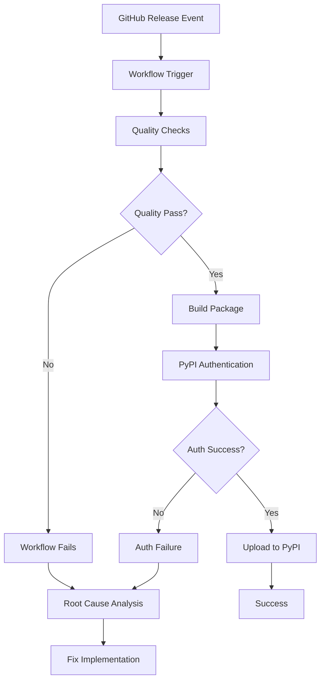
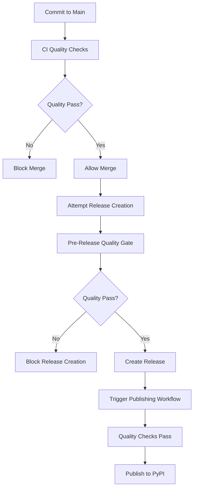

# Design Document

## Overview

This design addresses the systematic investigation and resolution of PyPI publishing workflow failures. The approach involves forensic analysis of workflow execution, identification of failure points, and implementation of targeted fixes to restore automated publishing functionality.

## Architecture

### Current Problem Flow



### Prevention System Architecture



### Failure Analysis Components

1. **Workflow Execution Tracer**
   - Analyzes GitHub Actions logs
   - Identifies exact failure points
   - Maps failure to workflow steps

2. **Quality Gate Analyzer**
   - Examines linting errors
   - Identifies formatting issues
   - Checks type validation failures
   - Reviews test execution results

3. **Authentication Validator**
   - Verifies PyPI trusted publisher setup
   - Validates OIDC token exchange
   - Checks repository permissions

## Components and Interfaces

### 1. Workflow Log Analyzer

**Purpose**: Extract and analyze GitHub Actions execution logs

**Interface**:
```python
class WorkflowAnalyzer:
    def get_failed_runs(self, workflow_name: str) -> List[WorkflowRun]
    def extract_failure_logs(self, run_id: str) -> FailureReport
    def identify_failure_step(self, logs: str) -> WorkflowStep
```

### 2. Quality Issue Detector

**Purpose**: Identify and categorize code quality problems

**Interface**:
```python
class QualityDetector:
    def run_linting_check(self) -> LintingReport
    def run_formatting_check(self) -> FormattingReport
    def run_type_check(self) -> TypeCheckReport
    def run_test_suite(self) -> TestReport
```

### 3. PyPI Configuration Validator

**Purpose**: Verify PyPI publishing setup

**Interface**:
```python
class PyPIValidator:
    def check_trusted_publisher(self) -> TrustedPublisherStatus
    def validate_package_config(self) -> PackageConfigStatus
    def test_authentication(self) -> AuthStatus
```

### 4. Version Synchronization Validator

**Purpose**: Ensure version consistency between git tags and package metadata

**Interface**:
```python
class VersionValidator:
    def extract_git_tag_version(self, tag: str) -> str
    def extract_package_version(self, pyproject_path: str) -> str
    def validate_version_sync(self, git_version: str, package_version: str) -> ValidationResult
    def check_pypi_version_exists(self, package_name: str, version: str) -> bool
```

## Data Models

### Failure Report
```python
@dataclass
class FailureReport:
    workflow_run_id: str
    trigger_event: str
    failed_step: str
    error_message: str
    exit_code: int
    timestamp: datetime
    logs_excerpt: str
```

### Quality Issue
```python
@dataclass
class QualityIssue:
    file_path: str
    line_number: int
    issue_type: str  # "linting", "formatting", "type", "test"
    severity: str
    message: str
    fix_suggestion: Optional[str]
```

### Version Validation Result
```python
@dataclass
class ValidationResult:
    is_synchronized: bool
    git_version: str
    package_version: str
    error_message: Optional[str]
    pypi_conflict: bool
    recommended_action: str
```

## Error Handling

### Workflow Analysis Errors
- Handle missing or inaccessible workflow logs
- Graceful degradation when GitHub API is unavailable
- Fallback to local git history analysis

### Quality Check Errors
- Continue analysis even if individual tools fail
- Aggregate results from multiple quality tools
- Provide partial results when some checks fail

### Authentication Errors
- Distinguish between configuration and runtime auth issues
- Provide specific guidance for different failure modes
- Test authentication without triggering actual publishing

## Testing Strategy

### Investigation Testing
1. **Mock Workflow Logs**: Test log parsing with known failure scenarios
2. **Quality Tool Integration**: Verify quality checks work in isolation
3. **Authentication Simulation**: Test PyPI auth flow without publishing

### Fix Validation Testing
1. **Quality Fix Verification**: Ensure fixes resolve identified issues
2. **Regression Testing**: Verify fixes don't break existing functionality
3. **End-to-End Publishing**: Test complete workflow after fixes

### Test Scenarios
- Release-triggered workflow failure
- Manual workflow success vs release failure
- Quality gate failures at different steps
- PyPI authentication failures
- Package build failures

## Implementation Phases

### Phase 1: Forensic Analysis
1. Extract and analyze failed workflow logs
2. Identify exact failure points and error messages
3. Compare successful manual runs vs failed release runs
4. Document findings in structured failure report

### Phase 2: Root Cause Identification
1. Run quality checks locally to reproduce issues
2. Validate PyPI configuration and authentication setup
3. Test individual workflow components in isolation
4. Determine primary vs secondary failure causes

### Phase 3: Targeted Fixes
1. Fix identified code quality issues
2. Resolve any PyPI configuration problems
3. Update workflow if necessary
4. Validate fixes through testing

### Phase 4: Version Synchronization Implementation
1. Add version validation step to publishing workflow
2. Implement fast-fail mechanism for version mismatches
3. Create clear error messages for version conflicts
4. Test version validation with mismatched versions
5. Validate that synchronized versions publish successfully

### Phase 5: Prevention System Implementation
1. Implement branch protection rules requiring CI checks
2. Create pre-release quality gate workflow
3. Configure GitHub repository settings to enforce quality gates
4. Test prevention system with failing quality checks

### Phase 6: Verification
1. Test complete publishing workflow with version validation
2. Verify both manual and release-triggered publishing work
3. Validate prevention system blocks bad releases
4. Test version synchronization prevents PyPI conflicts
5. Document resolution and prevention measures
6. Update CI/CD documentation