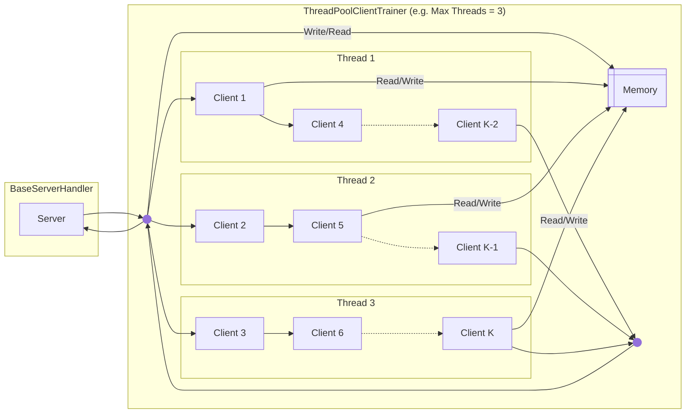
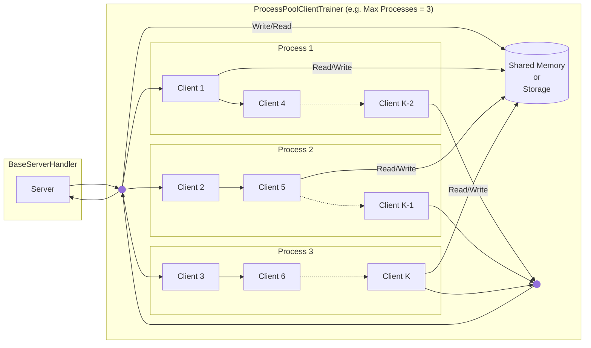
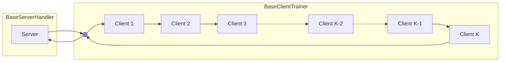
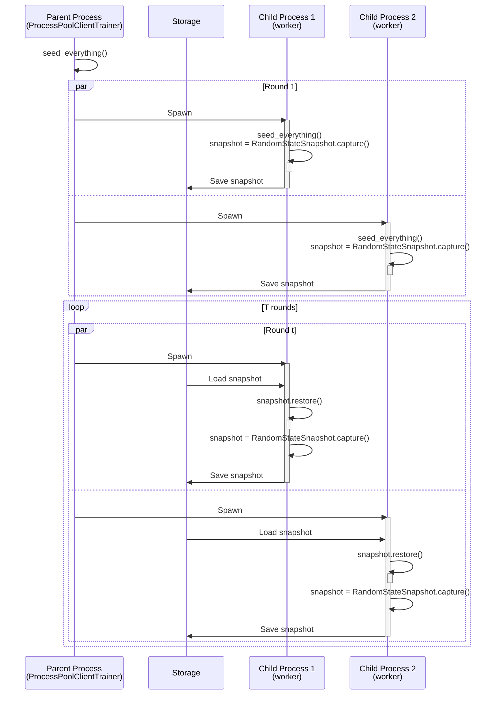
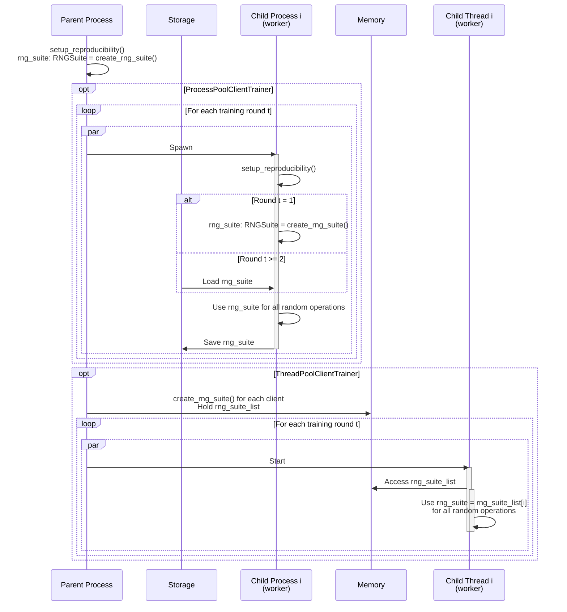

<div align="center"></div>
<div align="center">A blazing-fast, minimalist, and researcher-friendly simulation framework for Federated Learning</div>
<br>
<div align="center">
  <a href="https://github.com/astral-sh/uv"></a>
  <a href="https://pypi.python.org/pypi/blazefl"></a>
  <a href="https://pypi.python.org/pypi/blazefl"></a>
  <a href="https://pypi.python.org/pypi/blazefl"></a>
</div>


## Feature Highlights

- 🚀 **High Performance**: Optimized for single-node simulations, BlazeFL leverages Python 3.14's free-threading to deliver top-tier performance, especially in the multi-threaded mode.

- 🧩 **High Extensibility**: BlazeFL focuses on core communication and parallelization interfaces, avoiding excessive abstraction to maintain flexibility. 

- 🍃 **Minimal Dependencies**: The framework's core relies only on [PyTorch](https://github.com/pytorch/pytorch), ensuring a lightweight and straightforward setup. 

- 🔄 **Robust Reproducibility**: Ensures true experimental reproducibility with advanced strategies, from full random-state snapshotting to isolated random number generators, guaranteeing consistency in any parallel environment.

- 🛡️ **Structured and Type-Safe by Design**: By leveraging [dataclasses](https://docs.python.org/3/library/dataclasses.html) and [protocols](https://typing.python.org/en/latest/spec/protocol.html), BlazeFL enables the creation of clear, type-safe, and self-documenting communication packages (`UplinkPackage`, `DownlinkPackage`). This design enhances code readability, maintainability, and reduces errors in FL workflows.

## Execution Modes

BlazeFL offers three distinct execution modes, each providing a different balance between implementation simplicity and performance.

### 1. Multi-Threaded Mode (Recommended)

**Leverages multiple threads to process clients in parallel within the same process.**

This mode, implemented via the `ThreadPoolClientTrainer` class, can offer faster performance while maintaining a simpler implementation than multi-processing.

> [!IMPORTANT]
> To achieve true parallelism, this mode requires a Python 3.14+ free-threading build. Without it, performance will be limited by the Global Interpreter Lock (GIL), resulting in concurrency rather than true parallelism. Python 3.13 also offers an experimental version of this feature.



### 2. Multi-Process Mode

**Utilizes separate processes to achieve true parallelism and robust resource isolation.**

This mode, corresponding to the `ProcessPoolClientTrainer` class, offers excellent performance. It provides two options for Inter-Process Communication (IPC), configurable via the `ipc_mode` parameter, to suit your needs:
- **Storage Mode**: Shares parameters via disk, reducing memory usage.
- **Shared Memory Mode**: Shares parameters directly in shared memory for potentially faster performance.



### 3. Single-Threaded Mode

**Executes clients sequentially in a single thread.**

This is the most straightforward mode, making it ideal for simple simulations or debugging, though it offers the lowest throughput. This mode is implemented using the `BaseClientTrainer` class.



## Getting Started

### Installation

BlazeFL is available on PyPI and can be installed using your preferred package manager.

For example, using [uv](https://docs.astral.sh/uv/getting-started/installation/):

```bash
uv add blazefl
```

### Examples

| Example | Description | 
|---------|-------------|
| [Quickstart: FedAvg](https://github.com/blazefl/blazefl/tree/main/examples/quickstart-fedavg) | Learn the fundamentals of BlazeFL with a standard Federated Averaging (FedAvg) implementation, covering single-threaded, multi-process, and multi-threaded modes. |
| [Step-by-Step Tutorial: DS-FL](https://github.com/blazefl/blazefl/tree/main/examples/step-by-step-dsfl) | Build a custom distillation-based Federated Learning algorithm from scratch, and understand how to implement your own algorithms on the BlazeFL framework. |


## Robust Reproducibility
BlazeFL provides two strategies to ensure the reproducibility of your experiments, especially in complex scenarios like multi-process or multi-threaded environments. To use these features, please install the required dependencies:

```bash
uv add blazefl[reproducibility]
```

### 1. Global Seeding Strategy

This approach uses a single global seed. As the diagram illustrates, after the parent process calls `seed_everything()`, each child process is responsible for its own state management. It must capture a `RandomStateSnapshot` of its random number generators, save it to storage after its work is done, and restore it before the next round.

This strategy works for `ProcessPoolClientTrainer` because each process has its own memory space. However, it is **not compatible** with `ThreadPoolClientTrainer`, as all threads would share and alter a single global state non-deterministically.

<details>
<summary>Click to see the diagram</summary>


</details>

### 2. Generator-Based Strategy (Recommended)

This is the **recommended** approach. It provides each worker its own isolated `RNGSuite` (a collection of random number generators), avoiding global state entirely. The handling differs based on the trainer used:

- With `ProcessPoolClientTrainer`: Since processes don't share memory, each worker creates its own `RNGSuite` on the first round. For subsequent rounds, it saves its `RNGSuite` to storage and loads it back, as shown in the diagram.

- With `ThreadPoolClientTrainer`: Since threads share memory, the parent process can create an `RNGSuite` for every worker and hold them in a list. Each thread then directly accesses its assigned `RNGSuite` from shared memory for each round.

This ensures robust reproducibility in all scenarios.

<details>
<summary>Click to see the diagram</summary>


</details>

#### User Guide

When adopting the generator-based strategy, there's a crucial consideration. Libraries that internally rely on the global random number generator, such as `RandomCrop` or `RandomHorizontalFlip` from `torchvision.transforms`, will not benefit from the `RNGSuite` out of the box.

To resolve this, you must create a custom version of such transforms by inheriting from the original class and modifying it to accept and use a `torch.Generator` instance.

**Example Implementation:** `GeneratorRandomHorizontalFlip`

```python
import torch
from torchvision.transforms import RandomHorizontalFlip

class GeneratorRandomHorizontalFlip(RandomHorizontalFlip):
    def __init__(self, p=0.5, generator: torch.Generator | None = None):
        super().__init__(p)
        self.generator = generator

    def forward(self, img):
        if torch.rand(1, generator=self.generator) < self.p:
            return F.hflip(img)
        return img
```

By integrating these custom transforms into your dataset pipeline, you can achieve full reproducibility across all execution modes, including `ThreadPoolClientTrainer`.

## Simulation Benchmarks

To showcase the performance of BlazeFL, we conducted a benchmark against [Flower](https://github.com/adap/flower), a popular FL framework. With the official support for free-threading in Python 3.14, BlazeFL's multi-threaded mode now offers exceptional performance for single-node simulations.

### Benchmark Setup

The benchmark was performed using the **FedAvg** algorithm on the **CIFAR-10** dataset. The simulation was configured with **100 clients**, **5 communication** rounds, and **5 local epochs** for two models: a small [CNN](https://pytorch.org/tutorials/beginner/blitz/cifar10_tutorial.html) and a larger [ResNet18](https://pytorch.org/vision/main/models/generated/torchvision.models.resnet18.html).

### Execution Environment

The benchmark was conducted on a single node with the following specifications:

- **CPU**: AMD EPYC 7542 (32 Cores)
- **Memory**: 256 GB
- **GPU**: 4 x Quadro RTX 6000
- **Shared Memory**: 32 GB
- **Python**: BlazeFL was run with Python 3.13.7 (experimental free-threading build), while Flower was run with Python 3.13.7 (with GIL) due to library compatibility at the time of testing

### Results

The results demonstrate that BlazeFL's multi-threaded mode is the clear winner, outperforming both its own multi-process mode and Flower in nearly all scenarios.

<div style="display: flex; justify-content: center; align-items: center;">
  
  
</div>
<br>

For both the lightweight CNN and the more demanding ResNet-18, the multi-threaded mode scales exceptionally well, leveraging the direct memory access between threads to minimize overhead. This advantage is particularly pronounced in the CNN benchmark, where the overhead of process-based methods (BlazeFL's multiprocessing and Flower's Ray backend) is more significant relative to the computation time. Even with the heavier ResNet-18 model, the multi-threaded mode maintains a consistent performance lead.

This benchmark highlights the power of free-threaded Python for CPU-bound, data-intensive workloads like FL simulations. By eliminating the GIL and avoiding the costs of serialization and inter-process communication, BlazeFL's multi-threaded mode offers a simpler and faster solution for researchers and developers.

## Contributing

We welcome contributions from the community! If you'd like to contribute to this project, please see our [contribution guidelines](https://github.com/blazefl/blazefl/blob/main/docs/source/contribute.rst) for more information on how to get started.

Please note that this project is governed by our [Code of Conduct](https://github.com/blazefl/blazefl/blob/main/CODE_OF_CONDUCT.md). By participating, you are expected to uphold this code.
