# Clauxton Architecture

**Version**: 1.0
**Last Updated**: 2025-10-19
**Status**: Design Phase

---

## Table of Contents

- [System Overview](#system-overview)
- [Component Architecture](#component-architecture)
- [Data Flow](#data-flow)
- [Storage Architecture](#storage-architecture)
- [MCP Integration](#mcp-integration)
- [Task Dependency Graph](#task-dependency-graph)
- [Conflict Detection](#conflict-detection)
- [Deployment Architecture](#deployment-architecture)

---

## System Overview

Clauxton is a local-first, privacy-by-default Claude Code plugin that provides persistent context through three core subsystems:


### Design Principles

1. **Local-First**: All data stored locally, no cloud dependencies
2. **Privacy-by-Default**: User data never leaves the machine
3. **AI-Friendly**: Declarative, type-safe, human-readable
4. **Git-Compatible**: Plain-text YAML files, diffable and mergeable
5. **Fail-Safe**: Atomic writes, backups, validation

---

## Component Architecture

### High-Level Components


### Component Descriptions

| Component | Responsibility | Key Operations |
|-----------|----------------|----------------|
| **Knowledge Base** | Persistent project context storage | Add, search, get, update, delete entries |
| **Task Manager** | Task lifecycle & DAG management | Create, start, complete, validate dependencies |
| **Dependency Analyzer** | Auto-infer task dependencies | Analyze file edits, imports, KB patterns |
| **Conflict Detector** | Pre-merge conflict detection | Detect file overlaps, estimate risk, suggest order |
| **Event Logger** | Immutable audit log | Log all operations for analysis |
| **MCP Servers** | Claude Code integration | Expose tools via Model Context Protocol |
| **CLI** | User-facing commands | Interactive prompts, output formatting |

---

## Data Flow

### Knowledge Base Workflow


### Task Creation with Dependency Inference


### Conflict Detection Flow

```mermaid
sequenceDiagram
    participant User
    participant Claude
    participant CD as Conflict Detector
    participant TM as Task Manager
    participant Git

    User->>Claude: "/task-start TASK-005"
    Claude->>CD: detect_conflicts([TASK-005, in_progress_tasks])
    CD->>TM: get_in_progress_tasks()
    TM-->>CD: [TASK-003, TASK-004]
    CD->>CD: For each pair (TASK-005, TASK-X)
    CD->>CD: Calculate file_overlap()
    CD->>Git: git diff TASK-003-branch
    Git-->>CD: Modified lines in src/auth.py
    CD->>CD: Estimate line overlap (heuristic)
    CD->>CD: Calculate risk_score (0.0-1.0)
    CD-->>Claude: [{risk: 0.7, files: ["src/auth.py"], recommendation: "Complete TASK-003 first"}]
    Claude-->>User: "⚠️ Medium risk conflict with TASK-003. Suggested order: TASK-003 → TASK-005"
```



---

## Storage Architecture

### Directory Structure

```
your-project/
├── .clauxton/
│   ├── knowledge-base.yml    # Persistent project context
│   ├── tasks.yml              # Task definitions & status
│   ├── events.jsonl           # Immutable event log
│   ├── config.yml             # User preferences
│   └── backups/
│       ├── knowledge-base.yml.bak
│       └── tasks.yml.bak
├── .claude-plugin/
│   └── plugin.json            # Plugin manifest
├── commands/
│   ├── kb-search.md
│   ├── task-next.md
│   └── ...
├── agents/
│   ├── dependency-analyzer.md
│   └── conflict-detector.md
└── hooks/
    ├── post-edit-update-kb.sh
    └── pre-task-start.sh
```

### Data Schemas

#### knowledge-base.yml

```yaml
version: "1.0"
project_name: "my-project"
project_description: "E-commerce platform"

entries:
  - id: KB-20251019-001
    title: "API uses FastAPI framework"
    category: architecture
    content: |
      All backend APIs are implemented using FastAPI.
      - Uses Pydantic for request/response models
      - Async endpoints preferred
      - OpenAPI docs at /docs
    tags:
      - backend
      - api
      - fastapi
    created_at: 2025-10-19T10:30:00Z
    updated_at: 2025-10-19T10:30:00Z
    author: null
    version: 1

  - id: KB-20251019-002
    title: "Write tests before implementation"
    category: convention
    content: "Team follows TDD. All new features require tests first."
    tags:
      - testing
      - tdd
    created_at: 2025-10-19T11:00:00Z
    updated_at: 2025-10-19T11:00:00Z
    author: null
    version: 1
```

#### tasks.yml

```yaml
version: "1.0"

tasks:
  - id: TASK-001
    name: "Setup database schema"
    description: "Create PostgreSQL schema for users table"
    status: completed
    priority: high
    depends_on: []
    files_to_edit:
      - migrations/001_create_users.sql
      - models/user.py
    related_kb:
      - KB-20251019-001
    estimated_hours: 2.0
    actual_hours: 1.5
    created_at: 2025-10-19T09:00:00Z
    started_at: 2025-10-19T09:15:00Z
    completed_at: 2025-10-19T10:30:00Z

  - id: TASK-002
    name: "Implement user registration API"
    description: "POST /api/users endpoint with validation"
    status: in_progress
    priority: high
    depends_on:
      - TASK-001
    files_to_edit:
      - api/routes/users.py
      - api/schemas/user.py
    related_kb:
      - KB-20251019-001
    estimated_hours: 3.0
    actual_hours: null
    created_at: 2025-10-19T10:00:00Z
    started_at: 2025-10-19T10:45:00Z
    completed_at: null

  - id: TASK-003
    name: "Write tests for user registration"
    description: "Unit + integration tests for /api/users"
    status: pending
    priority: high
    depends_on:
      - TASK-002  # Manual dependency
    inferred_depends_on:
      - id: TASK-002
        confidence: 0.9
        reason: "KB pattern: TDD convention requires tests after implementation"
    files_to_edit:
      - tests/api/test_users.py
    related_kb:
      - KB-20251019-002
    estimated_hours: 2.0
    actual_hours: null
    created_at: 2025-10-19T10:30:00Z
    started_at: null
    completed_at: null
```

#### events.jsonl

```jsonl
{"event_type": "kb_added", "timestamp": "2025-10-19T10:30:00Z", "data": {"entry_id": "KB-20251019-001", "category": "architecture"}}
{"event_type": "task_created", "timestamp": "2025-10-19T10:00:00Z", "data": {"task_id": "TASK-002", "inferred_deps": ["TASK-001"]}}
{"event_type": "task_started", "timestamp": "2025-10-19T10:45:00Z", "data": {"task_id": "TASK-002", "user": "claude"}}
{"event_type": "file_edited", "timestamp": "2025-10-19T11:00:00Z", "data": {"file": "api/routes/users.py", "task_id": "TASK-002", "lines_changed": 45}}
{"event_type": "conflict_detected", "timestamp": "2025-10-19T11:15:00Z", "data": {"task_pair": ["TASK-002", "TASK-005"], "risk_score": 0.7, "files": ["api/routes/users.py"]}}
```

---

## MCP Integration

### MCP Server Architecture


### Registered Tools

#### KB Server Tools

| Tool Name | Description | Parameters | Returns |
|-----------|-------------|------------|---------|
| `kb_search` | Search Knowledge Base | `query: str`, `category?: str`, `tags?: list`, `limit?: int` | `List[KnowledgeBaseEntry]` |
| `kb_add` | Add KB entry | `title: str`, `category: str`, `content: str`, `tags?: list` | `{entry_id: str}` |
| `kb_get` | Get entry by ID | `entry_id: str` | `KnowledgeBaseEntry` |

#### Task Server Tools

| Tool Name | Description | Parameters | Returns |
|-----------|-------------|------------|---------|
| `task_create` | Create new task | `name: str`, `description?: str`, `files_to_edit?: list`, `priority?: str` | `{task_id: str, inferred_deps: list}` |
| `task_next` | Get next tasks | `priority?: str`, `limit?: int` | `List[Task]` |
| `task_start` | Mark task as started | `task_id: str` | `Task` |
| `task_complete` | Mark task as completed | `task_id: str`, `actual_hours?: float` | `Task` |
| `conflicts_check` | Check for conflicts | `task_ids: list` | `List[ConflictRisk]` |

---

## Task Dependency Graph

### DAG Representation

Tasks form a Directed Acyclic Graph (DAG) where:
- **Nodes**: Tasks (TASK-001, TASK-002, ...)
- **Edges**: Dependencies (TASK-002 depends on TASK-001)
- **Constraint**: No cycles allowed


**Legend**:
- 🟢 Green: Completed
- 🟡 Yellow: In Progress
- 🔵 Blue: Pending

### Algorithms

#### Cycle Detection (Depth-First Search)

```python
def detect_cycle(tasks: List[Task]) -> Optional[List[str]]:
    """
    Detect cycles in task dependency graph.

    Returns:
        List of task IDs forming a cycle, or None if no cycle.
    """
    graph = build_adjacency_list(tasks)
    visited = set()
    rec_stack = set()

    def dfs(task_id: str, path: List[str]) -> Optional[List[str]]:
        if task_id in rec_stack:
            # Cycle detected
            cycle_start = path.index(task_id)
            return path[cycle_start:] + [task_id]

        if task_id in visited:
            return None

        visited.add(task_id)
        rec_stack.add(task_id)

        for dep_id in graph.get(task_id, []):
            cycle = dfs(dep_id, path + [task_id])
            if cycle:
                return cycle

        rec_stack.remove(task_id)
        return None

    for task in tasks:
        cycle = dfs(task.id, [])
        if cycle:
            return cycle

    return None
```

#### Topological Sort (Kahn's Algorithm)

```python
def topological_sort(tasks: List[Task]) -> List[str]:
    """
    Return tasks in dependency order (roots first).
    """
    graph = build_adjacency_list(tasks)
    in_degree = calculate_in_degree(graph)

    queue = [task_id for task_id, degree in in_degree.items() if degree == 0]
    result = []

    while queue:
        task_id = queue.pop(0)
        result.append(task_id)

        for neighbor in graph.get(task_id, []):
            in_degree[neighbor] -= 1
            if in_degree[neighbor] == 0:
                queue.append(neighbor)

    if len(result) != len(tasks):
        raise CycleDetectedError("Graph has a cycle")

    return result
```

---

## Conflict Detection

### Risk Scoring Algorithm

```python
def calculate_conflict_risk(task1: Task, task2: Task) -> ConflictRisk:
    """
    Calculate conflict risk between two tasks.

    Risk factors:
    1. File overlap (same files edited)
    2. Line overlap (estimated via git diff)
    3. Temporal overlap (both in_progress simultaneously)
    4. Historical conflicts (from event log)
    """
    risk_score = 0.0

    # 1. File overlap (0.0-0.4)
    common_files = set(task1.files_to_edit) & set(task2.files_to_edit)
    if common_files:
        file_overlap_ratio = len(common_files) / max(len(task1.files_to_edit), len(task2.files_to_edit))
        risk_score += 0.4 * file_overlap_ratio

    # 2. Line overlap (0.0-0.4)
    for file in common_files:
        line_overlap = estimate_line_overlap(file, task1, task2)  # Heuristic
        risk_score += 0.4 * line_overlap

    # 3. Temporal overlap (0.0-0.1)
    if task1.status == "in_progress" and task2.status == "in_progress":
        risk_score += 0.1

    # 4. Historical conflicts (0.0-0.1)
    historical_risk = check_historical_conflicts(task1, task2)
    risk_score += 0.1 * historical_risk

    return ConflictRisk(
        task_pair=[task1.id, task2.id],
        risk_score=min(risk_score, 1.0),
        common_files=list(common_files),
        recommendation=generate_recommendation(risk_score)
    )
```

### Conflict Risk Levels

| Risk Score | Level | Recommendation |
|------------|-------|----------------|
| 0.0 - 0.3 | Low | Safe to proceed in parallel |
| 0.3 - 0.6 | Medium | Review changes carefully, consider sequential execution |
| 0.6 - 1.0 | High | Execute sequentially, high merge conflict probability |

---

## Deployment Architecture

### Local Installation

```
User's Machine
├── Python 3.11+ (system or venv)
├── Clauxton Package (pip install clauxton)
│   ├── clauxton/ (Python code)
│   ├── .claude-plugin/ (plugin manifest)
│   ├── commands/ (slash commands)
│   ├── agents/ (subagent definitions)
│   └── hooks/ (lifecycle hooks)
└── Claude Code
    └── ~/.config/claude-code/
        └── plugins/
            └── clauxton/ (symlink or copy)
```

### Runtime Architecture


### Process Communication

- **CLI ↔ Core**: Direct Python function calls (same process)
- **MCP Servers ↔ Core**: Direct Python function calls (same process)
- **Claude ↔ MCP Servers**: stdio or HTTP (separate processes)
- **All ↔ Storage**: File I/O with atomic writes

---

## Performance Characteristics

| Operation | Target Latency | Notes |
|-----------|----------------|-------|
| `kb_search` | <1s | In-memory cache for entries |
| `task_next` | <500ms | Topological sort on <1000 tasks |
| `conflicts_check` | <2s | Git diff analysis (I/O bound) |
| `kb_add` | <100ms | YAML write with backup |
| Dependency inference | <1s | AST parsing + pattern matching |

### Scalability Limits

- **Knowledge Base**: Up to 10,000 entries (YAML becomes slow beyond this)
- **Tasks**: Up to 1,000 tasks (DAG algorithms remain fast)
- **Event Log**: Unlimited (append-only, rotated if >100MB)

For larger projects, Phase 3+ will introduce PostgreSQL backend.

---

## Security Considerations

1. **File Permissions**: `.clauxton/` set to 700, files to 600
2. **Input Validation**: All inputs validated via Pydantic
3. **YAML Safety**: Use `yaml.safe_load()` (no arbitrary code execution)
4. **Path Traversal**: Validate all file paths stay within project root
5. **No Network**: Phase 0-2 have zero network dependencies

---

## Future Architecture (Phase 3+)

- **Team Mode**: PostgreSQL backend for shared Knowledge Base
- **Real-time Sync**: WebSocket for multi-user collaboration
- **ML Models**: Fine-tuned models for dependency/conflict prediction
- **Web UI**: Optional web interface for KB/task management

---

**Document Status**: ✅ Complete
**Last Review**: 2025-10-19
**Next Review**: After Phase 0 implementation
