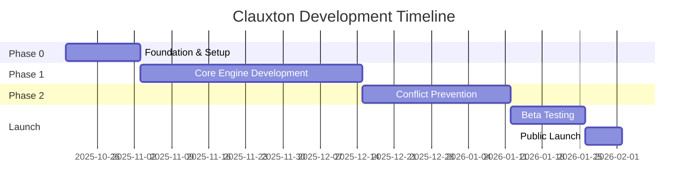

# Clauxton プロジェクト企画書

**バージョン**: 1.0
**作成日**: 2025年10月19日
**ステータス**: Draft
**プロジェクト名**: Clauxton (Claude + Context)

---

## エグゼクティブサマリー

Clauxtonは, Claude Codeユーザー向けの文脈永続化プラグインです.セッション間で失われるプロジェクト知識を保持し, タスク依存関係を自動追跡し, ファイル競合を事前検出することで, AI支援開発の生産性を飛躍的に向上させます.

**市場機会**: AI開発ツール市場は2025年に$2B→$97Bへ成長予測, しかし開発者の信頼は低下(70%→60%).66%の開発者が"ほぼ正しいが完全ではない"AI出力に不満を持つ.Clauxtonは, この信頼ギャップを埋める"記憶を持つAI"として差別化します.

**コアバリュー**:
- 🧠 **永続的記憶**: MCP (Model Context Protocol) による Knowledge Base で文脈を保持
- 🔗 **自動依存追跡**: SubagentとHooksによる依存関係グラフ自動生成
- ⚠️ **事前競合検出**: GitOps風 Drift Detection によるマージ前の競合予測
- 🔒 **プライバシーファースト**: ローカル実行, クラウド依存なし(デフォルト)

**ターゲット**: Claude Code採用開発者(特に中規模以上のプロジェクト, チーム開発)

**実装期間**: 3-4ヶ月(Phase 0-2)

**想定ROI**: 開発者1人あたり週2-4時間の時間節約(文脈再構築, 手動依存管理, マージ競合解決の削減)

---

## 1. プロジェクト概要

### 1.1 背景

Claude Code は強力なAIペアプログラミングツールですが, 以下の構造的課題があります: 

1. **セッションレス**: 各セッションが独立し, 以前の文脈を引き継がない
2. **依存管理の空白**: タスク依存(Jira等)とコード依存(dependency-cruiser等)が分離
3. **事後的競合検出**: マージ後にしか競合が分からない

これらは個人の問題ではなく, **業界全体の未解決問題**です(PAIN_POINTS_RESEARCH.md).

### 1.2 ソリューション

Clauxtonは, Claude Code Plugin として以下を提供します: 

```
Clauxton = Knowledge Base (MCP)
         + Task Manager (Subagent)
         + Conflict Detector (Hooks)
         + Smart Commands (Slash Commands)
```

**技術アーキテクチャ**:
- **MCP Servers**: 永続的Knowledge Base, Task状態管理
- **Subagents**: 依存解析, 競合検出の並列実行
- **Hooks**: コード編集· タスク開始時の自動チェック
- **Slash Commands**: `/kb-search`, `/task-next`, `/deps-graph` 等

**AI-Friendly設計**(後述の要件定義書で詳述):
- YAML/JSON: 設定· データ格納(AIが読み書きしやすい)
- Python + Type Hints: コアエンジン実装(AIが最も得意)
- Pydantic: データバリデーション(宣言的· 明示的)
- Markdown: ドキュメント· Knowledge Base(AI-native)

### 1.3 競合優位性

| 既存ソリューション | 弱点 | Clauxton の差別化 |
|---|---|---|
| mcp-memory-keeper | 汎用記憶(プロジェクト構造理解なし) | プロジェクト固有Knowledge Base |
| OpenMemory | LLM用ベクトルDB(検索特化) | タスク· 依存グラフ統合 |
| Jira/Linear | タスク依存のみ(コード非連携) | コード編集と連動した依存追跡 |
| dependency-cruiser | コード依存のみ(タスク非連携) | タスク依存とコード依存の統合 |
| GitHub Conflict Checker | マージ後の検出 | 事前予測(ローカルで実行前) |

**唯一の統合ソリューション**: Knowledge Base + Task + Dependency + Conflict を一体化.

---

## 2. 市場分析

### 2.1 市場規模と成長

**AI開発ツール市場**(TREND_RESEARCH_2025.md より):
- 2024年: $2B → 2025年予測: $97B(48.5倍成長)
- GitHub Copilot: 150万有料ユーザー(2024年)
- AI tool 採用率: 84%(Stack Overflow Survey 2024)

**ローカルAI トレンド**:
- Ollama 採用率: 51%(State of AI Engineering 2024)
- プライバシー懸念: 81%(McKinsey)
- ローカル実行需要が急増

### 2.2 開発者ペインポイント

**信頼の低下**:
- 2023年: 70% 満足 → 2024年: 60% 満足(Retool Survey)
- 66%が"ほぼ正しいが完全ではない"に不満(Stack Overflow)

**プロジェクト計画への抵抗**:
- 69%が"AIをプロジェクト計画に使う予定なし"(Stack Overflow)
- 理由: 文脈理解の欠如, 信頼性の低さ

**Clauxtonが解決する問題**:
1. 文脈欠如 → Knowledge Base で解決
2. "ほぼ正しい"問題 → 依存グラフで検証可能に
3. 計画抵抗 → 自動タスク分解· 依存抽出

### 2.3 ターゲット顧客

**プライマリターゲット**:
```yaml
Persona 1: "Solo Developer with Complex Projects"
  - 特徴: 個人開発者, 中~大規模プロジェクト
  - ペインポイント: セッション跨ぎ時の文脈喪失, 手動タスク管理
  - 使用頻度: 毎日 5-10回
  - 支払意欲: $10-20/月(時間節約効果)

Persona 2: "Small Team Tech Lead"
  - 特徴: 3-5人チームのリード
  - ペインポイント: チーム間の知識共有, マージ競合頻発
  - 使用頻度: 毎日 10-20回(チーム全体)
  - 支払意欲: $50-100/月(チームライセンス)

Persona 3: "AI-First Developer"
  - 特徴: Claude Code, Cursor 等を積極活用
  - ペインポイント: AIが過去の判断を覚えていない
  - 使用頻度: 毎日 20回以上
  - 支払意欲: $20-30/月(生産性向上)
```

**セカンダリターゲット**:
- リモートチーム(非同期コミュニケーション文脈保持)
- オープンソースメンテナー(長期プロジェクト文脈管理)

### 2.4 市場参入戦略

**Phase 1: Early Adopters(0-6ヶ月)**
- Claude Code公式プラグインマーケットプレイス登録
- GitHub/Reddit/HackerNews でのローンチ
- 無料版(個人利用)+ Pro版(チーム機能)

**Phase 2: Growth(6-12ヶ月)**
- Cursor, Windsurf 等への展開(汎用化)
- チームライセンス販売
- Enterprise向けオンプレミス版

**Phase 3: Platform(12-24ヶ月)**
- プラグインエコシステム(サードパーティ拡張)
- API公開(他ツールとの統合)

---

## 3. プロダクト戦略

### 3.1 コア機能(MVP)

**Phase 0: Foundation(Week 1-2)**
```yaml
Deliverables:
  - Claude Code Plugin Manifest
  - Basic MCP Server (Knowledge Base CRUD)
  - Plugin installation & activation確認
  - `/kb-add`, `/kb-search` commands

Success Criteria:
  - プラグインがClaude Codeで認識される
  - Knowledge Baseに手動追加· 検索が可能
```

**Phase 1: Core Engine(Week 3-8)**
```yaml
Deliverables:
  - Task Manager (YAML-based)
  - Dependency Analyzer Subagent
  - Auto-inference from code edits (Hooks)
  - `/task-start`, `/task-next`, `/deps-graph`

Success Criteria:
  - タスク間依存を自動推論
  - DAGを視覚化
  - "次に何をすべきか"をAIが提案
```

**Phase 2: Conflict Prevention(Week 9-12)**
```yaml
Deliverables:
  - Conflict Detector Subagent
  - Pre-merge drift detection
  - Smart merge suggestions
  - `/conflicts-check`, `/merge-safe`

Success Criteria:
  - マージ前に競合予測(80%以上の精度)
  - 安全なマージ順序を提案
```

### 3.2 差別化ポイント

**1. Claude Code Native**
- 他ツールは"汎用記憶", ClauxtonはClaude Code専用最適化
- Subagent並列実行(他ツールはシーケンシャル)
- Plan Mode統合(読み取り専用フェーズで安全にKB検索)

**2. GitOps Pattern**
- Event Sourcing: 全編集履歴を保持(監査可能)
- Drift Detection: 期待状態と実状態の差分検出
- Idempotent Operations: 安全な再実行

**3. Privacy-First**
- デフォルトローカル実行(.clauxton/ にすべて保存)
- オプションでクラウド同期(暗号化)
- No telemetry without consent

### 3.3 技術スタック(AI-Friendly)

**なぜAI-Friendlyか?**
- Claude Code自身がコード生成· 修正を行う
- AIが読み書きしやすい形式 = 自己修復· 自動進化が可能

```yaml
Core Language:
  - Python 3.11+ (AI が最も得意)
  - Type Hints 必須(Pydanticで検証)

Data Formats:
  - YAML: 設定, Knowledge Base(人間も読める)
  - JSON: Task状態, API通信(標準的)
  - Markdown: ドキュメント, プロンプト(AI-native)

Database:
  - SQLite: ローカルストレージ(依存なし)
  - PostgreSQL: オプション(チーム共有時)

Validation:
  - Pydantic v2: 宣言的スキーマ(AIが理解しやすい)

Testing:
  - Pytest: 標準的, AIがテスト生成しやすい

Documentation:
  - Docstring: Google Style(Claude Codeが推奨)
  - OpenAPI: MCP Server API定義
```

### 3.4 成功指標(KPI)

**Phase 0-1 (MVP)**:
```yaml
Technical:
  - Plugin activation success rate: >95%
  - Knowledge Base CRUD latency: <100ms
  - Dependency inference accuracy: >70%

User:
  - Early adopters: 100 users (3ヶ月以内)
  - Weekly active users: 50+ (MVP期間中)
  - GitHub stars: 200+ (ローンチ6週間)
```

**Phase 2 (Full Product)**:
```yaml
Technical:
  - Conflict prediction accuracy: >80%
  - False positive rate: <15%
  - Knowledge Base size: 10MB以下(平均プロジェクト)

User:
  - Total users: 1,000+ (6ヶ月)
  - Paying users: 50+ (Pro版)
  - Time saved: 2-4 hours/week/user
  - Retention (30-day): >60%
```

**Business(Optional, Year 1)**:
```yaml
Revenue:
  - MRR: $1,000+ ($10-20/user × 50-100 users)
  - Team licenses: 5+ ($50-100/team)

Community:
  - Plugin downloads: 5,000+
  - GitHub contributors: 10+
  - Documentation page views: 10,000+/month
```

---

## 4. 実装計画

### 4.1 開発フェーズ



**Phase 0: Foundation(2週間)**
- Week 1: プロジェクト初期化, 基本構造
- Week 2: MCP Server基礎, Plugin Manifest

**Phase 1: Core Engine(6週間)**
- Week 3-4: Task Manager, Knowledge Base統合
- Week 5-6: Dependency Analyzer Subagent
- Week 7-8: Hooks統合, 自動推論

**Phase 2: Conflict Prevention(4週間)**
- Week 9-10: Conflict Detector Subagent
- Week 11-12: Drift Detection, Smart Merge

**Launch Preparation(3週間)**
- Week 13-14: Beta Testing, Bug Fixes
- Week 15: Documentation, Marketing準備
- Week 16: Public Launch

### 4.2 リソース要件

**開発リソース**:
```yaml
Primary Developer: 1名(フルタイム想定)
  - Python/MCP経験
  - Claude Code Plugin開発経験(または学習意欲)
  - 週40時間 × 16週間 = 640時間

AI Assistance:
  - Claude Code: 設計· 実装· テスト生成
  - 想定効率化: 30-40%(従来比)

Infrastructure:
  - GitHub: コード管理(無料)
  - PyPI: パッケージ配布(無料)
  - Claude Code Plugin Marketplace: 配布(無料)
  - ドメイン(オプション): clauxton.dev ($12/year)
```

**総コスト見積もり**:
- 開発時間: 640時間(1名)
- インフラ: $0-12(ドメイン代のみ)
- **実質コスト: 開発者時間のみ**

### 4.3 リスク管理

**技術リスク**:

| リスク | 確率 | 影響 | 対策 |
|---|---|---|---|
| MCP仕様変更 | 中 | 高 | Anthropic公式Discord監視, 早期対応 |
| Claude Code Plugin API不安定 | 中 | 中 | Fallback to CLI mode実装 |
| 依存推論精度不足 | 高 | 中 | 手動修正UI提供, 継続的改善 |
| Conflict検出誤検知 | 中 | 低 | ユーザーフィードバックループ |

**市場リスク**:

| リスク | 確率 | 影響 | 対策 |
|---|---|---|---|
| Claude Code採用率低下 | 低 | 高 | 汎用化準備(Cursor等対応) |
| 競合製品登場 | 中 | 中 | 先行者利益, コミュニティ構築 |
| 無料化圧力 | 高 | 低 | オープンソース前提, Pro機能差別化 |

**軽減策**:
- Early Adopters との密なフィードバックループ
- モジュラー設計(コンポーネント単位で価値提供)
- オープンソース化(コミュニティ駆動開発)

---

## 5. Go-to-Market 戦略

### 5.1 ローンチ戦略

**Pre-Launch(Week 13-14, Beta)**:
```yaml
Target: 20-50 early adopters
Channels:
  - Claude Code Discord: Beta tester募集
  - Personal network: 直接依頼
  - Twitter/X: テック系フォロワーへ告知

Goal:
  - フィードバック収集
  - Critical bug修正
  - Success story 1-2件
```

**Launch Week(Week 15-16)**:
```yaml
Day 1:
  - Product Hunt投稿(朝9時 PST)
  - HackerNews Show HN投稿
  - Reddit r/ClaudeAI, r/programming 投稿

Day 2-3:
  - Twitter/X thread(使い方デモ動画付き)
  - Dev.to 技術記事投稿
  - GitHub README完成版公開

Day 4-7:
  - コミュニティ質問対応
  - メディア取材対応(あれば)
  - 初期ユーザーサポート
```

**Post-Launch(Week 17+)**:
- 週次アップデート(Changelog)
- ユーザーフィードバック優先対応
- コミュニティイベント(AMA等)

### 5.2 価格戦略

**Freemium Model**:

```yaml
Free Tier:
  - 個人利用(1プロジェクト)
  - Knowledge Base: 100エントリまで
  - Task Manager: 50タスクまで
  - ローカルストレージのみ
  - コミュニティサポート

Pro Tier ($15/month):
  - 無制限プロジェクト
  - 無制限Knowledge Base
  - 無制限タスク
  - クラウド同期(オプション)
  - Priority support
  - Advanced analytics

Team Tier ($75/month, 5 users):
  - Pro機能すべて
  - チーム共有Knowledge Base
  - 集中管理ダッシュボード
  - SSO(将来)
  - SLA保証
```

**理由**:
- Free Tier: 採用障壁を下げる, バイラル成長
- Pro Tier: 個人ヘビーユーザー収益化
- Team Tier: B2B展開, LTV向上

### 5.3 成長戦略

**Month 1-3: Product-Market Fit**
- ユーザーインタビュー(週2-3件)
- Retention analysis(週次)
- Feature prioritization(フィードバックベース)

**Month 4-6: Growth Hacking**
- Referral program(紹介で1ヶ月無料)
- Integration partnerships(Cursor, Windsurf等)
- Content marketing(技術ブログ, YouTube)

**Month 7-12: Scale**
- Enterprise sales開始
- API公開(サードパーティ統合)
- プラグインエコシステム構築

---

## 6. 次のステップ

### 6.1 即座に実施(今週)

- [x] プロジェクト名確定(Clauxton)
- [x] クリーンアップ計画策定
- [ ] **要件定義書作成**(次のドキュメント)
- [ ] **設計書作成**(技術アーキテクチャ詳細)
- [ ] ドメイン取得検討(clauxton.dev)

### 6.2 Phase 0 開始前(来週)

- [ ] 新ディレクトリ作成(/workspace/clauxton/)
- [ ] Git初期化, GitHub repo作成
- [ ] PyPI package name予約(`pip install clauxton`テスト)
- [ ] 開発環境セットアップ(venv, pre-commit hooks等)

### 6.3 Phase 0 Week 1

- [ ] Plugin manifest作成
- [ ] 基本ディレクトリ構造作成
- [ ] MCP Server boilerplate
- [ ] 初回動作確認(Claude Codeでプラグイン認識)

---

## 7. 承認

**企画承認者**: [Name]
**承認日**: [Date]
**次回レビュー**: Phase 0完了時(2週間後)

---

## 付録

### A. 参照ドキュメント

- `TREND_RESEARCH_2025.md`: 市場分析詳細
- `PAIN_POINTS_RESEARCH.md`: 技術的課題調査
- `CLAUDE_CODE_FEATURES_RESEARCH.md`: Claude Code機能調査
- `INTEGRATED_PRODUCT_PROPOSALS.md`: 代替案比較
- `PROJECT_NAMING.md`: 命名検討プロセス
- `CLEANUP_AND_RESTART.md`: クリーンアップ手順

### B. 用語集

- **MCP**: Model Context Protocol(Anthropic標準)
- **Knowledge Base**: プロジェクト固有の永続的文脈ストレージ
- **Subagent**: 並列実行される専門AIエージェント
- **Hooks**: Claude Codeライフサイクルイベントハンドラ
- **GitOps**: Git-based infrastructure management pattern
- **Drift Detection**: 期待状態と実状態の差分検出

### C. 変更履歴

| バージョン | 日付 | 変更内容 | 著者 |
|---|---|---|---|
| 1.0 | 2025-10-19 | 初版作成 | Claude Code |

---

**Next Document**: `要件定義書.md`(Functional & Non-Functional Requirements)
