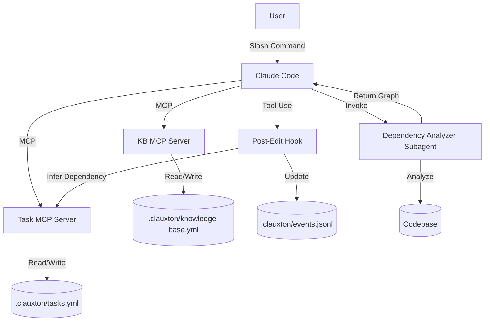
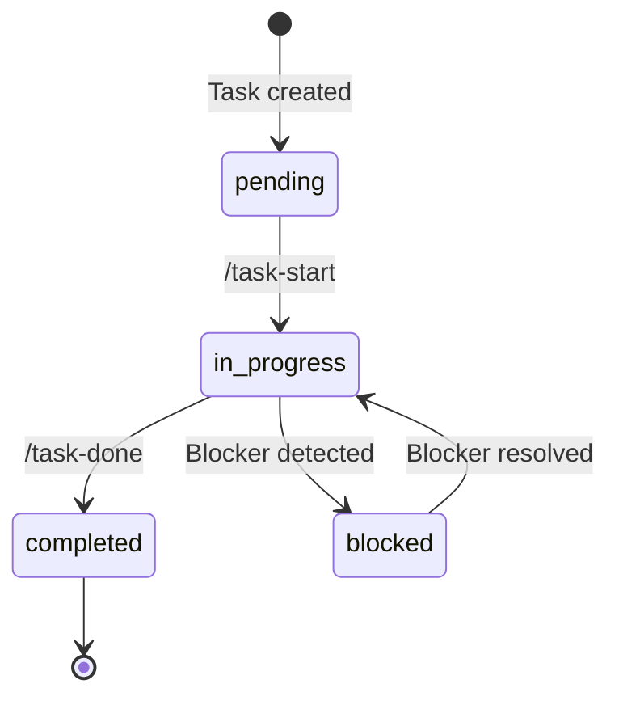

# Clauxton 要件定義書

**バージョン**: 1.0
**作成日**: 2025年10月19日
**ステータス**: Draft
**関連ドキュメント**: 企画書.md, 設計書.md

---

## 目次

1. [概要](#1-概要)
2. [機能要件](#2-機能要件)
3. [非機能要件](#3-非機能要件)
4. [データ要件](#4-データ要件)
5. [インターフェース要件](#5-インターフェース要件)
6. [制約条件](#6-制約条件)
7. [受け入れ基準](#7-受け入れ基準)

---

## 1. 概要

### 1.1 目的

Clauxtonは, Claude Code ユーザーが抱える以下の3つの主要ペインポイントを解決します: 

1. **セッション間の文脈喪失**
2. **手動的な依存関係追跡**
3. **事後的なファイル競合検出**

### 1.2 スコープ

**対象**:
- Claude Code ユーザー(個人· 小規模チーム)
- Python, JavaScript, TypeScript プロジェクト(初期対応言語)
- Git 管理されたプロジェクト

**非対象**(Phase 0-2では実装しない):
- Claude Code以外のエディタ(Cursor, Windsurf等)
- 大規模チーム向け機能(10名以上)
- リアルタイムコラボレーション
- クラウド同期(オプション機能として将来実装)

### 1.3 用語定義

| 用語 | 定義 |
|---|---|
| **Knowledge Base** | プロジェクト固有の永続的文脈情報(設計決定, アーキテクチャ, 制約等) |
| **Task** | 実装すべき単一の作業単位(例: "ログイン機能の実装") |
| **Dependency** | タスク間の依存関係(例: Task B は Task A 完了後にのみ実行可能) |
| **Conflict** | 複数のタスクが同一ファイルを編集することで生じる潜在的競合 |
| **MCP Server** | Model Context Protocol に基づくサーバープロセス |
| **Subagent** | 特定タスクに特化した並列実行AIエージェント |
| **Hook** | Claude Code のライフサイクルイベントに反応する自動実行スクリプト |
| **Slash Command** | `/` で始まるClaude Code コマンド(例: `/kb-search`) |

---

## 2. 機能要件

### 2.1 Knowledge Base 管理

#### 2.1.1 Knowledge Base 追加

**要件ID**: FR-KB-001
**優先度**: 高(Phase 0)

**機能概要**:
ユーザーが重要なプロジェクト知識をKnowledge Baseに手動追加できる.

**入力**:
- タイトル(必須): 50文字以内
- カテゴリ(必須): `architecture`, `constraint`, `decision`, `pattern`, `convention` のいずれか
- 内容(必須): Markdown形式, 10,000文字以内
- タグ(オプション): カンマ区切り, 各タグ20文字以内

**処理**:
1. 入力バリデーション(Pydantic)
2. 一意ID生成(UUID4)
3. タイムスタンプ付与(ISO 8601)
4. YAML形式で保存(`.clauxton/knowledge-base.yml`)
5. 検索インデックス更新(将来的にベクトル化)

**出力**:
- 成功: Knowledge Base エントリID, 確認メッセージ
- 失敗: エラーメッセージ(バリデーション失敗理由)

**使用例**:
```
User: /kb-add
Title: Use Pydantic for all data validation
Category: convention
Content: All data models must use Pydantic BaseModel for validation...
Tags: validation, pydantic, standards

→ Knowledge Base entry KB-20251019-001 created successfully
```

**受け入れ基準**:
- [ ] 有効な入力で正常に追加される
- [ ] バリデーション失敗時に適切なエラーメッセージが返る
- [ ] 同一内容の重複登録を警告する
- [ ] `/kb-search` で即座に検索可能になる

---

#### 2.1.2 Knowledge Base 検索

**要件ID**: FR-KB-002
**優先度**: 高(Phase 0)

**機能概要**:
キーワード· カテゴリ· タグで Knowledge Base を検索できる.

**入力**:
- 検索クエリ(必須): 自然言語またはキーワード
- カテゴリフィルタ(オプション)
- タグフィルタ(オプション)
- 最大結果数(オプション, デフォルト10)

**処理**:
1. クエリ解析(キーワード抽出)
2. カテゴリ· タグでフィルタリング
3. タイトル· 内容· タグでマッチング(部分一致)
4. 関連度スコアリング(TF-IDF風, Phase 1でベクトル検索)
5. 結果ソート(スコア降順)

**出力**:
- 検索結果リスト(タイトル, カテゴリ, スニペット, ID)
- ヒット数
- "もっと見る"リンク(結果が多い場合)

**使用例**:
```
User: /kb-search validation

→ Found 3 entries:
  1. KB-20251019-001: Use Pydantic for all data validation
     Category: convention | Tags: validation, pydantic
     "All data models must use Pydantic BaseModel..."

  2. KB-20251018-042: Input validation in API endpoints
     Category: pattern | Tags: api, validation
     ...
```

**受け入れ基準**:
- [ ] キーワード検索で関連エントリが返る
- [ ] カテゴリフィルタが正しく動作
- [ ] 検索結果が1秒以内に返る(100エントリまで)
- [ ] 検索結果がMarkdown形式で読みやすい

---

#### 2.1.3 Knowledge Base 更新· 削除

**要件ID**: FR-KB-003
**優先度**: 中(Phase 1)

**機能概要**:
既存の Knowledge Base エントリを更新または削除できる.

**更新**:
- 入力: エントリID, 更新フィールド(タイトル/内容/タグ等)
- 処理: バージョニング(更新履歴保持), タイムスタンプ更新
- 出力: 更新確認, 変更差分表示

**削除**:
- 入力: エントリID, 削除理由(オプション)
- 処理: 論理削除(`deleted: true` フラグ), 削除履歴保存
- 出力: 削除確認

**使用例**:
```
User: /kb-update KB-20251019-001
Field: content
New content: [Updated Markdown...]

→ KB-20251019-001 updated. View diff: /kb-diff KB-20251019-001
```

**受け入れ基準**:
- [ ] 更新履歴が保持される(Event Sourcing風)
- [ ] 削除は論理削除(物理削除しない)
- [ ] 誤削除時に復元可能

---

### 2.2 Task 管理

#### 2.2.1 Task 作成

**要件ID**: FR-TASK-001
**優先度**: 高(Phase 1)

**機能概要**:
新しいタスクを作成し, 依存関係を定義できる.

**入力**:
- タスク名(必須): 100文字以内
- 説明(オプション): Markdown形式
- 依存タスクID(オプション): カンマ区切り
- 優先度(オプション): `low`, `medium`, `high`, `critical`
- 見積もり時間(オプション): 単位は時間

**処理**:
1. 入力バリデーション
2. 一意ID生成(TASK-001, TASK-002...)
3. DAG(有向非巡回グラフ)検証(循環依存チェック)
4. `tasks.yml` に追加
5. Knowledge Base と関連付け(関連するKBエントリを推論)

**出力**:
- タスクID, 作成確認
- 依存関係グラフの更新通知
- 次に実行可能なタスク提案

**使用例**:
```
User: /task-add
Name: Implement login API endpoint
Depends on: TASK-002 (Setup FastAPI project)
Priority: high
Estimate: 4h

→ TASK-003 created.
  Dependencies: TASK-002
  Status: pending (waiting for TASK-002)
```

**受け入れ基準**:
- [ ] 循環依存を検出しエラーを返す
- [ ] 依存タスクが存在しない場合エラーを返す
- [ ] 作成と同時に `/task-next` で表示される(依存が解決済みなら)

---

#### 2.2.2 Task 依存関係の自動推論

**要件ID**: FR-TASK-002
**優先度**: 高(Phase 1)

**機能概要**:
コード編集· ファイル作成時に, 既存タスクとの依存関係を自動推論する.

**トリガー**:
- Hook: `PostToolUse` (Edit, Write tools実行後)
- Hook: `PostToolUse` (Bash tool でgit commit後)

**処理**:
1. 編集されたファイルパスを取得
2. 現在進行中のタスク(`in_progress` 状態)を特定
3. 他のタスクが同一ファイルに依存していないか検索
4. 依存関係を推論:
   - 同一ファイル編集 → 依存関係候補
   - Knowledge Base の `pattern` エントリ参照(例: "API実装後にテスト")
   - Subagent に依存解析を委譲(GPT-4活用)
5. 推論結果をユーザーに提案(自動適用はしない)

**出力**:
- 推論された依存関係リスト
- 確信度スコア(0.0-1.0)
- ユーザー承認UI

**使用例**:
```
[User edits src/api/auth.py while TASK-003 is in_progress]

Hook triggers:
→ Detected change to src/api/auth.py
  Related tasks:
    - TASK-005: Write tests for login API (same file)

  Suggestion: Add dependency TASK-005 -> TASK-003
  Confidence: 0.85

  [Accept] [Reject] [Edit]
```

**受け入れ基準**:
- [ ] 70%以上の精度で依存関係を推論(ユーザーフィードバックベース)
- [ ] 誤検知時にユーザーが拒否できる
- [ ] 推論ロジックが1秒以内に完了

---

#### 2.2.3 次のタスク提案

**要件ID**: FR-TASK-003
**優先度**: 高(Phase 1)

**機能概要**:
現在実行可能なタスクを優先度順に提案する.

**入力**:
- フィルタ(オプション): 優先度, タグ

**処理**:
1. DAGから実行可能タスクを抽出(依存が全て完了済み)
2. 優先度· 見積もり時間· Knowledge Baseの重要度でスコアリング
3. トップ3-5タスクを提示

**出力**:
- 実行可能タスクリスト(優先度順)
- 各タスクの説明, 依存関係, 見積もり
- "Start" リンク(タスク開始コマンド)

**使用例**:
```
User: /task-next

→ Next recommended tasks:

  1. TASK-004: Implement JWT authentication [HIGH, 3h]
     Dependencies: ✅ TASK-002, ✅ TASK-003
     Related KB: KB-20251019-015 (JWT best practices)
     [Start]

  2. TASK-006: Setup PostgreSQL connection pool [MEDIUM, 2h]
     Dependencies: ✅ TASK-001
     [Start]

  3. TASK-008: Write API documentation [LOW, 4h]
     ...
```

**受け入れ基準**:
- [ ] 依存未解決タスクが提案されない
- [ ] 優先度が正しく反映される
- [ ] Knowledge Base 関連エントリが表示される

---

#### 2.2.4 Task 進捗管理

**要件ID**: FR-TASK-004
**優先度**: 中(Phase 1)

**機能概要**:
タスクのステータスを管理(pending, in_progress, completed, blocked).

**状態遷移**:
```
pending → in_progress → completed
   ↓            ↓
blocked ←──────┘
```

**処理**:
- `/task-start TASK-ID`: pending → in_progress
- `/task-done TASK-ID`: in_progress → completed(依存タスクをunblock)
- `/task-block TASK-ID`: in_progress → blocked(理由を記録)

**Hook統合**:
- git commit時に `in_progress` タスクを自動検出し完了を提案
- 長時間 `in_progress` のタスクを警告(24時間以上)

**受け入れ基準**:
- [ ] 状態遷移が正しく動作
- [ ] completed タスクが依存タスクをunblockする
- [ ] blocked理由が記録され, 解決時に参照できる

---

### 2.3 Conflict Detection(競合検出)

#### 2.3.1 事前競合検出

**要件ID**: FR-CONFLICT-001
**優先度**: 高(Phase 2)

**機能概要**:
タスク開始前に, 他のタスクとのファイル競合を検出する.

**トリガー**:
- `/task-start TASK-ID` 実行時
- Hook: `PreToolUse` (Edit/Write実行前)

**処理**:
1. 対象タスクが編集予定のファイルを推論(Knowledge Base, 過去履歴, Subagent推論)
2. 他の `in_progress` タスクの編集ファイルと比較
3. 重複があれば競合リスクを計算(同一関数/クラス → 高リスク)
4. 競合検出時に警告を表示

**出力**:
- 競合リスク評価(Low, Medium, High)
- 競合ファイルリスト
- 推奨アクション(順序変更, マージ戦略等)

**使用例**:
```
User: /task-start TASK-007

→ ⚠️ Conflict risk detected:

  TASK-007 will modify:
    - src/api/auth.py (lines 50-100, estimated)

  TASK-005 (in_progress) is modifying:
    - src/api/auth.py (lines 80-120)

  Risk: HIGH (overlapping lines)

  Recommendations:
    1. Complete TASK-005 first, then start TASK-007
    2. Coordinate changes in auth.py to avoid overlap
    3. Use feature branch merging strategy

  [Proceed anyway] [Cancel]
```

**受け入れ基準**:
- [ ] 80%以上の精度で競合を予測(実測)
- [ ] False positive < 15%
- [ ] 検出処理が2秒以内に完了

---

#### 2.3.2 Drift Detection(差分検出)

**要件ID**: FR-CONFLICT-002
**優先度**: 中(Phase 2)

**機能概要**:
タスク計画時の予想と実際の編集内容の差分(drift)を検出する.

**処理**:
1. タスク開始時に編集予定ファイル· 範囲を記録(expected state)
2. 実際の編集をHookで監視(actual state)
3. 差分を検出:
   - 予想外のファイル編集
   - 予想外の関数· クラス変更
   - 予想より大きなスコープ
4. Driftが大きい場合, タスク分解を提案

**出力**:
- Drift report(期待vs実際)
- 影響範囲評価
- タスク再定義提案

**使用例**:
```
[User is working on TASK-003, expected to edit only src/api/auth.py]
[User edits src/models/user.py (unexpected)]

Hook triggers:
→ 🔍 Drift detected:

  Expected: Edit src/api/auth.py
  Actual:   Edited src/api/auth.py, src/models/user.py

  Drift level: MEDIUM

  Suggestion: Create a new task "Refactor User model" (TASK-010)
  to track changes in src/models/user.py

  [Create sub-task] [Ignore]
```

**受け入れ基準**:
- [ ] 予想外のファイル編集を検出
- [ ] Drift levelが適切に計算される
- [ ] ユーザーがdrift通知を無視できる(煩わしさ回避)

---

### 2.4 Subagent 機能

#### 2.4.1 Dependency Analyzer Subagent

**要件ID**: FR-AGENT-001
**優先度**: 高(Phase 1)

**機能概要**:
タスク間· コード間の依存関係を解析する専門Subagent.

**入力**:
- タスクリスト(YAML)
- コードベース(特定ディレクトリ)
- Knowledge Base

**処理**:
1. 静的解析(AST解析)でコード依存を抽出
   - import文
   - 関数呼び出し
   - クラス継承
2. タスク説明から依存キーワードを抽出(例: "after login is implemented")
3. Knowledge Base の `pattern` エントリを参照
4. 依存グラフ(DAG)を生成
5. 循環依存· bottleneckを検出

**出力**:
- 依存グラフ(Mermaid形式)
- 推論された依存関係リスト(確信度付き)
- Critical pathハイライト

**使用例**:
```
User: /deps-analyze

Subagent (Dependency Analyzer) activates:
→ Analyzing 15 tasks and codebase...

  [Progress: 100%]

  Dependencies found:
    - TASK-003 → TASK-002 (code: auth.py imports setup.py)
    - TASK-005 → TASK-003 (pattern: "tests after implementation")
    - TASK-007 → TASK-004 (keyword: "depends on JWT")

  Graph: /deps-graph
```

**受け入れ基準**:
- [ ] Python/TypeScript/JavaScriptの依存を解析可能
- [ ] 10タスク程度で10秒以内に完了
- [ ] 視覚的な依存グラフを出力

---

#### 2.4.2 Conflict Detector Subagent

**要件ID**: FR-AGENT-002
**優先度**: 高(Phase 2)

**機能概要**:
ファイル· コードレベルの競合を予測する専門Subagent.

**入力**:
- タスクリスト(編集予定ファイル情報含む)
- Gitブランチ状態
- 過去の競合履歴(Event log)

**処理**:
1. 各タスクの編集範囲を推論(LLM + AST解析)
2. ファイル· 行レベルの重複を検出
3. 過去の競合パターンから学習(例: "auth.pyはよく競合する")
4. Gitブランチ戦略を考慮(feature branch vs trunk-based)
5. 競合リスクスコアリング

**出力**:
- 競合マトリクス(Task × Task)
- リスクスコア(0.0-1.0)
- 推奨実行順序

**使用例**:
```
User: /conflicts-check

Subagent (Conflict Detector) activates:
→ Analyzing conflicts across 8 in_progress/pending tasks...

  ⚠️ High-risk conflicts:
    TASK-003 ↔ TASK-005: src/api/auth.py (lines 50-120 overlap)
    Risk: 0.85

  ⚠️ Medium-risk conflicts:
    TASK-007 ↔ TASK-009: src/models/user.py (same class)
    Risk: 0.60

  Recommendation: Complete TASK-003 → TASK-005 → TASK-007
```

**受け入れ基準**:
- [ ] 競合リスク予測精度 >80%
- [ ] 実行順序提案が実際に競合を減らす(A/Bテスト)

---

### 2.5 Slash Commands

#### 2.5.1 Knowledge Base コマンド

| コマンド | 機能 | Phase |
|---|---|---|
| `/kb-add` | Knowledge Base追加 | 0 |
| `/kb-search <query>` | Knowledge Base検索 | 0 |
| `/kb-update <ID>` | Knowledge Base更新 | 1 |
| `/kb-delete <ID>` | Knowledge Base削除 | 1 |
| `/kb-list [category]` | カテゴリ別一覧 | 1 |

#### 2.5.2 Task 管理コマンド

| コマンド | 機能 | Phase |
|---|---|---|
| `/task-add` | タスク作成 | 1 |
| `/task-start <ID>` | タスク開始 | 1 |
| `/task-done <ID>` | タスク完了 | 1 |
| `/task-next` | 次のタスク提案 | 1 |
| `/task-list [status]` | タスク一覧 | 1 |
| `/task-block <ID>` | タスクブロック | 1 |

#### 2.5.3 依存関係· 競合コマンド

| コマンド | 機能 | Phase |
|---|---|---|
| `/deps-graph` | 依存グラフ表示 | 1 |
| `/deps-analyze` | 依存関係解析 | 1 |
| `/conflicts-check` | 競合検出 | 2 |
| `/merge-safe <task-ids>` | 安全マージ順序 | 2 |

---

## 3. 非機能要件

### 3.1 パフォーマンス

| 要件ID | 項目 | 目標値 | 測定方法 |
|---|---|---|---|
| NFR-PERF-001 | Knowledge Base検索 | <1秒 | 100エントリ, キーワード検索 |
| NFR-PERF-002 | Task作成 | <500ms | 単一タスク追加 |
| NFR-PERF-003 | Dependency解析 | <10秒 | 10タスク, 1000行コード |
| NFR-PERF-004 | Conflict検出 | <2秒 | 5タスク並列実行時 |
| NFR-PERF-005 | MCP Server起動 | <2秒 | Claude Code起動時 |
| NFR-PERF-006 | Subagent並列実行 | 2倍高速化 | 逐次実行との比較 |

### 3.2 スケーラビリティ

| 要件ID | 項目 | 目標値 | 備考 |
|---|---|---|---|
| NFR-SCALE-001 | Knowledge Base最大エントリ数 | 1,000 | Phase 1時点 |
| NFR-SCALE-002 | Task最大数 | 500 | 単一プロジェクト |
| NFR-SCALE-003 | DAG最大ノード数 | 500 | タスク依存グラフ |
| NFR-SCALE-004 | 並列Subagent数 | 3 | Claude Code API制限考慮 |
| NFR-SCALE-005 | Knowledge Baseファイルサイズ | <10MB | YAML圧縮なし |

### 3.3 可用性· 信頼性

| 要件ID | 項目 | 目標値 | 備考 |
|---|---|---|---|
| NFR-AVAIL-001 | プラグインクラッシュ率 | <1% | セッションあたり |
| NFR-AVAIL-002 | データ損失防止 | 100% | トランザクション保証 |
| NFR-AVAIL-003 | Graceful degradation | 対応 | MCP Server停止時もCLI継続 |
| NFR-AVAIL-004 | エラーリカバリ | 自動 | 不正なYAMLを検出· 修復 |

### 3.4 セキュリティ· プライバシー

| 要件ID | 項目 | 要求 | 実装方法 |
|---|---|---|---|
| NFR-SEC-001 | ローカルファースト | 必須 | デフォルトでローカルストレージのみ |
| NFR-SEC-002 | クラウド同期(オプション) | 暗号化必須 | AES-256 |
| NFR-SEC-003 | 認証情報の非保存 | 必須 | Git credentials等を保存しない |
| NFR-SEC-004 | テレメトリ | Opt-in | ユーザー明示的許可時のみ |
| NFR-SEC-005 | ファイルパーミッション | 制限 | `.clauxton/` は600/700 |

**プライバシー原則**:
- Knowledge Baseは `.clauxton/` に保存(Gitにコミット可能)
- 機密情報(API key等)は `.gitignore` 推奨
- No cloud transmission by default
- テレメトリ収集時は匿名化(ユーザーID含まない)

### 3.5 ユーザビリティ

| 要件ID | 項目 | 目標 |
|---|---|---|
| NFR-UX-001 | コマンド学習曲線 | 5コマンドで基本操作習得 |
| NFR-UX-002 | エラーメッセージ | 明確な原因· 解決策提示 |
| NFR-UX-003 | ドキュメント | 全機能にチュートリアルあり |
| NFR-UX-004 | レスポンス表示 | Markdown形式, 構文ハイライト |
| NFR-UX-005 | 初回セットアップ | <5分 |

**UX原則**:
- "Least surprise": 直感的なコマンド名(`/task-start` not `/t-s`)
- Progressive disclosure: 基本機能 → 高度機能の段階的学習
- Feedback-driven: すべての操作に即座にフィードバック

### 3.6 保守性· 拡張性

| 要件ID | 項目 | 要求 |
|---|---|---|
| NFR-MAINT-001 | コードカバレッジ | >80% |
| NFR-MAINT-002 | 型安全性 | 100%(Pydantic + mypy strict) |
| NFR-MAINT-003 | モジュラー設計 | 各コンポーネント独立 |
| NFR-MAINT-004 | プラグインAPI | 公開(Phase 2以降) |
| NFR-MAINT-005 | ドキュメント | Docstring 100%(公開API) |

**AI-Friendly保守性**:
- すべての関数にGoogle Style docstring
- Type hints 100%(AI が型を理解できる)
- Pydantic models(宣言的スキーマ)
- 単体テスト充実(AIがテスト生成しやすい)

### 3.7 互換性

| 要件ID | 項目 | 要求 |
|---|---|---|
| NFR-COMPAT-001 | Claude Code バージョン | 最新版対応 |
| NFR-COMPAT-002 | Python バージョン | 3.11+ |
| NFR-COMPAT-003 | OS | Linux, macOS, Windows (WSL) |
| NFR-COMPAT-004 | Git バージョン | 2.30+ |
| NFR-COMPAT-005 | MCP Protocol | 1.0+ |

---

## 4. データ要件

### 4.1 Knowledge Base データモデル

**ファイル**: `.clauxton/knowledge-base.yml`

**構造**:
```yaml
version: "1.0"
project:
  name: "my-project"
  description: "Project description"

entries:
  - id: KB-20251019-001
    title: "Use Pydantic for data validation"
    category: convention
    content: |
      All data models must use Pydantic BaseModel...
      (Markdown format)
    tags:
      - validation
      - pydantic
    created_at: "2025-10-19T10:30:00Z"
    updated_at: "2025-10-19T10:30:00Z"
    author: "user@example.com"  # Optional
    version: 1

  - id: KB-20251018-042
    # ...
```

**Pydantic Model**:
```python
from pydantic import BaseModel, Field
from typing import Literal
from datetime import datetime

class KnowledgeBaseEntry(BaseModel):
    id: str = Field(..., pattern=r"KB-\d{8}-\d{3}")
    title: str = Field(..., max_length=50)
    category: Literal["architecture", "constraint", "decision", "pattern", "convention"]
    content: str = Field(..., max_length=10000)
    tags: list[str] = Field(default_factory=list)
    created_at: datetime
    updated_at: datetime
    author: str | None = None
    version: int = 1
```

### 4.2 Task データモデル

**ファイル**: `.clauxton/tasks.yml`

**構造**:
```yaml
version: "1.0"
tasks:
  - id: TASK-001
    name: "Setup FastAPI project"
    description: |
      Initialize FastAPI project structure...
    status: completed
    priority: high
    depends_on: []
    estimated_hours: 2
    actual_hours: 2.5
    assigned_to: null  # チーム機能用(将来)
    tags:
      - setup
      - backend
    files_to_edit:  # 推論または手動入力
      - "src/main.py"
      - "pyproject.toml"
    related_kb:
      - KB-20251019-015
    created_at: "2025-10-18T09:00:00Z"
    started_at: "2025-10-18T09:15:00Z"
    completed_at: "2025-10-18T11:45:00Z"

  - id: TASK-002
    # ...
```

**Pydantic Model**:
```python
from pydantic import BaseModel, Field
from typing import Literal
from datetime import datetime

class Task(BaseModel):
    id: str = Field(..., pattern=r"TASK-\d{3}")
    name: str = Field(..., max_length=100)
    description: str | None = None
    status: Literal["pending", "in_progress", "completed", "blocked"]
    priority: Literal["low", "medium", "high", "critical"] = "medium"
    depends_on: list[str] = Field(default_factory=list)  # List of task IDs
    estimated_hours: float | None = None
    actual_hours: float | None = None
    tags: list[str] = Field(default_factory=list)
    files_to_edit: list[str] = Field(default_factory=list)
    related_kb: list[str] = Field(default_factory=list)  # KB entry IDs
    created_at: datetime
    started_at: datetime | None = None
    completed_at: datetime | None = None
    blocked_reason: str | None = None
```

### 4.3 Event Log(監査ログ)

**ファイル**: `.clauxton/events.jsonl` (JSON Lines形式)

**目的**:
- Event Sourcing パターン実装
- すべての変更履歴を保持
- Drift Detection, 監査に使用

**構造**:
```jsonl
{"event_id": "EVT-001", "timestamp": "2025-10-19T10:30:00Z", "type": "kb_added", "data": {"kb_id": "KB-20251019-001", "title": "..."}}
{"event_id": "EVT-002", "timestamp": "2025-10-19T11:00:00Z", "type": "task_started", "data": {"task_id": "TASK-003"}}
{"event_id": "EVT-003", "timestamp": "2025-10-19T11:15:00Z", "type": "file_edited", "data": {"file": "src/api/auth.py", "task_id": "TASK-003", "lines": [50, 120]}}
```

**Event Types**:
- `kb_added`, `kb_updated`, `kb_deleted`
- `task_created`, `task_started`, `task_completed`, `task_blocked`
- `file_edited`, `file_created`, `file_deleted`
- `dependency_added`, `dependency_inferred`
- `conflict_detected`, `conflict_resolved`

### 4.4 Configuration(設定)

**ファイル**: `.clauxton/config.yml`

**構造**:
```yaml
version: "1.0"
project:
  name: "my-awesome-project"
  language: "python"  # または typescript, javascript
  git_root: "."

settings:
  auto_dependency_inference: true
  conflict_detection_enabled: true
  telemetry_enabled: false

  knowledge_base:
    max_entries: 1000
    auto_categorize: true  # AI が category を推論

  tasks:
    auto_estimate: true  # AI が見積もり時間を推論
    default_priority: medium

  agents:
    dependency_analyzer:
      enabled: true
      max_parallel: 2
    conflict_detector:
      enabled: true
      risk_threshold: 0.5  # 0.5以上で警告

  hooks:
    post_edit_update_kb: true
    pre_task_start_conflict_check: true

cloud:  # オプション(Phase 2+)
  sync_enabled: false
  sync_url: null
  encryption_key: null
```

---

## 5. インターフェース要件

### 5.1 MCP Server Interface

**Protocol**: Model Context Protocol (MCP) 1.0

**Endpoints**:

#### 5.1.1 Knowledge Base Server

**Base URL**: `mcp://clauxton/knowledge-base`

**Methods**:

```typescript
// Add KB entry
POST /kb/add
Request:
  {
    "title": string,
    "category": "architecture" | "constraint" | "decision" | "pattern" | "convention",
    "content": string,
    "tags": string[]
  }
Response:
  {
    "id": string,
    "created_at": string (ISO 8601)
  }

// Search KB
GET /kb/search
Query:
  {
    "query": string,
    "category"?: string,
    "tags"?: string[],
    "limit"?: number
  }
Response:
  {
    "results": KnowledgeBaseEntry[],
    "total": number
  }
```

#### 5.1.2 Task Manager Server

**Base URL**: `mcp://clauxton/tasks`

**Methods**:

```typescript
// Create task
POST /tasks/create
Request:
  {
    "name": string,
    "description"?: string,
    "depends_on"?: string[],
    "priority"?: "low" | "medium" | "high" | "critical",
    "estimated_hours"?: number
  }
Response:
  {
    "id": string,
    "status": "pending",
    "created_at": string
  }

// Get next task
GET /tasks/next
Query:
  {
    "priority"?: string,
    "tags"?: string[]
  }
Response:
  {
    "tasks": Task[],
    "recommendation": string  # AI explanation
  }
```

### 5.2 Claude Code Plugin Interface

**Manifest**: `.claude-plugin/plugin.json`

```json
{
  "name": "clauxton",
  "version": "0.1.0",
  "description": "Context that persists for Claude Code",
  "author": "Clauxton Team",
  "commands": [
    {
      "name": "kb-search",
      "file": "commands/kb-search.md",
      "description": "Search Knowledge Base"
    },
    {
      "name": "task-next",
      "file": "commands/task-next.md",
      "description": "Get next recommended task"
    }
  ],
  "agents": [
    {
      "name": "dependency-analyzer",
      "file": "agents/dependency-analyzer.md",
      "description": "Analyze task and code dependencies"
    }
  ],
  "hooks": [
    {
      "event": "PostToolUse",
      "tool": "Edit",
      "script": "hooks/post-edit-update-kb.sh"
    }
  ],
  "mcp_servers": [
    {
      "name": "clauxton-kb",
      "command": "python -m clauxton.mcp.kb_server"
    },
    {
      "name": "clauxton-tasks",
      "command": "python -m clauxton.mcp.task_server"
    }
  ]
}
```

### 5.3 CLI Interface(Fallback)

**Usage**:
```bash
clauxton --help

clauxton kb add --title "..." --category architecture --content "..."
clauxton kb search "validation"
clauxton task create --name "Implement login" --depends-on TASK-002
clauxton task next
clauxton deps graph --output deps.svg
clauxton conflicts check
```

**Exit Codes**:
- 0: Success
- 1: General error
- 2: Validation error
- 3: Dependency error (循環依存等)
- 4: Conflict detected

---

## 6. 制約条件

### 6.1 技術制約

| 制約 | 理由 | 回避策 |
|---|---|---|
| Claude Code API rate limits | Anthropic制限 | Subagent並列数を3に制限 |
| MCP Protocol未成熟 | 仕様変更リスク | Version pinning, 公式Discord監視 |
| ローカルストレージのみ | プライバシー要件 | チーム機能はPhase 2で検討 |
| Git依存 | プロジェクト管理前提 | 非Git環境は未対応(将来検討) |

### 6.2 ビジネス制約

| 制約 | 理由 | 対策 |
|---|---|---|
| 単独開発 | リソース制限 | AI支援で生産性向上 |
| 無償版必須 | 採用障壁下げる | Pro機能で収益化 |
| オープンソース前提 | コミュニティ駆動 | MIT License |

### 6.3 スコープ制約

**Phase 0-2では実装しない**:
- リアルタイムコラボレーション
- Web UI(CLI/Pluginのみ)
- 他エディタ対応(Cursor, Windsurf等)
- クラウド同期(オプション機能として将来実装)
- Enterprise SSO
- 大規模チーム向け機能(10名以上)

---

## 7. 受け入れ基準

### 7.1 Phase 0(Foundation)

**完了定義**:
- [ ] Claude Code でプラグインが認識される
- [ ] `/kb-add` でKnowledge Base追加可能
- [ ] `/kb-search` でキーワード検索可能
- [ ] MCP Server が正常起動する
- [ ] `.clauxton/knowledge-base.yml` が正しいYAML形式
- [ ] ユニットテストカバレッジ >70%
- [ ] ドキュメント(README, Quick Start)完成

**テストシナリオ**:
```
1. Claude Code起動
2. Clauxtonプラグインがロードされることを確認
3. `/kb-add` で5件のエントリ追加
4. `/kb-search validation` で関連エントリが返ることを確認
5. Claude Code再起動後もエントリが保持されていることを確認
```

### 7.2 Phase 1(Core Engine)

**完了定義**:
- [ ] `/task-add` でタスク作成可能
- [ ] `/task-next` で次のタスクが推奨される
- [ ] `/deps-graph` で依存グラフが表示される
- [ ] Dependency Analyzer Subagent が動作
- [ ] Hook による依存関係自動推論(70%以上精度)
- [ ] 循環依存検出が機能
- [ ] ユニットテストカバレッジ >80%
- [ ] チュートリアル動画作成

**テストシナリオ**:
```
1. 10件のタスクを作成(依存関係あり)
2. 意図的に循環依存を作成 → エラーが返ることを確認
3. `/task-next` で実行可能タスクのみが表示されることを確認
4. TASK-001を完了 → 依存していたTASK-003が実行可能になることを確認
5. `/deps-graph` でMermaid形式のグラフが出力されることを確認
```

### 7.3 Phase 2(Conflict Prevention)

**完了定義**:
- [ ] `/conflicts-check` で競合リスク検出
- [ ] `/task-start` 時に自動競合チェック
- [ ] Conflict Detector Subagent が動作
- [ ] 競合予測精度 >80%(実測)
- [ ] False positive <15%
- [ ] Drift Detection が動作
- [ ] ユニットテストカバレッジ >80%
- [ ] Public Beta開始

**テストシナリオ**:
```
1. 2つのタスクが同一ファイルを編集する状況を作成
2. `/conflicts-check` で競合が検出されることを確認
3. `/task-start TASK-007` 時に警告が表示されることを確認
4. タスク実行順序を変更 → 競合が解消されることを確認
5. 予想外のファイル編集時にDrift通知が表示されることを確認
```

### 7.4 Launch(Public Release)

**完了定義**:
- [ ] すべての機能が安定動作
- [ ] Critical bugゼロ
- [ ] ドキュメント完全(API reference, Tutorial, FAQ)
- [ ] Product Hunt投稿
- [ ] GitHub README完成
- [ ] 初期ユーザー20名以上獲得
- [ ] ユーザーフィードバック収集フロー確立

---

## 付録

### A. データフロー図



### B. 状態遷移図(Task)



### C. ユーザーストーリー

**Story 1: 文脈喪失を解決**
```
As a Claude Code user,
I want to preserve project context across sessions,
So that I don't have to re-explain architecture decisions every time.

Acceptance:
- Knowledge Base に設計決定を保存
- 次回セッションで Claude が自動的に参照
- 矛盾する提案時に Knowledge Base を引用して警告
```

**Story 2: 依存関係を自動追跡**
```
As a developer,
I want task dependencies to be automatically inferred,
So that I don't waste time manually managing them.

Acceptance:
- コード編集時に依存関係を推論
- 70%以上の精度で正しい依存を検出
- 誤検知時にユーザーが修正可能
```

**Story 3: 競合を事前検出**
```
As a team lead,
I want to detect file conflicts before they happen,
So that team members can coordinate their work.

Acceptance:
- タスク開始前に競合リスクを警告
- 80%以上の精度で競合を予測
- 推奨実行順序を提示
```

### D. 変更履歴

| Version | Date | Changes | Author |
|---|---|---|---|
| 1.0 | 2025-10-19 | 初版作成 | Claude Code |

---

**Next Document**: `設計書.md`(Technical Architecture & Design)
