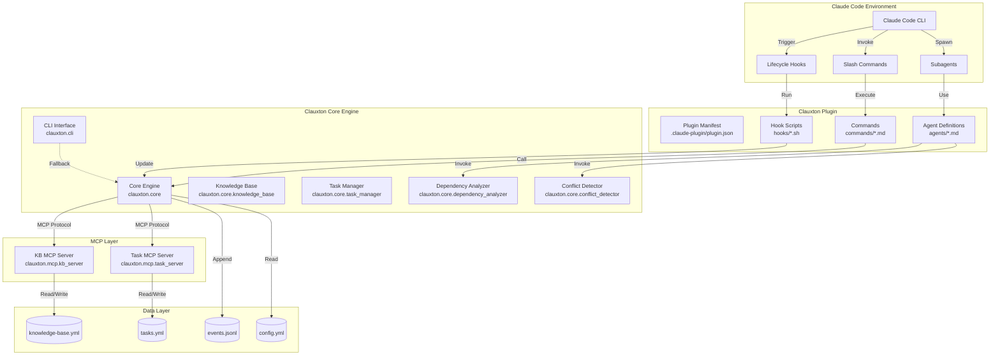
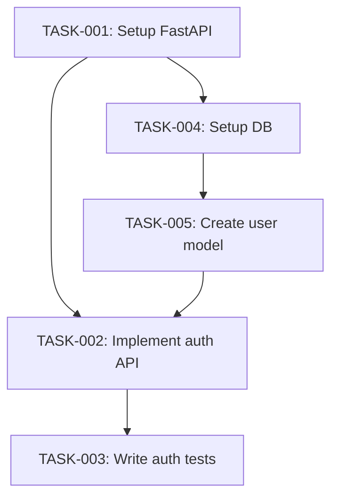
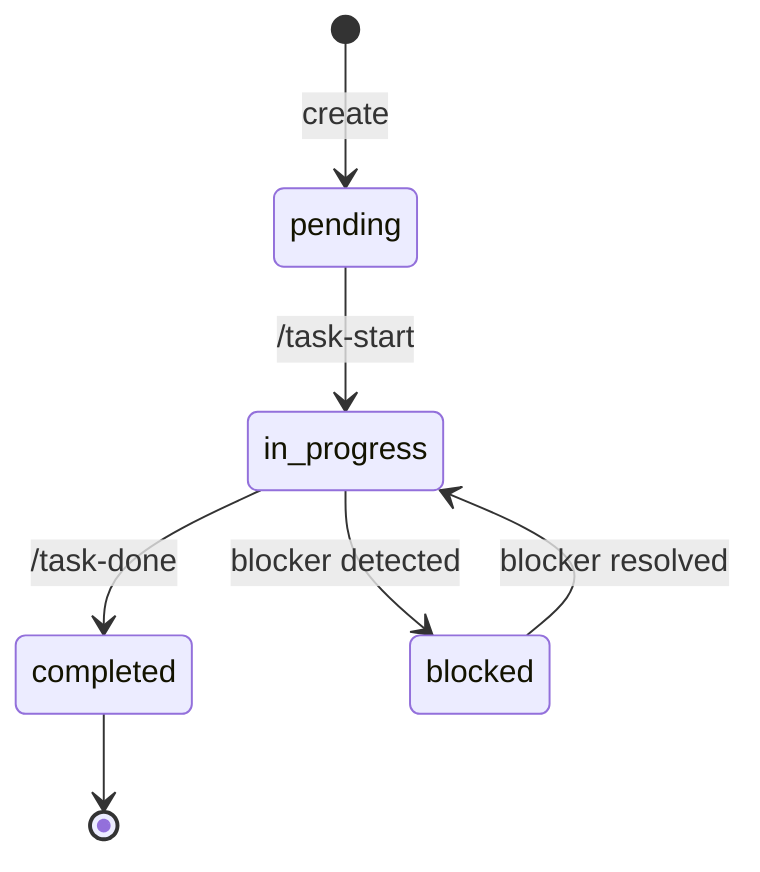

# Clauxton 技術設計書

**バージョン**: 1.0
**作成日**: 2025年10月19日
**ステータス**: Draft
**関連ドキュメント**: 企画書.md, 要件定義書.md

---

## 目次

1. [アーキテクチャ概要](#1-アーキテクチャ概要)
2. [コンポーネント設計](#2-コンポーネント設計)
3. [データ設計](#3-データ設計)
4. [AI-Friendly技術選定](#4-ai-friendly技術選定)
5. [MCP Server設計](#5-mcp-server設計)
6. [Subagent設計](#6-subagent設計)
7. [Hook設計](#7-hook設計)
8. [セキュリティ設計](#8-セキュリティ設計)
9. [デプロイメント設計](#9-デプロイメント設計)
10. [テスト戦略](#10-テスト戦略)

---

## 1. アーキテクチャ概要

### 1.1 システムアーキテクチャ



### 1.2 レイヤー構成

| Layer | 責務 | 技術 |
|---|---|---|
| **Presentation Layer** | ユーザーインターフェース | Slash Commands (Markdown) |
| **Application Layer** | ビジネスロジック | Python (Pydantic, type hints) |
| **Integration Layer** | 外部連携 | MCP Protocol, Git |
| **Data Layer** | 永続化 | YAML, JSON, SQLite (オプション) |

### 1.3 設計原則

**1. AI-First Design**
- すべてのコンポーネントがAI(Claude Code)によって読み書き可能
- 宣言的設定(YAML, Pydantic models)
- 自己記述的コード(Docstring, Type hints)

**2. Local-First**
- デフォルトでローカルストレージのみ
- No network dependencies(オプション除く)
- Privacy by default

**3. Modular & Extensible**
- 各コンポーネントが独立して動作
- Plugin API for third-party extensions(Phase 2+)
- Loose coupling via MCP Protocol

**4. Event-Driven**
- Event Sourcing pattern
- すべての変更を Event Log に記録
- 監査可能· 再生可能

**5. Fail-Safe**
- Graceful degradation(MCP Server停止時もCLI継続)
- データ損失防止(Atomic writes, Backups)
- 明確なエラーメッセージ

---

## 2. コンポーネント設計

### 2.1 ディレクトリ構造

```
clauxton/
├── .claude-plugin/
│   └── plugin.json              # Plugin manifest
│
├── clauxton/                    # Python package
│   ├── __init__.py
│   ├── __version__.py           # Version: 0.1.0
│   │
│   ├── core/                    # Core business logic
│   │   ├── __init__.py
│   │   ├── knowledge_base.py    # KB CRUD operations
│   │   ├── task_manager.py      # Task lifecycle management
│   │   ├── dependency_analyzer.py  # Dependency inference engine
│   │   ├── conflict_detector.py    # Conflict prediction engine
│   │   ├── event_logger.py      # Event sourcing logger
│   │   └── models.py            # Pydantic data models
│   │
│   ├── mcp/                     # MCP Servers
│   │   ├── __init__.py
│   │   ├── kb_server.py         # Knowledge Base MCP Server
│   │   ├── task_server.py       # Task Manager MCP Server
│   │   └── base.py              # Base MCP Server class
│   │
│   ├── cli/                     # CLI interface (fallback)
│   │   ├── __init__.py
│   │   ├── main.py              # Click-based CLI
│   │   ├── kb_commands.py       # KB CLI commands
│   │   └── task_commands.py     # Task CLI commands
│   │
│   └── utils/                   # Utilities
│       ├── __init__.py
│       ├── git_utils.py         # Git operations
│       ├── file_utils.py        # File I/O helpers
│       ├── yaml_utils.py        # YAML validation
│       └── dag_utils.py         # DAG algorithms (topological sort, etc.)
│
├── commands/                    # Claude Code Slash Commands
│   ├── kb-search.md
│   ├── kb-add.md
│   ├── task-next.md
│   ├── task-start.md
│   ├── deps-graph.md
│   └── conflicts-check.md
│
├── agents/                      # Claude Code Subagents
│   ├── dependency-analyzer.md
│   ├── conflict-detector.md
│   └── kb-categorizer.md        # Auto-categorize KB entries
│
├── hooks/                       # Lifecycle Hooks
│   ├── post-edit-update-kb.sh   # Update KB after Edit tool
│   ├── pre-task-start.sh        # Check conflicts before task start
│   └── post-commit.sh           # Auto-update task status
│
├── tests/                       # Tests
│   ├── __init__.py
│   ├── conftest.py              # Pytest fixtures
│   ├── core/
│   │   ├── test_knowledge_base.py
│   │   ├── test_task_manager.py
│   │   ├── test_dependency_analyzer.py
│   │   └── test_conflict_detector.py
│   ├── mcp/
│   │   ├── test_kb_server.py
│   │   └── test_task_server.py
│   └── integration/
│       └── test_end_to_end.py
│
├── docs/                        # Documentation
│   ├── index.md                 # Overview
│   ├── quick-start.md           # Getting started
│   ├── installation.md          # Install guide
│   ├── configuration.md         # Config reference
│   ├── api-reference.md         # API docs
│   ├── slash-commands.md        # Command reference
│   └── architecture.md          # This document
│
├── examples/                    # Example projects
│   └── sample-project/
│       ├── .clauxton/
│       │   ├── knowledge-base.yml
│       │   ├── tasks.yml
│       │   └── config.yml
│       └── README.md
│
├── pyproject.toml               # Python package config
├── README.md
├── LICENSE                      # MIT
├── .gitignore
├── CHANGELOG.md
└── Makefile                     # Dev commands
```

### 2.2 Core Components

#### 2.2.1 Knowledge Base (clauxton.core.knowledge_base)

**責務**:
- Knowledge Base の CRUD 操作
- 検索(キーワード, カテゴリ, タグ)
- バージョニング(更新履歴)

**主要クラス**:

```python
from pydantic import BaseModel, Field
from typing import List, Optional
from datetime import datetime
from pathlib import Path

class KnowledgeBaseEntry(BaseModel):
    """Knowledge Base entry model (AI-friendly with type hints)."""
    id: str = Field(..., pattern=r"KB-\d{8}-\d{3}")
    title: str = Field(..., max_length=50)
    category: Literal["architecture", "constraint", "decision", "pattern", "convention"]
    content: str = Field(..., max_length=10000)
    tags: List[str] = Field(default_factory=list)
    created_at: datetime
    updated_at: datetime
    author: Optional[str] = None
    version: int = 1

class KnowledgeBase:
    """
    Knowledge Base manager.

    Handles CRUD operations for project-specific context.
    Uses YAML for human-readable storage.
    """

    def __init__(self, root_dir: Path):
        """
        Initialize Knowledge Base.

        Args:
            root_dir: Project root directory (contains .clauxton/)
        """
        self.root_dir = root_dir
        self.kb_file = root_dir / ".clauxton" / "knowledge-base.yml"
        self._ensure_kb_exists()

    def add(self, entry: KnowledgeBaseEntry) -> str:
        """
        Add new entry to Knowledge Base.

        Args:
            entry: KnowledgeBaseEntry to add

        Returns:
            Entry ID

        Raises:
            ValidationError: If entry is invalid
        """
        # Implementation
        pass

    def search(
        self,
        query: str,
        category: Optional[str] = None,
        tags: Optional[List[str]] = None,
        limit: int = 10
    ) -> List[KnowledgeBaseEntry]:
        """
        Search Knowledge Base.

        Args:
            query: Search query (keywords)
            category: Filter by category
            tags: Filter by tags
            limit: Max results

        Returns:
            List of matching entries (sorted by relevance)
        """
        # Implementation: TF-IDF ranking
        pass

    def update(self, entry_id: str, updates: dict) -> KnowledgeBaseEntry:
        """Update existing entry (creates new version)."""
        pass

    def delete(self, entry_id: str, reason: Optional[str] = None) -> None:
        """Soft delete entry (sets deleted flag)."""
        pass
```

**ファイルフォーマット**:
```yaml
# .clauxton/knowledge-base.yml
version: "1.0"
project:
  name: "my-project"

entries:
  - id: KB-20251019-001
    title: "Use Pydantic for validation"
    category: convention
    content: |
      All data models must use Pydantic BaseModel...
    tags: [validation, pydantic]
    created_at: "2025-10-19T10:30:00Z"
    updated_at: "2025-10-19T10:30:00Z"
    version: 1
```

---

#### 2.2.2 Task Manager (clauxton.core.task_manager)

**責務**:
- Task の CRUD 操作
- 依存関係グラフ(DAG)管理
- Task 状態遷移(pending → in_progress → completed)
- Next Task 推奨

**主要クラス**:

```python
from typing import List, Optional, Literal
from pydantic import BaseModel, Field, validator
from datetime import datetime

class Task(BaseModel):
    """Task model."""
    id: str = Field(..., pattern=r"TASK-\d{3}")
    name: str = Field(..., max_length=100)
    description: Optional[str] = None
    status: Literal["pending", "in_progress", "completed", "blocked"] = "pending"
    priority: Literal["low", "medium", "high", "critical"] = "medium"
    depends_on: List[str] = Field(default_factory=list)  # Task IDs
    estimated_hours: Optional[float] = None
    actual_hours: Optional[float] = None
    tags: List[str] = Field(default_factory=list)
    files_to_edit: List[str] = Field(default_factory=list)
    related_kb: List[str] = Field(default_factory=list)  # KB entry IDs
    created_at: datetime
    started_at: Optional[datetime] = None
    completed_at: Optional[datetime] = None
    blocked_reason: Optional[str] = None

    @validator("depends_on")
    def validate_no_self_dependency(cls, v, values):
        """Ensure task doesn't depend on itself."""
        if "id" in values and values["id"] in v:
            raise ValueError("Task cannot depend on itself")
        return v

class TaskManager:
    """
    Task lifecycle manager.

    Manages task dependencies as a DAG (Directed Acyclic Graph).
    Detects circular dependencies and suggests next tasks.
    """

    def __init__(self, root_dir: Path):
        self.root_dir = root_dir
        self.task_file = root_dir / ".clauxton" / "tasks.yml"
        self._ensure_task_file_exists()

    def create_task(self, task: Task) -> str:
        """
        Create new task.

        Args:
            task: Task to create

        Returns:
            Task ID

        Raises:
            ValidationError: If task is invalid
            CircularDependencyError: If adding task creates cycle
        """
        self._validate_dag(task)
        # Save to tasks.yml
        pass

    def get_next_tasks(
        self,
        priority: Optional[str] = None,
        limit: int = 5
    ) -> List[Task]:
        """
        Get next recommended tasks.

        Returns tasks where all dependencies are completed,
        sorted by priority and estimated time.

        Args:
            priority: Filter by priority
            limit: Max tasks to return

        Returns:
            List of executable tasks
        """
        # 1. Find tasks with status=pending
        # 2. Filter: All depends_on tasks are completed
        # 3. Sort by priority, estimated_hours
        pass

    def start_task(self, task_id: str) -> Task:
        """Start task (pending → in_progress)."""
        pass

    def complete_task(self, task_id: str, actual_hours: Optional[float] = None) -> Task:
        """Complete task (in_progress → completed)."""
        pass

    def _validate_dag(self, new_task: Task) -> None:
        """
        Validate that adding new_task doesn't create circular dependency.

        Raises:
            CircularDependencyError: If cycle detected
        """
        # Topological sort to detect cycles
        pass
```

**DAG Utilities** (clauxton.utils.dag_utils):

```python
from typing import List, Dict, Set

class CircularDependencyError(Exception):
    """Raised when circular dependency is detected."""
    pass

def topological_sort(tasks: List[Task]) -> List[str]:
    """
    Topological sort of tasks.

    Args:
        tasks: List of tasks

    Returns:
        Task IDs in execution order

    Raises:
        CircularDependencyError: If cycle exists
    """
    # Kahn's algorithm
    pass

def find_critical_path(tasks: List[Task]) -> List[str]:
    """
    Find critical path (longest path) in task DAG.

    Returns:
        Task IDs on critical path
    """
    pass

def detect_bottlenecks(tasks: List[Task]) -> List[str]:
    """
    Detect tasks that many other tasks depend on.

    Returns:
        Task IDs with high in-degree
    """
    pass
```

---

#### 2.2.3 Dependency Analyzer (clauxton.core.dependency_analyzer)

**責務**:
- コード編集から依存関係を推論
- AST(Abstract Syntax Tree)解析
- Knowledge Base の pattern エントリを参照
- Subagent 経由で LLM 推論

**主要クラス**:

```python
import ast
from pathlib import Path
from typing import List, Tuple

class DependencyInference(BaseModel):
    """Inferred dependency."""
    source_task_id: str
    target_task_id: str
    confidence: float = Field(..., ge=0.0, le=1.0)
    reason: str  # "same_file_edit", "import_detected", "pattern_match", "llm_inferred"

class DependencyAnalyzer:
    """
    Dependency inference engine.

    Analyzes code edits and infers task dependencies using:
    1. Static analysis (AST)
    2. Knowledge Base patterns
    3. LLM inference (via Subagent)
    """

    def __init__(self, root_dir: Path, kb: KnowledgeBase, tm: TaskManager):
        self.root_dir = root_dir
        self.kb = kb
        self.tm = tm

    def infer_from_file_edit(
        self,
        file_path: str,
        current_task_id: str
    ) -> List[DependencyInference]:
        """
        Infer dependencies from file edit.

        Args:
            file_path: Edited file path
            current_task_id: Task currently in progress

        Returns:
            List of inferred dependencies
        """
        inferences = []

        # 1. Check if other tasks plan to edit same file
        same_file_tasks = self._find_tasks_editing_file(file_path)
        for task in same_file_tasks:
            inferences.append(DependencyInference(
                source_task_id=task.id,
                target_task_id=current_task_id,
                confidence=0.7,
                reason="same_file_edit"
            ))

        # 2. AST analysis for imports
        imports = self._extract_imports(file_path)
        # ... map imports to tasks

        # 3. Query Knowledge Base for patterns
        patterns = self.kb.search("dependency pattern", category="pattern")
        # ... apply pattern matching

        # 4. LLM inference (low confidence, requires user approval)
        # This would invoke Subagent

        return inferences

    def _extract_imports(self, file_path: str) -> List[str]:
        """Extract import statements via AST."""
        with open(file_path) as f:
            tree = ast.parse(f.read())

        imports = []
        for node in ast.walk(tree):
            if isinstance(node, ast.Import):
                imports.extend(n.name for n in node.names)
            elif isinstance(node, ast.ImportFrom):
                imports.append(node.module)

        return imports

    def _find_tasks_editing_file(self, file_path: str) -> List[Task]:
        """Find tasks that plan to edit the same file."""
        all_tasks = self.tm.get_all_tasks()
        return [
            task for task in all_tasks
            if file_path in task.files_to_edit and task.status != "completed"
        ]
```

---

#### 2.2.4 Conflict Detector (clauxton.core.conflict_detector)

**責務**:
- ファイル· 行レベルの競合予測
- Git diff 解析
- 競合リスクスコアリング
- 安全な実行順序の推奨

**主要クラス**:

```python
from typing import List, Tuple, Dict
from dataclasses import dataclass

@dataclass
class ConflictRisk:
    """Conflict risk between two tasks."""
    task1_id: str
    task2_id: str
    risk_level: Literal["low", "medium", "high"]
    risk_score: float  # 0.0 - 1.0
    conflicting_files: List[str]
    conflicting_lines: Dict[str, Tuple[int, int]]  # file -> (start, end)
    recommendation: str

class ConflictDetector:
    """
    File conflict prediction engine.

    Predicts conflicts by analyzing:
    1. Overlapping file edits
    2. Line-level overlap (estimated or from git diff)
    3. Historical conflict patterns
    """

    def __init__(self, root_dir: Path, tm: TaskManager):
        self.root_dir = root_dir
        self.tm = tm

    def detect_conflicts(
        self,
        task_ids: Optional[List[str]] = None
    ) -> List[ConflictRisk]:
        """
        Detect conflicts among tasks.

        Args:
            task_ids: Tasks to check (default: all in_progress + pending)

        Returns:
            List of conflict risks
        """
        if task_ids is None:
            tasks = self.tm.get_tasks_by_status(["in_progress", "pending"])
        else:
            tasks = [self.tm.get_task(tid) for tid in task_ids]

        conflicts = []

        # Pairwise comparison
        for i, task1 in enumerate(tasks):
            for task2 in tasks[i+1:]:
                risk = self._analyze_pair(task1, task2)
                if risk.risk_score > 0.3:  # Threshold
                    conflicts.append(risk)

        return sorted(conflicts, key=lambda c: c.risk_score, reverse=True)

    def _analyze_pair(self, task1: Task, task2: Task) -> ConflictRisk:
        """Analyze conflict risk between two tasks."""
        # 1. Check file overlap
        files1 = set(task1.files_to_edit)
        files2 = set(task2.files_to_edit)
        overlap = files1 & files2

        if not overlap:
            return ConflictRisk(
                task1_id=task1.id,
                task2_id=task2.id,
                risk_level="low",
                risk_score=0.0,
                conflicting_files=[],
                conflicting_lines={},
                recommendation="No file overlap"
            )

        # 2. Estimate line overlap (simplified)
        # In practice, this would use git diff or AST analysis
        risk_score = len(overlap) * 0.3  # Simplified scoring

        # 3. Check historical conflicts
        # ... query event log for past conflicts

        # 4. Determine risk level
        if risk_score > 0.7:
            level = "high"
            recommendation = f"Complete {task1.id} before {task2.id}"
        elif risk_score > 0.4:
            level = "medium"
            recommendation = "Coordinate changes carefully"
        else:
            level = "low"
            recommendation = "Proceed with caution"

        return ConflictRisk(
            task1_id=task1.id,
            task2_id=task2.id,
            risk_level=level,
            risk_score=risk_score,
            conflicting_files=list(overlap),
            conflicting_lines={},  # TODO: Implement line-level analysis
            recommendation=recommendation
        )

    def suggest_execution_order(self, task_ids: List[str]) -> List[str]:
        """
        Suggest safe execution order to minimize conflicts.

        Returns:
            Task IDs in recommended order
        """
        # Topological sort + conflict-aware scheduling
        pass
```

---

## 3. データ設計

### 3.1 Knowledge Base スキーマ

**ファイル**: `.clauxton/knowledge-base.yml`

**スキーマ**:
```yaml
version: string  # "1.0"
project:
  name: string
  description?: string

entries: array
  - id: string (pattern: KB-YYYYMMDD-NNN)
    title: string (max 50 chars)
    category: enum [architecture, constraint, decision, pattern, convention]
    content: string (Markdown, max 10000 chars)
    tags: array<string>
    created_at: datetime (ISO 8601)
    updated_at: datetime (ISO 8601)
    author?: string
    version: integer
```

**インデックス**(将来的にSQLite移行時):
- Primary key: `id`
- Index: `category`, `tags`, `created_at`
- Full-text search: `title`, `content`

### 3.2 Task スキーマ

**ファイル**: `.clauxton/tasks.yml`

**スキーマ**:
```yaml
version: string  # "1.0"

tasks: array
  - id: string (pattern: TASK-NNN)
    name: string (max 100 chars)
    description?: string (Markdown)
    status: enum [pending, in_progress, completed, blocked]
    priority: enum [low, medium, high, critical]
    depends_on: array<string>  # Task IDs
    estimated_hours?: number
    actual_hours?: number
    tags: array<string>
    files_to_edit: array<string>  # File paths
    related_kb: array<string>  # KB entry IDs
    created_at: datetime
    started_at?: datetime
    completed_at?: datetime
    blocked_reason?: string
```

**制約**:
- `depends_on` で循環参照を許さない(DAG制約)
- `status` 遷移ルール:
  - pending → in_progress → completed
  - in_progress → blocked → in_progress

### 3.3 Event Log スキーマ

**ファイル**: `.clauxton/events.jsonl` (JSON Lines)

**スキーマ**:
```json
{
  "event_id": "string (EVT-NNNNNN)",
  "timestamp": "datetime (ISO 8601)",
  "type": "enum [kb_added, kb_updated, task_started, file_edited, ...]",
  "actor": "string (user | system | subagent)",
  "data": {
    // Event-specific payload
  },
  "metadata": {
    "session_id": "string",
    "git_commit": "string (SHA)"
  }
}
```

**Event Types**:

| Type | Data Fields | Purpose |
|---|---|---|
| `kb_added` | `kb_id`, `title`, `category` | Knowledge Base entry created |
| `kb_updated` | `kb_id`, `field`, `old_value`, `new_value` | KB entry modified |
| `task_created` | `task_id`, `name`, `priority` | Task created |
| `task_started` | `task_id`, `started_at` | Task started |
| `task_completed` | `task_id`, `completed_at`, `actual_hours` | Task completed |
| `file_edited` | `file_path`, `task_id`, `lines_changed` | File edited (Hook trigger) |
| `dependency_inferred` | `source_task`, `target_task`, `confidence` | Dependency auto-inferred |
| `conflict_detected` | `task1_id`, `task2_id`, `risk_score` | Conflict detected |

**用途**:
- Event Sourcing(状態再構築)
- 監査ログ
- Drift Detection
- 機械学習(将来的に依存· 競合予測精度向上)

### 3.4 Configuration スキーマ

**ファイル**: `.clauxton/config.yml`

**スキーマ**:
```yaml
version: string  # "1.0"

project:
  name: string
  language: enum [python, typescript, javascript]
  git_root: string (path)

settings:
  auto_dependency_inference: boolean
  conflict_detection_enabled: boolean
  telemetry_enabled: boolean

  knowledge_base:
    max_entries: integer
    auto_categorize: boolean

  tasks:
    auto_estimate: boolean
    default_priority: enum [low, medium, high, critical]

  agents:
    dependency_analyzer:
      enabled: boolean
      max_parallel: integer
    conflict_detector:
      enabled: boolean
      risk_threshold: number (0.0-1.0)

  hooks:
    post_edit_update_kb: boolean
    pre_task_start_conflict_check: boolean

cloud:  # Optional
  sync_enabled: boolean
  sync_url?: string
  encryption_key?: string
```

---

## 4. AI-Friendly技術選定

### 4.1 選定基準

AI(特にClaude Code)が扱いやすい技術を選定する基準: 

1. **宣言的**: 手続き型より宣言型(YAMLスキーマ, Pydanticモデル)
2. **型安全**: 明示的な型情報(Type hints, Pydantic)
3. **標準的**: ニッチなライブラリより標準的なもの(標準ライブラリ, 人気フレームワーク)
4. **可読性**: AIがコードを理解しやすい(明確な命名, Docstring)
5. **テスタブル**: AIがテストを生成しやすい(純粋関数, 依存注入)

### 4.2 技術スタック詳細

#### 4.2.1 プログラミング言語: Python 3.11+

**選定理由**:
- ✅ AI が最も得意な言語(Claude, GPT は Python コード生成精度が最高)
- ✅ Type hints でコード補完· 検証が容易
- ✅ 豊富なライブラリエコシステム(AST解析, YAML, CLI)
- ✅ MCP SDK が Python をサポート

**使用機能**:
- Type hints (PEP 484, 585, 604)
- dataclasses / Pydantic
- pathlib (Path操作)
- asyncio (MCP Server非同期処理)

**コーディング規約**:
```python
# ✅ Good (AI-friendly)
def search_knowledge_base(
    query: str,
    category: Optional[str] = None,
    limit: int = 10
) -> List[KnowledgeBaseEntry]:
    """
    Search Knowledge Base by query.

    Args:
        query: Search keywords
        category: Filter by category (optional)
        limit: Maximum results to return

    Returns:
        List of matching KB entries, sorted by relevance

    Raises:
        ValidationError: If query is empty
    """
    if not query:
        raise ValidationError("Query cannot be empty")

    # Implementation...
    return results

# ❌ Bad (AI-unfriendly)
def search(q, c=None, l=10):  # Cryptic names, no types, no docstring
    return [...]
```

---

#### 4.2.2 データフォーマット: YAML + JSON

**YAML** (Knowledge Base, Tasks, Config):
- ✅ 人間が読み書きしやすい
- ✅ AI がパターンを理解しやすい(インデントベース)
- ✅ コメント対応(設定説明を含められる)
- ❌ 複雑な構造では冗長

**JSON** (Event Log, API通信):
- ✅ 標準的, あらゆる言語で対応
- ✅ 厳密なスキーマ検証
- ✅ JSON Lines (.jsonl) で追記型ログに適する
- ❌ コメント非対応

**選定ガイドライン**:
- 人間が編集する → YAML
- 機械のみ読み書き → JSON
- ログ → JSON Lines

**例**:
```yaml
# .clauxton/config.yml (YAML - 人間が編集)
settings:
  auto_dependency_inference: true  # Enable auto-inference
  conflict_detection_enabled: true
```

```jsonl
# .clauxton/events.jsonl (JSON Lines - 機械のみ)
{"event_id": "EVT-001", "timestamp": "2025-10-19T10:30:00Z", "type": "kb_added"}
{"event_id": "EVT-002", "timestamp": "2025-10-19T11:00:00Z", "type": "task_started"}
```

---

#### 4.2.3 データバリデーション: Pydantic v2

**選定理由**:
- ✅ **宣言的スキーマ**: AIがモデル定義を理解しやすい
- ✅ **自動バリデーション**: 型安全性を保証
- ✅ **JSON/YAML シリアライズ**: `model_dump()`, `model_validate()`
- ✅ **エラーメッセージ**: 明確な検証エラー

**例**:
```python
from pydantic import BaseModel, Field, validator

class Task(BaseModel):
    """Task model with validation."""
    id: str = Field(..., pattern=r"TASK-\d{3}")
    name: str = Field(..., min_length=1, max_length=100)
    priority: Literal["low", "medium", "high", "critical"] = "medium"
    depends_on: List[str] = Field(default_factory=list)

    @validator("name")
    def name_must_not_be_empty(cls, v):
        if not v.strip():
            raise ValueError("Task name cannot be empty")
        return v.strip()

    @validator("depends_on")
    def no_self_dependency(cls, v, values):
        if "id" in values and values["id"] in v:
            raise ValueError("Task cannot depend on itself")
        return v

# Usage
task = Task(id="TASK-001", name="Implement login", priority="high")
task.model_dump()  # → dict (for YAML serialization)
```

**AI-Friendly な点**:
- モデル定義を見れば, 制約がすべてわかる(ドキュメント不要)
- AIが新しいモデルを生成しやすい(パターンが明確)

---

#### 4.2.4 CLI Framework: Click

**選定理由**:
- ✅ Pythonで最も人気のCLIフレームワーク
- ✅ 宣言的コマンド定義(デコレータベース)
- ✅ 自動ヘルプ生成
- ✅ AIがコマンド追加しやすい

**例**:
```python
import click

@click.group()
def cli():
    """Clauxton CLI."""
    pass

@cli.command()
@click.option("--title", required=True, help="KB entry title")
@click.option("--category", type=click.Choice(["architecture", "constraint"]), required=True)
@click.option("--content", required=True, help="Entry content (Markdown)")
def kb_add(title: str, category: str, content: str):
    """Add entry to Knowledge Base."""
    kb = KnowledgeBase(Path.cwd())
    entry = KnowledgeBaseEntry(
        id=generate_kb_id(),
        title=title,
        category=category,
        content=content,
        created_at=datetime.now(),
        updated_at=datetime.now()
    )
    kb.add(entry)
    click.echo(f"✓ KB entry {entry.id} created")

if __name__ == "__main__":
    cli()
```

---

#### 4.2.5 Testing: Pytest

**選定理由**:
- ✅ Python標準的なテストフレームワーク
- ✅ AIがテストケース生成しやすい(シンプルな構文)
- ✅ Fixtures でテストデータ管理

**例**:
```python
import pytest
from clauxton.core.knowledge_base import KnowledgeBase

@pytest.fixture
def kb(tmp_path):
    """Create temporary Knowledge Base."""
    return KnowledgeBase(tmp_path)

def test_add_entry(kb):
    """Test adding entry to KB."""
    entry = KnowledgeBaseEntry(
        id="KB-20251019-001",
        title="Test entry",
        category="architecture",
        content="Test content",
        created_at=datetime.now(),
        updated_at=datetime.now()
    )

    kb.add(entry)

    # Verify
    results = kb.search("test")
    assert len(results) == 1
    assert results[0].title == "Test entry"

def test_circular_dependency_detection(tm):
    """Test that circular dependencies are rejected."""
    task1 = Task(id="TASK-001", name="Task 1", depends_on=["TASK-002"])
    task2 = Task(id="TASK-002", name="Task 2", depends_on=["TASK-001"])

    tm.create_task(task1)

    with pytest.raises(CircularDependencyError):
        tm.create_task(task2)
```

**AI がテスト生成しやすい理由**:
- 関数名が `test_` で始まる(パターン明確)
- Assertion が `assert` 文(自然言語に近い)
- Fixtures で前提条件を宣言的に定義

---

#### 4.2.6 AST解析: ast (標準ライブラリ)

**選定理由**:
- ✅ Python標準ライブラリ(依存なし)
- ✅ AIがコード構造を理解するのに適する
- ✅ import文, 関数定義, クラス定義を抽出可能

**例**:
```python
import ast

def extract_imports(file_path: str) -> List[str]:
    """
    Extract import statements from Python file.

    Args:
        file_path: Path to Python file

    Returns:
        List of imported module names
    """
    with open(file_path) as f:
        tree = ast.parse(f.read())

    imports = []
    for node in ast.walk(tree):
        if isinstance(node, ast.Import):
            imports.extend(alias.name for alias in node.names)
        elif isinstance(node, ast.ImportFrom):
            if node.module:
                imports.append(node.module)

    return imports

def extract_function_names(file_path: str) -> List[str]:
    """Extract function definitions."""
    with open(file_path) as f:
        tree = ast.parse(f.read())

    return [
        node.name for node in ast.walk(tree)
        if isinstance(node, ast.FunctionDef)
    ]
```

---

#### 4.2.7 Git操作: GitPython

**選定理由**:
- ✅ Pythonで最も人気のGitライブラリ
- ✅ AIがGit操作コードを生成しやすい(高レベルAPI)

**例**:
```python
from git import Repo

def get_current_branch() -> str:
    """Get current Git branch name."""
    repo = Repo(".")
    return repo.active_branch.name

def get_uncommitted_files() -> List[str]:
    """Get list of uncommitted files."""
    repo = Repo(".")
    return [item.a_path for item in repo.index.diff(None)]

def get_last_commit_message() -> str:
    """Get last commit message."""
    repo = Repo(".")
    return repo.head.commit.message.strip()
```

---

## 5. MCP Server設計

### 5.1 MCP Protocol概要

**MCP (Model Context Protocol)** は, AnthropicがAIツール統合のために策定したプロトコル.

**特徴**:
- JSON-RPC 2.0 ベース
- Tools (AI が呼び出せる関数), Resources (AI が読めるデータ), Prompts (AI が使うテンプレート) をサポート
- サーバープロセスとして動作(Claude Code が起動· 管理)

### 5.2 Knowledge Base MCP Server

**ファイル**: `clauxton/mcp/kb_server.py`

**Endpoints**:

```python
from mcp.server import Server
from mcp.types import Tool, TextContent
from clauxton.core.knowledge_base import KnowledgeBase

app = Server("clauxton-kb")
kb = KnowledgeBase(Path.cwd())

@app.list_tools()
async def list_tools() -> List[Tool]:
    """List available tools."""
    return [
        Tool(
            name="kb_search",
            description="Search Knowledge Base by keywords",
            inputSchema={
                "type": "object",
                "properties": {
                    "query": {"type": "string"},
                    "category": {"type": "string", "enum": ["architecture", "constraint", "decision", "pattern", "convention"]},
                    "limit": {"type": "integer", "default": 10}
                },
                "required": ["query"]
            }
        ),
        Tool(
            name="kb_add",
            description="Add entry to Knowledge Base",
            inputSchema={
                "type": "object",
                "properties": {
                    "title": {"type": "string", "maxLength": 50},
                    "category": {"type": "string", "enum": ["architecture", "constraint", "decision", "pattern", "convention"]},
                    "content": {"type": "string", "maxLength": 10000},
                    "tags": {"type": "array", "items": {"type": "string"}}
                },
                "required": ["title", "category", "content"]
            }
        )
    ]

@app.call_tool()
async def call_tool(name: str, arguments: dict) -> List[TextContent]:
    """Handle tool calls."""
    if name == "kb_search":
        results = kb.search(
            query=arguments["query"],
            category=arguments.get("category"),
            limit=arguments.get("limit", 10)
        )
        return [TextContent(
            type="text",
            text=f"Found {len(results)} entries:\n\n" + "\n\n".join([
                f"**{r.title}** ({r.category})\n{r.content[:200]}..."
                for r in results
            ])
        )]

    elif name == "kb_add":
        entry = KnowledgeBaseEntry(
            id=generate_kb_id(),
            title=arguments["title"],
            category=arguments["category"],
            content=arguments["content"],
            tags=arguments.get("tags", []),
            created_at=datetime.now(),
            updated_at=datetime.now()
        )
        kb.add(entry)
        return [TextContent(
            type="text",
            text=f"✓ Knowledge Base entry {entry.id} created"
        )]

if __name__ == "__main__":
    app.run()
```

**起動方法** (plugin.json):
```json
{
  "mcp_servers": [
    {
      "name": "clauxton-kb",
      "command": "python -m clauxton.mcp.kb_server"
    }
  ]
}
```

### 5.3 Task Manager MCP Server

**ファイル**: `clauxton/mcp/task_server.py`

**Endpoints**:
- `task_create`: タスク作成
- `task_start`: タスク開始
- `task_complete`: タスク完了
- `task_next`: 次のタスク取得
- `deps_graph`: 依存グラフ取得

(実装は KB Server と同様のパターン)

---

## 6. Subagent設計

### 6.1 Dependency Analyzer Subagent

**ファイル**: `agents/dependency-analyzer.md`

```markdown
# Dependency Analyzer Subagent

You are a specialized subagent for analyzing task and code dependencies.

## Your Task

Analyze the provided tasks and codebase to infer dependencies:

1. **Static Analysis**: Parse code (AST) to find imports, function calls, class inheritance
2. **Keyword Analysis**: Extract dependency keywords from task descriptions (e.g., "after X is implemented")
3. **Pattern Matching**: Apply Knowledge Base patterns (e.g., "tests come after implementation")
4. **Confidence Scoring**: Assign confidence (0.0-1.0) to each inference

## Input

You will receive:
- List of tasks (YAML format)
- Codebase directory path
- Knowledge Base entries (category: pattern)

## Output

Return a JSON array of inferred dependencies:

```json
[
  {
    "source_task_id": "TASK-003",
    "target_task_id": "TASK-002",
    "confidence": 0.85,
    "reason": "TASK-003 edits src/api/auth.py which imports src/setup.py (edited by TASK-002)"
  },
  ...
]
```

## Guidelines

- Only infer dependencies with confidence > 0.5
- Prioritize static analysis (higher confidence) over keyword analysis
- Explain your reasoning clearly
- If unsure, ask for clarification rather than guessing
```

**使用方法** (Claude Code):
```
User: /deps-analyze

Claude Code invokes Subagent:
→ Spawns "dependency-analyzer" subagent
→ Passes tasks.yml, codebase path, KB entries
→ Subagent returns JSON with inferred dependencies
→ User approves or rejects each inference
```

### 6.2 Conflict Detector Subagent

**ファイル**: `agents/conflict-detector.md`

```markdown
# Conflict Detector Subagent

You are a specialized subagent for detecting file conflicts between tasks.

## Your Task

Analyze tasks to predict file conflicts before they occur:

1. **File Overlap**: Identify tasks editing the same files
2. **Line-Level Analysis**: Estimate or analyze line-level overlap
3. **Risk Scoring**: Calculate risk score (0.0-1.0) based on overlap severity
4. **Recommendations**: Suggest execution order or merge strategies

## Input

- List of tasks (with `files_to_edit` field)
- Current Git branch state
- Historical conflict data (from event log)

## Output

Return JSON array of conflict risks:

```json
[
  {
    "task1_id": "TASK-003",
    "task2_id": "TASK-005",
    "risk_level": "high",
    "risk_score": 0.85,
    "conflicting_files": ["src/api/auth.py"],
    "recommendation": "Complete TASK-003 before starting TASK-005"
  }
]
```

## Risk Scoring

- **High (0.7-1.0)**: Same file, overlapping functions/classes
- **Medium (0.4-0.7)**: Same file, different sections
- **Low (0.0-0.4)**: Different files, or minor overlap
```

---

## 7. Hook設計

### 7.1 Post-Edit Hook

**ファイル**: `hooks/post-edit-update-kb.sh`

**トリガー**: `PostToolUse` (Edit, Write tools)

**目的**:
- ファイル編集時に自動的に依存関係を推論
- Event Log に記録

**実装**:
```bash
#!/bin/bash
# Post-Edit Hook: Update KB after file edit

set -e

# Arguments passed by Claude Code:
# $1: tool_name (Edit or Write)
# $2: file_path (edited file)

TOOL_NAME="$1"
FILE_PATH="$2"

# Get current task (if any)
CURRENT_TASK=$(clauxton task current --quiet)

if [ -z "$CURRENT_TASK" ]; then
    # No task in progress, skip
    exit 0
fi

# Infer dependencies
echo "🔍 Analyzing dependencies for $FILE_PATH..."
clauxton deps infer --file "$FILE_PATH" --task "$CURRENT_TASK" --suggest

# Log event
clauxton events log \
    --type "file_edited" \
    --data "{\"file\": \"$FILE_PATH\", \"task_id\": \"$CURRENT_TASK\"}"

exit 0
```

### 7.2 Pre-Task-Start Hook

**ファイル**: `hooks/pre-task-start.sh`

**トリガー**: `/task-start` コマンド実行前

**目的**:
- タスク開始前に競合をチェック
- リスクが高い場合, 警告を表示

**実装**:
```bash
#!/bin/bash
# Pre-Task-Start Hook: Check conflicts before starting task

set -e

TASK_ID="$1"

echo "⚠️ Checking for conflicts with $TASK_ID..."

# Run conflict detection
CONFLICTS=$(clauxton conflicts check --task "$TASK_ID" --json)

# Parse JSON and check risk
RISK_SCORE=$(echo "$CONFLICTS" | jq -r '.[0].risk_score // 0')

if (( $(echo "$RISK_SCORE > 0.7" | bc -l) )); then
    echo "❌ HIGH CONFLICT RISK detected!"
    echo "$CONFLICTS" | jq -r '.[0].recommendation'

    # Prompt user
    read -p "Proceed anyway? (y/N): " -n 1 -r
    echo
    if [[ ! $REPLY =~ ^[Yy]$ ]]; then
        exit 1  # Cancel task start
    fi
fi

echo "✓ Conflict check passed"
exit 0
```

---

## 8. セキュリティ設計

### 8.1 プライバシー保護

**原則**: **Local-First, Privacy by Default**

**実装**:

1. **ローカルストレージ**:
   - すべてのデータを `.clauxton/` に保存
   - No cloud transmission by default

2. **ファイルパーミッション**:
   ```python
   def _ensure_clauxton_dir():
       clauxton_dir = Path(".clauxton")
       clauxton_dir.mkdir(mode=0o700, exist_ok=True)  # rwx------

       # Sensitive files: 600 (rw-------)
       for sensitive_file in ["config.yml", "events.jsonl"]:
           file_path = clauxton_dir / sensitive_file
           if file_path.exists():
               file_path.chmod(0o600)
   ```

3. **機密情報の除外**:
   - `.gitignore` に `.clauxton/config.yml` 推奨(API key等含む可能性)
   - Knowledge Base には機密情報を保存しない警告

4. **テレメトリ Opt-In**:
   ```yaml
   # config.yml
   settings:
     telemetry_enabled: false  # Default: disabled
   ```

### 8.2 データ検証

**すべての入力を検証**:

```python
from pydantic import BaseModel, Field, validator

class KnowledgeBaseEntry(BaseModel):
    title: str = Field(..., max_length=50)
    content: str = Field(..., max_length=10000)

    @validator("content")
    def sanitize_content(cls, v):
        # Remove potential script injections (if rendering to HTML)
        # For Markdown, basic sanitization
        return v.strip()
```

### 8.3 Git Credentials

**絶対に保存しない**:
- Git操作は GitPython 経由(システムの Git credential helper を使用)
- Clauxton は Git credentials を保存· 管理しない

---

## 9. デプロイメント設計

### 9.1 パッケージング

**PyPI Package**:

```toml
# pyproject.toml
[build-system]
requires = ["hatchling"]
build-backend = "hatchling.build"

[project]
name = "clauxton"
version = "0.1.0"
description = "Context that persists for Claude Code"
authors = [{name = "Clauxton Team"}]
license = {text = "MIT"}
requires-python = ">=3.11"
dependencies = [
    "pydantic>=2.0",
    "click>=8.1",
    "pyyaml>=6.0",
    "gitpython>=3.1",
    "mcp-sdk>=1.0",  # Hypothetical MCP SDK
]

[project.optional-dependencies]
dev = [
    "pytest>=7.4",
    "pytest-cov>=4.1",
    "mypy>=1.5",
    "ruff>=0.1",
]

[project.scripts]
clauxton = "clauxton.cli.main:cli"

[tool.hatch.build.targets.wheel]
packages = ["clauxton"]
```

**インストール**:
```bash
pip install clauxton
```

### 9.2 Claude Code Plugin インストール

**方法1: Plugin Marketplace(将来)**:
- Claude Code 公式マーケットプレイスから検索· インストール

**方法2: Manual Installation**:
```bash
# 1. Install Python package
pip install clauxton

# 2. Clone plugin files (or download from GitHub)
git clone https://github.com/clauxton/clauxton.git
cd clauxton

# 3. Link plugin to Claude Code
claude-code plugins link .

# 4. Restart Claude Code
```

**方法3: Project-Local Plugin**:
```bash
# Copy plugin files to project
cp -r clauxton/.claude-plugin my-project/
cp -r clauxton/commands my-project/
cp -r clauxton/agents my-project/
cp -r clauxton/hooks my-project/

# Claude Code auto-detects .claude-plugin/ in project root
```

### 9.3 初回セットアップ

**自動初期化**:
```bash
# Claude Code起動時, Clauxtonが.clauxton/を自動作成
cd my-project/
claude-code

# Clauxton initializes:
# .clauxton/
# ├── knowledge-base.yml
# ├── tasks.yml
# ├── config.yml (default)
# └── events.jsonl
```

**手動初期化**:
```bash
clauxton init

# Interactive setup:
# → Project name?
# → Primary language? (python/typescript/javascript)
# → Enable auto-dependency inference? (y/n)
# ...
```

---

## 10. テスト戦略

### 10.1 テストピラミッド

```
         /\
        /E2E\         End-to-End Tests (5%)
       /------\
      / Integr \      Integration Tests (15%)
     /----------\
    / Unit Tests \    Unit Tests (80%)
   /--------------\
```

### 10.2 Unit Tests

**カバレッジ目標**: >80%

**テスト対象**:
- `clauxton.core.*` (KnowledgeBase, TaskManager, DependencyAnalyzer, ConflictDetector)
- `clauxton.utils.*` (dag_utils, yaml_utils, git_utils)

**例**:
```python
# tests/core/test_task_manager.py

def test_create_task(task_manager):
    """Test creating a valid task."""
    task = Task(
        id="TASK-001",
        name="Test task",
        created_at=datetime.now()
    )

    task_id = task_manager.create_task(task)

    assert task_id == "TASK-001"
    assert task_manager.get_task("TASK-001").name == "Test task"

def test_circular_dependency_rejected(task_manager):
    """Test that circular dependencies are rejected."""
    task1 = Task(id="TASK-001", name="Task 1", depends_on=["TASK-002"])
    task2 = Task(id="TASK-002", name="Task 2", depends_on=["TASK-001"])

    task_manager.create_task(task1)

    with pytest.raises(CircularDependencyError):
        task_manager.create_task(task2)

def test_next_tasks_respects_dependencies(task_manager):
    """Test that next_tasks only returns executable tasks."""
    task1 = Task(id="TASK-001", name="Setup", status="completed")
    task2 = Task(id="TASK-002", name="Implement", depends_on=["TASK-001"], status="pending")
    task3 = Task(id="TASK-003", name="Test", depends_on=["TASK-002"], status="pending")

    task_manager.create_task(task1)
    task_manager.create_task(task2)
    task_manager.create_task(task3)

    next_tasks = task_manager.get_next_tasks()

    assert len(next_tasks) == 1
    assert next_tasks[0].id == "TASK-002"  # Only TASK-002 is executable
```

### 10.3 Integration Tests

**カバレッジ目標**: 主要フロー全体

**テスト対象**:
- MCP Server ↔ Core Engine 統合
- Hook ↔ Event Log 統合
- CLI ↔ Core Engine 統合

**例**:
```python
# tests/integration/test_mcp_kb_server.py

@pytest.mark.asyncio
async def test_mcp_kb_search(mcp_kb_server):
    """Test MCP KB Server search endpoint."""
    # Add entry via server
    response = await mcp_kb_server.call_tool(
        name="kb_add",
        arguments={
            "title": "Test entry",
            "category": "architecture",
            "content": "Test content"
        }
    )

    assert "KB-" in response[0].text

    # Search for entry
    search_response = await mcp_kb_server.call_tool(
        name="kb_search",
        arguments={"query": "test"}
    )

    assert "Test entry" in search_response[0].text
```

### 10.4 End-to-End Tests

**カバレッジ目標**: ユーザーストーリー全体

**テスト対象**:
- プラグインインストール → セットアップ → 使用 → アンインストール
- 実際の Claude Code 環境での動作確認

**例**:
```python
# tests/e2e/test_user_journey.py

def test_complete_user_journey(tmp_project):
    """Test complete user journey from installation to usage."""
    # 1. Initialize project
    result = subprocess.run(["clauxton", "init"], cwd=tmp_project, capture_output=True)
    assert result.returncode == 0
    assert (tmp_project / ".clauxton" / "config.yml").exists()

    # 2. Add Knowledge Base entry
    result = subprocess.run([
        "clauxton", "kb", "add",
        "--title", "Architecture decision",
        "--category", "decision",
        "--content", "Use microservices"
    ], cwd=tmp_project, capture_output=True)
    assert result.returncode == 0

    # 3. Create task
    result = subprocess.run([
        "clauxton", "task", "create",
        "--name", "Setup API gateway",
        "--priority", "high"
    ], cwd=tmp_project, capture_output=True)
    assert "TASK-001" in result.stdout.decode()

    # 4. Get next task
    result = subprocess.run(["clauxton", "task", "next"], cwd=tmp_project, capture_output=True)
    assert "Setup API gateway" in result.stdout.decode()
```

---

## 11. パフォーマンス最適化

### 11.1 ボトルネック予測と対策

| 処理 | 想定ボトルネック | 対策 |
|---|---|---|
| KB検索 | 大量エントリで線形探索 | 将来的にSQLite + FTS5(全文検索)移行 |
| Dependency解析 | AST解析が重い | ファイルキャッシュ(変更時のみ再解析) |
| Conflict検出 | Pairwise比較でO(n²) | 並列化, ファイル重複がある組のみ詳細解析 |
| MCP Server起動 | 初回起動が遅い | 常駐プロセス化(Phase 2) |

### 11.2 キャッシング戦略

**AST キャッシュ**:
```python
# .clauxton/cache/ast/{file_hash}.pkl
def parse_file_cached(file_path: str) -> ast.AST:
    file_hash = hashlib.sha256(Path(file_path).read_bytes()).hexdigest()
    cache_path = Path(f".clauxton/cache/ast/{file_hash}.pkl")

    if cache_path.exists():
        with open(cache_path, "rb") as f:
            return pickle.load(f)

    tree = ast.parse(Path(file_path).read_text())

    cache_path.parent.mkdir(parents=True, exist_ok=True)
    with open(cache_path, "wb") as f:
        pickle.dump(tree, f)

    return tree
```

---

## 12. 将来拡張

### 12.1 Phase 3+ 機能

**チーム機能**:
- 共有Knowledge Base(PostgreSQL)
- リアルタイムコラボレーション(WebSocket)
- Task assignment(チームメンバーへ割り当て)

**AI学習機能**:
- 依存推論精度向上(ユーザーフィードバック学習)
- プロジェクト固有パターン自動抽出

**統合拡張**:
- Cursor, Windsurf 対応
- GitHub Issues/PRs 連携
- Jira/Linear 同期

---

## 付録

### A. API Reference(抜粋)

詳細は `docs/api-reference.md` 参照.

**Core API**:
- `KnowledgeBase.add(entry) -> str`
- `KnowledgeBase.search(query, category, tags, limit) -> List[KnowledgeBaseEntry]`
- `TaskManager.create_task(task) -> str`
- `TaskManager.get_next_tasks(priority, limit) -> List[Task]`
- `DependencyAnalyzer.infer_from_file_edit(file_path, task_id) -> List[DependencyInference]`
- `ConflictDetector.detect_conflicts(task_ids) -> List[ConflictRisk]`

### B. Mermaid Diagrams

**Dependency Graph Example**:


**State Machine (Task)**:


### C. 変更履歴

| Version | Date | Changes | Author |
|---|---|---|---|
| 1.0 | 2025-10-19 | 初版作成 | Claude Code |

---

**実装準備完了!次は Phase 0 の実装開始です.**
