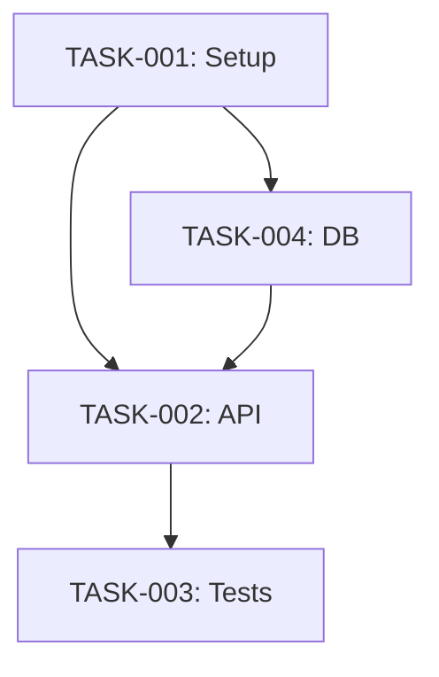
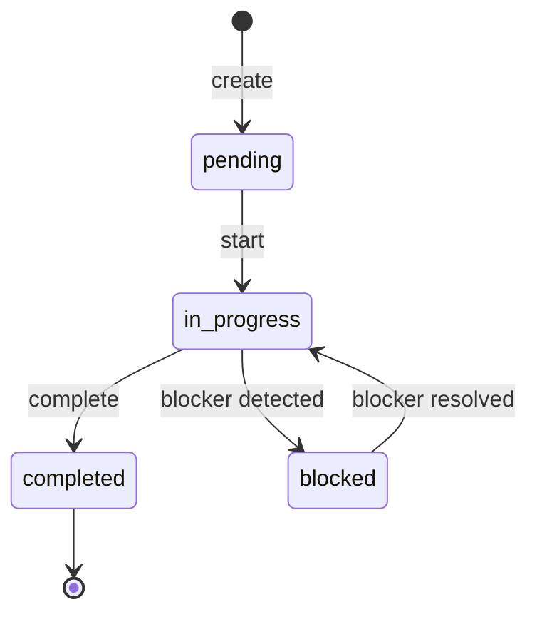

# Clauxton Technical Design

**Version**: 2.0 (Updated for v0.10.0)
**Date**: October 22, 2025
**Status**: Production Ready
**Related**: README.md, quick-start.md

---

## Table of Contents

1. [Architecture Overview](#1-architecture-overview)
2. [Component Design](#2-component-design)
3. [Data Design](#3-data-design)
4. [MCP Server Design](#4-mcp-server-design)
5. [Security Design](#5-security-design)
6. [Testing Strategy](#6-testing-strategy)
7. [AI-Friendly Design Principles](#7-ai-friendly-design-principles)

---

## 1. Architecture Overview

### 1.1 System Architecture

```
┌─────────────────────────────────────────────────────────────┐
│                     Claude Code Environment                  │
│  ┌───────────────────────────────────────────────────────┐  │
│  │                   Claude Code CLI                      │  │
│  └───────────────────────────────────────────────────────┘  │
│           │                              │                   │
│           │ MCP Protocol                 │ CLI Fallback      │
│           ▼                              ▼                   │
├───────────────────────────────────────────────────────────────┤
│                     Clauxton Layer                           │
│  ┌─────────────────┐              ┌────────────────────┐    │
│  │  MCP Server     │              │   CLI Interface    │    │
│  │  (17 tools)     │              │   (Click-based)    │    │
│  └────────┬────────┘              └──────────┬─────────┘    │
│           │                                   │               │
│           └─────────────┬─────────────────────┘               │
│                         ▼                                     │
│  ┌───────────────────────────────────────────────────────┐  │
│  │              Core Engine                               │  │
│  │  ┌────────────┐  ┌────────────┐  ┌────────────────┐  │  │
│  │  │ Knowledge  │  │   Task     │  │   Conflict     │  │  │
│  │  │    Base    │  │  Manager   │  │   Detector     │  │  │
│  │  └────────────┘  └────────────┘  └────────────────┘  │  │
│  │  ┌────────────┐  ┌────────────┐  ┌────────────────┐  │  │
│  │  │ Operation  │  │Confirmation│  │     Search     │  │  │
│  │  │  History   │  │  Manager   │  │    Engine      │  │  │
│  │  └────────────┘  └────────────┘  └────────────────┘  │  │
│  └───────────────────────────────────────────────────────┘  │
│                         │                                     │
│                         ▼                                     │
│  ┌───────────────────────────────────────────────────────┐  │
│  │              Data Layer                                │  │
│  │   knowledge-base.yml │ tasks.yml │ config.yml         │  │
│  │   operation_history.jsonl │ backups/ │ logs/          │  │
│  └───────────────────────────────────────────────────────┘  │
└─────────────────────────────────────────────────────────────┘
```

### 1.2 Layer Responsibilities

| Layer | Responsibility | Technology |
|-------|----------------|------------|
| **Presentation Layer** | User interaction | MCP Protocol (17 tools) + CLI fallback |
| **Application Layer** | Business logic | Python + Pydantic (type-safe) |
| **Integration Layer** | External integration | MCP SDK, Git |
| **Data Layer** | Persistence | YAML (human-readable, Git-friendly) |

### 1.3 Design Principles

**1. AI-First Design**
- All components are AI-readable and writable
- Declarative configuration (YAML, Pydantic models)
- Self-documenting code (docstrings, type hints)

**2. Local-First**
- Default to local storage only (`.clauxton/`)
- No network dependencies by default
- Privacy by default

**3. Modular & Composable**
- Each component operates independently
- Loose coupling via MCP Protocol
- CLI override always available

**4. Fail-Safe**
- Graceful degradation (MCP failure → CLI fallback)
- Data loss prevention (atomic writes, automatic backups)
- Clear error messages

**5. Human-in-the-Loop**
- Configurable confirmation levels (always/auto/never)
- Undo capability for all write operations
- Operation logging for audit

---

## 2. Component Design

### 2.1 Directory Structure

```
clauxton/
├── clauxton/                    # Python package
│   ├── __init__.py
│   ├── __version__.py           # 0.10.0
│   │
│   ├── core/                    # Core business logic
│   │   ├── knowledge_base.py    # KB CRUD operations
│   │   ├── task_manager.py      # Task lifecycle management
│   │   ├── conflict_detector.py # Conflict prediction
│   │   ├── search.py            # TF-IDF search engine
│   │   ├── operation_history.py # Undo/redo history
│   │   ├── confirmation_manager.py # HITL confirmation
│   │   ├── task_validator.py    # YAML task validation
│   │   └── models.py            # Pydantic data models
│   │
│   ├── mcp/                     # MCP Server
│   │   └── server.py            # 17 MCP tools
│   │
│   ├── cli/                     # CLI interface
│   │   ├── main.py              # KB commands (add, search, list, etc.)
│   │   ├── tasks.py             # Task commands (add, list, next, etc.)
│   │   ├── conflicts.py         # Conflict commands (detect, order, check)
│   │   └── config.py            # Configuration commands
│   │
│   └── utils/                   # Utilities
│       ├── file_utils.py        # Secure file operations
│       ├── yaml_utils.py        # YAML I/O with atomic writes
│       ├── backup_manager.py    # Automatic backups
│       └── logger.py            # Structured logging
│
├── tests/                       # 758 tests (91% coverage)
│   ├── core/                    # Core module tests
│   ├── cli/                     # CLI command tests
│   ├── mcp/                     # MCP server tests (99% coverage)
│   ├── utils/                   # Utility tests
│   └── integration/             # End-to-end tests
│
├── docs/                        # Documentation
│   ├── README.md                # Project overview
│   ├── quick-start.md           # Getting started
│   ├── configuration-guide.md   # Configuration reference
│   ├── kb-export-guide.md       # KB export guide
│   ├── logging-guide.md         # Logging guide
│   ├── performance-guide.md     # Performance tips
│   ├── troubleshooting.md       # Common issues
│   └── technical-design.md      # This document
│
├── pyproject.toml               # Package configuration
├── README.md
├── LICENSE                      # MIT
├── CHANGELOG.md
└── .gitignore
```

### 2.2 Core Components

#### 2.2.1 Knowledge Base (clauxton.core.knowledge_base)

**Responsibilities**:
- CRUD operations for Knowledge Base entries
- Search (TF-IDF relevance ranking with scikit-learn)
- Cache management for performance

**Key Classes**:

```python
from pydantic import BaseModel, Field
from pathlib import Path
from typing import List, Optional

class KnowledgeBaseEntry(BaseModel):
    """Knowledge Base entry with strict validation."""
    id: str = Field(..., pattern=r"^KB-\d{8}-\d{3}$")
    title: str = Field(..., min_length=1, max_length=200)
    category: Literal["architecture", "constraint", "decision", "pattern", "convention"]
    content: str = Field(..., min_length=1)
    tags: List[str] = Field(default_factory=list)
    created_at: datetime
    updated_at: datetime

class KnowledgeBase:
    """
    Knowledge Base manager with TF-IDF search.

    Handles CRUD operations and intelligent search.
    Uses YAML for human-readable storage with atomic writes.
    """

    def __init__(self, root_dir: Path | str) -> None:
        """Initialize Knowledge Base (accepts Path or str)."""
        self.root_dir: Path = Path(root_dir) if isinstance(root_dir, str) else root_dir
        # ... implementation

    def add(self, entry: KnowledgeBaseEntry) -> str:
        """Add new entry with automatic ID generation."""
        pass

    def search(
        self,
        query: str,
        category: Optional[str] = None,
        limit: int = 10
    ) -> List[KnowledgeBaseEntry]:
        """Search with TF-IDF relevance ranking."""
        pass

    def update(self, entry_id: str, **updates) -> KnowledgeBaseEntry:
        """Update entry with operation history."""
        pass

    def delete(self, entry_id: str) -> None:
        """Delete entry with operation history."""
        pass
```

**File Format**:
```yaml
# .clauxton/knowledge-base.yml
version: "1.0"
entries:
  - id: KB-20251022-001
    title: "Use Pydantic for validation"
    category: convention
    content: |
      All data models must use Pydantic BaseModel...
    tags: [validation, pydantic]
    created_at: "2025-10-22T10:30:00Z"
    updated_at: "2025-10-22T10:30:00Z"
```

---

#### 2.2.2 Task Manager (clauxton.core.task_manager)

**Responsibilities**:
- Task CRUD operations
- DAG (Directed Acyclic Graph) validation
- Dependency inference from file overlap
- Task status management (pending → in_progress → completed)
- Bulk YAML import with error recovery

**Key Classes**:

```python
class Task(BaseModel):
    """Task model with DAG validation."""
    id: str = Field(..., pattern=r"^TASK-\d{3}$")
    name: str = Field(..., min_length=1, max_length=200)
    description: Optional[str] = None
    status: TaskStatusType = "pending"  # pending, in_progress, completed, blocked
    priority: TaskPriorityType = "medium"  # low, medium, high, critical
    depends_on: List[str] = Field(default_factory=list)
    estimated_hours: Optional[float] = Field(None, ge=0)
    files_to_edit: List[str] = Field(default_factory=list)
    created_at: datetime
    updated_at: datetime

class TaskManager:
    """
    Task lifecycle manager with DAG validation.

    Auto-infers dependencies from file overlap.
    Supports bulk YAML import with transaction rollback.
    """

    def __init__(self, root_dir: Path | str) -> None:
        """Initialize TaskManager (accepts Path or str)."""
        self.root_dir: Path = Path(root_dir) if isinstance(root_dir, str) else root_dir
        # ... implementation

    def add(self, task: Task) -> str:
        """Add task with cycle detection."""
        pass

    def import_yaml(
        self,
        yaml_content: str,
        skip_confirmation: bool = False,
        on_error: Literal["rollback", "skip", "abort"] = "rollback"
    ) -> Dict[str, Any]:
        """
        Bulk import tasks from YAML.

        Features:
        - Confirmation prompts for large imports (≥10 tasks)
        - Error recovery: rollback/skip/abort
        - Dangerous YAML tag detection
        - Transaction-safe operations
        """
        pass

    def next_task(self) -> Optional[Task]:
        """Get AI-recommended next task (dependencies satisfied)."""
        pass
```

**DAG Example**:
```
TASK-001 (Setup) → TASK-002 (API) → TASK-003 (Tests)
                 ↘ TASK-004 (DB)  ↗
```

---

#### 2.2.3 Conflict Detector (clauxton.core.conflict_detector)

**Responsibilities**:
- File overlap detection between tasks
- Risk scoring (LOW/MEDIUM/HIGH)
- Safe execution order recommendation

**Key Classes**:

```python
class ConflictRisk(BaseModel):
    """Conflict risk assessment."""
    task1_id: str
    task2_id: str
    risk_level: Literal["LOW", "MEDIUM", "HIGH"]
    conflicting_files: List[str]
    recommendation: str

class ConflictDetector:
    """
    File conflict prediction engine.

    Analyzes file overlap to predict merge conflicts.
    """

    def detect_conflicts(self, task_id: str) -> Dict[str, Any]:
        """Detect conflicts for a specific task."""
        pass

    def recommend_safe_order(self, task_ids: List[str]) -> List[str]:
        """Recommend safe execution order."""
        pass
```

---

#### 2.2.4 Operation History (clauxton.core.operation_history)

**Responsibilities**:
- Record all write operations (add/update/delete)
- Provide undo functionality
- Operation logging for audit

**Key Features**:
- Undo last operation with `undo_last_operation()`
- View history with `get_recent_operations(limit)`
- Automatic cleanup (keeps last 100 operations)

---

#### 2.2.5 Confirmation Manager (clauxton.core.confirmation_manager)

**Responsibilities**:
- Human-in-the-loop confirmation for bulk operations
- Configurable modes: always/auto/never

**Configuration**:
```yaml
# .clauxton/config.yml
confirmation_mode: auto  # always, auto, never
confirmation_thresholds:
  task_import: 10
  kb_bulk_add: 5
```

---

## 3. Data Design

### 3.1 Knowledge Base Schema

**File**: `.clauxton/knowledge-base.yml`

```yaml
version: string  # "1.0"
entries: array
  - id: string (pattern: KB-YYYYMMDD-NNN)
    title: string (max 200 chars)
    category: enum [architecture, constraint, decision, pattern, convention]
    content: string (Markdown)
    tags: array<string>
    created_at: datetime (ISO 8601)
    updated_at: datetime (ISO 8601)
```

**Validation**: Pydantic `KnowledgeBaseEntry` model

---

### 3.2 Task Schema

**File**: `.clauxton/tasks.yml`

```yaml
version: string  # "1.0"
tasks: array
  - id: string (pattern: TASK-NNN)
    name: string (max 200 chars)
    description: string (Markdown, optional)
    status: enum [pending, in_progress, completed, blocked]
    priority: enum [low, medium, high, critical]
    depends_on: array<string>  # Task IDs (DAG constraint)
    estimated_hours: number (optional, >=0)
    files_to_edit: array<string>  # File paths
    created_at: datetime
    updated_at: datetime
```

**Constraints**:
- `depends_on` must not create cycles (DAG validation)
- Dependencies are auto-inferred from file overlap

---

### 3.3 Operation History Schema

**File**: `.clauxton/operation_history.jsonl` (JSON Lines)

```json
{
  "operation_id": "string (OP-YYYYMMDD-HHMMSS-NNNNNN)",
  "timestamp": "datetime (ISO 8601)",
  "operation_type": "enum [kb_add, kb_update, kb_delete, task_add, ...]",
  "target_type": "enum [kb_entry, task]",
  "target_id": "string",
  "old_state": "dict (JSON)",
  "new_state": "dict (JSON)",
  "reversible": "boolean"
}
```

**Usage**:
- Undo: Restore `old_state`
- Audit: Track all operations
- Automatic cleanup: Keep last 100 operations

---

### 3.4 Configuration Schema

**File**: `.clauxton/config.yml`

```yaml
version: string  # "1.0"
confirmation_mode: enum [always, auto, never]
confirmation_thresholds:
  task_import: integer  # Default: 10
  kb_bulk_add: integer  # Default: 5
logging:
  level: enum [DEBUG, INFO, WARNING, ERROR]
  format: enum [json, text]
```

---

## 4. MCP Server Design

### 4.1 MCP Protocol Overview

**MCP (Model Context Protocol)**: Anthropic's protocol for AI tool integration.

**Features**:
- JSON-RPC 2.0 based
- Tools (functions Claude Code can call)
- Run as server process (managed by Claude Code)

### 4.2 Clauxton MCP Server

**File**: `clauxton/mcp/server.py`

**17 MCP Tools**:

**Knowledge Base** (6 tools):
- `kb_search(query, limit)` - Search KB entries
- `kb_add(title, category, content, tags)` - Add entry
- `kb_list(category)` - List entries
- `kb_get(entry_id)` - Get specific entry
- `kb_update(entry_id, ...)` - Update entry
- `kb_delete(entry_id)` - Delete entry

**Task Management** (7 tools):
- `task_add(name, priority, files, ...)` - Add single task
- `task_import_yaml(yaml_content, skip_confirmation, on_error)` - Bulk import
- `task_list(status, priority)` - List tasks
- `task_get(task_id)` - Get specific task
- `task_update(task_id, status, ...)` - Update task
- `task_next()` - Get AI-recommended next task
- `task_delete(task_id)` - Delete task

**Conflict Detection** (3 tools):
- `detect_conflicts(task_id)` - Check conflicts for task
- `recommend_safe_order(task_ids)` - Get safe execution order
- `check_file_conflicts(file_paths)` - Check file availability

**Undo/History** (1 tool):
- `undo_last_operation()` - Reverse last operation

**Implementation Example**:

```python
from mcp.server import Server
from mcp.types import Tool, TextContent

server = Server("clauxton")

@server.list_tools()
async def list_tools() -> List[Tool]:
    """List available tools."""
    return [
        Tool(
            name="kb_search",
            description="Search Knowledge Base by keywords",
            inputSchema={
                "type": "object",
                "properties": {
                    "query": {"type": "string"},
                    "limit": {"type": "integer", "default": 10}
                },
                "required": ["query"]
            }
        ),
        # ... 16 more tools
    ]

@server.call_tool()
async def call_tool(name: str, arguments: dict) -> List[TextContent]:
    """Handle tool calls."""
    if name == "kb_search":
        kb = KnowledgeBase(Path.cwd())
        results = kb.search(
            query=arguments["query"],
            limit=arguments.get("limit", 10)
        )
        return [TextContent(
            type="text",
            text=format_results(results)
        )]
    # ... handle other tools
```

**Starting MCP Server**:
```bash
# Claude Code automatically starts:
python -m clauxton.mcp.server
```

---

## 5. Security Design

### 5.1 Privacy Protection

**Principle**: Local-First, Privacy by Default

**Implementation**:

1. **Local Storage**:
   - All data stored in `.clauxton/`
   - No cloud transmission by default

2. **File Permissions**:
   ```python
   # .clauxton/ directory: 700 (drwx------)
   # YAML files: 600 (rw-------)
   def ensure_clauxton_dir(root_dir: Path | str) -> Path:
       clauxton_dir = Path(root_dir) / ".clauxton" if isinstance(root_dir, str) else root_dir / ".clauxton"
       clauxton_dir.mkdir(mode=0o700, exist_ok=True)
       return clauxton_dir
   ```

3. **Sensitive Data Exclusion**:
   - `.gitignore` includes `.clauxton/config.yml` (may contain secrets)
   - KB should not store sensitive information

### 5.2 Data Validation

**All inputs validated with Pydantic**:

```python
class KnowledgeBaseEntry(BaseModel):
    title: str = Field(..., min_length=1, max_length=200)
    content: str = Field(..., min_length=1)

    @field_validator("content")
    def sanitize_content(cls, v: str) -> str:
        return v.strip()
```

### 5.3 YAML Safety

**Dangerous YAML tags blocked**:
- `!!python` (code execution)
- `!!exec` (command execution)
- `!!apply` (function application)

**Implementation**:
```python
import yaml

# ALWAYS use safe_load (never load)
with open(path, "r") as f:
    data = yaml.safe_load(f)  # No code execution risk
```

---

## 6. Testing Strategy

### 6.1 Test Coverage

**Current Status** (v0.10.0):
- **758 tests** passing (100% success rate)
- **91% overall coverage**
- **99% MCP server coverage**

### 6.2 Test Structure

```
tests/
├── core/           # 96% coverage target
│   ├── test_knowledge_base.py
│   ├── test_task_manager.py
│   ├── test_conflict_detector.py
│   ├── test_operation_history.py
│   └── test_confirmation_manager.py
├── cli/            # 90% coverage target
│   ├── test_cli_kb.py
│   ├── test_cli_tasks.py
│   └── test_cli_conflicts.py
├── mcp/            # 99% coverage (achieved)
│   └── test_server.py
├── utils/          # 80% coverage target
│   ├── test_file_utils.py
│   ├── test_yaml_utils.py
│   └── test_backup_manager.py
└── integration/    # End-to-end tests
    └── test_end_to_end.py
```

### 6.3 Test Patterns

**Unit Test Example**:
```python
def test_knowledge_base_add(tmp_path):
    """Test adding entry to KB."""
    kb = KnowledgeBase(tmp_path)

    entry = KnowledgeBaseEntry(
        id="KB-20251022-001",
        title="Test entry",
        category="architecture",
        content="Test content",
        tags=["test"],
        created_at=datetime.now(),
        updated_at=datetime.now()
    )

    entry_id = kb.add(entry)
    assert entry_id == "KB-20251022-001"

    retrieved = kb.get(entry_id)
    assert retrieved.title == "Test entry"
```

**MCP Tool Test Example**:
```python
@pytest.mark.asyncio
async def test_mcp_kb_search():
    """Test MCP kb_search tool."""
    response = await server.call_tool(
        name="kb_search",
        arguments={"query": "architecture", "limit": 10}
    )

    assert response[0].type == "text"
    assert "Found" in response[0].text
```

---

## 7. AI-Friendly Design Principles

### 7.1 Selection Criteria

1. **Declarative**: Prefer declarative over imperative (YAML schemas, Pydantic)
2. **Type-Safe**: Explicit type information (type hints, Pydantic)
3. **Standard**: Use standard libraries and popular frameworks
4. **Readable**: AI can understand code easily (clear naming, docstrings)
5. **Testable**: AI can generate tests (pure functions, dependency injection)

### 7.2 Technology Stack

**Python 3.11+**:
- ✅ AI's strongest language (best code generation accuracy)
- ✅ Type hints for validation
- ✅ Rich library ecosystem (AST, YAML, CLI)
- ✅ MCP SDK supports Python

**Pydantic v2**:
- ✅ Declarative schemas (AI understands models)
- ✅ Automatic validation
- ✅ JSON/YAML serialization

**Click (CLI)**:
- ✅ Most popular Python CLI framework
- ✅ Declarative commands (decorator-based)
- ✅ AI can easily add commands

**Pytest**:
- ✅ Standard Python testing
- ✅ AI generates tests easily (simple syntax)
- ✅ Fixtures for test data

### 7.3 Code Style

**✅ Good (AI-friendly)**:
```python
def search_knowledge_base(
    query: str,
    category: Optional[str] = None,
    limit: int = 10
) -> List[KnowledgeBaseEntry]:
    """
    Search Knowledge Base by query.

    Args:
        query: Search keywords
        category: Filter by category (optional)
        limit: Maximum results to return

    Returns:
        List of matching KB entries, sorted by relevance

    Raises:
        ValidationError: If query is empty
    """
    if not query:
        raise ValidationError("Query cannot be empty")

    return results
```

**❌ Bad (AI-unfriendly)**:
```python
def search(q, c=None, l=10):  # Cryptic names, no types, no docstring
    return [...]
```

---

## 8. Performance Considerations

### 8.1 Bottlenecks and Solutions

| Operation | Bottleneck | Solution |
|-----------|------------|----------|
| KB search | Linear search for large entries | TF-IDF indexing with scikit-learn |
| Task import | Large YAML parsing | Streaming parser (future) |
| Conflict detection | Pairwise comparison O(n²) | File overlap pre-filtering |
| MCP startup | Initial load time | Cache frequently used data |

### 8.2 Caching Strategy

**Search Index Cache**:
- TF-IDF matrix cached after KB modifications
- Invalidated on add/update/delete

**File Operations**:
- Atomic writes (temp file → rename)
- Automatic backups before modifications

---

## Appendix

### A. API Reference

See individual module docstrings for detailed API documentation.

**Core APIs**:
- `KnowledgeBase.add(entry) -> str`
- `KnowledgeBase.search(query, category, limit) -> List[KnowledgeBaseEntry]`
- `TaskManager.add(task) -> str`
- `TaskManager.import_yaml(yaml_content) -> Dict[str, Any]`
- `TaskManager.next_task() -> Optional[Task]`
- `ConflictDetector.detect_conflicts(task_id) -> Dict[str, Any]`
- `OperationHistory.undo_last_operation() -> Dict[str, Any]`

### B. Mermaid Diagrams

**Task Dependency Graph**:


**Task State Machine**:


### C. Changelog

| Version | Date | Changes | Status |
|---------|------|---------|--------|
| 2.0 | 2025-10-22 | Updated for v0.10.0 production release | Current |
| 1.0 | 2025-10-19 | Initial design document (Japanese) | Archived |

---

**Ready for Production!** Clauxton v0.10.0 is feature-complete and production-ready.

For more information, see:
- [README.md](../README.md) - Project overview
- [quick-start.md](quick-start.md) - Getting started guide
- [configuration-guide.md](configuration-guide.md) - Configuration reference
