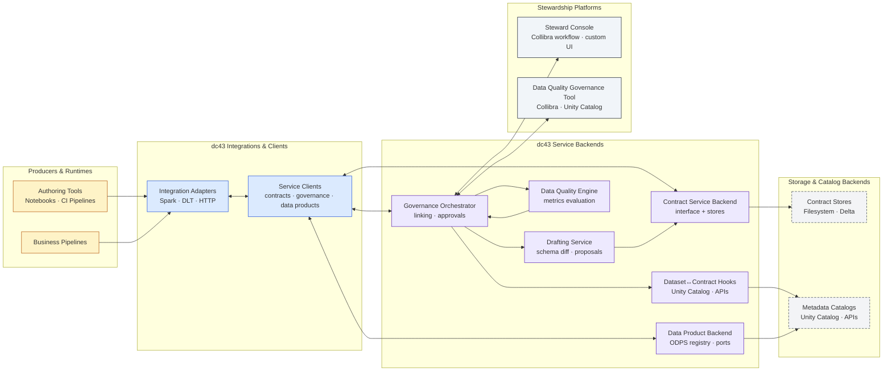

# dc43 — Data Contracts For Free!

## Overview

### Conceptual platform

dc43 is a governance-first toolkit that separates the **concepts** of data contract management from their **implementations**. At its core it provides:

- Contract lifecycle management primitives to draft, review, approve, and retire ODCS contracts. _Note: dc43 currently targets ODCS 3.0.2; a compatibility table will follow as the spec evolves._
- Extensible interfaces for contract storage, drafting, and data quality orchestration that keep governance decisions close to the data contract owner.
- Runtime helpers to apply approved specifications in compute platforms while feeding observations back to governance workflows.
- A documentation assistant embedded in the dc43 app (powered by LangChain and Gradio) so teams can chat with the Markdown guides that ship with the project.

### Provided integrations

On top of the conceptual platform, dc43 ships opinionated integrations that you can adopt or replace:

- Spark & DLT pipelines via `dc43_integrations.spark.io` with schema/metric helpers from `dc43_service_backends.data_quality.backend` for auto-casting and contract-aware IO.
- Storage backends such as filesystem (DBFS/UC volumes), Delta tables, and Collibra through `CollibraContractStore`.
- Open Data Product backends (`dc43_service_backends.data_products.backend`) that let product owners register ports and bind them to contracts via ODPS-compliant metadata stores.
- A pluggable data-quality client with a stub implementation that can be replaced by catalog-native tools.
- Scenario-first getting started guides (operations setup, local Spark flows, remote integrations, and the contracts app helper) live in [`docs/getting-started/`](docs/getting-started/README.md).

See [`docs/implementations/data-quality-governance/collibra.md`](docs/implementations/data-quality-governance/collibra.md) for end-to-end orchestration guidance when Collibra owns stewardship workflows. Component deep dives cover the [contract store](docs/component-contract-store.md), [contract drafter](docs/component-contract-drafter.md), [data-quality governance interface](docs/component-data-quality-governance.md), [data-quality engine](docs/component-data-quality-engine.md), and [integration layer](docs/component-integration-layer.md). Each component links to implementation catalogs under [`docs/implementations/`](docs/implementations/) so you can pick technology-specific guides (Spark, Delta, Collibra, ...).

## Component model

dc43 exposes a small set of well-defined components. Swap any of them without rewriting the rest of the stack:

| Layer | Component | Responsibility |
| --- | --- | --- |
| Governance | **Contract manager/store interface** | Retrieve, version, and persist contracts from catalog-backed or file-based sources. |
| Governance | **Data product service interface** | Manage ODPS data products, register input/output ports, and bind them to contract versions for runtime discovery. |
| Governance | **Dataset↔contract link hooks** | Propagate dataset/contract bindings to external catalogs (Unity Catalog, bespoke metadata APIs) after governance approves the linkage. |
| Governance | **Data quality manager interface** | Coordinate with an external DQ governance tool (e.g., Collibra, Unity Catalog) that records dataset↔contract alignment and approval state. |
| Authoring support | **Contract drafter module** | Generate ODCS drafts from observed data or schema drift events before handing them back to governance. |
| Runtime services | **Data-quality metrics engine** | Collect contract-driven metrics in execution engines and forward them to the governance tool for status evaluation. |
| Integration | **Integration adapters** | Bridge the contract, data product, drafter, and DQ components into execution engines such as Spark or Delta Live Tables (current adapters live under `dc43_integrations.spark`). |

Guides for each component live under `docs/`:

- Contract store: [`component-contract-store.md`](docs/component-contract-store.md)
- Contract drafter: [`component-contract-drafter.md`](docs/component-contract-drafter.md)
- Data-quality governance interface: [`component-data-quality-governance.md`](docs/component-data-quality-governance.md)
- Data-quality engine: [`component-data-quality-engine.md`](docs/component-data-quality-engine.md)
- Integration layer: [`component-integration-layer.md`](docs/component-integration-layer.md); Spark & DLT adapter: [`implementations/integration/spark-dlt.md`](docs/implementations/integration/spark-dlt.md)
- Write violation strategies: [`component-write-violation-strategies.md`](docs/component-write-violation-strategies.md)

## Architecture



This architecture separates the libraries that ship with dc43 from the external systems they orchestrate:

- **Producers & runtimes** only call into dc43 through the integration adapters. Notebooks, CI pipelines, and Spark jobs import helpers such as [`dc43_integrations.spark.io`](packages/dc43-integrations/src/dc43_integrations/spark/io.py) which assemble schema metrics and forward requests to the services through typed clients.
- **dc43 integrations & clients** include the runtime adapters plus the request/response protocols defined under [`dc43_service_clients`](packages/dc43-service-clients/src/dc43_service_clients). These clients declare how to fetch contracts, submit governance assessments, and register ODPS ports without exposing storage details.
- **dc43 service backends** live in [`dc43_service_backends`](packages/dc43-service-backends/src/dc43_service_backends). They combine contract stores, the drafting module, the governance orchestrator, ODPS product registries, and the data-quality engine that materialises expectations from ODCS documents.
- **Stewardship platforms** (Collibra, Unity Catalog UIs, custom consoles) sit outside this repository. The governance backend offers hook points so approval workflows can run there while still receiving compatibility assessments and draft details via [`governance.backend.local`](packages/dc43-service-backends/src/dc43_service_backends/governance/backend/local.py) and the hook interfaces in [`governance.hooks`](packages/dc43-service-backends/src/dc43_service_backends/governance/hooks.py).
- **Storage & catalog backends** highlight the concrete infrastructure that backs each service: filesystem, SQL, or Delta-backed contract stores and metadata targets updated by link hooks such as [`governance.unity_catalog`](packages/dc43-service-backends/src/dc43_service_backends/governance/unity_catalog.py).

### Node & edge glossary

- **Integration adapters** – runtime entry points (Spark, HTTP) that call every service through the typed clients, gather schema metrics, and assemble observation payloads for governance reviews. See [`spark/io.py`](packages/dc43-integrations/src/dc43_integrations/spark/io.py) and [`spark/data_quality.py`](packages/dc43-integrations/src/dc43_integrations/spark/data_quality.py).
- **Service clients** – thin protocols implemented by backends or HTTP gateways that expose contract, governance, and data-product actions to adapters without binding them to storage choices. Interfaces live under [`contracts/client`](packages/dc43-service-clients/src/dc43_service_clients/contracts/client), [`governance/client`](packages/dc43-service-clients/src/dc43_service_clients/governance/client), and [`data_products/client`](packages/dc43-service-clients/src/dc43_service_clients/data_products/client).
- **Contract service backend** – resolves, versions, and stores ODCS documents using pluggable stores such as the filesystem adapter in [`contracts.backend`](packages/dc43-service-backends/src/dc43_service_backends/contracts/backend).
- **Drafting service** – materialises schema diffs and draft ODCS payloads based on validation results so stewards can review suggested changes. Implementation details live in [`contracts/backend/drafting.py`](packages/dc43-service-backends/src/dc43_service_backends/contracts/backend/drafting.py).
- **Governance orchestrator** – evaluates observation payloads, records compatibility results, triggers draft generation, and invokes dataset-link hooks during approvals via [`governance/backend/local.py`](packages/dc43-service-backends/src/dc43_service_backends/governance/backend/local.py) and [`governance/hooks.py`](packages/dc43-service-backends/src/dc43_service_backends/governance/hooks.py).
- **Data product backend** – persists ODPS product definitions and port bindings in repositories such as Delta tables or Collibra exports. See [`data_products/backend`](packages/dc43-service-backends/src/dc43_service_backends/data_products/backend).
- **Data quality engine** – projects contract expectations into executable rules and reuses stored metrics when possible to cut redundant checks through [`data_quality/backend/engine.py`](packages/dc43-service-backends/src/dc43_service_backends/data_quality/backend/engine.py).
- **Dataset↔contract link hooks** – extension points (for example the Unity Catalog linker) that propagate approvals to metadata catalogs after governance records a new binding. Implementations live under [`governance/unity_catalog.py`](packages/dc43-service-backends/src/dc43_service_backends/governance/unity_catalog.py).
- **Storage and catalog backends** – infrastructure that underpins the services: filesystem/Git paths, Delta tables, Unity Catalog, or bespoke APIs configured through the backend modules inside [`contracts/backend/stores`](packages/dc43-service-backends/src/dc43_service_backends/contracts/backend/stores) and the Unity Catalog integration referenced above.

Variations—such as Collibra-governed contracts or bespoke storage backends—slot into the same model by substituting implementations of the interfaces described above.

## Install

dc43 now ships as a family of distributions so you can install only the layers you need:

| Distribution | Imports | Responsibility | Depends on |
| --- | --- | --- | --- |
| `dc43-service-clients` | `dc43_service_clients.*` | Typed service clients, request/response models, and governance helpers that front-end applications can embed. | `open-data-contract-standard` |
| `dc43-service-backends` | `dc43_service_backends.*` | Reference backend implementations (filesystem/SQL stores, local drafting, in-memory governance service) that orchestrate the client layer. | `dc43-service-clients` |
| `dc43-integrations` | `dc43_integrations.*` | Runtime adapters such as the Spark helpers that call into client APIs without requiring backend dependencies. | `dc43-service-clients` |
| `dc43` | `dc43.*` | Aggregating package that wires the CLI/demo and depends on the three modules above. | all of the above |

### Pip installs

- **Service contracts only**: `pip install dc43-service-clients`
- **Backend reference services**: `pip install dc43-service-backends`
- **Backend services with SQL storage**: `pip install "dc43-service-backends[sql]"`
- **HTTP service backends**: `pip install "dc43-service-backends[http]"` (see
  [`deploy/http-backend/README.md`](deploy/http-backend/README.md) for a
  containerised deployment recipe)
- **Spark integrations**: `pip install "dc43-integrations[spark]"`
- **Full stack**: `pip install dc43`
- **Spark extras for the meta package**: `pip install "dc43[spark]"`
- **Demo app**: `pip install "dc43[demo]"`

When developing locally (Databricks Repos, workspace files, or any source checkout) the editable install automatically pulls in
the sibling packages:

```bash
pip install -e .
```

Chain extras as needed—for example to prepare the test environment run:

```bash
pip install -e ".[test]"
```

Each distribution can now be installed independently. For example, lightweight clients can use `pip install dc43-service-clients` and then `from dc43_service_clients.data_quality import ValidationResult` without pulling in the backend or Spark helpers at runtime.

## Quickstart

1) Define a contract (ODCS typed model)

```python
from open_data_contract_standard.model import (
    OpenDataContractStandard, SchemaObject, SchemaProperty, Description
)

contract = OpenDataContractStandard(
    version="0.1.0",
    kind="DataContract",
    apiVersion="3.0.2",
    id="sales.orders",
    name="Orders",
    description=Description(usage="Orders facts"),
    schema_=[
        SchemaObject(
            name="orders",
            properties=[
                SchemaProperty(name="order_id", physicalType="bigint", required=True, unique=True),
                SchemaProperty(name="customer_id", physicalType="bigint", required=True),
                SchemaProperty(name="order_ts", physicalType="timestamp", required=True),
                SchemaProperty(name="amount", physicalType="double", required=True),
                SchemaProperty(
                    name="currency", physicalType="string", required=True,
                    logicalTypeOptions={"enum": ["EUR", "USD"]}
                ),
            ],
        )
    ],
)
```

2) Validate and write with Spark

```python
from dc43_service_clients import load_governance_client
from dc43_integrations.spark.io import (
    write_with_governance,
    ContractVersionLocator,
    GovernanceSparkWriteRequest,
)

governance = load_governance_client("/path/to/dc43.toml")

write_with_governance(
    df=orders_df,
    request=GovernanceSparkWriteRequest(
        context={
            "contract": {
                "contract_id": "sales.orders",
                "version_selector": ">=0.1.0",
            }
        },
        dataset_locator=ContractVersionLocator(dataset_version="latest"),
        mode="append",
    ),
    governance_service=governance,
    enforce=True,
    auto_cast=True,
)
```

3) DLT usage (inside a pipeline notebook)

DLT annotations follow the same governance-first philosophy as the Spark IO
helpers: the decorator only needs a governance client and a context describing
the contract (or future data product binding).

```python
import dlt
from dc43_integrations.spark.dlt import governed_table
from dc43_service_clients import load_governance_client

governance = load_governance_client()


@governed_table(
    dlt,
    context={
        "contract": {
            "contract_id": "sales.orders",
            "version_selector": ">=0.1.0",
        }
    },
    governance_service=governance,
    name="orders",
)
def orders():
    df = spark.read.stream.table("bronze.sales_orders_raw")
    return df.select("order_id", "customer_id", "order_ts", "amount", "currency")
```

Need to experiment outside Databricks? Install [`databricks-dlt`](https://pypi.org/project/databricks-dlt/)
for the official notebook-compatible shims (the local mode only flips a flag).
If the package is not available the helpers now fall back to an in-repo stub so
the demo pipeline and tests continue to run, but installing the real package is
recommended for parity. Wrap your pipeline definitions in
``LocalDLTHarness`` (see `packages/dc43-integrations/examples/dlt_contract_pipeline.py`)
to execute the same annotations on a local Spark session and inspect the
recorded expectation verdicts.

4) Store and resolve contracts

```python
from dc43_service_backends.contracts.backend.stores import FSContractStore

store = FSContractStore(base_path="/mnt/contracts")
store.put(contract)
latest = store.latest("sales.orders")
```

5) DQ/DO orchestration on read

```python
from dc43_integrations.spark.io import (
    read_with_governance,
    ContractVersionLocator,
    GovernanceSparkReadRequest,
)
from dc43_service_clients import load_governance_client

governance = load_governance_client("/path/to/dc43.toml")
df, status = read_with_governance(
    spark,
    GovernanceSparkReadRequest(
        context={
            "contract": {
                "contract_id": "sales.orders",
                "version_selector": "==0.1.0",
            }
        },
        dataset_locator=ContractVersionLocator(dataset_version="latest"),
    ),
    governance_service=governance,
    return_status=True,
)
print(status.status, status.reason)
```

6) Quality status check on write

```python
from dc43_integrations.spark.io import (
    write_with_governance,
    ContractVersionLocator,
    GovernanceSparkWriteRequest,
)
from dc43_service_clients import load_governance_client

governance = load_governance_client("/path/to/dc43.toml")
vr, status = write_with_governance(
    df=orders_df,
    request=GovernanceSparkWriteRequest(
        context={
            "contract": {
                "contract_id": "sales.orders",
                "version_selector": ">=0.1.0",
            }
        },
        dataset_locator=ContractVersionLocator(dataset_version="latest"),
    ),
    governance_service=governance,
    enforce=False,  # continue writing
    return_status=True,
)
if status and status.status == "block":
    raise ValueError(f"DQ blocked write: {status.details}")
```

## Demo application

A Vue-powered FastAPI application packaged as ``dc43-demo-app`` (module
``dc43_demo_app``) offers a visual way to explore contracts, datasets and data
quality results. Install the optional dependencies and launch the app with:

```bash
pip install ".[demo]"
dc43-demo
```

Visit ``http://localhost:8000`` to:

- Browse contracts and their versions with draft/active status.
- Inspect dataset versions, their linked contract, validation status and
  detailed DQ metrics derived from contract rules.
- Highlight datasets using draft contracts and trigger validation to promote
  them.

An additional Reveal.js presentation is available at
``http://localhost:8000/static/presentation.html`` to walk through the
contract lifecycle and automation steps.

The application also exposes an example Spark pipeline in
``dc43_demo_app.pipeline`` used when registering new dataset versions. The
preconfigured scenarios are documented in
[`docs/demo-pipeline-scenarios.md`](docs/demo-pipeline-scenarios.md) including
the new split strategy example that writes ``orders_enriched::valid`` and
``orders_enriched::reject`` alongside the main dataset.

The demo now drives its contract, governance, and data-quality operations
through the same HTTP clients that production pipelines use. When the UI starts
it spins up an in-process instance of the service backend HTTP application, so
Spark runs exercise the remote code paths without requiring an external
deployment.

### Running the service backend over HTTP

Pipelines that rely on the remote clients can reach a standalone backend via
the `dc43_service_backends.webapp` module. Set the contract directory and (if
needed) a bearer token before launching `uvicorn`:

```bash
export DC43_CONTRACT_STORE=/path/to/contracts
export DC43_BACKEND_TOKEN="super-secret"  # optional
uvicorn dc43_service_backends.webapp:app --host 0.0.0.0 --port 8001
```

Contracts stored under `$DC43_CONTRACT_STORE` are served over the API while the
stub data-quality and governance backends keep draft information on disk. See
[`docs/implementations/service-backends/http-server.md`](docs/implementations/service-backends/http-server.md)
for Docker packaging notes and deployment options.

## Spark Flow (Mermaid)

```mermaid
flowchart LR
    subgraph Read
      U[User code / Notebook] --> RWG{read_with_governance}
      RWG --> RC["resolve_read_context"]
      RC --> SR["spark.read.format(...).load"]
      RWG --> EV["ensure_version(contract)"]
      EV --> OBS[collect_observations]
      OBS --> DQS["dq_service.evaluate"]
      DQS -->|ok| AC["apply_contract (cast/order)"]
      DQS -->|errors & enforce| E1[Raise]
      AC --> DF[DataFrame ready]
      RWG --> DQ{dq_client?}
      DQ -->|yes| GS["get_status(dataset@version, contract@version)"]
      GS -->|unknown/stale| CM[compute_metrics]
      CM --> SM[submit_metrics -> status]
      GS -->|up-to-date| SM
      SM -->|block & enforce| E2[Raise]
      SM -->|ok/warn| DF
    end

    DF --> T[Transformations / joins / aggregations]

    subgraph Write
      T --> WWC{write_with_contract}
      WWC --> OBS2[collect_observations]
      OBS2 --> DQS2["dq_service.evaluate"]
      DQS2 -->|ok| AC2[apply_contract]
      DQS2 -->|errors & enforce| E3[Raise]
      DQS2 -->|errors & !enforce| AC2
      AC2 --> SW["spark.write.(format, options).mode.save"]
      SW --> DELTA[Delta table / UC]
      DELTA --> DQ2{dq_client?}
      DQ2 -->|yes| EVAL["evaluate_dataset"]
      EVAL -->|status block & enforce| E4[Raise]
      EVAL -->|status ok/warn| DELTA
    end

    classDef err fill:#ffe5e5,stroke:#ff4d4f,color:#000
    class E1,E2,E3,E4 err
```



Notes

- The library uses the official ODCS package and enforces `$schema` version `3.0.2` by default (configurable via `DC43_ODCS_REQUIRED`).
- Validation runs inside the Spark DQ engine: presence, types, nullability and common constraints (enum, regex, min/max, unique best-effort). The resulting ``ValidationResult`` bundles metrics and a schema snapshot so governance adapters can update compatibility matrices.
- DLT helpers translate constraints into `expect` expressions when feasible.
- DQ orchestration: the IO wrapper checks schema vs contract and consults the DQ client. If dataset version is newer than DQ’s known version, it computes the required metrics and submits them, then enforces the resulting status if requested.

Local Dev

- Install dependencies locally (match your Databricks runtime where possible):

```bash
pip install open-data-contract-standard==3.0.2 pyspark
```

- dc43 enforces `apiVersion` via `DC43_ODCS_REQUIRED` (default `3.0.2`).

# Tests

- Install the shared test extras and run the suites that matter for the area you
  are touching.  The top-level pytest configuration automatically adds each
  package's `src` directory to `sys.path`, so cloning the repo and running
  `pytest` works even before the editable installs finish building.

```bash
# Option A: run everything with one helper (installs extras unless --skip-install is passed)
./scripts/test_all.sh

# Option B: manage installs yourself and invoke pytest directly
pip install -e ".[test]"
pytest -q tests packages/dc43-service-clients/tests \
  packages/dc43-service-backends/tests packages/dc43-integrations/tests
```

# Continuous integration

- The GitHub Actions release workflow at `.github/workflows/release.yml` builds
  the contracts app and HTTP backend Docker images after the release pipeline
  finishes and publishes them to Amazon ECR using the released package versions
  as image tags (alongside `latest`).
- Trigger the `ci` workflow manually with **Publish Docker images to Amazon ECR**
  enabled to run a smoke test that builds and pushes both images without waiting
  for a release.
- Configure the following repository secrets so the workflows can assume an AWS
  role and push to your registries:
  - `AWS_REGION`
  - `AWS_ROLE_TO_ASSUME`
  - `AWS_ECR_CONTRACTS_APP_REPOSITORY`
  - `AWS_ECR_HTTP_BACKEND_REPOSITORY`
- See [`docs/aws-ecr-setup.md`](docs/aws-ecr-setup.md) for full AWS and GitHub
  configuration guidance.

# Publishing

- Push a tag `v*` on a commit in `main`.
- The workflow `.github/workflows/release.yml` runs tests, builds the package, waits for manual approval via environment `release`, publishes to PyPI, and creates a GitHub release with autogenerated notes.
- Set `PYPI_TOKEN` secret and configure the `release` environment with required reviewers.

# License

Apache 2
