# Docuchango

[](https://github.com/jrepp/docuchango/actions)
[](https://codecov.io/gh/jrepp/docuchango)
[](https://www.python.org/downloads/)
[](https://opensource.org/licenses/MPL-2.0)

[](https://github.com/astral-sh/ruff)
[](http://mypy-lang.org/)
[](pyproject.toml)
[](https://github.com/jrepp/docuchango/graphs/commit-activity)
[](https://github.com/jrepp/docuchango)

Validate and fix Docusaurus documentation. Checks frontmatter, links, code blocks, and formatting.

```mermaid
flowchart LR
    A[docs-cms/] --> B{docuchango}
    B -->|validate| C[✓ Report errors]
    B -->|fix| D[✓ Fixed docs]
    D --> E[Docusaurus]
    E -->|build| F[📚 Static site]

    style A fill:#f9f,stroke:#333
    style B fill:#bbf,stroke:#333
    style C fill:#bfb,stroke:#333
    style D fill:#bfb,stroke:#333
    style E fill:#feb,stroke:#333
    style F fill:#bfb,stroke:#333
```



## Quick Start

### 1. Bootstrap a docs-cms Project

```bash
# Install uv (if not already installed)
curl -LsSf https://astral.sh/uv/install.sh | sh

# Install docuchango
curl -sSL https://raw.githubusercontent.com/jrepp/docuchango/main/install.sh | bash

# View bootstrap guide
docuchango bootstrap

# View agent instructions
docuchango bootstrap --guide agent

# View best practices
docuchango bootstrap --guide best-practices
```

### 2. Validate and Fix Documentation

```bash
# Validate
docuchango validate

# Fix issues
docuchango fix all
```

## Example Usage

```bash
# Run validation
$ docuchango validate --verbose

📂 Scanning documents...
   Found 23 documents

✓ Validating links...
   Found 47 total links

❌ DOCUMENTS WITH ERRORS (2):
   adr/adr-001.md:
   ✗ Missing field: 'deciders'
   ✗ Invalid status: 'Draft'

# Fix automatically
$ docuchango fix all
   ✓ Fixed 12 code blocks
   ✓ Removed trailing whitespace
   ✓ Added missing frontmatter
```

## Document Structure

```text
docs-cms/
├── adr/              # Architecture Decision Records
│   ├── adr-001-*.md
│   └── adr-002-*.md
├── rfcs/             # Request for Comments
│   └── rfc-001-*.md
├── memos/            # Technical memos
│   └── memo-001-*.md
└── prd/              # Product requirements
    └── prd-001-*.md
```

Each doc needs frontmatter:
```yaml
---
id: "adr-001"
title: "Use Click for CLI"
status: Accepted
date: 2025-01-26
deciders: Engineering Team
tags: ["cli", "framework"]
project_id: "my-project"
doc_uuid: "..."
---
```

### Schema Structure


**Templates & Docs:**
- [ADR Template](templates/adr-template.md) | [RFC Template](templates/rfc-template.md) | [Memo Template](templates/memo-template.md)
- [Schema Docs](docuchango/schemas.py) | [ADR-001](docs-cms/adr/adr-001-pydantic-schema-validation.md)

## Features

- **Validates** frontmatter (required fields, valid formats)
- **Checks links** (internal, relative, broken refs)
- **Fixes automatically** (whitespace, code blocks, frontmatter)
- **Fast** (100 docs in < 1s)
- **CI-ready** (exit codes, clear errors)

## Commands

```bash
# Validate everything
docuchango validate

# Validate with verbose output
docuchango validate --verbose

# Skip slow build checks
docuchango validate --skip-build

# Fix all issues
docuchango fix all

# Fix specific issues
docuchango fix code-blocks
docuchango fix links

# CLI shortcuts
dcc-validate        # Same as docuchango validate
dcc-fix            # Same as docuchango fix
```

## Python API

```python
from docuchango.validator import DocValidator
from docuchango.schemas import ADRFrontmatter

# Validate
validator = DocValidator(repo_root=".", verbose=True)
validator.scan_documents()
validator.check_code_blocks()
validator.check_formatting()

# Use schemas
adr = ADRFrontmatter(**frontmatter_data)
```

## Development

```bash
# Setup
uv sync
pip install -e ".[dev]"

# Test
pytest
pytest --cov=docuchango
pytest -n auto  # Parallel (for large test suites)

# Lint
ruff format .
ruff check .
mypy docuchango tests
actionlint  # Lint GitHub Actions workflows

# Build
uv build
```

## Documentation

- [Templates](templates/) - Starter files for ADR, RFC, Memo, PRD
- [ADRs](docs-cms/adr/) - Architecture decisions
- [RFCs](docs-cms/rfcs/) - Technical proposals

## Requirements

- Python 3.9+
- Works on macOS, Linux, Windows

## License

Mozilla Public License Version 2.0 (MPL-2.0) - See [LICENSE](LICENSE) file

This Source Code Form is subject to the terms of the Mozilla Public License, v. 2.0. If a copy of the MPL was not distributed with this file, You can obtain one at https://mozilla.org/MPL/2.0/.

## Links

- [GitHub](https://github.com/jrepp/docuchango)
- [PyPI](https://pypi.org/project/docuchango)
- [Issues](https://github.com/jrepp/docuchango/issues)
