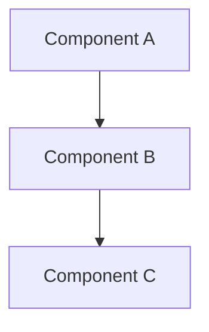

# RFC-NNN: Proposal Title

## Summary
Brief 2-3 sentence overview of the proposal.

## Motivation
Why are we doing this? What problem does it solve? What user need does it address?

## Proposed Solution
Detailed explanation of the proposal.

Include diagrams, code examples, and specific implementation details.

### Architecture


### Example Usage
```python
# Code example showing how it would work
result = new_feature.do_something()
```

## Implementation

### Phase 1: [Name] (Timeline)
- [ ] Task 1
- [ ] Task 2

### Phase 2: [Name] (Timeline)
- [ ] Task 3
- [ ] Task 4

### Dependencies
- System X must be upgraded
- Team Y must approve
- Infrastructure Z must be available

## Alternatives

### Alternative 1: [Name]
**Approach**: Description

**Pros**: Benefits

**Cons**: Drawbacks

**Why Not**: Reason not chosen

### Alternative 2: [Name]
Similar format...

## Open Questions
- Question 1?
- Question 2?
- Question 3?

## Risks
- Risk 1: Description
  - **Mitigation**: How we'll address it

- Risk 2: Description
  - **Mitigation**: How we'll address it

## Success Metrics
- Metric 1: Target value
- Metric 2: Target value
- Metric 3: Target value

## Related Decisions
- [ADR-XXX](../adr/adr-XXX-related.md): Related decision
- [RFC-YYY](./rfc-YYY-related.md): Related proposal

## Next Steps
1. Discuss and gather feedback
2. Address open questions
3. Create ADR if approved
4. Begin implementation

---

**Note**: This is a [Draft|In Review|Approved|Rejected] RFC. Feedback welcome on [specific aspects].
