# Docuchango

[](https://pypi.org/project/docuchango/)
[](https://github.com/jrepp/docuchango/actions)
[](https://codecov.io/gh/jrepp/docuchango)
[](https://www.python.org/downloads/)
[](https://opensource.org/licenses/MPL-2.0)

[](https://github.com/astral-sh/ruff)
[](http://mypy-lang.org/)
[](pyproject.toml)
[](https://github.com/jrepp/docuchango/graphs/commit-activity)
[](https://github.com/jrepp/docuchango)

A command-line tool to validate and automatically fix Docusaurus documentation, ensuring frontmatter, links, code blocks, and formatting meet quality standards.

## Why Docuchango?

- **Automated fixes** - Don't just find errors, fix them automatically (whitespace, code blocks, frontmatter)
- **Docusaurus-specific** - Purpose-built for docs-cms projects with ADR, RFC, Memo, and PRD templates
- **Strict validation** - Enforces consistent frontmatter schemas with Pydantic, catches issues before build time
- **Fast & CI-ready** - Processes 100+ docs in under a second, perfect for pre-commit hooks and CI pipelines

## Installation

```bash
# Install from PyPI (latest version)
pip install docuchango

# Or use uvx to run without installing
uvx docuchango --help

# Or use the install script (includes uv)
curl -sSL https://raw.githubusercontent.com/jrepp/docuchango/main/install.sh | bash
```

## Quick Start

```bash
# Bootstrap a new docs-cms project with templates and structure
docuchango bootstrap

# Validate your documentation against frontmatter schemas, links, and formatting rules
docuchango validate

# Automatically fix detected issues (code blocks, whitespace, frontmatter)
docuchango fix all
```



```mermaid
flowchart LR
    A[docs-cms/] --> B{docuchango}
    B -->|validate| C[✓ Report errors]
    B -->|fix| D[✓ Fixed docs]
    D --> E[Docusaurus]
    E -->|build| F[📚 Static site]

    style A fill:#f9f,stroke:#333
    style B fill:#bbf,stroke:#333
    style C fill:#bfb,stroke:#333
    style D fill:#bfb,stroke:#333
    style E fill:#feb,stroke:#333
    style F fill:#bfb,stroke:#333
```

## Usage Examples

### Validation Commands

```bash
# Run validation with verbose output
$ docuchango validate --verbose

📂 Scanning documents...
   Found 23 documents

✓ Validating links...
   Found 47 total links

❌ DOCUMENTS WITH ERRORS (2):
   adr/adr-001.md:
   ✗ Missing field: 'deciders'
   ✗ Invalid status: 'Draft'

# Validate everything (default)
docuchango validate

# Skip slow build checks
docuchango validate --skip-build
```

### Fix Commands

```bash
# Automatically fix all detected issues
$ docuchango fix all
   ✓ Fixed 12 code blocks
   ✓ Removed trailing whitespace
   ✓ Added missing frontmatter

# Fix specific issues
docuchango fix code-blocks
docuchango fix links
```

### Bootstrap & Guides

```bash
# View agent integration guides
docuchango bootstrap --guide agent
docuchango bootstrap --guide best-practices
```

### CLI Shortcuts

```bash
dcc-validate        # Same as docuchango validate
dcc-fix            # Same as docuchango fix
```

## CMS Folder Structure

```text
docs-cms/
├── adr/              # Architecture Decision Records
│   ├── adr-001-*.md
│   └── adr-002-*.md
├── rfcs/             # Request for Comments
│   └── rfc-001-*.md
├── memos/            # Technical memos
│   └── memo-001-*.md
└── prd/              # Product requirements
    └── prd-001-*.md
```

### Document Schema (frontmatter)

Each document requires structured frontmatter. Here's an example with field descriptions:

```yaml
---
# Unique identifier matching the filename (e.g., "adr-001", "rfc-042")
id: "adr-001"

# Human-readable title for the document
title: "Use Click for CLI Framework"

# Current status - valid values depend on doc type
# ADR: Proposed, Accepted, Deprecated, Superseded
# RFC: Draft, In Review, Accepted, Rejected, Implemented
# Memo: Draft, Published, Archived
status: Accepted

# ISO 8601 date (YYYY-MM-DD) when the document was created
date: 2025-01-26

# Who made or approved this decision (ADR-specific field)
deciders: Engineering Team

# Categorization tags for search and filtering
tags: ["cli", "framework", "tooling"]

# Project identifier for organizing docs across multiple projects
project_id: "my-project"

# Auto-generated UUID for tracking and references (generate once, never change)
doc_uuid: "550e8400-e29b-41d4-a716-446655440000"
---
```

**Note**: Different document types (ADR, RFC, Memo, PRD) have slightly different required fields. Use `docuchango bootstrap` to see templates for each type.

### Schema Structure


**Templates & Docs:**
- [ADR Template](templates/adr-template.md) | [RFC Template](templates/rfc-template.md) | [Memo Template](templates/memo-template.md)
- [Schema Docs](docuchango/schemas.py) | [ADR-001](docs-cms/adr/adr-001-pydantic-schema-validation.md)

## Features

- **Validates** frontmatter (required fields, valid formats)
- **Checks links** (internal, relative, broken refs)
- **Fixes automatically** (whitespace, code blocks, frontmatter)
- **Fast** (100 docs in < 1s)
- **CI-ready** (exit codes, clear errors)

## Python API

```python
from docuchango.validator import DocValidator
from docuchango.schemas import ADRFrontmatter

# Validate
validator = DocValidator(repo_root=".", verbose=True)
validator.scan_documents()
validator.check_code_blocks()
validator.check_formatting()

# Use schemas
adr = ADRFrontmatter(**frontmatter_data)
```

## Development

```bash
# Setup
uv sync
pip install -e ".[dev]"

# Test
pytest
pytest --cov=docuchango
pytest -n auto  # Parallel (for large test suites)

# Lint
ruff format .
ruff check .
mypy docuchango tests
actionlint  # Lint GitHub Actions workflows

# Build
uv build
```

## Documentation

- [Templates](templates/) - Starter files for ADR, RFC, Memo, PRD
- [ADRs](docs-cms/adr/) - Architecture decisions
- [RFCs](docs-cms/rfcs/) - Technical proposals

## Requirements

- Python 3.9+
- Works on macOS, Linux, Windows

## License

Mozilla Public License Version 2.0 (MPL-2.0) - See [LICENSE](LICENSE) file

This Source Code Form is subject to the terms of the Mozilla Public License, v. 2.0. If a copy of the MPL was not distributed with this file, You can obtain one at https://mozilla.org/MPL/2.0/.

## Glossary: Issues Detected and Fixed

This comprehensive reference lists all documentation issues that docuchango can detect and automatically fix.

### Frontmatter Issues

**Detected:**
- Missing YAML frontmatter
- Missing required fields (`id`, `title`, `status`, `date`, `tags`, `project_id`, `doc_uuid`)
- Invalid field types or formats
- Invalid status values for document type (e.g., "Draft" instead of "Proposed" for ADRs)
- Missing document-type-specific fields (e.g., `deciders` for ADRs)
- Invalid date formats (must be ISO 8601: YYYY-MM-DD)
- Malformed UUID values
- ID/filename mismatches (frontmatter `id` doesn't match filename)
- ID/title mismatches (frontmatter `id` doesn't match title number)
- Duplicate IDs across documents
- Duplicate UUIDs across documents

**Auto-Fixed:**
- ✓ Generates missing frontmatter fields
- ✓ Adds missing required fields with sensible defaults

**Requires Manual Fix:**
- Missing YAML frontmatter
- Invalid field types or formats
- Invalid status values for document type (e.g., "Draft" instead of "Proposed" for ADRs)
- Missing document-type-specific fields (e.g., `deciders` for ADRs)
- Invalid date formats (must be ISO 8601: YYYY-MM-DD)
- Malformed UUID values
- ID/filename mismatches (frontmatter `id` doesn't match filename)
- ID/title mismatches (frontmatter `id` doesn't match title number)
- Duplicate IDs across documents
- Duplicate UUIDs across documents

### Code Block Issues

**Detected:**
- Opening code fences without language specification (bare \`\`\`)
- Closing code fences with language/text (should be bare \`\`\`)
- Unclosed code blocks (missing closing fence)
- Missing blank line before opening fence
- Missing blank line after closing fence
- Unbalanced code fences

**Auto-Fixed:**
- ✓ Adds "text" language to bare opening fences
- ✓ Removes language from closing fences
- ✓ Adds missing closing fences
- ✓ Inserts blank lines before/after fences

### Link Issues

**Detected:**
- Broken internal document links (file not found)
- Invalid relative paths (`./path` or `../path` pointing to non-existent files)
- Ambiguous link formats
- Problematic cross-plugin links (multiple `../` levels)
- Broken ADR/RFC cross-references

**Auto-Fixed:**
- ✓ Updates broken internal links to correct paths
- ✓ Converts problematic cross-plugin links to absolute GitHub URLs
- ✓ Fixes document link formats

### MDX Compatibility Issues

**Detected:**
- Unescaped `<` before numbers (e.g., "< 10")
- Unescaped `>` before numbers (e.g., "> 5")
- MDX compilation errors
- JSX syntax incompatibilities
- Special characters that break MDX parsing

**Auto-Fixed:**
- ✓ Escapes special MDX characters (`&lt;`, `&gt;`)
- ✓ Fixes MDX syntax issues
- ✓ Corrects JSX-incompatible markdown

### Formatting Issues

**Detected:**
- Trailing whitespace on lines
- More than 2 consecutive blank lines
- Inconsistent line endings

**Auto-Fixed:**
- ✓ Removes trailing whitespace
- ✓ Normalizes multiple blank lines

### Filename & Naming Issues

**Detected:**
- Invalid filename patterns (must be: `type-NNN-slug.md`)
- Uppercase in filenames (deprecated, must be lowercase)
- Inconsistent ADR/RFC/Memo numbering

**Requires Manual Fix:** Flagged for user intervention

### Build & Compilation Issues

**Detected:**
- TypeScript compilation errors in Docusaurus config
- Full Docusaurus build failures
- MDX compilation failures via @mdx-js/mdx
- Build warnings

**Requires Manual Fix:** Reported for debugging and manual resolution

### Migration & Import Issues

**Auto-Fixed:**
- ✓ Proto import syntax issues
- ✓ Migration syntax corrections

---

**Issue Categories:**
1. **Frontmatter** - Schema validation, required fields, format checking
2. **Code Blocks** - Fence formatting, language labels, balance
3. **Links** - Broken links, cross-references, path resolution
4. **MDX** - Compilation, special character escaping, JSX compatibility
5. **Formatting** - Whitespace, blank lines
6. **Identifiers** - IDs, UUIDs, filename consistency
7. **Build** - TypeScript, Docusaurus compilation
8. **Migration** - Import syntax, migration corrections

## Links

- [GitHub](https://github.com/jrepp/docuchango)
- [PyPI](https://pypi.org/project/docuchango)
- [Issues](https://github.com/jrepp/docuchango/issues)
