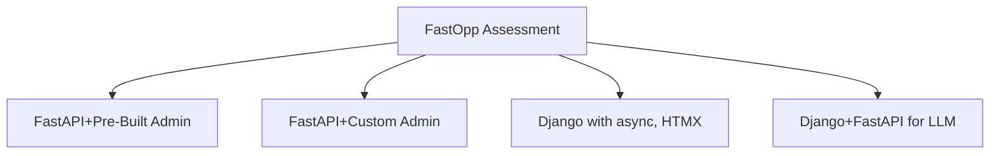

# FastOpp Development Roadmap

This document outlines the development timeline, student recruitment plans, and strategic direction for the FastOpp platform.

## Project Overview

FastOpp is designed for developers to assess FastAPI functionality. The pre-built admin tools for FastAPI may not end up being popular for FastAPI developers, but they serve as a step in the process to evaluate FastAPI or where Oppkey ends up.

**Recent Improvement**: The codebase has been refactored to follow a Model-View-Service (MVS) architecture, improving maintainability and separation of concerns. See [Architecture Overview](../ARCHITECTURE.md) for details.

## 🎯 Evaluation Focus

This setup allows your team to quickly evaluate:

1. **FastAPI Admin Interface** - Compare with Django Admin
2. **Authentication System** - JWT + Session-based auth plus FastAPI Users' PasswordHelper
3. **Database Management** - [SQLModel](https://sqlmodel.tiangolo.com/) + [Alembic migrations](https://alembic.sqlalchemy.org/en/latest/)
4. **User Management** - [FastAPI Users](https://fastapi-users.github.io/fastapi-users/latest/)
5. **Development Experience** - Environment variables, management commands
6. **Production Readiness** - PostgreSQL, Gunicorn, environment config

The goal is to assess whether FastAPI + pre-built admin tools can provide a Django-like development experience for your developer team.

## Phase 1: Call for Students Expansion Launch Requirements

### Core Platform Development

* **Builds core components for FastOpp and decides on opinionated architecture**
  * Establish FastAPI-based backend architecture
  * Implement authentication and authorization systems
  * Design database schema and models
  * Create responsive frontend templates
  * Set up development and deployment pipelines

### Training Infrastructure

* **Tests tasks (such as building a new page with AI)**
  * Develop sample tasks that demonstrate real-world development scenarios
    * new page, deploy to one cheap site (such as fly.io), new model, new site without database and unused components
  * Create AI-assisted development workflows
  * Test task complexity and completion timeframes
  * Validate learning outcomes and skill development

* **Builds training tutorial to be used as test of candidates**
  * Create comprehensive onboarding tutorial
  * Design hands-on exercises and projects
  * Develop assessment criteria and evaluation metrics
  * Test tutorial effectiveness with internal team

### Planning and Documentation

* **Build training plan**
  * Define learning objectives and outcomes
  * Create structured curriculum with milestones
  * Design progression paths for different skill levels
  * Establish mentorship and support systems

* **Build high-level work assignment plan**
  * Identify project areas suitable for student contributions
  * Define task categories and complexity levels
  * Create assignment workflows and review processes
  * Establish quality assurance and feedback mechanisms

### Marketing and Promotion

* **Build promotional videos and blog post for FastOpp**
  * status as of Aug 13. Jesse has one.
  * Create compelling video content showcasing the platform. Craig has built several videos.
    * FastAPI with LLM and Database Beginner Tutorial
    * FastAPI for AI LLM Apps with SQLAdmin, SQLModel - Quickstart Template for Frontend
  * Write technical blog posts highlighting features and benefits
  * Create visual assets for social media and marketing

* **Build web site for FastOpp**
  * FastOpp_site created. Currently changing messaging to students. Aug 24, 2025.
  * includes recruitment
  * includes videos, blog posts
  * community discussions features

* **Build promotional plan for FastOpp**
  * Identify target audience and channels
  * Develop messaging strategy and positioning
  * Create content calendar and distribution plan
  * Establish metrics for measuring promotional success

* **Build volunteer recruitment plan**
  * Define candidate profiles and requirements
  * Create application and screening processes
  * Develop interview and assessment procedures
  * Establish onboarding and orientation programs

* **Launch project with promotional content**
  * Execute promotional campaign across identified channels
  * Engage with university CS departments and student groups
  * Monitor initial response and adjust strategy as needed
  * Begin collecting applications and expressions of interest

## Phase 2: Implementation and Training

### Recruitment and Selection

* **Implement recruitment plan**
  * Execute targeted recruitment campaigns
  * Screen and evaluate candidate applications
  * Conduct initial interviews and assessments
  * Select final candidates for training program

* **Vet candidates with the tutorial that is a test**
  * Administer training tutorial as candidate assessment
  * Evaluate technical skills and learning aptitude
  * Assess communication and collaboration abilities
  * Make final selection decisions based on performance

### Training and Development

* **Train candidates per schedule in 3 month plan**
  * Execute structured training curriculum
  * Provide hands-on project experience
  * Monitor progress and provide feedback
  * Adjust training approach based on candidate performance

## Student Recruitment Strategy

### Calling All Student Developers

Oppkey, a developer relations firm in Silicon Valley, is seeking undergraduate computer science students to receive hands-on training on modern AI software development using cutting-edge technologies. Gain hands-on experience and build your portfolio. Pair with mentors for working through projects, get issues assigned in GitHub, and contribute to Silicon Valley-based Oppkey-supported open source project.

### What Students Will Learn

Students will receive comprehensive training with a **production-ready AI technology stack** that's used by top tech companies:

#### Core Technologies

- **[FastAPI](https://fastapi.tiangolo.com/)** - Modern, high-performance Python web framework
  - Automatic API documentation generation
  - Type safety with Pydantic validation
  - Async/await support for high concurrency
  - Used by Netflix, Uber, and Microsoft

- **PostgreSQL + SQLite** - Professional database management
  - Vector database support with pgvector
  - Embedding storage for AI applications
  - Production-ready data persistence

- **[pgvector](https://github.com/pgvector/pgvector)** - Vector database for AI
  - Store and query embeddings
  - Semantic search capabilities
  - RAG (Retrieval-Augmented Generation) support

- **OpenRouter API** - Multi-model AI access
  - Drop-in replacement for OpenAI API
  - Access to 100+ AI models (GPT-4, Claude, Llama, etc.)
  - Cost-effective AI model switching

#### Modern Web Technologies

- **HTMX** - Dynamic web interfaces without JavaScript frameworks
- **Alpine.js** - Lightweight reactive JavaScript
- **Tailwind CSS** - Utility-first CSS framework
- **DaisyUI** - Component library for rapid UI development

#### Development Tools

- **[uv](https://docs.astral.sh/uv/)** - Fast Python package manager
- **Alembic** - Database migration management
- **SQLModel** - SQL databases in Python with type safety
- **FastAPI Users** - Authentication and user management

## 🎯 Real-World Experience

Students will work on a **production-ready application** that demonstrates:

### Architecture & Best Practices

- **Model-View-Service (MVS) Architecture** - Clean separation of concerns
- **Async/await patterns** for high-performance applications
- **Environment-based configuration** (development vs production)
- **Database migrations** with Alembic
- **Authentication systems** with JWT and session management

### AI Integration

- **Real-time chat interfaces** with LLM integration
- **Vector database operations** for semantic search
- **Multi-model AI access** through OpenRouter
- **Streaming responses** from AI models

### Production Features

- **Admin panel** with SQLAdmin
- **User management** with role-based permissions
- **File upload** and image processing
- **Database backup** and recovery systems
- **Environment management** tools

## Career Benefits

### Industry-Relevant Skills

- **FastAPI** is rapidly growing in popularity for AI applications
- **Vector databases** are essential for modern AI systems
- **Async programming** is the future of web development
- **Type safety** reduces bugs and improves code quality

### Portfolio Project

- **Open source contribution** to a real application
- **Production-ready code** you can showcase
- **Modern tech stack** that employers value
- **AI integration** experience in high demand

### Learning Outcomes

- Build **scalable web applications** with modern Python
- Integrate **AI models** into production systems
- Implement **vector databases** for semantic search
- Deploy **async applications** with proper architecture
- Use **modern development tools** and best practices

## What Students Will Build

### Core Application Features

1. **User Authentication System**
   - JWT-based API authentication
   - Session-based admin authentication
   - Role-based permission system
   - User management interface

2. **Database Management**
   - SQLModel data models
   - Alembic migrations
   - PostgreSQL with pgvector
   - Backup and recovery systems

3. **Admin Interface**
   - SQLAdmin integration
   - Custom admin views
   - Permission-based access control
   - Data management tools

4. **AI Chat System**
   - Streaming chat interface
   - Multi-model AI integration
   - Real-time responses
   - Markdown rendering

5. **File Management**
   - Image upload system
   - File storage management
   - Security validation
   - Sample data generation

### Development Tasks

Students will work on real development tasks including:

- **Adding new pages** to the application
- **Creating new database models** and migrations
- **Implementing new API endpoints**
- **Building new admin interface features**
- **Deploying to production** environments
- **Testing and debugging** application features

## Training Program Structure

### Phase 1: Foundation (Weeks 1-4)

- **Week 1**: Environment setup and FastAPI basics
- **Week 2**: Database models and migrations
- **Week 3**: Authentication and permissions
- **Week 4**: Admin interface and basic CRUD

### Phase 2: Features (Weeks 5-8)

- **Week 5**: File uploads and management
- **Week 6**: AI integration and chat system
- **Week 7**: Advanced admin features
- **Week 8**: Testing and debugging

### Phase 3: Production (Weeks 9-12)

- **Week 9**: Deployment preparation
- **Week 10**: Production deployment
- **Week 11**: Monitoring and optimization
- **Week 12**: Project completion and review

## Evaluation Criteria

### Technical Skills Assessment

| Skill Area | Beginner | Intermediate | Advanced |
|------------|----------|--------------|----------|
| **FastAPI** | Basic routing | Custom middleware | Advanced patterns |
| **Database** | Basic CRUD | Migrations | Optimization |
| **Frontend** | Basic templates | HTMX integration | Custom components |
| **AI Integration** | API calls | Streaming | Custom models |
| **Deployment** | Local dev | Basic deployment | Production setup |

### Project Completion Metrics

- **Code Quality**: PEP 8 compliance, type hints, documentation
- **Feature Implementation**: Complete functionality, error handling
- **Testing**: Unit tests, integration tests, manual testing
- **Documentation**: Code comments, README updates, user guides
- **Deployment**: Successful production deployment, monitoring

## Mentorship and Support

### Mentor Responsibilities

- **Technical Guidance**: Code review and best practices
- **Project Planning**: Task breakdown and timeline management
- **Problem Solving**: Debugging assistance and architecture decisions
- **Career Development**: Industry insights and skill development

### Support Resources

- **Documentation**: Comprehensive guides and tutorials
- **Code Examples**: Sample implementations and patterns
- **Community**: Peer support and knowledge sharing
- **Tools**: Development environment and deployment resources

## Success Metrics

### Short-term Goals (3 months)

- [ ] 10+ student applications received
- [ ] 5+ students complete training program
- [ ] 3+ new features implemented
- [ ] 1+ production deployments completed
- [ ] Training materials validated and refined

### Long-term Goals (6-12 months)

- [ ] 25+ student applications received
- [ ] 15+ students complete training program
- [ ] 10+ new features implemented
- [ ] 5+ production deployments completed
- [ ] Self-sustaining student community established

### Impact Metrics

- **Student Satisfaction**: Training program feedback scores
- **Skill Development**: Pre/post assessment improvements
- **Project Completion**: Feature implementation success rate
- **Career Outcomes**: Student placement and advancement
- **Community Growth**: Active contributors and engagement

## Next Steps

### Immediate Actions (Next 30 days)

1. **Finalize Training Materials**: Complete tutorial development and testing
2. **Launch Recruitment Campaign**: Begin student outreach and applications
3. **Prepare Mentorship Program**: Define mentor roles and responsibilities
4. **Set Up Infrastructure**: Prepare development and deployment environments

### Short-term Actions (Next 90 days)

1. **Select First Cohort**: Screen and select initial student participants
2. **Begin Training Program**: Execute Phase 1 training curriculum
3. **Monitor Progress**: Track student development and program effectiveness
4. **Iterate and Improve**: Refine training approach based on feedback

### Long-term Vision (6-12 months)

1. **Scale Program**: Expand to multiple student cohorts
2. **Build Community**: Establish self-sustaining student developer community
3. **Industry Partnerships**: Develop relationships with tech companies for student placement
4. **Open Source Impact**: Contribute to broader FastAPI and AI development ecosystem

## Conclusion

The FastOpp platform represents a unique opportunity to evaluate modern web development technologies while providing valuable learning experiences for computer science students. By combining cutting-edge AI technologies with proven development practices, we can create a training program that benefits both students and the broader developer community.

The roadmap outlined here provides a structured approach to achieving these goals, with clear milestones and success metrics. Success will be measured not just in technical achievements, but in the development of a sustainable ecosystem for learning and innovation.

For more information about the technical implementation, see:
- [POSTGRESQL_SETUP.md](../deployment/POSTGRESQL_SETUP.md) - PostgreSQL setup and database configuration
- [ARCHITECTURE.md](../ARCHITECTURE.md) - System architecture overview
- [FEATURES.md](../FEATURES.md) - Application features and usage
- [DEVELOPMENT.md](../DEVELOPMENT.md) - Development workflow and best practices
