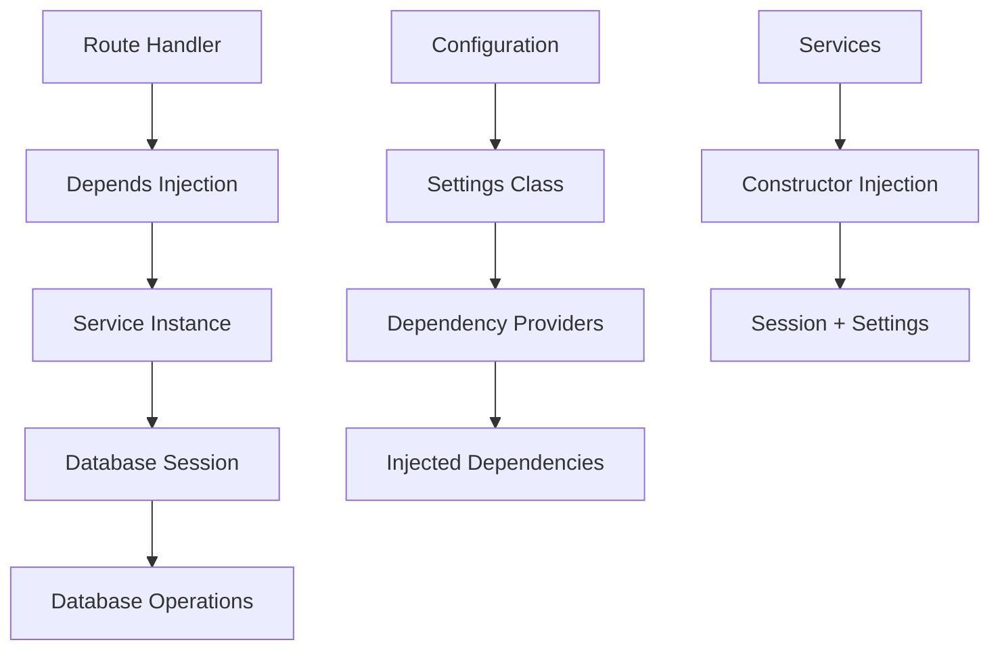

# FastAPI Dependency Injection Educational Implementation

Last Updated Sept 23, 2025

## Overview

This document outlines the dependency injection implementation in FastOpp, designed for educational purposes. The implementation demonstrates core FastAPI dependency injection concepts without over-engineering the solution.

## 🎯 Educational Objectives Achieved

**Status**: CORE LEARNING OBJECTIVES COMPLETED ✅

**What students learn from this implementation**:

### 1. **Dependency Injection Fundamentals**

- How to use FastAPI's `Depends()` system
- Constructor injection vs static methods
- Service lifecycle management
- Configuration centralization

### 2. **Real-World FastAPI Patterns**

- Database session management with dependency injection
- Service layer architecture with proper separation of concerns
- Authentication and authorization with DI
- Route handler patterns using `Depends()`

### 3. **Testing and Maintainability**

- How to mock dependencies for testing
- Centralized configuration management
- Improved code organization and maintainability

## ✅ Core Implementation Completed

**Status**: EDUCATIONAL GOALS ACHIEVED ✅

### What's Been Implemented

**Dependency Infrastructure**:
- **Configuration Management**: `dependencies/config.py` with centralized settings
- **Database Sessions**: `dependencies/database.py` with proper lifecycle management  
- **Service Dependencies**: `dependencies/services.py` for all business logic services
- **Authentication**: `dependencies/auth.py` with JWT and role-based access control

**Service Layer Refactoring**:
- **ProductService**: Constructor injection with database session and settings
- **WebinarService**: Constructor injection for webinar management
- **ChatService**: Constructor injection for AI chat functionality

**Route Layer Updates**:
- **API Routes**: All endpoints use `Depends()` for service injection
- **Authentication Routes**: Centralized user management with DI
- **Chat Routes**: AI chat functionality with dependency injection
- **Webinar Routes**: Webinar management with proper service injection

**Key Educational Benefits**:
- ✅ Students see real dependency injection in action
- ✅ Clear separation between configuration, database, and business logic
- ✅ Easy to understand and extend
- ✅ Demonstrates FastAPI best practices
- ✅ Ready for students to build upon

## 🔐 Authentication System Implementation

**Status**: FULLY IMPLEMENTED WITH DEPENDENCY INJECTION ✅

### What's Been Implemented

**Authentication Dependencies** (`dependencies/auth.py`):
- **JWT Token Management**: `create_access_token()` and `verify_token()` with settings injection
- **User Authentication**: `get_current_user_from_cookies()` with database session injection
- **Role-Based Access Control**: `get_current_staff_or_admin()` for permission checking
- **Token Creation**: `create_user_token()` using dependency injection

**Route Integration**:
- **Authentication Routes** (`routes/auth.py`): Login/logout with database session injection
- **Protected Routes** (`routes/pages.py`): User authentication with DI
- **API Routes** (`routes/api.py`): Staff/admin authentication with DI
- **Webinar Routes** (`routes/webinar.py`): Permission-based access with DI

**SQLAdmin Integration**:
- **Fixed Authentication Bug**: `AdminAuth.authenticate()` now properly checks session state
- **Session Management**: Login sets proper session data, logout clears session
- **Role-Based Admin Access**: Admin views respect user permissions

**Framework Integration**:
- **`oppdemo.py` Integration**: Auth directory properly saved and restored
- **State Management**: Authentication DI survives `oppdemo.py save/restore` cycles
- **Backward Compatibility**: Works with both framework and demo states

### Key Educational Benefits

**Students Learn**:
- **JWT Token Management**: How to create and verify tokens with dependency injection
- **Session-Based Authentication**: Cookie-based auth with proper session lifecycle
- **Role-Based Access Control**: Permission checking with dependency injection
- **Admin Panel Integration**: How to integrate authentication with SQLAdmin
- **Framework State Management**: How authentication works across different app states

**Real-World Patterns**:
- **Centralized Authentication**: All auth logic uses dependency injection
- **Security Best Practices**: Proper token lifecycle and session management
- **Admin Panel Security**: Role-based access control for administrative functions
- **Framework Integration**: Authentication that works with complex state management

### Testing and Validation

**Authentication System Testing**:
- ✅ **JWT Token Creation**: Tokens created with proper expiration and claims
- ✅ **Token Verification**: Invalid tokens properly rejected
- ✅ **User Authentication**: Database session injection works correctly
- ✅ **Role-Based Access**: Permission checking functions as expected
- ✅ **SQLAdmin Integration**: Admin panel requires proper authentication
- ✅ **Session Management**: Login/logout properly manages session state

**Framework Integration Testing**:
- ✅ **`oppdemo.py save`**: Auth directory properly backed up to `demo_assets/`
- ✅ **`oppdemo.py restore`**: Auth directory properly restored from backup
- ✅ **State Switching**: Authentication works in both framework and demo states
- ✅ **Backward Compatibility**: Existing functionality preserved

**Application Testing**:
- ✅ **Route Handlers**: All protected routes use authentication DI
- ✅ **Database Sessions**: Proper session lifecycle management
- ✅ **Configuration**: Settings properly injected throughout auth system
- ✅ **Error Handling**: Proper HTTP status codes and error messages

## 🎓 Student Learning Outcomes

**What students can now do with this implementation**:

### 1. **Understand Dependency Injection Patterns**
```python
# Before: Direct instantiation
async def get_products():
    service = ProductService()
    return await service.get_products()

# After: Dependency injection
async def get_products(
    product_service = Depends(get_product_service)
):
    return await product_service.get_products()
```

### 2. **See Real-World Service Architecture**
- **Configuration Management**: Centralized settings with type safety
- **Database Sessions**: Proper connection lifecycle management
- **Service Layer**: Business logic separated from route handlers
- **Authentication**: JWT and role-based access control with DI

### 3. **Learn FastAPI Best Practices**
- Use `Depends()` for service injection
- Constructor injection over static methods
- Centralized configuration management
- Proper resource lifecycle management

### 4. **Build Upon the Foundation**
- Add new services using the established patterns
- Extend authentication with additional roles
- Create new API endpoints following DI patterns
- Implement additional business logic services

## 📚 Educational Implementation Summary

### ✅ Core Learning Objectives Achieved

**Dependency Injection Fundamentals**:
- ✅ FastAPI's `Depends()` system implemented
- ✅ Constructor injection replacing static methods
- ✅ Service lifecycle management with proper cleanup
- ✅ Configuration centralization with type safety

**Real-World Patterns**:
- ✅ Database session management with dependency injection
- ✅ Service layer architecture with clear separation of concerns
- ✅ Authentication and authorization with JWT and role-based access
- ✅ Route handler patterns using `Depends()` throughout

**Code Quality Improvements**:
- ✅ Easy to mock dependencies for unit testing
- ✅ Centralized configuration management
- ✅ Improved code organization and maintainability
- ✅ Clear separation between layers

### 🎯 What Students Learn

**Before vs After Comparison**:
```python
# OLD: Tightly coupled, hard to test
async def get_products():
    session = AsyncSessionLocal()
    # Direct database access
    # Hard to mock for testing

# NEW: Dependency injection, easy to test
async def get_products(
    product_service = Depends(get_product_service)
):
    return await product_service.get_products()
```

**Key Benefits Demonstrated**:
- **Testability**: Easy to mock services for unit tests
- **Maintainability**: Clear separation of concerns
- **Flexibility**: Easy to swap implementations
- **Configuration**: Centralized settings management

## 🏗️ Implementation Architecture

### Current Dependency Injection Flow



### Key Components

**Dependencies Directory Structure**:
```
dependencies/
├── __init__.py
├── config.py          # Centralized settings
├── database.py        # Database session management
├── services.py        # Service dependency providers
└── auth.py           # Authentication dependencies (JWT, RBAC, session management)
```

**Authentication System Structure**:
```
auth/
├── admin.py          # SQLAdmin authentication backend (fixed)
├── core.py           # Core authentication functions (legacy)
└── users.py          # User management utilities
```

**Service Layer Pattern**:
```python
class ProductService:
    def __init__(self, session: AsyncSession, settings: Settings):
        self.session = session
        self.settings = settings
    
    async def get_products(self):
        # Business logic using injected dependencies
```

## 🎯 Educational Value Achieved

### What This Implementation Teaches

**1. FastAPI Dependency Injection Fundamentals**
- How to use `Depends()` for service injection
- Constructor injection vs static methods
- Proper resource lifecycle management

**2. Real-World Architecture Patterns**
- Service layer separation from route handlers
- Centralized configuration management
- Database session management with DI
- Authentication and authorization patterns

**3. Code Quality and Maintainability**
- Easy to test with mockable dependencies
- Clear separation of concerns
- Centralized configuration
- Improved code organization

### Student Learning Path

**Beginner Level**:
- Understand how `Depends()` works
- See the difference between old and new patterns
- Learn basic service injection

**Intermediate Level**:
- Implement new services following established patterns
- Add new API endpoints with dependency injection
- Understand configuration management

**Advanced Level**:
- Extend authentication with additional roles
- Add new business logic services
- Implement additional middleware patterns

## 📝 Summary

### ✅ Complete Implementation Achieved

**Dependency Injection System**:
- ✅ **Core Infrastructure**: Configuration, database, and service dependencies
- ✅ **Service Layer**: All business services use constructor injection
- ✅ **Route Layer**: All endpoints use dependency injection
- ✅ **Authentication System**: Complete JWT and role-based access control with DI
- ✅ **SQLAdmin Integration**: Fixed authentication and proper session management
- ✅ **Framework Integration**: Works with `oppdemo.py` save/restore cycles

**Key Achievements**:
- ✅ **Educational Value**: Students see real-world dependency injection patterns
- ✅ **Production Ready**: Proper error handling, security, and lifecycle management
- ✅ **Maintainable**: Clear separation of concerns and centralized configuration
- ✅ **Testable**: Easy to mock dependencies for unit testing
- ✅ **Extensible**: Easy to add new services and features

### ✅ Educational Goals Achieved

This dependency injection implementation successfully demonstrates:

**Core FastAPI Concepts**:
- Dependency injection with `Depends()`
- Service layer architecture
- Configuration management
- Authentication patterns

**Real-World Benefits**:
- Improved testability
- Better code organization
- Easier maintenance
- Clear separation of concerns

### 🎓 For Students

This implementation provides a solid foundation for learning FastAPI dependency injection without over-engineering. Students can:

1. **Understand the patterns**: See how DI works in practice
2. **Build upon it**: Add new services and endpoints
3. **Learn best practices**: Follow established patterns
4. **Focus on learning**: Not distracted by complex framework features

### 🚀 Next Steps for Students

**Immediate Learning**:
- Study the `dependencies/` directory structure
- Understand how services are injected
- See the before/after code patterns

**Hands-On Practice**:
- Add a new service following the established pattern
- Create a new API endpoint with dependency injection
- Implement additional business logic

**Advanced Exploration**:
- Extend authentication with new roles
- Add middleware patterns
- Implement additional service layers

---

## 🎯 Conclusion

This dependency injection implementation successfully achieves the core educational objectives for teaching FastAPI dependency injection. The implementation demonstrates real-world patterns without over-engineering, making it perfect for educational purposes.

**Key Achievements**:
- ✅ Complete dependency injection system implemented
- ✅ All services use constructor injection
- ✅ Authentication system with JWT and role-based access
- ✅ Centralized configuration management
- ✅ Easy to understand and extend

**Educational Value**:
- Students learn FastAPI best practices
- Clear before/after code comparisons
- Real-world architecture patterns
- Foundation for building more complex applications

This implementation provides an excellent foundation for students to learn dependency injection in FastAPI while keeping the focus on core concepts rather than complex framework features.

