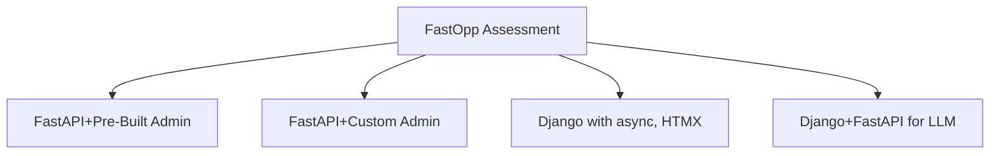

# FastOpp Assessment versus Django

The project is designed for developers
to assess FastAPI functionality.

The pre-built admin tools for FastAPI may not end up being popular for FastAPI developers.

After building applications with pre-built admin components, developers
may eventually move from pre-built components to building
our own admin tools.

The tools could be a step in the process to evaluate FastAPI
or where Oppkey ends up.

**Recent Improvement**: The codebase has been refactored to follow a Model-View-Service (MVS) architecture, improving maintainability and separation of concerns. See [Architecture Overview](docs/ARCHITECTURE.md) for details.

## 🎯 Evaluation Focus

This setup allows your team to quickly evaluate:

1. **FastAPI Admin Interface** - Compare with Django Admin
2. **Authentication System** - JWT + Session-based auth plus FastAPI Users' PasswordHelper
3. **Database Management** - [SQLModel](https://sqlmodel.tiangolo.com/) + [Alembic migrations](https://alembic.sqlalchemy.org/en/latest/)
4. **User Management** - [FastAPI Users](https://fastapi-users.github.io/fastapi-users/latest/)
5. **Development Experience** - Environment variables, management commands
6. **Production Readiness** - PostgreSQL, Gunicorn, environment config

The goal is to assess whether FastAPI + pre-built admin tools can provide a Django-like development experience for your developer team.

### Do With Admin Panel

| Create, Update, Delete, Users | Yes | Verify only admin can delete users |
| Add new record to existing model | Yes | Delete, new, edit  |

### Do With Code Editor

| Usable Functionality | Database Test | Minimum Functionality |
| -- | -- | -- |
| Create new database model for different data |  Access through SQL Admin | On your own project, create new model in Python code. migrate. access data in new page and admin panel |
| Create new page for design testing. Basic with tailwind, HTMX, Alpine.  | Do not use database | On your own project, add new page to `templates`. Connect to site. Must look good |
| Create new Page for data access.  Does not need to look good.  | Code must pass data to page | On your own project, add new page to `templates`. Connect to site. |

#### Don't

| Functionality Not Covered | Plan For Next Project | Technology Plan|
| -- | -- | -- |
| real-time status updates in colored bubbles | Yes |  SSE |
| streaming data from LLM | Yes | LLM stream |
| chat box | Yes | LLM |
| assign long-running task and do something else | Yes | Simulated delay with sleep |
| React or Flutter with API endpoint | No | Refactor logic code to support both API and template access |
