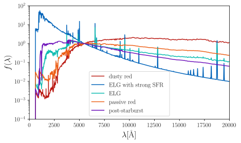
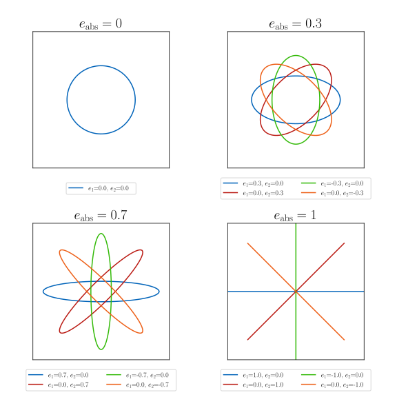

=================================================
Phenomenologial GalSBI: Overview of the model
=================================================

In this tutorial, we will give an overview of the phenomenological galaxy population
model that is used in the `galsbi` package.
It will explain how galaxy catalogs are generated and how the model can be customized.
Generally, we assume that galaxies are split into two populations:
star-forming (or blue) galaxies and quiescent (or red) galaxies.

--------------------
Luminosity Functions
--------------------

The first step in generating a galaxy catalog is to define the luminosity function for
each galaxy population as a function of redshift.
We use two independent Schechter functions for both populations parametrized by the following parameters:

.. math::

    \phi(z, M) = \frac{2}{5} \ln(10) \phi^*(z) 10^{\frac{2}{5} (M^*(z) - M)(\alpha+1)} \exp\left(-10^{\frac{2}{5}\left(M^*\left(z\right)-M\right)}\right),

where the parameter :math:`\alpha` can be defined in galsbi with ``lum_fct_alpha_blue`` and ``lum_fct_alpha_red``.
For :math:`M^*(z)` and :math:`\phi^*(z)`, GalSBI offers the following parametrizations:

- lum_fct_parametrization = "linexp":
    .. math::

        M^*(z) = M^*_1 + M^*_2 z, \phi^*(z) = \phi^*_1 + \exp(\phi^*_2 z),

- luminosity_function_parametrization = "logpower":
    .. math::

        M^*(z) = M^*_1 + M^*_2 \log(1+z), \phi^*(z) = \phi^*_1 (1+z)^{\phi_2^*},

- luminosity_function_parametrization = "truncated_logexp":
    .. math::

        \phi^*(z) = \phi^*_1 \exp(\phi^*_2 z), \quad
        M^*(z) =
        \begin{cases}
            M^*_1 + M^*_2 \log(1+z) & \text{if } z < z_0 \\
            M^*_1 + M^*_2 \log(1+z_0) & \text{if } z \geq z_0
        \end{cases}

The parameters :math:`M^*_1`, :math:`M^*_2`, :math:`\phi^*_1`, :math:`\phi^*_2`, and :math:`z_0` can be defined using the following names:

- :math:`M^*_1`: ``lum_fct_m_star_blue_intcpt`` and ``lum_fct_m_star_red_intcpt``
- :math:`M^*_2`: ``lum_fct_m_star_blue_slope`` and ``lum_fct_m_star_red_slope``
- :math:`\phi^*_1`: ``lum_fct_phi_star_blue_amp`` and ``lum_fct_phi_star_red_amp``
- :math:`\phi^*_2`: ``lum_fct_phi_star_blue_exp`` and ``lum_fct_phi_star_red_exp``
- :math:`z_0`: ``lum_fct_z_const_blue`` and ``lum_fct_z_const_red``

Sampling galaxies from the luminosity function creates a catalog of galaxies with redshifts and absolute magnitude.
Changing the parameters of the luminosity function therefore changes the **number of galaxies**, the **redshift** distribution and the
**magnitude** distribution.
The impact of the different parameters on the luminosity function is illustrated in the interactive figure below.

.. raw:: html

   <iframe src="https://cosmo-docs.phys.ethz.ch/galsbi-dash/run-dash-lumfunc" width=900 height=1500 style="border: 1px solid #aaa;"></iframe>

This figure shows the luminosity function for star-forming galaxies (blue) and quiescent galaxies (red) for different redshifts and
a simulated HSC deep field images generated with these luminosity functions (with the other parameters following the posterior from Fischbacher+2024).
The sliders allow you to change the parameters of the luminosity function and see how the galaxy population and the images change.
Since deep fields are typically dominated by blue galaxies, the impact of changing the parameters is more pronounced for the blue galaxy population.
Intuitively, :math:`M^*_1` controls the knee of the luminosity function at redshift 0 and :math:`M^*_2` controls the evolution of the knee with redshift.
:math:`\phi^*_1` controls the amplitude of the luminosity function at redshift 0 and :math:`\phi^*_2` controls the evolution of the amplitude with redshift.
And :math:`\alpha` controls the slope of the luminosity function at the faint end.

--------------
Galaxy Spectra
--------------

In a next step, we assign a spectrum to each galaxy.
Given the spectrum and the redshift, the **apparent magnitude** in each filter band can be computed
by integrating the redshifted spectrum over the filter throughput.
The spectra are assigned as a linear combination of the kcorrect template from Blanton and Roweis (2007),
see the figure below.

The template coefficients describe the relative contribution of each template to the galaxy spectrum.
After defining the spectra, it is rescaled to match the absolute magnitude of the galaxy.
Since only the relative contribution of the templates is important, the sum of these coefficients can be set to 1.
This is exactly the support of a Dirichlet distribution with the number of components equal to the number of templates.
The standard Dirichlet distribution of order 5 is parametrized by the concentration parameter :math:`\alpha=(\alpha_1, \ldots, \alpha_5)`.
The concentration parameters are sampled at redshift 0 and and at a redshift defined by ``template_coeff_z1_blue`` and ``template_coeff_z1_red``.
Redshifts in between are interpolated by

.. math::

    \alpha_i (z) = \left(\alpha_{i,z=0}\right)^{1-\frac{z}{z_1}} \times \left(\alpha_{i,z=z_1}\right)^{\frac{z}{z_1}}.

The concentration parameters can be defined by the following names:

- ``template_coeff_alpha0_blue_i`` and ``template_coeff_alpha0_red_i`` for :math:`\alpha_{i,z=0}` with :math:`i=1, \ldots, 5`
- ``template_coeff_alpha1_blue_i`` and ``template_coeff_alpha1_red_i`` for :math:`\alpha_{i,z=z_1}` with :math:`i=1, \ldots, 5`

GalSBI offers different parametrizations of the Dirichlet distribution:

- template_coeff_sampler = "dirichlet":
    This is the standard Dirichlet distribution with the concentration parameter :math:`\alpha`
    following the text book definition and was used in Herbel+2018.
- template_coeff_sampler = "dirichlet_alpha_mode":
    In this parameterization, the distribution is parametrized by the modes of each component and the standard deviation.
    Both mode and standard deviation are clearly defined for a Dirichlet distribution such that given
    the mode and standard deviation, the concentration parameter can be computed.
    The modes are still defined with the same GalSBI parameters as above.
    The standard deviation is defined by ``template_coeff_alpha0_std_blue`` and ``template_coeff_alpha1_std_blue``
    and for red correspondingly.
    This parametrization has the advantage that defining the distribution by its mode and
    standard deviation increases the interpretability of the parameters.

-----------------
Galaxy Morphology
-----------------

The last step in generating a galaxy catalog is to assign a morphological parameters to each galaxy.
This includes the size, the ellipticity, and the light profile.

Size
====

In GalSBI, we sample the the **half-light radius** :math:`r_{50}` from a lognormal distribution with
mean :math:`\mu_{\log r_{50}}(M)` and standard deviation :math:`\sigma_{\log r_{50}}(M)`, where both
mean and standard deviation can depend on the absolute magnitude :math:`M`.
The following parametrizations are currently available:

- logr50_sampling_method="single":
    In this parametrization, the standard deviation is constant across all magnitudes and
    defined by the parameter ``logr50_phys_std``.
    and the mean is parametrized as a linear function of the absolute magnitude with the following parameters:
    ``logr50_phys_mean_intcpt``, ``logr50_phys_mean_slope``

- logr50_sampling_method="red_blue":
    This parametrization is similar to the single parametrization but the parameters are
    different for red and blue galaxies. The parameters are:
    ``logr50_phys_mean_intcpt_blue``, ``logr50_phys_mean_slope_blue``, ``logr50_phys_std_blue``,
    ``logr50_phys_mean_intcpt_red``, ``logr50_phys_mean_slope_red``, ``logr50_phys_std_red``

- logr50_sampling_method="sdss_fit":
    This parametrization follows the fitting function Shen et al. (2003).
    It adds a non-linear dependence of the mean on the absolute magnitude for blue galaxies and
    a non-constant standard deviation.
    The mean and standard deviation are parametrized as follows:

    .. math::

        \begin{aligned}
            \mu_{\log r_{50}, \mathrm{red}}(M) &= -0.4 a_{\log r_{50}} M + b_{\log r_{50}}, \\
            \mu_{\log r_{50}, \mathrm{blue}}(M) &= -0.4 \alpha_{\log r_{50}} M + (\beta_{\log r_{50}}-\alpha_{\log r_{50}}) \log \left(1+10^{-0.4(M-M_0)}\right) + \gamma_{\log r_{50}}, \\
            \sigma_{\log r_{50}}(M) &= \sigma_{2, \log r_{50}} + \frac{\left(\sigma_{1, \log r_{50}}-\sigma_{2, \log r_{50}}\right)}{1+ 10^{-0.8(M-M_0)}},
        \end{aligned}

    The parameters in GalSBI are ``logr50_sdss_fit_sigma1_blue``, ``logr50_sdss_fit_sigma2_blue``,
    ``logr50_sdss_fit_M0_blue``, ``logr50_sdss_fit_alpha_blue``, ``logr50_sdss_fit_beta_blue``,
    ``logr50_sdss_fit_gamma_blue`` for blue galaxies and
    ``logr50_sdss_fit_sigma1_red``, ``logr50_sdss_fit_sigma2_red``,
    ``logr50_sdss_fit_M0_red``, ``logr50_sdss_fit_a_red``, ``logr50_sdss_fit_b_red`` for red galaxies.

Furthermore, GalSBI includes a parametrization of the size evolution with redshift.
For this the sampled size is rescaled by a factor :math:`(1+z)^{\alpha_{r_{50}}}`.
The parameter :math:`\alpha_{r_{50}}` can be defined by ``logr50_alpha`` for the single and
by ``logr50_alpha_blue`` and ``logr50_alpha_red`` for the other two parametrizations.

An interactive figure showing the impact of the different parameters of the sdss_fit parametrization is shown below
including the redshift evolution of the size (with the parameter called eta to avoid confusion with the alpha parameter).
Because we increase the half-light radius of the galaxies but keep the magnitude fixed, the galaxies become fainter
when the size increases.
At the same time, decreasing the size makes the galaxies more compact and more round as soon
as the size is comparable to the PSF.
The plot also highlights that changing some of these parameters,
although the varied ranges exceed the posterior distribution of these parameters dramatically,
lead to changes in the image that are barely visible by eye.
This demonstrates how sophistacted the inference of these parameters has to be.

.. raw:: html

    <iframe src="https://cosmo-docs.phys.ethz.ch/galsbi-dash/run-dash-size" width=900 height=1500 style="border: 1px solid #aaa;"></iframe>

Ellipticity
===========

The **ellipticity** of a galaxy is defined as a complex number :math:`e = e_1 + i e_2`.
The magnitude of the ellipticity (typically called absolute ellipticity) is defined as
:math:`e_\mathrm{abs}= \sqrt{e_1^2 + e_2^2}`.
The shape of a galaxy for different ellipticities is shown in the figure below.

To sample the ellipticity, GalSBI offers the following parametrizations:

- ellipticity_sampling_method="gaussian":
    In this parametrization, the ellipticity is sampled from a gaussian distribution with mean
    and standard deviation parametrized by ``e1_mean``, ``e1_sigma``, ``e2_mean``, ``e2_sigma``.
    It is made sure that the absolute ellipticity is smaller than 1.

- ellipticity_sampling_method="blue_red":
    Same as the default parametrization but the parameters are different for blue and red galaxies.
    The parameters are ``e1_mean_blue``, ``e1_sigma_blue``, ``e2_mean_blue``, ``e2_sigma_blue``,
    ``e1_mean_red``, ``e1_sigma_red``, ``e2_mean_red``, ``e2_sigma_red``.

- ellipticity_sampling_method="blue_red_miller2013":
    This parametrization follows the parametrization of Miller et al. (2013), see Equation B2 and B3.
    The blue galaxies are sampled from the following distribution:

    .. math::
        p(e_\mathrm{abs}) =
        \frac{e_\mathrm{abs}^\alpha \left(1 - \exp\left(
        \frac{e_\mathrm{abs}-e_\mathrm{max}}{\log(a)}
        \right)\right)}
        {\sqrt{(1+e_\mathrm{abs})(e_\mathrm{max}^2 + e_\mathrm{min}^2)}}.

    with :math:`e_\mathrm{max} = 0.8` and the other parameters can be defined using
    ``ell_disc_log_a`` for :math:`\log(a)`, ``ell_disc_pow_alpha`` for :math:`\alpha` and ``ell_disc_min_e`` for :math:`e_\mathrm{min}`.

    The red galaxies are sampled from the following distribution:

    .. math::
        p(e_\mathrm{abs}) = e_\mathrm{abs} \exp\left(-b e_\mathrm{abs} - c e_\mathrm{abs}^2\right)

    with the parameters ``ell_bulge_b`` for :math:`b` and :math:`c=6.691`.

    After sampling the absolute ellipticity, the phase is sampled uniformly between 0 and 2pi
    and the complex ellipticity is converted to the real and imaginary part :math:`e_1` and :math:`e_2`.

- ellipticity_sampling_method="beta_ratio":
    This parametrization samples the absolute ellipticity from a beta distribution which is
    bounded between 0 and 1 and is parametrized by two shape parameters :math:`\alpha` and :math:`\beta`.
    The parameters are ``ell_beta_ab_ratio`` and ``ell_beta_ab_sum`` where the ratio is
    computed as :math:`\alpha / (\alpha + \beta)` and the sum as :math:`\alpha + \beta`.
    For all ellipticity methods based on the beta distribution, there is also an additional parameter
    ``ell_beta_emax`` which defines the maximum value of the ellipticity.

- ellipticity_sampling_method="beta_mode":
    This parametrization samples the absolute ellipticity from a beta distribution using two parameters
    ``ell_beta_ab_sum`` and ``ell_beta_ab_mode``.
    The sum is the same as in the beta_ratio parametrization and the mode is definded as :math:`\frac{\alpha-1}{\alpha+\beta-2}`.

- ellipticity_sampling_method="beta_mode_red_blue":
    Same as the beta_mode parametrization but the parameters are different for blue and red galaxies.
    The parameters are ``ell_beta_ab_sum_blue``, ``ell_beta_ab_mode_blue``, ``ell_beta_ab_sum_red``, ``ell_beta_ab_mode_red``.

Light Profile
=============

The **light profile** of galaxies is defined by the Sersic profile:

.. math::

    I(R) = I_0 \exp\left(-b_n \left(\left(\frac{R}{R_e}\right)^{1/n} - 1\right)\right),

where :math:`I_0` is the intensity at the center, :math:`R_e` is the effective radius, :math:`n` is the Sersic index, and :math:`b_n` is a constant that depends on :math:`n`.
GalSBI offers the following parametrizations for the Sersic profile:

- sersic_sampling_method="berge":
    In this parametrization, the Sersic index is sampled from the distribution proposed by Berge et al. (2013),
    see Appendix A.1.
    It defines two distributions, one for the bright galaxies and one for the faint galaxies.
    The bright sample is sampled from two lognormal distributions with the following parameters:
    ``sersic_n_mean_1_hi``, ``sersic_n_sigma_1_hi``, ``sersic_n_mean_2_hi``, ``sersic_n_sigma_2_hi``.
    The faint sample is based on one lognormal distribution with the following parameters:
    ``sersic_n_mean_low``, ``sersic_n_sigma_low``.
    All the distributions are offset by the parameter ``sersic_n_offset``.

- sersic_sampling_method="blue_red_fixed":
    In this parametrization, the Sersic index is fixed to the values ``sersic_index_blue`` and ``sersic_index_red`` for blue and red galaxies, respectively.

- sersic_sampling_method="single":
    In this parametrization, the Sersic index is fixed to the value ``sersic_single_value``.

- sersic_sampling_method="blue_red_betaprime":
    In this parametrization, the Sersic index is sampled from a beta prime distribution.
    The parameters are ``sersic_betaprime_blue_mode``, ``sersic_betaprime_blue_size`` and ``sersic_betaprime_blue_mode_alpha``
    (and correspondingly for red galaxies).
    The size relates directly to the classical beta parameter :math:`\beta` of the beta prime distribution.
    The mode characterizes the peak of the distribution at redshift 0 and
    the mode alpha characterizes the redshift evolution of the mode.
    The traditional :math:`\alpha` parameter of the beta prime distribution is therefore

    .. math::

        \alpha = \text{mode} \times (1+z)^{\text{mode_alpha}} (\beta + 1) + 1.

The impact of the different parameters for ``the blue_red_betaprime`` parametrization is illustrated in the interactive figure below.

.. raw:: html

    <iframe src="https://cosmo-docs.phys.ethz.ch/galsbi-dash/run-dash-sersic" width=900 height=900 style="border: 1px solid #aaa;"></iframe>

-----------------------------------------------------------------------------------------
Do I need to set all these configurations and parameters when using the `galsbi` package?
-----------------------------------------------------------------------------------------

No, if a specific model is passed to the `GalSBI` class, all the configurations and parameter values
are set automatically based on the model.
For example, the following code snippet will

.. code-block:: python

    from galsbi import GalSBI
    model = GalSBI(model="Fischbacher+24", model_index=96)

sets all the parametrizations based on the fiducial model of Fischbacher et al. (2024)
and sets all the parameter values to the 96th sample of the posterior distribution.

----------
References
----------

GalSBI is based on the following papers:

- Fischbacher et al. (2024): `GalSBI: Phenomenological galaxy population model for cosmology using simulation-based inference <https://arxiv.org/abs/2412.08701>`_
- Moser et al. (2024): `Simulation-based inference of deep fields: galaxy population model and redshift distributions <http://arxiv.org/abs/2401.06846>`_
- Tortorelli et al. (2021): `The PAU Survey: Measurement of Narrow-band galaxy properties with Approximate Bayesian Computation <https://arxiv.org/abs/2106.02651v2>`_
- Tortorelli et al. (2020): `Measurement of the B-band Galaxy Luminosity Function with Approximate Bayesian Computation <https://arxiv.org/abs/2001.07727v2>`_
- Kacprzak et al. (2020): `Monte Carlo Control Loops for cosmic shear cosmology with DES Year 1 <http://arxiv.org/abs/1906.01018>`_
- Herbel et al. (2018): `The redshift distribution of cosmological samples: a forward modeling approach <http://arxiv.org/abs/1705.05386>`_

Further references used for the parametrizations are:

- Berge et al. (2013): `An Ultra Fast Image Generator (UFig) for wide-field astronomy <http://arxiv.org/abs/1209.1200>`_
- Miller et al. (2013): `Bayesian galaxy shape measurement for weak lensing surveys – III. Application to the Canada–France–Hawaii Telescope Lensing Survey <https://arxiv.org/abs/1210.8201>`_
- Blanton and Roweis (2007): `K-corrections and filter transformations in the ultraviolet, optical, and near infrared <http://arxiv.org/abs/astro-ph/0606170>`_
- Shen et al. (2003): `The size distribution of galaxies in the Sloan Digital Sky Survey <https://arxiv.org/abs/astro-ph/0301527>`_
