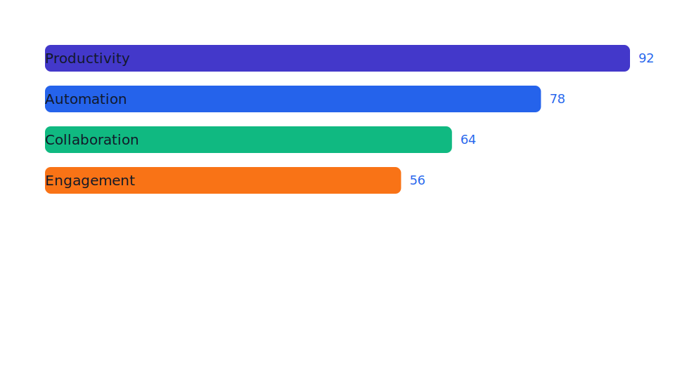
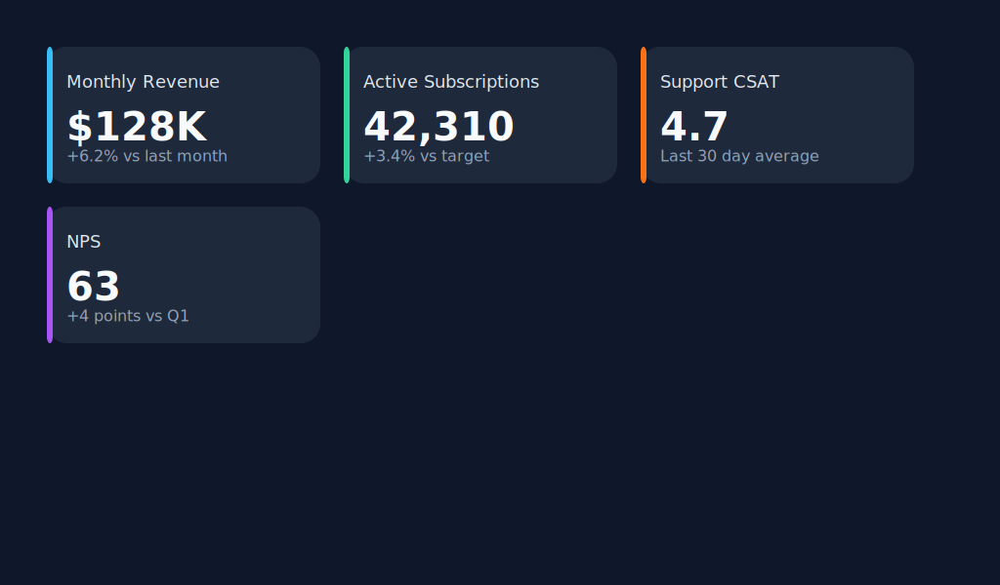
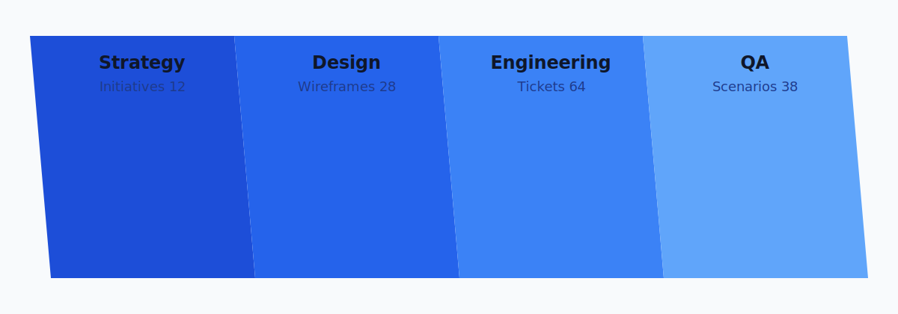
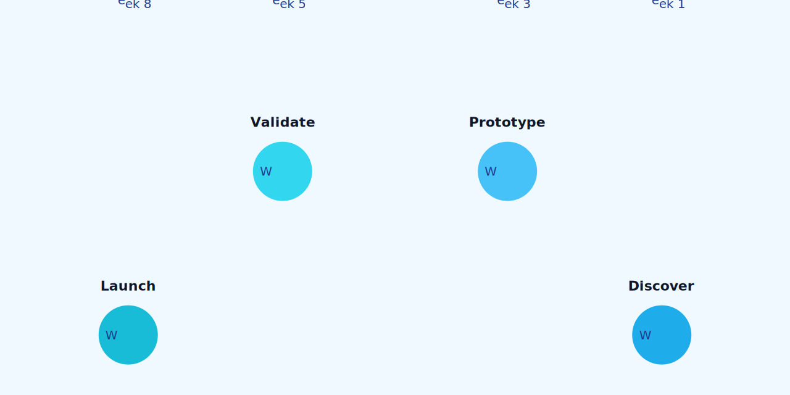
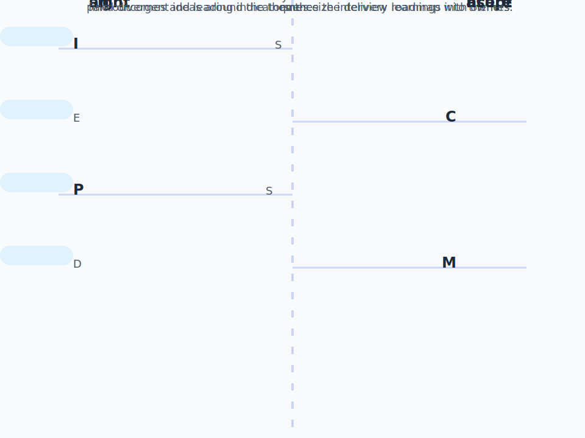
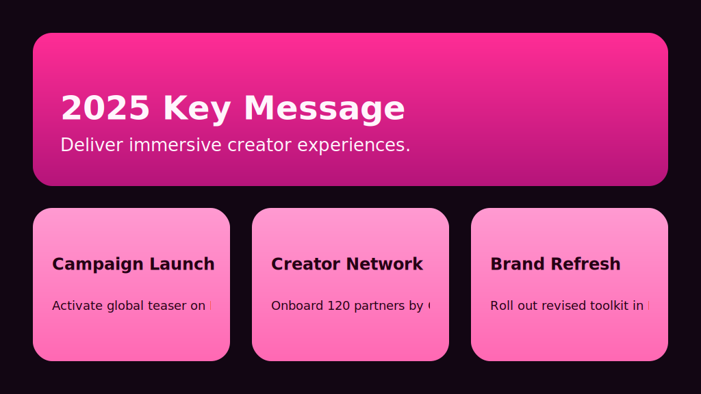

# Infogroove

Infogroove converts declarative template definitions into SVG infographics using
[sympy](https://www.sympy.org/) for formula evaluation and
[svg.py](https://pypi.org/project/svg.py/) for SVG generation.

## Quick Start

Create the virtual environment and install dependencies with uv:

```bash
uv sync
```

Render any of the bundled examples (each lives in its own subdirectory):

```bash
uv run infogroove -f examples/horizontal-bars/def.json -i examples/horizontal-bars/data.json -o examples/horizontal-bars/horizontal-bars.svg
uv run infogroove -f examples/stat-cards/def.json -i examples/stat-cards/data.json -o examples/stat-cards/stat-cards.svg
uv run infogroove -f examples/blue-parallelograms/def.json -i examples/blue-parallelograms/data.json -o examples/blue-parallelograms/blue-parallelograms.svg
uv run infogroove -f examples/arc-circles/def.json -i examples/arc-circles/data.json -o examples/arc-circles/arc-circles.svg
uv run infogroove -f examples/staggered-keywords/def.json -i examples/staggered-keywords/data.json -o examples/staggered-keywords/staggered-keywords.svg
```

## Running Tests

Install development dependencies and execute the test suite with pytest:

```bash
uv sync --extra dev
uv run --extra dev pytest
```

To measure coverage locally you can add the ``--cov`` flag:

```bash
uv run --extra dev pytest --cov=infogroove --cov=tests
```

## Example Gallery

| Template | Preview |
| --- | --- |
| Horizontal Bars |  |
| Stat Cards |  |
| Blue Parallelogram Bands |  |
| Arc Circles |  |
| Staggered Keywords |  |
| Key Messages |  |

## Template Overview

A template definition is a JSON document with these top-level keys:

- `variables`: Global constants available throughout rendering. Define
  `variables.canvas` with viewport `width` and `height`, plus any reusable
  values such as `palette`, `margin`, or `fontFamily`. Variables are exposed in
  the rendering context both under `variables` and as direct names, so a value
  declared as `variables.radius` is available as `{radius}`.
- `formulas` (optional): Named expressions evaluated with sympy. Results are
  merged into the rendering context for placeholder substitution. Skip the
  block entirely when inline expressions are sufficient.
- `elements`: A list of SVG element descriptors. Each descriptor has a `type`,
  attribute map, optional `text` content, and an optional `scope` (`canvas` or
  `item`). Canvas elements are rendered once; item elements repeat for each
  data record.
- `numElementsRange` (optional): Expected minimum and maximum number of data
  items.

Placeholder syntax supports both `{path.to.value}` lookups and inline Python
expressions such as `{index * 10}` or `{canvas.width / 2}`. Expressions are
evaluated inside the same safe context exposed to formulas (variables, data
fields, derived metrics, and formula results).

## CLI Options

```
uv run infogroove --help
```

Key flags:

- `-f, --template`: Path to the template definition JSON file (e.g. `def.json`).
- `-i, --input`: JSON file containing an array of data objects.
- `-o, --output`: Destination SVG path or `-` for stdout.

## Programmatic Usage

Infogroove exposes a loader for integrating templates directly into Python
applications:

```python
from infogroove.loader import load

with open("examples/arc-circles/def.json", encoding="utf-8") as fh:
    infographic = load(fh)

svg_markup = infographic.render([{"label": "Alpha", "value": 3}])
```

Prefer `infogroove.loader.load` for file objects and `infogroove.loader.loads`
when the template definition is already in memory as a string. Both helpers
return an `InfogrooveRenderer`, exposing the parsed template via the
`template` property for metadata inspection.

When you already have the JSON structure as a Python mapping, instantiate an
infographic directly with the `Infogroove` factory:

```python
from infogroove import Infogroove

infographic = Infogroove({
    "variables": {
        "canvas": {"width": 200, "height": 40},
        "gap": 10,
    },
    "formulas": {"x": "index * gap"},
    "elements": [
        {"type": "circle", "attributes": {"cx": "{x}", "cy": "20", "r": "5"}},
    ],
})

svg_inline = infographic.render([{}] * 10)
```

## Developing Templates

- Formulas can reference global values (`canvas.width`, `radius`),
  per-item fields (`value`, `label`), and derived metrics (`maxValue`,
  `averageValue`).
- Place reusable constants (including canvas dimensions) under `variables`.
- Provide `scope: "canvas"` for static backgrounds and decorations.
- Choose between inline expressions and formulas depending on reuse: inline
  placeholders handle quick math (`{index * 10}`), while formulas remain useful
  for shared or multi-step calculations.
