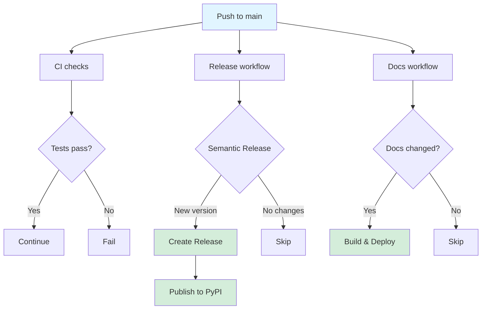

# GitHub Actions Workflows

This directory contains the CI/CD workflows for the Katana OpenAPI Client project.

## Workflows

### [ci.yml](ci.yml)

**Trigger:** Pull requests to `main` branch

**Purpose:** Continuous integration checks for pull requests

**Steps:**

- Install dependencies with uv
- Run full CI pipeline (`uv run poe ci`)
  - Format checking
  - Linting (ruff, mypy, yamllint)
  - Tests with coverage
  - OpenAPI validation

**Permissions:** `contents: read`

### [docs.yml](docs.yml)

**Trigger:**

- Push to `main` branch (when docs-related files change)
- Manual workflow dispatch

**Purpose:** Build and deploy documentation to GitHub Pages

**Steps:**

- Build MkDocs documentation
- Upload documentation artifacts
- Deploy to GitHub Pages

**Permissions:** `contents: read`, `pages: write`, `id-token: write`

**Note:** This workflow only runs when documentation files change (docs/\*\*,
mkdocs.yml, etc.) to avoid unnecessary builds.

### [release.yml](release.yml)

**Trigger:**

- Push to `main` branch
- Manual workflow dispatch

**Purpose:** Automated releases using semantic versioning

**Jobs:**

1. **test**: Run full CI pipeline
1. **release**: Create GitHub release and build package
   - Uses Python Semantic Release
   - Creates git tags and release notes
   - Builds distribution packages
1. **publish-pypi**: Publish to PyPI (only if release created)
   - Uses trusted publishing (OIDC)
   - Includes package attestations

**Permissions:**

- test: `contents: read`
- release: `contents: write`, `id-token: write`
- publish-pypi: `id-token: write`

**Note:** Documentation is now handled by the separate `docs.yml` workflow.

### [security.yml](security.yml)

**Trigger:** Weekly schedule (Sundays at 00:00 UTC)

**Purpose:** Security scanning and dependency audits

**Steps:**

- Dependency vulnerability scanning
- Code security analysis
- License compliance checks

**Permissions:** `contents: read`, `security-events: write`

### [copilot-setup-steps.yml](copilot-setup-steps.yml)

**Type:** Reusable workflow

**Purpose:** Common setup steps for GitHub Copilot integrations

**Provides:**

- Dependency installation
- Environment configuration
- Caching setup

## Workflow Orchestration



## Configuration

### Secrets Required

- `GITHUB_TOKEN` - Automatically provided by GitHub Actions
- PyPI publishing uses Trusted Publishers (no manual tokens needed)

### Environments

- **PyPI Release** - Protected environment for PyPI publishing
  - URL: https://pypi.org/p/katana-openapi-client
- **github-pages** - GitHub Pages deployment environment

### Branch Protection

- `main` branch requires:
  - CI checks to pass
  - Up-to-date branches
  - No direct pushes (PRs only)

## Local Testing

Test workflows locally using [act](https://github.com/nektos/act):

```bash
# Test CI workflow
act pull_request -W .github/workflows/ci.yml

# Test docs build (without deploy)
act workflow_dispatch -W .github/workflows/docs.yml

# Test release (dry-run)
act push -W .github/workflows/release.yml
```

## Maintenance

### Updating Actions

Keep actions up to date by:

1. Monitoring Dependabot alerts
1. Reviewing action changelogs
1. Testing in a branch before merging

### Adding New Workflows

When adding new workflows:

1. Create the workflow file
1. Update this README
1. Test locally with `act`
1. Create a PR for review
1. Update branch protection rules if needed

## Troubleshooting

### Common Issues

**Docs not deploying:**

- Check that `docs/**` files were actually changed
- Verify GitHub Pages is enabled in repository settings
- Check workflow logs for build errors

**Release not creating:**

- Ensure commits follow conventional commit format
- Check semantic-release configuration in `pyproject.toml`
- Review workflow logs for PSR errors

**PyPI publish failing:**

- Verify Trusted Publisher is configured in PyPI
- Check that release was actually created
- Review PyPI environment protection rules

### Debug Mode

Enable workflow debug logging:

```bash
# In repository settings > Secrets and variables > Actions
# Add repository secret:
ACTIONS_STEP_DEBUG=true
ACTIONS_RUNNER_DEBUG=true
```

## Links

- [GitHub Actions Documentation](https://docs.github.com/en/actions)
- [uv Documentation](https://docs.astral.sh/uv/)
- [Python Semantic Release](https://python-semantic-release.readthedocs.io/)
- [MkDocs](https://www.mkdocs.org/)
