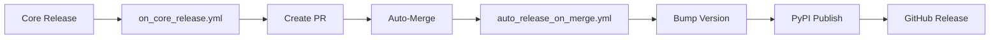

# GitHub Actions Workflows

## Overview

This directory contains CI/CD workflows for `market_data_pipeline`.

## Workflows

### dispatch_contracts.yml

**Purpose**: Cross-repo contract testing with `market-data-core`.

**Trigger**:
- Automatically: Triggered by `market-data-core` when Core contracts change
- Manually: Via GitHub Actions UI for testing

**What It Does**:
1. Installs a specific version of `market-data-core` (by ref)
2. Installs this project with dev dependencies
3. Runs contract tests in `tests/contracts/`
4. Reports pass/fail status

**Manual Execution**:
```bash
# Via GitHub UI:
1. Go to Actions → dispatch_contracts
2. Click "Run workflow"
3. Enter core_ref (e.g., "v1.1.0", "main", "abc123")
4. Click "Run workflow"
```

**Expected Behavior**:
- Duration: ~2 minutes
- Tests: 10 contract tests
- Result: ✅ All tests pass (if compatible)

**Troubleshooting**:
- If tests fail: Check Core version compatibility
- If workflow fails: Verify REPO_TOKEN secret exists
- If Core install fails: Check ref exists in market-data-core repo

---

### _contracts_reusable.yml

**Purpose**: Reusable workflow logic called by `dispatch_contracts.yml`.

**Internal Use Only**: Do not trigger directly.

**Parameters**:
- `core_ref` (required): Git ref of Core to test against

**Steps**:
1. Checkout pipeline code
2. Setup Python 3.11 with pip caching
3. Install market-data-core from git at specified ref
4. Install pipeline with dev dependencies
5. Run pytest on tests/contracts/

---

## Secrets

### REPO_TOKEN

**Required For**: dispatch_contracts.yml (when triggered by Core)

**Purpose**: Allows `market-data-core` repository to trigger workflows in this repo.

**Setup**:
1. Create GitHub Personal Access Token (PAT):
   - Settings → Developer settings → Personal access tokens → Fine-grained tokens
   - Name: `REPO_TOKEN`
   - Permissions: Actions (read/write), Contents (read), Workflows (read/write)
   - Expiration: 90 days
   
2. Add to this repository:
   - Repository → Settings → Secrets and variables → Actions
   - New repository secret: Name=`REPO_TOKEN`, Value=`ghp_...`

**Rotation**: PAT expires every 90 days. Set reminder to rotate.

---

## Local Testing

You can run contract tests locally without GitHub Actions:

```bash
# Install dev dependencies
pip install -e ".[dev]"

# Run contract tests
pytest tests/contracts/ -v

# Test against specific Core version
pip install "git+https://github.com/mjdevaccount/market-data-core.git@v1.1.0"
pytest tests/contracts/ -v
```

---

## Phase 8.0C Context

These workflows are part of **Phase 8.0C: Cross-Repo Orchestration**.

**Architecture**:
```
market-data-core (upstream)
    │
    ├─ contracts.yml (runs on PR)
    │       ↓ (success)
    └─ fanout.yml (triggers downstream)
            │
            ├─► market_data_pipeline (this repo)
            │   └─ dispatch_contracts.yml ← YOU ARE HERE
            │
            ├─► market-data-store
            │   └─ dispatch_contracts.yml
            │
            └─► market-data-orchestrator
                └─ dispatch_contracts.yml
```

**Goal**: Ensure all downstream repos remain compatible with Core contract changes.

---

## Support

For issues or questions:
- Check [PHASE_8.0C_VIABILITY_ASSESSMENT.md](../../PHASE_8.0C_VIABILITY_ASSESSMENT.md)
- Review Core docs: [Phase 8.0 Migration Guide](../../docs/PHASE_8.0_MIGRATION_GUIDE.md)
- Contact: Pipeline maintainers

---

# Automated Dependency Updates & Releases

## ✅ Complete Automation Chain

This repository has a fully automated workflow for handling Core dependency updates:



## 📋 Automation Workflows

### 1. `on_core_release.yml`
- **Trigger**: `workflow_dispatch` (manual) or `repository_dispatch` (from Core)
- **Actions**:
  - Updates `market-data-core` dependency in `pyproject.toml` and `requirements.txt`
  - Creates PR with automated labels
  - Enables auto-merge (squash)
- **Key**: Uses `REPO_TOKEN` (PAT) to allow workflow chaining

### 2. `auto_release_on_merge.yml`
- **Trigger**: Push to `base` when `pyproject.toml` changes
- **Actions**:
  - Bumps patch version (via `scripts/bump_version.sh`)
  - Creates git tag
  - Builds and publishes to PyPI
  - Creates GitHub Release with artifacts
- **Key**: Uses `PYPI_API_TOKEN` for PyPI uploads

## 🔐 Required Secrets

| Secret | Scope | Purpose |
|--------|-------|---------|
| `REPO_TOKEN` | repo, workflows | PAT for creating PRs that trigger other workflows |
| `PYPI_API_TOKEN` | N/A | Production PyPI upload token |

## 🚀 Testing the Automation

```bash
# Test with an existing Core version
gh workflow run on_core_release.yml --ref base -f version=1.2.12

# Expected:
# 1. PR created and merged
# 2. Version auto-bumped
# 3. Published to PyPI
# 4. GitHub Release created
```

## 🧠 Key Technical Details

### Why REPO_TOKEN instead of GITHUB_TOKEN?

GitHub security: workflows triggered by `GITHUB_TOKEN` cannot trigger other workflows. Using a PAT (`REPO_TOKEN`) allows the PR merge from `on_core_release.yml` to trigger `auto_release_on_merge.yml`.

### Version Bumping

The `scripts/bump_version.sh` script:
- Handles both GNU and BSD `sed` (cross-platform)
- Bumps patch version only (can be modified for minor/major)
- Robust error handling with `set -euo pipefail`
- Outputs only version number to stdout (for capture in workflows)

### Duplicate Tag Protection

The auto-release workflow checks for existing tags before creating new ones, preventing accidental overwrites or re-publishes.

## 📊 Monitoring

View workflow runs:
```bash
# List all workflow runs
gh run list --limit 10

# View specific workflow
gh workflow view on_core_release.yml

# Check auto-release runs
gh run list --workflow="Auto-Release on Core Dependency Update"
```

## ✅ Verification

After a successful run, verify:
```bash
# Check latest version
grep 'version = ' pyproject.toml

# Check dependency
grep 'market-data-core' pyproject.toml

# View latest release
gh release view --json tagName,publishedAt,url

# Check PyPI
# Visit https://pypi.org/project/market_data_pipeline/
```

