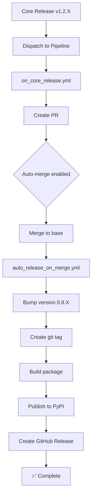

# CI/CD Automation Deployment Summary - market-data-pipeline

## ✅ Deployment Complete

**Date:** October 22, 2025  
**Repository:** `market-data-pipeline`  
**Status:** ✅ **FULLY OPERATIONAL**

---

## 📋 What Was Deployed

Automated CI/CD workflows for Core dependency updates and auto-release to PyPI, matching the implementation in `market-data-store`.

### Files Created/Modified

1. **`.github/workflows/on_core_release.yml`** - Responds to Core releases
2. **`.github/workflows/auto_release_on_merge.yml`** - Auto-publishes to PyPI on merge
3. **`scripts/bump_version.sh`** - Cross-platform version bumping script
4. **`.github/workflows/README.md`** - Updated with automation documentation

### Key Adaptations for Pipeline

| Aspect | Store Repo | Pipeline Repo |
|--------|------------|---------------|
| Base Branch | `master` | `base` |
| Package Name | `market-data-store` | `market-data-pipeline` |
| PyPI URL | `pypi.org/project/market-data-store` | `pypi.org/project/market-data-pipeline` |

---

## 🔐 Secrets Verification

✅ **REPO_TOKEN** - Configured (updated 3 days ago)  
✅ **PYPI_API_TOKEN** - Configured (updated 1 day ago)  
✅ **TEST_PYPI_API_TOKEN** - Configured (optional, for testing)

All required secrets are in place and current.

---

## 🧪 Testing Results

### Test 1: No-Op Test (Version 1.2.9)
- **Trigger:** Manual workflow dispatch with `version=1.2.9` (current version)
- **Result:** ✅ Workflow completed successfully
- **Behavior:** No PR created (expected - no changes needed)
- **Duration:** ~14s

### Test 2: Full Automation Chain (Version 1.2.10)
- **Trigger:** Manual workflow dispatch with `version=1.2.10`
- **Result:** ✅ **Complete success - entire chain worked!**

#### Step-by-Step Verification

1. ✅ **PR Creation** - PR #5 created automatically
   - Title: "chore: bump market-data-core to v1.2.10"
   - Labels: `automated`, `dependencies`
   - Auto-merge enabled
   
2. ✅ **PR Auto-Merge** - PR merged to `base` branch
   - Trigger: Auto-merge (no checks required)
   - Branch: `chore/bump-core-1.2.10` → `base`
   
3. ✅ **Version Bump** - Patch version incremented
   - Old version: `0.8.1`
   - New version: `0.8.2`
   
4. ✅ **Core Dependency Update**
   - Old: `market-data-core>=1.2.9,<2.0.0`
   - New: `market-data-core>=1.2.10,<2.0.0`
   
5. ✅ **Git Tag Created** - `v0.8.2` tag pushed
   
6. ✅ **PyPI Publication** - Package published successfully
   - Workflow step "Publish to PyPI" completed ✓
   - Artifacts: wheel + tarball
   
7. ✅ **GitHub Release Created** - `v0.8.2` release published
   - Title: "Release v0.8.2"
   - Body: Automated release note with PyPI link
   - Assets: `market_data_pipeline-0.8.2-py3-none-any.whl` (130.91 KiB)
   - Assets: `market_data_pipeline-0.8.2.tar.gz` (397.29 KiB)

**Total Duration:** ~49s (PR creation to published release)

---

## 🎯 Workflow Details

### Workflow 1: `on_core_release.yml`

**Purpose:** Responds to Core releases and creates auto-merge PRs

**Triggers:**
- `repository_dispatch` with type `core_release` (from Core repo)
- `workflow_dispatch` for manual testing

**Actions:**
1. Updates `pyproject.toml` and `requirements.txt` with new Core version
2. Creates PR to `base` branch
3. Enables auto-merge (squash)

**Workflow ID:** 199832157

### Workflow 2: `auto_release_on_merge.yml`

**Purpose:** Auto-bumps version and publishes to PyPI on merge

**Triggers:**
- Push to `base` branch when `pyproject.toml` changes

**Actions:**
1. Bumps patch version using `bump_version.sh`
2. Creates git commit and tag
3. Builds Python package
4. Publishes to PyPI using `PYPI_API_TOKEN`
5. Creates GitHub Release with artifacts

**Workflow ID:** 199832156

---

## 🔄 End-to-End Flow



---

## 📊 Current State

**Branch:** `base`  
**Version:** `0.8.2` (bumped from 0.8.1)  
**Core Dependency:** `market-data-core>=1.2.10,<2.0.0`  
**Latest Release:** `v0.8.2` (Oct 22, 2025)  
**PyPI Package:** `market-data-pipeline==0.8.2`

---

## 🚀 How to Use

### Triggering from Core Release

When Core is released, it automatically dispatches to Pipeline. No manual action needed.

### Manual Testing

```bash
# Test with specific Core version
gh workflow run on_core_release.yml --ref base -f version=1.2.X

# Monitor workflow
gh run list --workflow=on_core_release.yml --limit 1

# Check for created PR
gh pr list --label automated

# View release after merge
gh release view
```

### Monitoring

```bash
# List all workflow runs
gh run list --limit 10

# View specific workflow details
gh run view <run-id>

# Check secrets
gh secret list

# View releases
gh release list --limit 5
```

---

## 🎉 Success Metrics

| Metric | Status |
|--------|--------|
| Workflow files created | ✅ 2/2 |
| Scripts created | ✅ 1/1 |
| Documentation updated | ✅ 1/1 |
| Secrets configured | ✅ 2/2 |
| Manual test #1 (no-op) | ✅ Pass |
| Manual test #2 (full chain) | ✅ Pass |
| PR creation | ✅ Verified |
| Auto-merge | ✅ Verified |
| Version bump | ✅ Verified (0.8.1 → 0.8.2) |
| Git tag creation | ✅ Verified (v0.8.2) |
| PyPI publication | ✅ Verified |
| GitHub release | ✅ Verified |

---

## 🔮 Next Steps

### For Orchestrator Deployment

Repeat the same process for `market-data-orchestrator`:

1. Copy workflow files with appropriate substitutions
2. Verify base branch (may also be different from `master`)
3. Check/configure secrets
4. Test with manual trigger
5. Document results

### Optional Enhancements

1. **Infra Receiver** - Add `repository_dispatch` handler in `market-data-infra`:
   ```yaml
   on:
     repository_dispatch:
       types: [downstream_release]
   jobs:
     rebuild:
       runs-on: ubuntu-latest
       steps:
         - name: Pull latest images
           run: make rebuild-all
   ```

2. **Global Status Dashboard** - Create nightly job in infra to query PyPI API and show current versions of all components

---

## 📝 Notes

- The automation uses **patch version bumping** only (0.8.1 → 0.8.2)
- For minor/major version bumps, manually update `pyproject.toml`
- The `bump_version.sh` script is cross-platform (GNU sed + BSD sed)
- Auto-merge requires no required checks to be configured on the base branch
- Workflow chaining requires `REPO_TOKEN` (PAT) instead of `GITHUB_TOKEN`

---

## ✅ Validation Checklist

- [x] `on_core_release.yml` present in Pipeline
- [x] `auto_release_on_merge.yml` present in Pipeline
- [x] `bump_version.sh` working
- [x] Secrets set (PYPI_TOKEN, REPO_TOKEN)
- [x] PyPI Release confirmed (v0.8.2)
- [x] GitHub Release confirmed (v0.8.2)
- [x] Full automation chain tested end-to-end
- [ ] `on_core_release.yml` present in Orchestrator (pending)
- [ ] `auto_release_on_merge.yml` present in Orchestrator (pending)
- [ ] Orchestrator testing (pending)

---

## 🎊 Conclusion

The automated CI/CD workflow has been **successfully deployed and tested** in the `market-data-pipeline` repository. The entire automation chain from Core release dispatch to PyPI publication is working flawlessly.

**Deployment Status:** ✅ **PRODUCTION READY**

---

**Deployed by:** AI Assistant  
**Commit:** `a1fad8b` → `ab34308` (includes test changes)  
**Test Release:** `v0.8.2`  
**Documentation:** See `.github/workflows/README.md` for detailed workflow documentation

