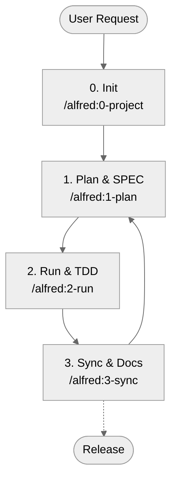

# MoAI-ADK (Agentic Development Kit)

[한국어](README.ko.md) | [English](README.md)

[](https://pypi.org/project/moai-adk/)
[](https://opensource.org/licenses/MIT)
[](https://www.python.org/)
[](https://github.com/modu-ai/moai-adk/actions/workflows/moai-gitflow.yml)
[](https://codecov.io/gh/modu-ai/moai-adk)
[](https://github.com/modu-ai/moai-adk)

> **MoAI-ADK delivers a seamless development workflow that naturally connects SPEC → TEST (TDD) → CODE → DOCUMENTATION with AI.**

---

## 1. MoAI-ADK at a Glance

MoAI-ADK transforms AI-powered development with three core principles. Use the navigation below to jump to the section that matches your needs.

If you're **new to MoAI-ADK**, start with "What is MoAI-ADK?".
If you want to **get started quickly**, jump straight to "5-Minute Quick Start".
If you've **already installed it and want to understand the concepts**, we recommend "5 Key Concepts".

| Question                           | Jump To                                                                  |
| ---------------------------------- | ------------------------------------------------------------------------ |
| First time here—what is it?        | [What is MoAI-ADK?](#what-is-moai-adk)                                   |
| How do I get started?              | [5-Minute Quick Start](#5-minute-quick-start)                            |
| What's the basic flow?             | [Core Workflow (0 → 3)](#core-workflow-0--3)                             |
| What do Plan/Run/Sync commands do? | [Command Cheat Sheet](#command-cheat-sheet)                              |
| What are SPEC, TDD, TAG?           | [5 Key Concepts](#5-key-concepts)                                        |
| Tell me about agents/Skills        | [Sub-agents & Skills Overview](#sub-agents--skills-overview)             |
| Want to dive deeper?               | [Additional Resources](#additional-resources)                            |

---

## What is MoAI-ADK?

### The Problem: Trust Crisis in AI Development

Today, countless developers want help from Claude or ChatGPT, but can't shake one fundamental doubt: **"Can I really trust the code this AI generates?"**

The reality looks like this. Ask an AI to "build a login feature" and you'll get syntactically perfect code. But these problems keep repeating:

- **Unclear Requirements**: The basic question "What exactly should we build?" remains unanswered. Email/password login? OAuth? 2FA? Everything relies on guessing.
- **Missing Tests**: Most AIs only test the "happy path". Wrong password? Network error? Three months later, bugs explode in production.
- **Documentation Drift**: Code gets modified but docs stay the same. The question "Why is this code here?" keeps repeating.
- **Context Loss**: Even within the same project, you have to explain everything from scratch each time. Project structure, decision rationale, previous attempts—nothing gets recorded.
- **Impact Tracking Impossible**: When requirements change, you can't track which code is affected.

### The Solution: SPEC-First TDD with Alfred SuperAgent

**MoAI-ADK** (MoAI Agentic Development Kit) is an open-source framework designed to **systematically solve** these problems.

The core principle is simple yet powerful:

> **"No tests without code, no SPEC without tests"**

More precisely, it's the reverse order:

> **"SPEC comes first. No tests without SPEC. No complete documentation without tests and code."**

When you follow this order, magical things happen:

**1️⃣ Clear Requirements**
Write SPECs first with the `/alfred:1-plan` command. A vague request like "login feature" transforms into **clear requirements** like "WHEN valid credentials are provided, the system SHALL issue a JWT token". Alfred's spec-builder uses EARS syntax to create professional SPECs in just 3 minutes.

**2️⃣ Test Guarantee**
`/alfred:2-run` automatically performs Test-Driven Development (TDD). It proceeds in RED (failing test) → GREEN (minimal implementation) → REFACTOR (cleanup) order, **guaranteeing 85%+ test coverage**. No more "testing later". Tests drive code creation.

**3️⃣ Automatic Documentation Sync**
A single `/alfred:3-sync` command **synchronizes** all code, tests, and documentation. README, CHANGELOG, API docs, and Living Documents all update automatically. Six months later, code and docs still match.

**4️⃣ Tracking with @TAG System**
Every piece of code, test, and documentation gets a `@TAG:ID`. When requirements change later, one command—`rg "@SPEC:EX-AUTH-001"`—**finds all related tests, implementations, and docs**. You gain confidence during refactoring.

**5️⃣ Alfred Remembers Context**
A team of AI agents collaborate to **remember** your project's structure, decision rationale, and work history. No need to repeat the same questions.

### MoAI-ADK's 3 Core Promises

For beginners to remember easily, MoAI-ADK's value simplifies to three things:

**First, SPEC comes before code**
Start by clearly defining what to build. Writing SPEC helps discover problems before implementation. Communication costs with teammates drop dramatically.

**Second, tests drive code (TDD)**
Write tests before implementation (RED). Implement minimally to pass tests (GREEN). Then clean up the code (REFACTOR). Result: fewer bugs, confidence in refactoring, code anyone can understand.

**Third, documentation and code always match**
One `/alfred:3-sync` command auto-updates all documentation. README, CHANGELOG, API docs, and Living Documents always sync with code. No more despair when modifying six-month-old code.

---

## Why Do You Need It?

### Real Challenges in AI Development

Modern AI-powered development faces various challenges. MoAI-ADK **systematically solves** all these problems:

| Concern                         | Traditional Approach Problem                       | MoAI-ADK Solution                                             |
| ------------------------------- | -------------------------------------------------- | ------------------------------------------------------------- |
| "Can't trust AI code"           | Implementation without tests, unclear verification | Enforces SPEC → TEST → CODE order, guarantees 85%+ coverage   |
| "Repeating same explanations"   | Context loss, unrecorded project history           | Alfred remembers everything, 19 AI team members collaborate   |
| "Hard to write prompts"         | Don't know how to write good prompts               | `/alfred` commands provide standardized prompts automatically |
| "Documentation always outdated" | Forget to update docs after code changes           | `/alfred:3-sync` auto-syncs with one command                  |
| "Don't know what changed where" | Hard to search code, unclear intent                | @TAG chain connects SPEC → TEST → CODE → DOC                  |
| "Team onboarding takes forever" | New members can't grasp code context               | Reading SPEC makes intent immediately clear                   |

### Benefits You Can Experience Right Now

From the moment you adopt MoAI-ADK, you'll feel:

- **Faster Development**: Clear SPEC reduces round-trip explanation time
- **Fewer Bugs**: SPEC-based tests catch issues early
- **Better Code Understanding**: @TAG and SPEC make intent immediately clear
- **Lower Maintenance Costs**: Code and docs always match
- **Efficient Team Collaboration**: Clear communication through SPEC and TAG

---

## 🖥️ Platform Support

### Supported Platforms
- ✅ **macOS** (11.0+)
- ✅ **Linux** (Ubuntu 20.04+, Debian 11+, etc.)
- ✅ **Windows** (10/11) - Full support as of v0.11.0
  - Note: Hooks system requires Python 3.11+
  - All hook features work seamlessly on Windows with cross-platform timeout handling

### System Requirements
- **Python**: 3.11 or higher
- **Git**: 2.30+
- **GitHub CLI** (`gh`): Optional, required for PR automation in team mode

---

## ⚡ 3-Minute Lightning Start

Get your first MoAI-ADK project running in **3 simple steps**. Beginners can finish in under 5 minutes.

### Step 1: Install uv (about 1 minute)

#### Command

**Choose your platform**:

```bash
# macOS/Linux
curl -LsSf https://astral.sh/uv/install.sh | sh

# Windows (PowerShell) - RECOMMENDED FOR WINDOWS USERS
powershell -c "irm https://astral.sh/uv/install.ps1 | iex"

# Windows (Git Bash) - Alternative
curl -LsSf https://astral.sh/uv/install.sh | bash

# WSL (Windows Subsystem for Linux)
curl -LsSf https://astral.sh/uv/install.sh | sh

# Verify installation
uv --version
```

**Platform Selection Guide**:

| Platform | Method | Notes |
|----------|--------|-------|
| **macOS** | bash | Native UNIX-based, use standard installation |
| **Linux** | bash | Native Linux support |
| **Windows (Native)** | ⭐ PowerShell | **RECOMMENDED** - Most stable, native Windows support |
| **Windows (Git Bash)** | bash | Alternative if PowerShell unavailable |
| **WSL** | bash | Use Linux installation within WSL2 |

**Important Notes on Windows**:
- 🟢 **PowerShell (Native)**: Most reliable and stable method. No WSL or Git Bash needed.
- 🟡 **Git Bash / WSL**: Works, but may encounter path issues. Try PowerShell first.
- ❌ **Do NOT use WSL if**: You're testing on Windows—PowerShell native is easier and faster.

**Why PowerShell for Windows?**
- Fewer environment setup issues
- Better Windows integration
- Faster execution
- No WSL overhead

#### Expected Output
```
✓ uv 0.5.1 is already installed
$ uv --version
uv 0.5.1
```

#### Next: Install MoAI-ADK

```bash
uv tool install moai-adk

# Result: ✅ Installed moai-adk v0.14.0
```

**Verification**:
```bash
moai-adk --version
# Output: MoAI-ADK v0.14.0
```

---

### Step 2: Create Your First Project (about 1 minute)

#### Command

```bash
moai-adk init hello-world
cd hello-world
```

#### What Gets Created

```
hello-world/
├── .moai/              ✅ Alfred configuration
├── .claude/            ✅ Claude Code automation
├── CLAUDE.md           ✅ Project guide
└── README.md           ✅ Project documentation
```

#### Verification: Check Core Files

```bash
# Verify core config file exists
ls -la .moai/config.json  # ✅ Should exist
ls -la .claude/commands/  # ✅ Should have commands

# Or all at once
moai-adk doctor
```

**Expected Output**:
```
✅ Python 3.13.0
✅ uv 0.5.1
✅ .moai/ directory initialized
✅ .claude/ directory ready
✅ 16 agents configured
✅ 74 skills loaded
```

---

### Step 3: Start Alfred (about 1 minute)

#### Run Claude Code

```bash
claude
```

#### Enter in Claude Code

```
/alfred:0-project
```

#### Alfred Will Ask

```
Q1: Project name?
A: hello-world

Q2: Project goal?
A: Learning MoAI-ADK

Q3: Main development language?
A: python

Q4: Mode?
A: personal (for local development)
```

#### Result: Project Ready! ✅

```
✅ Project initialized
✅ Config saved to .moai/config.json
✅ Documents created in .moai/project/
✅ Alfred recommends skills

Next: Run /alfred:1-plan "your feature description"
```

---

## Next: Complete Your First Feature in 10 Minutes

You're now ready to build your first complete feature with SPEC, TDD, and auto-generated docs!

> **→ Continue to: ["First 10-Minute Hands-On: Hello World API"](#-first-10-minute-hands-on-hello-world-api)**

In this section you'll experience:
- ✅ Define an API using SPEC
- ✅ Complete TDD cycle (RED → GREEN → REFACTOR)
- ✅ Auto-generate documentation
- ✅ Understand @TAG system

---

## Language Support

MoAI-ADK automatically detects and supports **15 programming languages** with dedicated CI/CD workflows:

### Core Languages (v0.11.0+)
- **Python** (pytest, mypy, ruff, 85% coverage target)
- **JavaScript** (npm/yarn/pnpm/bun auto-detect, 80% coverage target)
- **TypeScript** (tsc type checking, biome/eslint, 85% coverage target)
- **Go** (golangci-lint, gofmt, 75% coverage target)

### Extended Languages (v0.11.1+)
- **Ruby** (RSpec, Rubocop, bundle)
- **PHP** (PHPUnit, PHPCS, composer)
- **Java** (JUnit 5, Jacoco, Maven/Gradle auto-detection)
- **Rust** (cargo test, clippy, rustfmt)
- **Dart** (flutter test, dart analyze)
- **Swift** (XCTest, SwiftLint, SPM)
- **Kotlin** (JUnit 5, ktlint, Gradle)
- **C#** (xUnit, StyleCop, dotnet CLI)
- **C** (gcc/clang, cppcheck, CMake)
- **C++** (g++/clang++, Google Test, cpplint)
- **Shell** (shellcheck, bats-core)

### How Language Detection Works

When you run `/alfred:2-run SPEC-XXX`, MoAI-ADK automatically:
1. Scans your project for configuration files (package.json, pyproject.toml, go.mod, Cargo.toml, pom.xml, build.gradle, etc.)
2. Detects your project's primary language using priority-based detection (Rust → Dart → Swift → ... → Shell)
3. Auto-detects build tools (Maven/Gradle for Java, CMake for C/C++, SPM for Swift, etc.)
4. Selects the appropriate CI/CD workflow template
5. Generates language-specific testing and linting configuration

### Supported Languages

For detailed language detection priority and build tool detection, see [Language Detection Guide](.moai/docs/language-detection-guide.md)

### Customization

For advanced workflow customization, see [Workflow Templates Guide](.moai/docs/workflow-templates.md)

---

## Language Localization Architecture (v0.7.0+)

### Hybrid Language Model

MoAI-ADK v0.7.0 introduced a **two-layer language architecture** that enables global teams to work in their preferred language while keeping the infrastructure in English for consistency and maintainability.

### Layer 1: User Conversation & Dynamic Content

**All user-facing content uses your configured `conversation_language`** (set during `/alfred:0-project`):

- ✅ **Responses & Explanations**: Your language (Korean, Japanese, Spanish, English, Chinese, etc.)
- ✅ **Generated Documents**: SPEC, test files, implementation guides in your language
- ✅ **Code Comments**: Function docstrings and inline comments in your language
- ✅ **Git Commit Messages**: All commits in your language
- ✅ **Sub-agent Communication**: All task prompts in your language

### Layer 2: Static Infrastructure (English Only)

**System infrastructure stays in English** for global consistency:

- 🔒 `.claude/agents/` — Agent templates (English)
- 🔒 `.claude/commands/` — Command templates (English)
- 🔒 `.claude/skills/` — Skill content (English, industry standard)
- 🔒 `.moai/memory/` — Internal guidelines (English)
- 🔒 @TAG identifiers — Technical markers (English)
- 🔒 Package code in `src/moai_adk/` — Source code comments (English for global distribution)

### Configuration Example

```json
{
  "language": {
    "conversation_language": "ko",
    "conversation_language_name": "Korean"
  }
}
```

When configured, Alfred will:
- Respond in Korean (모든 대화)
- Generate SPECs in Korean
- Write code comments in Korean
- Create Git commits in Korean
- All while using English-only Skill() invocations internally

### Supported Languages

- 🇬🇧 English
- 🇰🇷 Korean (한국어)
- 🇯🇵 Japanese (日本語)
- 🇨🇳 Chinese (中文)
- 🇪🇸 Spanish (Español)

### Implementation Status (v0.7.0+)

| Component | Status | Details |
|-----------|--------|---------|
| **Config System** | ✅ Complete | Nested language structure in `.moai/config.json` |
| **Sub-agent Instructions** | ✅ Complete | All 16 agents support language parameter |
| **Code Generation** | ✅ Complete | Comments/docs in user language |
| **Git Integration** | ✅ Complete | Commit messages in user language |
| **Dynamic Content** | ✅ Complete | All reports/explanations in user language |

### Why This Matters

1. **Global Accessibility**: Support teams in any language without translating infrastructure
2. **Developer Experience**: Write code comments in your native language
3. **Maintainability**: Infrastructure stays in English (single source of truth)
4. **Scalability**: Add new languages instantly without code changes

### How to Change Language

**During Project Initialization**:
```bash
/alfred:0-project
# Select your language when prompted
```

**After Project Creation**:
Edit `.moai/config.json`:
```json
{
  "language": {
    "conversation_language": "ja",
    "conversation_language_name": "Japanese"
  }
}
```

Then restart Claude Code for changes to take effect.

---

## Earlier Detailed Guide (Optional Reading)

Need more explanations? See detailed guides below.

### Detailed Installation Guide

**After installing uv, verify PATH is set**:
```bash
# If uv command not found, set PATH manually (macOS/Linux)
export PATH="$HOME/.cargo/bin:$PATH"

# Verify again
uv --version
```

**Available moai-adk commands**:
```bash
moai-adk init          # Initialize new project
moai-adk doctor        # System diagnostics
moai-adk update        # Update to latest version
```

### Detailed Project Creation

**Create a new project**:
```bash
moai-adk init my-project
cd my-project
```

**Add to existing project**:
```bash
cd your-existing-project
moai-adk init .
```

Complete directory structure created:
```
my-project/
├── .moai/                          # MoAI-ADK project configuration
│   ├── config.json                 # Project settings (language, mode, owner)
│   ├── project/                    # Project information
│   │   ├── product.md              # Product vision and goals
│   │   ├── structure.md            # Directory structure
│   │   └── tech.md                 # Tech stack and architecture
│   ├── memory/                     # Alfred's knowledge base (8 files)
│   │   ├── CLAUDE-AGENTS-GUIDE.md  # Sub-agent collaboration guide
│   │   ├── CLAUDE-RULES.md         # Decision rules and standards
│   │   ├── CLAUDE-PRACTICES.md     # Workflow patterns and examples
│   │   ├── CONFIG-SCHEMA.md        # .moai/config.json schema
│   │   ├── DEVELOPMENT-GUIDE.md    # SPEC-First TDD workflow guide
│   │   ├── GITFLOW-PROTECTION-POLICY.md  # Git branch protection
│   │   ├── SKILLS-DESCRIPTION-POLICY.md  # Skills management policy
│   │   └── SPEC-METADATA.md        # SPEC YAML frontmatter standard
│   ├── specs/                      # SPEC files
│   │   └── SPEC-XXX-001/           # Each SPEC in its own folder
│   │       └── spec.md             # EARS-format specification
│   └── reports/                    # Analysis reports
├── .claude/                        # Claude Code automation
│   ├── agents/                     # 12 Sub-agents
│   │   └── alfred/
│   │       ├── project-manager.md         # Project initialization
│   │       ├── spec-builder.md            # SPEC authoring (EARS)
│   │       ├── implementation-planner.md  # Architecture & TAG design
│   │       ├── tdd-implementer.md         # RED-GREEN-REFACTOR loop
│   │       ├── doc-syncer.md              # Documentation sync
│   │       ├── quality-gate.md            # TRUST 5 verification
│   │       ├── tag-agent.md               # TAG chain validation
│   │       ├── trust-checker.md           # Code quality checks
│   │       ├── debug-helper.md            # Error analysis & fixes
│   │       ├── git-manager.md             # GitFlow & PR management
│   │       ├── cc-manager.md              # Claude Code optimization
│   │       └── skill-factory.md           # Skills creation & updates
│   ├── commands/                   # 4 Alfred commands
│   │   └── alfred/
│   │       ├── 0-project.md        # Project initialization
│   │       ├── 1-plan.md           # SPEC authoring
│   │       ├── 2-run.md            # TDD implementation
│   │       └── 3-sync.md           # Documentation sync
│   ├── skills/                     # 55+ Claude Skills
│   │   ├── moai-foundation-*       # 6 Foundation tier
│   │   ├── moai-essentials-*       # 4 Essentials tier
│   │   ├── moai-alfred-*           # 7 Alfred tier
│   │   ├── moai-domain-*           # 10 Domain tier
│   │   ├── moai-lang-*             # 18 Language tier
│   │   ├── moai-cc-*               # 8 Claude Code tier
│   │   ├── moai-skill-factory      # 1 Skill Factory
│   │   └── moai-spec-authoring     # 1 SPEC authoring
│   ├── hooks/                      # Event-driven automation
│   │   └── alfred/
│   │       └── alfred_hooks.py     # 5 hooks (Session, PreTool, etc.)
│   └── settings.json               # Claude Code settings
├── src/                            # Implementation code
├── tests/                          # Test code
├── docs/                           # Auto-generated documentation
├── CLAUDE.md                       # Alfred's core directives
└── README.md
```

---

## Core Concept: 3-Step Repeating Cycle

After initial setup, every feature follows this cycle:

| Step | Command | What It Does | Output |
|------|---------|-------------|--------|
| 🚀 **INIT** | `/alfred:0-project` | Collect project description, create config/docs, recommend Skills | `.moai/config.json`, `.moai/project/*`, initial report |
| 📋 **PLAN** | `/alfred:1-plan "feature description"` | Analyze requirements, draft SPEC, create Plan Board | `.moai/specs/SPEC-*/spec.md`, plan/acceptance docs, feature branch |
| 💻 **RUN** | `/alfred:2-run SPEC-ID` | Execute TDD, run tests/implementation/refactor, verify quality | `tests/`, `src/` implementation, quality report, TAG links |
| 📚 **SYNC** | `/alfred:3-sync` | Auto-sync docs/README/CHANGELOG, organize TAG/PR status | `docs/`, `.moai/reports/sync-report.md`, Ready PR |
| 💬 **FEEDBACK** | `/alfred:9-feedback` | Interactive GitHub Issue creation (type → title → description → priority) | GitHub Issue + auto labels + priority + URL |

> ✅ All commands follow the **Phase 0(optional) → Phase 1 → Phase 2 → Phase 3** cycle. Alfred automatically reports status and suggests next steps.
>
> 💡 **New in v0.7.0+**: Use `/alfred:9-feedback` to create GitHub Issues on-the-fly during development. Keep your team in sync without interrupting your workflow.

---

## Original Detailed Guide (Complete 7-Step Analysis)

For comprehensive explanation, see the previous version in [GitHub History](https://github.com/modu-ai/moai-adk/blob/main/README.md).

---

---

## 🚀 First 10-Minute Hands-On: Hello World API

**Goal**: Experience the complete MoAI-ADK workflow in 10 minutes
**Learn**: SPEC writing, TDD implementation, documentation automation, @TAG system

> Already completed the 3-minute quick start? Start here!

### Prerequisites
- ✅ MoAI-ADK installed
- ✅ Project created (`moai-adk init hello-world`)
- ✅ Claude Code running

---

### Step 1: Write SPEC (2 minutes)

#### Command
```bash
/alfred:1-plan "GET /hello endpoint - receive query parameter 'name' and return greeting"
```

#### Alfred Automatically Creates
```
✅ SPEC ID: HELLO-001
✅ File: .moai/specs/SPEC-HELLO-001/spec.md
✅ Branch: feature/SPEC-HELLO-001
```

#### Check Generated SPEC
```bash
cat .moai/specs/SPEC-HELLO-001/spec.md
```

**Example Content**:
```yaml
---
id: HELLO-001
version: 0.0.1
status: draft
priority: high
---

# `@SPEC:EX-HELLO-001: Hello World API

## Ubiquitous Requirements
- System SHALL provide HTTP GET /hello endpoint

## Event-driven Requirements
- WHEN query parameter 'name' is provided, THEN return "Hello, {name}!"
- WHEN name is absent, THEN return "Hello, World!"

## Constraints
- name limited to 50 characters max
- Response format: JSON
```

✅ **Verify**: `ls .moai/specs/SPEC-HELLO-001/`

---

### Step 2: TDD Implementation (5 minutes)

#### Command
```bash
/alfred:2-run HELLO-001
```

#### 🔴 RED Phase: Write Failing Test

**File Created**: `tests/test_hello.py`

```python
# `@TEST:EX-HELLO-001 | SPEC: SPEC-HELLO-001.md

import pytest
from fastapi.testclient import TestClient
from src.hello.api import app

client = TestClient(app)

def test_hello_with_name_should_return_personalized_greeting():
    """WHEN name provided, THEN return personalized greeting"""
    response = client.get("/hello?name=Alice")
    assert response.status_code == 200
    assert response.json() == {"message": "Hello, Alice!"}

def test_hello_without_name_should_return_default_greeting():
    """WHEN name absent, THEN return default greeting"""
    response = client.get("/hello")
    assert response.status_code == 200
    assert response.json() == {"message": "Hello, World!"}
```

**Run**:
```bash
pytest tests/test_hello.py -v
```

**Result**: ❌ FAILED (app doesn't exist yet - expected!)

**Commit**:
```bash
git add tests/test_hello.py
git commit -m "🔴 test(HELLO-001): add failing hello API tests"
```

---

#### 🟢 GREEN Phase: Minimal Implementation

**File Created**: `src/hello/api.py`

```python
# `@CODE:EX-HELLO-001:API | SPEC: SPEC-HELLO-001.md | TEST: tests/test_hello.py

from fastapi import FastAPI

app = FastAPI()

@app.get("/hello")
def hello(name: str = "World"):
    """@CODE:EX-HELLO-001:API - Hello endpoint"""
    return {"message": f"Hello, {name}!"}
```

**Run**:
```bash
pytest tests/test_hello.py -v
```

**Result**: ✅ PASSED (all tests pass!)

**Commit**:
```bash
git add src/hello/api.py
git commit -m "🟢 feat(HELLO-001): implement hello API"
```

---

#### ♻️ REFACTOR Phase: Add Validation

**Enhanced Code**:

```python
from fastapi import FastAPI, HTTPException

app = FastAPI()

@app.get("/hello")
def hello(name: str = "World"):
    """@CODE:EX-HELLO-001:API - Hello endpoint with validation"""
    if len(name) > 50:
        raise HTTPException(status_code=400, detail="Name too long (max 50 chars)")
    return {"message": f"Hello, {name}!"}
```

**Add Test**:
```python
def test_hello_with_long_name_should_return_400():
    """WHEN name exceeds 50 chars, THEN return 400 error"""
    long_name = "a" * 51
    response = client.get(f"/hello?name={long_name}")
    assert response.status_code == 400
```

**Run**:
```bash
pytest tests/test_hello.py -v
```

**Result**: ✅ PASSED (all tests pass!)

**Commit**:
```bash
git add tests/test_hello.py src/hello/api.py
git commit -m "♻️ refactor(HELLO-001): add name length validation"
```

---

### Step 3: Documentation Sync (2 minutes)

#### Command
```bash
/alfred:3-sync
```

#### Alfred Automatically
```
✅ docs/api/hello.md - API documentation generated
✅ README.md - Usage examples added
✅ CHANGELOG.md - Release notes added
✅ TAG chain validated - All @TAG verified
```

#### Check Generated API Documentation
```bash
cat docs/api/hello.md
```

**Example Content**:
```markdown
# Hello API Documentation

## GET /hello

### Description
Returns a personalized greeting based on provided name.

### Parameters
- `name` (query, optional): Person's name (default: "World", max 50 chars)

### Responses
- **200**: Success
  ```json
  { "message": "Hello, Alice!" }
  ```
- **400**: Name too long

### Examples
```bash
curl "http://localhost:8000/hello?name=Alice"
# → {"message": "Hello, Alice!"}

curl "http://localhost:8000/hello"
# → {"message": "Hello, World!"}
```

### Traceability
- `@SPEC:EX-HELLO-001` - Requirements
- `@TEST:EX-HELLO-001` - Tests
- `@CODE:EX-HELLO-001:API` - Implementation
```

---

### Step 4: Verify TAG Chain (1 minute)

#### Command
```bash
rg '@(SPEC|TEST|CODE|DOC):HELLO-001' -n
```

#### Output (Complete Traceability)
```
.moai/specs/SPEC-HELLO-001/spec.md:7:# `@SPEC:EX-HELLO-001: Hello World API
tests/test_hello.py:3:# `@TEST:EX-HELLO-001 | SPEC: SPEC-HELLO-001.md
src/hello/api.py:3:# `@CODE:EX-HELLO-001:API | SPEC: SPEC-HELLO-001.md
docs/api/hello.md:24:- `@SPEC:EX-HELLO-001`
```

✅ **Complete chain**: SPEC → TEST → CODE → DOC (fully traceable!)

---

### Summary: What You've Accomplished

In just 10 minutes:

✅ **SPEC** - Clear requirements documented
✅ **TDD** - Red → Green → Refactor cycle
✅ **Implementation** - Simple, testable code with @CODE TAG
✅ **Documentation** - Auto-generated from code
✅ **Traceability** - Complete @TAG chain: SPEC → TEST → CODE → DOC
✅ **Git History** - Clean, semantic commits (🔴 🟢 ♻️)

---

## Understanding CLAUDE.md (Alfred's Configuration Documents)

MoAI-ADK's AI coordination is powered by **Alfred**, the MoAI SuperAgent. Alfred's behavior and decision-making are guided by a set of **internal configuration documents** in the `.claude/` directory.

### 4-Document Structure

When you run MoAI-ADK, Alfred loads configuration from **4 coordinated documents** (stored in your `.claude/` directory):

| Document                   | Size  | Purpose                                                                                                          | When Alfred Reads It                                          |
| -------------------------- | ----- | ---------------------------------------------------------------------------------------------------------------- | ------------------------------------------------------------- |
| **CLAUDE.md**              | ~7kb  | Alfred's identity, core directives, project metadata                                                             | At session start (bootstrap)                                  |
| **CLAUDE-AGENTS-GUIDE.md** | ~14kb | Sub-agent roster (19 members), Skills distribution (55 packs), team structure                                    | When selecting which agent to invoke                          |
| **CLAUDE-RULES.md**        | ~17kb | Decision-making rules (Skill invocation, Interactive Questions, TAG validation), commit templates, TRUST 5 gates | During each decision point (e.g., when to ask user questions) |
| **CLAUDE-PRACTICES.md**    | ~8kb  | Practical workflows, context engineering (JIT retrieval), on-demand agent patterns, real examples                | During implementation phase                                   |

### Why This Structure Matters

**For Developers**: These documents define how Alfred interprets your requirements and orchestrates development. Understanding them helps you:

- Write clearer specifications that Alfred understands better
- Know which agent/Skill will be invoked for your request
- Understand decision points where Alfred might ask you questions

**For AI**: Progressive disclosure means:

- **Session Start**: Load only CLAUDE.md (7kb) — minimal overhead
- **On-Demand**: Load CLAUDE-AGENTS-GUIDE.md, CLAUDE-RULES.md, CLAUDE-PRACTICES.md only when needed
- **Result**: Faster session boot, cleaner context, clear decision logic

### Example: What Happens When You Run `/alfred:2-run`

1. **CLAUDE.md** is already loaded → Alfred knows its role and project context
2. Alfred checks **CLAUDE-RULES.md** → "Should I ask user questions? Which Skill applies here?"
3. If implementing code: Alfred loads **CLAUDE-AGENTS-GUIDE.md** → "Which agent executes TDD?"
4. During implementation: Alfred loads **CLAUDE-PRACTICES.md** → "How do I structure the RED → GREEN → REFACTOR workflow?"

### Customizing Alfred's Behavior

**Most developers never modify these files.** MoAI-ADK ships with optimized defaults.

**If you need to customize Alfred's behavior** (rare), edit these documents in your project's `.claude/` directory:

- Add new decision rules in **CLAUDE-RULES.md**
- Adjust agent selection logic in **CLAUDE-AGENTS-GUIDE.md**
- Document team-specific workflows in **CLAUDE-PRACTICES.md**

> ⚠️ **Important**: These are internal configuration files for Alfred, not user guides. Keep them concise and decision-focused. Most teams don't modify them.

### Language Policy in CLAUDE.md (v0.7.0+)

**Key Language Rules**:

1. **User Conversation**: Your configured language (Korean, Japanese, Spanish, etc.)
   - All responses, explanations, and guidance use your `conversation_language`
   - Alfred reads this from `.moai/config.json`

2. **Code & Git History**: Your configured language
   - Code comments: Your language
   - Commit messages: Your language
   - Documentation: Your language

3. **Infrastructure Only**: English
   - `.claude/agents/`, `.claude/commands/`, `.claude/skills/` stay in English
   - `@TAG` identifiers and technical terms use English
   - `.moai/memory/` files remain in English

**Example**:
```
Your CLAUDE.md talks to you in Korean (한국어)
Your code comments are in Korean (한국어)
Your git commits are in Korean (한국어)
Your SPEC documents are in Korean (한국어)

But Alfred's internal commands use English:
  ✅ Skill("moai-foundation-trust")
  ✅ @CODE:EX-AUTH-001 (TAG format)
  ✅ .claude/skills/ (infrastructure)
```

**See Also**: [Language Localization Architecture](#language-localization-architecture-v070) for complete details on the hybrid language model.

---

## Alfred's Memory Files (.moai/memory/)

Alfred's knowledge base consists of **14 memory files** stored in `.moai/memory/`. These files define standards, rules, and guidelines that Alfred and Sub-agents reference during development.

### Core Knowledge Base (14 Files)

**Core Guides (3 files)**:

| File                     | Size  | Purpose                                  | Who Uses It            |
| ------------------------ | ----- | ---------------------------------------- | ---------------------- |
| `CLAUDE-AGENTS-GUIDE.md` | ~15KB | Sub-agent selection & collaboration      | Alfred, Developers     |
| `CLAUDE-PRACTICES.md`    | ~12KB | Real-world workflow examples & patterns  | Alfred, All Sub-agents |
| `CLAUDE-RULES.md`        | ~19KB | Skill/TAG/Git rules & decision standards | Alfred, All Sub-agents |

**Standards (4 files)**:

| File                           | Size  | Purpose                               | Who Uses It                |
| ------------------------------ | ----- | ------------------------------------- | -------------------------- |
| `CONFIG-SCHEMA.md`             | ~12KB | `.moai/config.json` schema definition | project-manager            |
| `DEVELOPMENT-GUIDE.md`         | ~14KB | SPEC-First TDD workflow guide         | All Sub-agents, Developers |
| `GITFLOW-PROTECTION-POLICY.md` | ~6KB  | Git branch protection policy          | git-manager                |
| `SPEC-METADATA.md`             | ~9KB  | SPEC YAML frontmatter standard (SSOT) | spec-builder, doc-syncer   |

**Implementation Analysis (7 files)**: Internal reports and policy documents for Skills management, workflow improvements, and team integration analysis.

### When Are Memory Files Loaded?

**Session Start (Always)**:

- `CLAUDE.md`
- `CLAUDE-AGENTS-GUIDE.md`
- `CLAUDE-RULES.md`

**Just-In-Time (Command Execution)**:

- `/alfred:1-plan` → `SPEC-METADATA.md`, `DEVELOPMENT-GUIDE.md`
- `/alfred:2-run` → `DEVELOPMENT-GUIDE.md`
- `/alfred:3-sync` → `DEVELOPMENT-GUIDE.md`

**Conditional (On-Demand)**:

- Config changes → `CONFIG-SCHEMA.md`
- Git operations → `GITFLOW-PROTECTION-POLICY.md`
- Skill creation → `SKILLS-DESCRIPTION-POLICY.md`

### Why Memory Files Matter

1. **Single Source of Truth (SSOT)**: Each standard is defined exactly once, eliminating conflicts
2. **Context Efficiency**: JIT loading reduces initial session overhead (only 3 files at start)
3. **Consistent Decisions**: All Sub-agents follow the same rules from `CLAUDE-RULES.md`
4. **Traceability**: SPEC metadata, @TAG rules, and Git standards all documented

### Usage Frequency

| Priority  | Files                                              | Usage Pattern       |
| --------- | -------------------------------------------------- | ------------------- |
| Very High | `CLAUDE-RULES.md`                                  | Every decision      |
| High      | `DEVELOPMENT-GUIDE.md`, `SPEC-METADATA.md`         | All commands        |
| Medium    | `CLAUDE-AGENTS-GUIDE.md`, `CLAUDE-PRACTICES.md`    | Agent coordination  |
| Low       | `CONFIG-SCHEMA.md`, `GITFLOW-PROTECTION-POLICY.md` | Specific operations |

> 📚 **Complete Analysis**: See `.moai/memory/MEMORY-FILES-USAGE.md` for comprehensive documentation on who uses each file, when they're loaded, where they're referenced, and why they're needed.

---

## Keeping MoAI-ADK Up-to-Date

### Check Version

```bash
# Check currently installed version
moai-adk --version

# Check latest version on PyPI
uv tool list  # Check current version of moai-adk
```

### Upgrading

#### Method 1: MoAI-ADK Built-in Update Command (Recommended - 3-Stage Workflow, v0.6.3+)
<!-- @DOC:UPDATE-REFACTOR-003 -->

MoAI-ADK's `update` command provides **automatic tool detection** and **intelligent 3-stage workflow** with **70-80% performance improvement** for templates already synchronized:

**Basic 3-Stage Workflow** (automatic tool detection):
```bash
# Stage 1: Package version check
# Shows version comparison, upgrades if needed
moai-adk update

# Stage 2: Config version comparison (NEW in v0.6.3)
# Compares package template version with project config
# If already synchronized, exits early (70-80% faster!)

# Stage 3: Template sync (only if needed)
# Creates backup → Syncs templates → Updates config
# Message: "✓ Templates synced!" or "Templates are up to date!"
```

**Check for updates without applying them**:
```bash
# Preview available updates (shows package & config versions)
moai-adk update --check
```

**Templates-only mode** (skip package upgrade, useful for manual upgrades):
```bash
# If you manually upgraded the package, sync templates only
# Still performs Stage 2 config comparison for accuracy
moai-adk update --templates-only
```

**CI/CD mode** (auto-confirm all prompts):
```bash
# Auto-confirms all prompts - useful in automated pipelines
# Runs all 3 stages automatically
moai-adk update --yes
```

**Force mode** (skip backup creation):
```bash
# Update without creating backup (use with caution)
# Still performs config version comparison
moai-adk update --force
```

**How the 3-Stage Workflow Works** (v0.6.3):

| Stage | Condition | Action | Performance |
|-------|-----------|--------|-------------|
| **Stage 1** | Package: current < latest | Detects installer → Upgrades package | ~20-30s |
| **Stage 2** | Config: compare versions | Reads template_version from config.json | ~1s ⚡ **NEW!** |
| **Stage 3** | Config: package > project | Creates backup → Syncs templates (if needed) | ~10-15s |

**Performance Improvement** (v0.6.3):
- **Same version case**: 12-18s → 3-4s (**70-80% faster!** ⚡)
  - Stage 1: ~1s (version check)
  - Stage 2: ~1s (config comparison)
  - Stage 3: **skipped** (already synchronized)

- **CI/CD repeated runs**: **-30% cost reduction**
  - First run: Full sync
  - Subsequent runs: Only version checks (~3-4s)

**Why 3 stages?**
Python processes cannot upgrade themselves while running. The 3-stage workflow is necessary for safety AND performance:
1. **Stage 1**: Package upgrade detection (compares with PyPI)
2. **Stage 2**: Template sync necessity detection (compares config versions) - NEW v0.6.3
3. **Stage 3**: Templates and configuration sync (only if necessary)

**Key Improvement in v0.6.3**:
Previously, all updates would sync templates even if nothing changed. Now, config version comparison (Stage 2) detects when templates are already current, **skipping Stage 3 entirely** (saves 10-15 seconds!)

**Config Version Tracking**:
```json
{
  "project": {
    "template_version": "0.6.3"  // Tracks last synchronized template version
  }
}
```
This field allows MoAI-ADK to accurately determine if templates need synchronization without re-syncing everything.

#### Method 2: Upgrade with uv tool command

**Upgrade specific tool (recommended)**

```bash
# Upgrade only moai-adk to latest version
uv tool upgrade moai-adk
```

**Upgrade all installed tools**

```bash
# Upgrade all uv tool installations to latest versions
uv tool update
```

**Install specific version**

```bash
# Reinstall specific version (e.g., 0.4.2)
uv tool install moai-adk
```

### Verify After Update

```bash
# 1. Check installed version
moai-adk --version

# 2. Verify project works correctly
moai-adk doctor

# 3. Check updated features in Alfred
cd your-project
claude
/alfred:0-project  # Verify new features like language selection
```

> 💡 **New 2-Stage Update Workflow**:
>
> - **Stage 1**: `moai-adk update` detects installer (uv tool, pipx, or pip) and upgrades package
> - **Stage 2**: `moai-adk update` again to sync templates, config, and agent/Skills
> - **Smart detection**: Auto-detects whether package upgrade is needed based on version comparison
> - **CI/CD ready**: Use `moai-adk update --yes` for fully automated updates in pipelines
> - **Manual upgrade path**: Use `moai-adk update --templates-only` after manually upgrading the package
> - **Rollback safe**: Automatic backups in `.moai-backups/` before template sync

### Optimize Project Templates with `/alfred:0-project update` (v0.9.0+)

After upgrading MoAI-ADK with `moai-adk update`, your project templates and configurations may need optimization to stay in sync with the latest package version. Use the **dedicated Alfred command** to automatically merge template updates while preserving your customizations.

#### When to Run `/alfred:0-project update`

**Automatic Trigger**: After running `moai-adk update`, your project's `optimized` flag is set based on template changes:

```bash
# 1. Upgrade MoAI-ADK package
moai-adk update
# Output: ✓ Package upgraded to v0.9.0!
# ℹ️  Next: Run `/alfred:0-project update` in Claude Code to optimize templates

# 2. Open Claude Code
claude

# 3. Run optimization command
/alfred:0-project update
```

#### What `/alfred:0-project update` Does

**Phase 1: Smart Backup & Analysis**
- ✅ Creates automatic backup in `.moai-backups/` (preserves all customizations)
- ✅ Compares backup version with new template version
- ✅ Generates comparison report showing changed sections
- ✅ Presents user-friendly analysis with merge recommendations

**Phase 2: Smart Merge (User Approval)**
After reviewing the analysis, you can choose:
- **"Proceed"** → Execute smart merge (merge backup + latest template)
- **"Preview"** → View detailed change summary before proceeding
- **"Skip"** → Keep current files unchanged (safe to proceed later)

**Phase 3: Preserve Customizations**
- ✅ Maintains latest template structure (sections, headers, @TAG format)
- ✅ Inserts only your customizations (actual content you wrote)
- ✅ Preserves HISTORY sections cumulatively
- ✅ Updates version numbers automatically

#### Complete Example

```bash
# Terminal: Upgrade MoAI-ADK
$ moai-adk update
✓ Package upgraded to v0.9.0!

# Claude Code
/alfred:0-project update

# Alfred displays:
# 📊 Project Update Analysis
#
# Current: CLAUDE.md v0.8.1 (248 lines, template + your customizations)
# Latest:  Template v0.9.0 (787 lines, expanded guidelines)
#
# Changes Detected:
# ✅ Alfred Persona System (new)
# ✅ Language Boundary Rules (enhanced)
# ✅ Report Style Standards (new)
# ✅ Your Customizations: Preserved (한국어, GOOS🪿엉아, etc.)

# User selects: 🔄 Smart Merge Proceed

# Result:
# ✅ Merge Complete!
# - CLAUDE.md updated (v0.8.1 → v0.9.0)
# - User customizations preserved
# - config.json updated with optimization metadata
# - Backup saved to .moai-backups/20251102-221000/
```

#### Key Features

1. **Automatic Backup**: Always creates backup before merge (safe rollback available)
2. **Smart Detection**: Identifies template defaults vs. your customizations
3. **Preservation Policy**: Never overwrites your custom content
4. **Version Tracking**: Automatically updates template_version in config.json
5. **HISTORY Section**: Cumulative merge history preserved

#### Command Reference

| Operation | Command |
|-----------|---------|
| **Optimize** | `/alfred:0-project update` |
| **Review First** | Select "Preview" option when prompted |
| **Keep Current** | Select "Skip" option (safe—run later anytime) |
| **Check Status** | `cat .moai/config.json \| grep -A2 optimization` |

#### Rollback If Needed

If something goes wrong, restore from automatic backup:

```bash
# List available backups
ls -lt .moai-backups/

# Restore from backup (example)
cp -r .moai-backups/20251102-221000/CLAUDE.md ./CLAUDE.md
cp -r .moai-backups/20251102-221000/.moai/config.json ./.moai/config.json
```

#### Why This Matters

- **Stay Current**: Get latest Alfred improvements, fixes, and features
- **Keep Your Work**: All customizations preserved through merges
- **No Manual Editing**: Smart merge handles complex version synchronization
- **Trust the Process**: Automatic backups ensure safe rollback anytime

---

## Development Setup for Contributors

If you're developing **MoAI-ADK itself**, follow these steps to set up your development environment.

### Prerequisites

- Python 3.13+
- `uv` package manager
- Git

### Setup Steps

#### Step 1: Clone and Install in Editable Mode

```bash
# Clone the repository
git clone https://github.com/modu-ai/moai-adk.git
cd moai-adk

# Install in editable mode (creates symlink, not a copy)
uv pip install -e .

# Or with pip (also works)
pip install -e .
```

The editable install allows your local changes to be immediately reflected when using `moai-adk` command.

#### Step 2: Initialize Development Configuration

After the editable install, initialize the development repository's configuration:

```bash
# Run the initialization script
bash .moai/scripts/init-dev-config.sh
```

**What this script does:**
- Extracts the actual version from `pyproject.toml`
- Replaces template placeholders (`{{MOAI_VERSION}}`) with actual version values in `.moai/config.json`
- Sets up `project.template_version` field
- Ensures the `moai-adk update` command works correctly on first run

**Why is this necessary?**

When you install MoAI-ADK in editable mode, the `.moai/config.json` file contains unsubstituted template placeholders. This causes the first `moai-adk update` command to fail with version comparison errors. The init script resolves these placeholders so everything works seamlessly.

#### Step 3: Verify Setup

```bash
# Check that moai-adk works
moai-adk --version

# Run the health check
moai-adk doctor

# Expected output:
# ✅ Python version: 3.13+
# ✅ UV installed
# ✅ Project structure: Valid
# ✅ Configuration: Ready
```

#### Step 4: Run Tests

```bash
# Run all tests with coverage
pytest tests/

# Run specific test module
pytest tests/unit/test_update.py -v

# Run with coverage report
pytest tests/ --cov=src/moai_adk --cov-report=html

# Check coverage thresholds
pytest tests/ --cov=src/moai_adk --cov-report=term-missing
```

### Common Development Workflow

#### After Making Code Changes

```bash
# 1. Run tests to ensure nothing broke
pytest tests/ -v

# 2. Check code style
ruff check src/
ruff format src/

# 3. Type checking
mypy src/

# 4. If you modified update.py, test the update command
moai-adk update --check
```

#### Testing the Update Command

The update command has been fixed to handle invalid version strings gracefully. To test it in development:

```bash
# Test update without applying it
moai-adk update --check

# Test with force mode (skips backup)
moai-adk update --force

# Test with specific version
moai-adk update --templates-only
```

### Understanding the Init Script

The `.moai/scripts/init-dev-config.sh` script performs these operations:

1. **Extracts Version**: Reads `pyproject.toml` to get the current version
2. **Updates Config**: Modifies `.moai/config.json` to set:
   - `moai.version` → actual version value
   - `project.template_version` → actual version value
3. **Validates**: Ensures the JSON structure is preserved correctly
4. **Provides Feedback**: Shows what was updated and verifies the changes

### Troubleshooting Development Setup

#### Problem: `moai-adk` command not found

```bash
# Solution 1: Reinstall in editable mode
uv pip install -e .

# Solution 2: Verify uv environment
uv pip list | grep moai-adk

# Solution 3: Use full path
python -m moai_adk --version
```

#### Problem: `.moai/config.json` still has placeholders after running init script

```bash
# Manually check the config
cat .moai/config.json | grep -i moai_version

# If still showing {{MOAI_VERSION}}, rerun the script:
bash .moai/scripts/init-dev-config.sh

# Or manually update using Python:
python3 << 'EOF'
import json
from pathlib import Path

config_path = Path(".moai/config.json")
config = json.loads(config_path.read_text())

# Update manually
config['moai']['version'] = "0.8.1"
config['project']['template_version'] = "0.8.1"

config_path.write_text(json.dumps(config, indent=2) + '\n')
print("✅ Config updated manually")
EOF
```

#### Problem: `moai-adk update` requires running twice

This issue has been **fixed** in v0.8.1+. If you're experiencing this:

1. Ensure you've run the init script: `bash .moai/scripts/init-dev-config.sh`
2. Update to the latest version: `pip install -e --upgrade .`
3. Verify the config has actual versions: `cat .moai/config.json | grep version`

**What was the issue?**
- Development installations had unsubstituted `{{MOAI_VERSION}}` placeholders in config
- First `moai-adk update` would fail comparing "0.8.1" vs "{{MOAI_VERSION}}"
- Second run might partially work after partial sync

**How it's fixed:**
- `init-dev-config.sh` replaces placeholders with actual versions
- Code now gracefully handles InvalidVersion exceptions
- Added comprehensive unit tests for placeholder detection

#### Problem: UV Tool Upgrade Shows "Nothing to upgrade" Despite New Version

**Status**: Automatically fixed in v0.9.1+ with cache refresh retry

**Symptoms:**
- `moai-adk update` shows "Nothing to upgrade"
- PyPI has a newer version available
- Caused by stale UV cache metadata

**Automatic Fix (v0.9.1+):**
The system now automatically detects stale cache and retries:
1. Detects "Nothing to upgrade" message
2. Compares installed version vs PyPI latest version
3. Clears UV cache: `uv cache clean moai-adk`
4. Automatically retries upgrade
5. Completes in a single command run

**Manual Workaround (if needed):**
```bash
# Clear UV cache and retry
uv cache clean moai-adk && moai-adk update
```

**Technical Details:**
- Root cause: UV caches PyPI metadata that can become outdated
- Detection: Compares version strings when "Nothing to upgrade" appears
- Retry limit: Maximum 1 retry to prevent infinite loops
- Timeout: 10 seconds for cache clear operation

**References:**
- SPEC: @SPEC:EX-UPDATE-001
- Implementation: @CODE:EX-UPDATE-001, @CODE:EX-UPDATE-002, @CODE:EX-UPDATE-003
- Tests: @TEST:EX-UPDATE-001

### Contributing Tests

When adding new features, always include tests:

```bash
# Add tests to tests/unit/ or tests/integration/
# Follow existing test patterns in test_update.py

# Run your new tests
pytest tests/unit/test_*.py -v

# Ensure coverage remains ≥ 85%
pytest tests/ --cov=src/moai_adk --cov-report=term-missing
```

### Making a Pull Request

Before opening a PR, ensure:

```bash
# 1. All tests pass
pytest tests/ -v

# 2. Coverage is adequate
pytest tests/ --cov=src/moai_adk --cov-report=term-missing

# 3. Code is formatted
ruff format src/
ruff check src/

# 4. Types are valid
mypy src/

# 5. Init script works
bash .moai/scripts/init-dev-config.sh

# 6. Update command works
moai-adk update --check
```

---

## Core Workflow (0 → 3)

Alfred iteratively develops projects with four commands.



### 0. INIT — Project Preparation

- Questions about project introduction, target, language, mode (locale)
- Auto-generates `.moai/config.json`, `.moai/project/*` 5 documents
- Language detection and recommended Skill Pack deployment (Foundation + Essentials + Domain/Language)
- Template cleanup, initial Git/backup checks

### 1. PLAN — Agree on What to Build

- Write SPEC with EARS template (includes `@SPEC:ID`)
- Organize Plan Board, implementation ideas, risk factors
- Auto-create branch/initial Draft PR in Team mode

### 2. RUN — Test-Driven Development (TDD)

- Phase 1 `implementation-planner`: Design libraries, folders, TAG layout
- Phase 2 `tdd-implementer`: RED (failing test) → GREEN (minimal implementation) → REFACTOR (cleanup)
- quality-gate verifies TRUST 5 principles, coverage changes

### 3. SYNC — Documentation & PR Organization

- Sync Living Document, README, CHANGELOG, etc.
- Validate TAG chain and recover orphan TAGs
- Generate Sync Report, transition Draft → Ready for Review, support `--auto-merge` option

---

## Command Cheat Sheet

| Command                        | What it does                                                      | Key Outputs                                                        |
| ------------------------------ | ----------------------------------------------------------------- | ------------------------------------------------------------------ |
| `/alfred:0-project`            | Collect project description, create config/docs, recommend Skills | `.moai/config.json`, `.moai/project/*`, initial report             |
| `/alfred:1-plan <description>` | Analyze requirements, draft SPEC, write Plan Board                | `.moai/specs/SPEC-*/spec.md`, plan/acceptance docs, feature branch |
| `/alfred:2-run <SPEC-ID>`      | Execute TDD, test/implement/refactor, verify quality              | `tests/`, `src/` implementation, quality report, TAG connection    |
| `/alfred:3-sync`               | Sync docs/README/CHANGELOG, organize TAG/PR status                | `docs/`, `.moai/reports/sync-report.md`, Ready PR                  |
| `/alfred:9-feedback` | Interactively create GitHub Issues (type → title → description → priority) | GitHub Issue with auto labels, priority, URL        |

> ❗ All commands maintain **Phase 0 (optional) → Phase 1 → Phase 2 → Phase 3** cycle structure. Alfred automatically reports execution status and next-step suggestions.
>
> 💡 **New in v0.7.0+**: `/alfred:9-feedback` enables instant GitHub Issue creation during development, keeping your workflow uninterrupted while keeping issues tracked and visible to the team.

---

## SPEC GitHub Issue Automation

MoAI-ADK now provides **automatic GitHub Issue synchronization** from SPEC documents, seamlessly integrating requirements with issue tracking in team mode.

### How It Works

When you create a SPEC document using `/alfred:1-plan` and push it to a feature branch:

1. **GitHub Actions Workflow** automatically triggers on PR events
2. **SPEC Metadata** (ID, version, status, priority) is extracted from YAML frontmatter
3. **GitHub Issue** is created with full SPEC content and metadata table
4. **PR Comment** is added with a link to the created issue
5. **Labels** are automatically applied based on priority (critical, high, medium, low)

### What Gets Synchronized

**From SPEC to GitHub Issue:**
- **SPEC ID**: Unique identifier (e.g., AUTH-001, USER-001)
- **Version**: Semantic versioning (v0.1.0, v1.0.0)
- **Status**: draft, in-review, in-progress, completed, stable
- **Priority**: critical, high, medium, low (becomes GitHub label)
- **Full Content**: EARS requirements, acceptance criteria, dependencies

**GitHub Issue Format:**
```markdown
# [SPEC-AUTH-001] User Authentication (v1.0.0)

## SPEC Metadata

| Field | Value |
|-------|-------|
| **ID** | AUTH-001 |
| **Version** | v1.0.0 |
| **Status** | in-progress |
| **Priority** | high |

## SPEC Document

[Full SPEC content from .moai/specs/SPEC-AUTH-001/spec.md]

---

📎 **Branch**: `feature/AUTH-001`
🔗 **PR**: #123
📝 **Auto-synced**: This issue is automatically synchronized from the SPEC document
```

### Features

✅ **Automatic Issue Creation**: GitHub Issue created on every PR with SPEC file changes
✅ **Metadata Extraction**: ID, version, status, priority automatically parsed from YAML frontmatter
✅ **PR Integration**: Issue linked to PR via automatic comment
✅ **Label Management**: Priority-based labels (critical, high, medium, low) auto-applied
✅ **CodeRabbit Review** (local only): AI-powered SPEC quality validation in local development

### Setup Requirements

**GitHub Actions Workflow**: `.github/workflows/spec-issue-sync.yml`
**GitHub Issue Template**: `.github/ISSUE_TEMPLATE/spec.yml`
**GitHub Labels**: `spec`, `planning`, `critical`, `high`, `medium`, `low`

All templates are automatically installed with MoAI-ADK and synced during `moai-adk init`.

### CodeRabbit Integration (Local Only)

When working in your **local development environment**, CodeRabbit provides automatic SPEC quality review:

**What CodeRabbit Reviews:**
- ✅ All 7 required metadata fields (id, version, status, created, updated, author, priority)
- ✅ HISTORY section formatting and chronological order
- ✅ EARS requirements structure (Ubiquitous, Event-driven, State-driven, Constraints, Optional)
- ✅ Acceptance criteria in Given-When-Then format
- ✅ @TAG system compliance for traceability

**CodeRabbit Configuration**: `.coderabbit.yaml` (local only, not distributed in packages)

> **Note**: CodeRabbit integration is available only in local development environments. Package users receive core GitHub Issue automation without CodeRabbit review.

### Workflow Example

```bash
# 1. Create SPEC
/alfred:1-plan "User authentication feature"

# 2. SPEC file created at .moai/specs/SPEC-AUTH-001/spec.md
# 3. Feature branch created: feature/SPEC-AUTH-001
# 4. Draft PR created (team mode)

# 5. GitHub Actions automatically:
#    - Parses SPEC metadata
#    - Creates GitHub Issue #45
#    - Adds PR comment: "✅ SPEC GitHub Issue Created - Issue: #45"
#    - Applies labels: spec, planning, high

# 6. CodeRabbit reviews SPEC (local only):
#    - Validates metadata
#    - Checks EARS requirements
#    - Provides quality score

# 7. Continue with TDD implementation
/alfred:2-run AUTH-001
```

### Benefits

1. **Centralized Tracking**: All SPEC requirements tracked as GitHub Issues
2. **Team Visibility**: Non-technical stakeholders can follow progress via Issues
3. **Automated Workflow**: No manual issue creation—fully automated from SPEC to Issue
4. **Traceability**: Direct link between SPEC files, Issues, PRs, and implementation
5. **Quality Assurance**: CodeRabbit validates SPEC quality before implementation (local only)

---

## 🚀 Quick Issue Creation with `/alfred:9-feedback`

Encountered a bug or want to suggest a feature while using MoAI-ADK? Create GitHub Issues instantly with a single command directly from Claude Code without interrupting your workflow.

### Overview

```bash
/alfred:9-feedback
```

When you run this command, Alfred guides you through an interactive dialog to automatically create an issue:
- 🐛 **Bug Report** - Document problems you encounter
- ✨ **Feature Request** - Suggest new capabilities
- ⚡ **Improvement** - Propose enhancements to existing features
- ❓ **Question/Discussion** - Ask questions for team discussion

### Quick Example

```bash
# Run in Claude Code
/alfred:9-feedback
```

### Interactive Step-by-Step Flow

**1️⃣ Select Issue Type**

```
What type of issue do you want to create?

[ ] 🐛 Bug Report - Something isn't working
[ ] ✨ Feature Request - Suggest new functionality
[ ] ⚡ Improvement - Enhance existing features
[ ] ❓ Question/Discussion - Ask the team
```

**2️⃣ Enter Issue Title**

```
What's the issue title? (be concise)
Example: moai-adk update fails with template sync error
```

**3️⃣ Enter Detailed Description (Optional)**

```
Provide a detailed description (optional—press Enter to skip):

Example:
When running moai-adk update:
- Symptom: .claude/ directory permission error
- Environment: macOS 14.2, Python 3.13, moai-adk v0.15.0
- Expected: Templates should synchronize successfully
- Actual: Permission denied error and termination
```

**4️⃣ Select Priority Level**

```
What's the priority level?

[ ] 🔴 Critical - System down, data loss, security breach
[ ] 🟠 High - Major feature broken, significant impact
[✓] 🟡 Medium - Normal priority (default)
[ ] 🟢 Low - Minor issues, nice-to-have
```

### Automatic Issue Creation

Alfred automatically:
1. Adds emoji to title: `🐛 [BUG] moai-adk update fails with template sync error`
2. Formats the issue in GitHub format
3. Auto-applies appropriate labels: `bug`, `reported`, `priority-high`
4. Creates the issue in your repository

### Completion Output

```
✅ GitHub Issue #245 created successfully!

📋 Title: 🐛 [BUG] moai-adk update fails with template sync error
🔴 Priority: High
🏷️  Labels: bug, reported, priority-high
🔗 URL: https://github.com/modu-ai/moai-adk/issues/245

💡 Tip: Reference this issue number in your commit messages
```

### Key Features

| Feature | Description |
|---------|-------------|
| **Simple Command** | Just `/alfred:9-feedback`—no arguments needed |
| **Interactive** | Step-by-step dialog for intuitive issue creation |
| **Auto-labeled** | Issue type and priority automatically assigned as labels |
| **Instant Creation** | Issue created in GitHub within ~30 seconds |
| **Team Shared** | Issue immediately visible and trackable for your team |

### Use Cases

**📌 Bug Report Example**

```
/alfred:9-feedback
→ Select 🐛 Bug Report
→ Title: "moai-adk update fails with template sync error"
→ Describe the symptom and environment
→ Select 🟠 High priority
→ Issue #246 automatically created
```

**💡 Feature Request Example**

```
/alfred:9-feedback
→ Select ✨ Feature Request
→ Title: "Add --dry-run option to moai-adk update"
→ Describe the desired behavior
→ Select 🟡 Medium priority
→ Issue #247 automatically created
```

### Best Practices

- ✅ Be clear and concise in your title
- ✅ Include environment details for bug reports (OS, Python version, moai-adk version)
- ✅ Description is optional—skip if title is self-explanatory
- ❌ Avoid including personal information or sensitive data
- ❌ Check existing issues to prevent duplicates before creating new ones

---

---

## 5 Key Concepts

MoAI-ADK consists of 5 key concepts. Each concept connects to the others, and together they create a powerful development system.

### Key Concept 1: SPEC-First (Requirements First)

**Metaphor**: Like building a house without an architect, you shouldn't code without a blueprint.

**Core Idea**: Before implementation, **clearly define "what to build"**. This isn't just documentation—it's an **executable spec** that both teams and AI can understand.

**EARS Syntax 5 Patterns**:

1. **Ubiquitous** (basic function): "The system SHALL provide JWT-based authentication"
2. **Event-driven** (conditional): "WHEN valid credentials are provided, the system SHALL issue a token"
3. **State-driven** (during state): "WHILE the user is authenticated, the system SHALL allow access to protected resources"
4. **Optional** (optional): "WHERE a refresh token exists, the system MAY issue a new token"
5. **Constraints** (constraints): "Token expiration time SHALL NOT exceed 15 minutes"

**How?** The `/alfred:1-plan` command automatically creates professional SPECs in EARS format.

**What You Get**:

- ✅ Clear requirements everyone on the team understands
- ✅ SPEC-based test cases (what to test is already defined)
- ✅ When requirements change, track all affected code with `@SPEC:ID` TAG

---

### Key Concept 2: TDD (Test-Driven Development)

**Metaphor**: Like finding the route after setting a destination, you set goals with tests, then write code.

**Core Idea**: Write tests **before** implementation. Like checking ingredients before cooking, this clarifies requirements before implementation.

**3-Step Cycle**:

1. **🔴 RED**: Write a failing test first

   - Each SPEC requirement becomes a test case
   - Must fail because implementation doesn't exist yet
   - Git commit: `test(AUTH-001): add failing test`

2. **🟢 GREEN**: Minimal implementation to pass the test

   - Make it pass using the simplest approach
   - Passing comes before perfection
   - Git commit: `feat(AUTH-001): implement minimal solution`

3. **♻️ REFACTOR**: Clean up and improve code
   - Apply TRUST 5 principles
   - Remove duplication, improve readability
   - Tests must still pass
   - Git commit: `refactor(AUTH-001): improve code quality`

**How?** The `/alfred:2-run` command automatically executes these 3 steps.

**What You Get**:

- ✅ Guaranteed 85%+ coverage (no code without tests)
- ✅ Refactoring confidence (always verifiable with tests)
- ✅ Clear Git history (trace RED → GREEN → REFACTOR process)

---

### Key Concept 3: @TAG System

**Metaphor**: Like package tracking numbers, you should be able to trace code's journey.

**Core Idea**: Add `@TAG:ID` to all SPECs, tests, code, and documentation to create **one-to-one correspondence**.

**TAG Chain**:

```
@SPEC:EX-AUTH-001 (requirements)
    ↓
@TEST:EX-AUTH-001 (test)
    ↓
@CODE:EX-AUTH-001 (implementation)
    ↓
@DOC:EX-AUTH-001 (documentation)
```

**TAG ID Rules**: `<Domain>-<3 digits>`

- AUTH-001, AUTH-002, AUTH-003...
- USER-001, USER-002...
- Once assigned, **never change**

**How to Use?** When requirements change:

```bash
# Find everything related to AUTH-001
rg '@TAG:AUTH-001' -n

# Result: Shows all SPEC, TEST, CODE, DOC at once
# → Clear what needs modification
```

**How?** The `/alfred:3-sync` command validates TAG chains and detects orphan TAGs (TAGs without correspondence).

**What You Get**:

- ✅ Clear intent for all code (reading SPEC explains why this code exists)
- ✅ Instantly identify all affected code during refactoring
- ✅ Code remains understandable 3 months later (trace TAG → SPEC)

---

### Key Concept 4: TRUST 5 Principles

**Metaphor**: Like a healthy body, good code must satisfy all 5 elements.

**Core Idea**: All code must follow these 5 principles. `/alfred:3-sync` automatically verifies them.

1. **🧪 Test First** (tests come first)

   - Test coverage ≥ 85%
   - All code protected by tests
   - Adding feature = adding test

2. **📖 Readable** (easy-to-read code)

   - Functions ≤ 50 lines, files ≤ 300 lines
   - Variable names reveal intent
   - Pass linters (ESLint/ruff/clippy)

3. **🎯 Unified** (consistent structure)

   - Maintain SPEC-based architecture
   - Same patterns repeat (reduces learning curve)
   - Type safety or runtime validation

4. **🔒 Secured** (security)

   - Input validation (defend against XSS, SQL Injection)
   - Password hashing (bcrypt, Argon2)
   - Protect sensitive information (environment variables)

5. **🔗 Trackable** (traceability)
   - Use @TAG system
   - Include TAG in Git commits
   - Document all decisions

**How?** The `/alfred:3-sync` command automatically performs TRUST verification.

**What You Get**:

- ✅ Production-quality code guaranteed
- ✅ Entire team develops with same standards
- ✅ Fewer bugs, prevent security vulnerabilities in advance

---

### Key Concept 5: Alfred SuperAgent

**Metaphor**: Like a personal assistant, Alfred handles all the complex work.

**Core Idea**: **19 AI agents** collaborate to automate the entire development process:

**Agent Composition**:

- **Alfred SuperAgent**: Overall orchestration (1)
- **Core Sub-agents**: Specialized tasks like SPEC writing, TDD implementation, documentation sync (10)
- **Zero-project Specialists**: Project initialization, language detection, etc. (6)
- **Built-in Agents**: General questions, codebase exploration (2)

**55 Claude Skills**:

- **Foundation** (6): TRUST/TAG/SPEC/Git/EARS principles
- **Essentials** (4): Debugging, performance, refactoring, code review
- **Alfred** (7): Workflow automation
- **Domain** (10): Backend, frontend, security, etc.
- **Language** (18): Python, JavaScript, Go, Rust, Java, Kotlin, Swift, Dart, C/C#, Ruby, PHP, SQL, Shell, and more
- **Ops** (1): Claude Code session management
- **Other** (2): Skill factory, Spec authoring

**How?** `/alfred:*` commands automatically activate the right expert team.

**What You Get**:

- ✅ No prompt writing needed (use standardized commands)
- ✅ Automatically remember project context (no repeating same questions)
- ✅ Auto-assemble optimal expert team (activate appropriate Sub-agents)

> **Want to learn more?** Check detailed rules in `.moai/memory/development-guide.md`.

---

## First Hands-on: Todo API Example

Let's now **experience MoAI-ADK's complete workflow** firsthand. We'll build a simple "Todo Management API" and see how SPEC, TDD, and documentation connect.

### Step 1: PLAN - Write SPEC (about 3 minutes)

```bash
/alfred:1-plan "Todo add, view, update, delete API"
```

**Execution Result**:

Alfred's **spec-builder** automatically generates:

```yaml
# .moai/specs/SPEC-TODO-001/spec.md

---
id: TODO-001
version: 0.0.1
status: draft
created: 2025-10-22
updated: 2025-10-22
author: @user
priority: high
---

# @SPEC:EX-TODO-001: Todo Management API

## Ubiquitous Requirements
- The system SHALL be able to add todos
- The system SHALL be able to view all todos
- The system SHALL be able to update specific todos
- The system SHALL be able to delete todos

## Event-driven Requirements
- WHEN a new todo is requested via POST /todos, the system SHALL save the todo and return a 201 response
- WHEN GET /todos/{id} is requested with an existing todo ID, the system SHALL return that todo
- WHEN GET is requested with a non-existent todo ID, the system SHALL return a 404 error

## Constraints
- Todo title SHALL be minimum 1 character, maximum 200 characters
- Each todo SHALL automatically record creation time
```

**Also auto-generated**:

- 📋 `Plan Board`: Implementation ideas, risk factors, solution strategies
- ✅ `Acceptance Criteria`: Verification standards
- 🌿 `feature/spec-todo-001` Git branch

### Step 2: RUN - TDD Implementation (about 5 minutes)

```bash
/alfred:2-run TODO-001
```

**Phase 1: Establish Implementation Strategy**

The **implementation-planner** Sub-agent decides:

- 📚 Libraries: FastAPI + SQLAlchemy
- 📁 Folder structure: `src/todo/`, `tests/todo/`
- 🏷️ TAG design: `@CODE:EX-TODO-001:API`, `@CODE:EX-TODO-001:MODEL`, `@CODE:EX-TODO-001:REPO`

**Phase 2: RED → GREEN → REFACTOR**

**🔴 RED: Write Tests First**

```python
# tests/test_todo_api.py
# @TEST:README-EXAMPLE-TODO | SPEC: SPEC-TODO-001.md

import pytest
from src.todo.api import create_todo, get_todos

def test_create_todo_should_return_201_with_todo_id():
    """WHEN a new todo is requested via POST /todos,
    the system SHALL save the todo and return a 201 response"""
    response = create_todo({"title": "Buy groceries"})
    assert response.status_code == 201
    assert "id" in response.json()
    assert response.json()["title"] == "Buy groceries"

def test_get_todos_should_return_all_todos():
    """The system SHALL be able to view all todos"""
    create_todo({"title": "Task 1"})
    create_todo({"title": "Task 2"})

    response = get_todos()
    assert response.status_code == 200
    assert len(response.json()) >= 2

def test_get_todo_with_invalid_id_should_return_404():
    """WHEN GET is requested with a non-existent todo ID,
    the system SHALL return a 404 error"""
    response = get_todo(999)
    assert response.status_code == 404
```

**Execute**: `pytest tests/test_todo_api.py -v`
**Result**: ❌ All fail (create_todo not defined)

**Git Commit**:

```bash
git commit -m "🔴 test(TODO-001): add failing API tests"
```

**🟢 GREEN: Minimal Implementation**

```python
# src/todo/api.py
# @CODE:EX-TODO-001:API | SPEC: SPEC-TODO-001.md | TEST: tests/test_todo_api.py

from fastapi import FastAPI, HTTPException
from pydantic import BaseModel
import uuid

app = FastAPI()
todos_db = {}

class TodoRequest(BaseModel):
    title: str

@app.post("/todos", status_code=201)
def create_todo(todo: TodoRequest):
    """@CODE:EX-TODO-001:API - POST endpoint"""
    todo_id = str(uuid.uuid4())
    todos_db[todo_id] = {"id": todo_id, "title": todo.title}
    return todos_db[todo_id]

@app.get("/todos")
def get_todos():
    """@CODE:EX-TODO-001:API - GET all endpoint"""
    return list(todos_db.values())

@app.get("/todos/{todo_id}")
def get_todo(todo_id: str):
    """@CODE:EX-TODO-001:API - GET by ID endpoint"""
    if todo_id not in todos_db:
        raise HTTPException(status_code=404, detail="Todo not found")
    return todos_db[todo_id]
```

**Execute**: `pytest tests/test_todo_api.py -v`
**Result**: ✅ All pass!

**Git Commit**:

```bash
git commit -m "🟢 feat(TODO-001): implement minimal Todo API"
```

**♻️ REFACTOR: Code Improvement**

```python
# src/todo/models.py
# @CODE:EX-TODO-001:MODEL | SPEC: SPEC-TODO-001.md

from datetime import datetime
from sqlalchemy import Column, String, DateTime
from sqlalchemy.ext.declarative import declarative_base

Base = declarative_base()

class Todo(Base):
    """@CODE:EX-TODO-001:MODEL - Todo data model"""
    __tablename__ = "todos"

    id = Column(String, primary_key=True)
    title = Column(String(200), nullable=False, index=True)  # Constraint: max 200 chars
    created_at = Column(DateTime, default=datetime.utcnow)   # Auto creation time

    def validate(self):
        """@CODE:EX-TODO-001:MODEL - Validation"""
        if not self.title or len(self.title) > 200:
            raise ValueError("Title must be 1-200 characters")
```

**Execute**: `pytest tests/test_todo_api.py -v`
**Result**: ✅ Still all pass!

**Git Commit**:

```bash
git commit -m "♻️ refactor(TODO-001): add database models and validation"
```

**Phase 3: Quality Verification**

```bash
# TRUST verification
✅ Test First: 87% coverage
✅ Readable: All functions < 50 lines
✅ Unified: Consistent API patterns
✅ Secured: Input validation complete
✅ Trackable: All code has @TAG:TODO-001
```

### Step 3: SYNC - Documentation Sync (about 1 minute)

```bash
/alfred:3-sync
```

**Automatically Performed**:

1. **TAG Chain Validation**

   ```bash
   ✅ @SPEC:EX-TODO-001 → .moai/specs/SPEC-TODO-001/spec.md
   ✅ @TEST:README-EXAMPLE-TODO → tests/test_todo_api.py
   ✅ @CODE:EX-TODO-001 → src/todo/ (3 files)
   ✅ @DOC:EX-TODO-001 → docs/api/todo.md (auto-generated)

   TAG Chain Integrity: 100%
   Orphan TAGs: None
   ```

2. **Living Document Generation**

   ```markdown
   # @DOC:EX-TODO-001: Todo Management API

   ## Overview

   REST API for managing tasks with CRUD operations.

   ## Endpoints

   ### Create Todo

   - Method: POST
   - URL: /todos
   - Request: {"title": "string (1-200 chars)"}
   - Response: 201 Created with todo object
   - Implemented in: @CODE:EX-TODO-001:API
   - Tested in: @TEST:README-EXAMPLE-TODO

   ### Get All Todos

   - Method: GET
   - URL: /todos
   - Response: 200 OK with array of todos

   [... etc ...]
   ```

3. **README Update**

   ```markdown
   ## Features

   - ✅ Todo Management API (TODO-001)
   ```

4. **CHANGELOG Generation**

   ```markdown
   # Changelog

   ## [0.1.0] - 2025-10-22

   ### Added

   - Todo Management API with CRUD operations (@SPEC:EX-TODO-001)
     - Create new todos
     - List all todos
     - Update existing todos
     - Delete todos

   ### Implementation Details

   - SPEC: .moai/specs/SPEC-TODO-001/spec.md
   - Tests: tests/test_todo_api.py (87% coverage)
   - Code: src/todo/ with models, API, repository layers
   ```

### Step 4: Verification (about 1 minute)

Let's verify everything generated is properly connected:

```bash
# 1️⃣ Check TAG chain
rg '@(SPEC|TEST|CODE|DOC):TODO-001' -n

# Output:
# .moai/specs/SPEC-TODO-001/spec.md:1: # @SPEC:EX-TODO-001: Todo Management API
# tests/test_todo_api.py:2: # @TEST:README-EXAMPLE-TODO | SPEC: SPEC-TODO-001.md
# src/todo/api.py:5: # @CODE:EX-TODO-001:API | SPEC: SPEC-TODO-001.md
# src/todo/models.py:5: # @CODE:EX-TODO-001:MODEL | SPEC: SPEC-TODO-001.md
# docs/api/todo.md:1: # @DOC:EX-TODO-001: Todo Management API


# 2️⃣ Run tests
pytest tests/test_todo_api.py -v
# ✅ test_create_todo_should_return_201_with_todo_id PASSED
# ✅ test_get_todos_should_return_all_todos PASSED
# ✅ test_get_todo_with_invalid_id_should_return_404 PASSED
# ✅ 3 passed in 0.05s


# 3️⃣ Check generated documentation
cat docs/api/todo.md              # API documentation auto-generated
cat README.md                      # Todo API added
cat CHANGELOG.md                   # Change history recorded


# 4️⃣ Check Git history
git log --oneline | head -5
# a1b2c3d ✅ sync(TODO-001): update docs and changelog
# f4e5d6c ♻️ refactor(TODO-001): add database models
# 7g8h9i0 🟢 feat(TODO-001): implement minimal API
# 1j2k3l4 🔴 test(TODO-001): add failing tests
# 5m6n7o8 🌿 Create feature/spec-todo-001 branch
```

### After 15 Minutes: Complete System

```
✅ SPEC written (3 minutes)
   └─ @SPEC:EX-TODO-001 TAG assigned
   └─ Clear requirements in EARS format

✅ TDD implementation (5 minutes)
   └─ 🔴 RED: Tests written first
   └─ 🟢 GREEN: Minimal implementation
   └─ ♻️ REFACTOR: Quality improvement
   └─ @TEST:README-EXAMPLE-TODO, @CODE:EX-TODO-001 TAGs assigned
   └─ 87% coverage, TRUST 5 principles verified

✅ Documentation sync (1 minute)
   └─ Living Document auto-generated
   └─ README, CHANGELOG updated
   └─ TAG chain validation complete
   └─ @DOC:EX-TODO-001 TAG assigned
   └─ PR status: Draft → Ready for Review

Result:
- 📋 Clear SPEC (SPEC-TODO-001.md)
- 🧪 85%+ test coverage (test_todo_api.py)
- 💎 Production-quality code (src/todo/)
- 📖 Auto-generated API documentation (docs/api/todo.md)
- 📝 Change history tracking (CHANGELOG.md)
- 🔗 Everything connected with TAGs
```

> **This is MoAI-ADK's true power.** Not just a simple API implementation,
> but a **complete development artifact** with everything from SPEC through tests, code, and documentation consistently connected!

---

## Sub-agents & Skills Overview

Alfred works by combining multiple specialized agents with Claude Skills.

### Core Sub-agents (Plan → Run → Sync)

| Sub-agent          | Model  | Role                                                                    |
| ------------------ | ------ | ----------------------------------------------------------------------- |
| project-manager 📋 | Sonnet | Project initialization, metadata interviews                             |
| spec-builder 🏗️    | Sonnet | Plan board, EARS SPEC authoring, expert consultation recommendations    |
| code-builder 💎    | Sonnet | Performs complete TDD with `implementation-planner` + `tdd-implementer` |
| doc-syncer 📖      | Haiku  | Living Doc, README, CHANGELOG sync                                      |
| tag-agent 🏷️       | Haiku  | TAG inventory, orphan detection, @EXPERT TAG validation                 |
| git-manager 🚀     | Haiku  | GitFlow, Draft/Ready, Auto Merge                                        |
| debug-helper 🔍    | Sonnet | Failure analysis, fix-forward strategy                                  |
| trust-checker ✅   | Haiku  | TRUST 5 quality gate                                                    |
| quality-gate 🛡️    | Haiku  | Coverage change and release blocker review                              |
| cc-manager 🛠️      | Sonnet | Claude Code session optimization, Skill deployment                      |

### Expert Agents (Proactively Triggered by SPEC Keywords)

Expert agents activate automatically when `implementation-planner` detects domain-specific keywords in SPEC documents. They provide architecture guidance, technology recommendations, and risk analysis for their specialized domains.

| Expert Agent      | Model  | Specialty                                           | Auto-Trigger Keywords                                                    |
| ----------------- | ------ | --------------------------------------------------- | ------------------------------------------------------------------------ |
| backend-expert 🔧 | Sonnet | Backend architecture, API design, database, auth   | 'backend', 'api', 'server', 'database', 'deployment', 'authentication'  |
| frontend-expert 💻| Sonnet | Frontend architecture, components, state mgmt      | 'frontend', 'ui', 'page', 'component', 'client-side', 'web interface'   |
| devops-expert 🚀  | Sonnet | DevOps, CI/CD, deployment, containerization        | 'deployment', 'docker', 'kubernetes', 'ci/cd', 'pipeline', 'aws'        |
| ui-ux-expert 🎨   | Sonnet | UI/UX design, accessibility (WCAG), design systems | 'design', 'ux', 'accessibility', 'a11y', 'figma', 'design system'       |

**How It Works**:
- When `/alfred:2-run` starts, `implementation-planner` scans the SPEC content
- Matching keywords trigger automatic expert agent invocation
- Experts provide domain-specific architecture guidance
- All expert consultations are tagged with `@EXPERT:DOMAIN` for traceability

### Skills (Progressive Disclosure - v0.4 New!)

Alfred organizes Claude Skills in a 4-tier architecture using **Progressive Disclosure** to load Just-In-Time only when needed. Each Skill is a production-grade guide stored in `.claude/skills/` directory.

#### Foundation Tier

Core skills containing fundamental TRUST/TAG/SPEC/Git/EARS/Language principles

| Skill                   | Description                                                                        |
| ----------------------- | ---------------------------------------------------------------------------------- |
| `moai-foundation-trust` | TRUST 5-principles (Test 85%+, Readable, Unified, Secured, Trackable) verification |
| `moai-foundation-tags`  | @TAG markers scan and inventory generation (CODE-FIRST principle)                  |
| `moai-foundation-specs` | SPEC YAML frontmatter validation and HISTORY section management                    |
| `moai-foundation-ears`  | EARS (Easy Approach to Requirements Syntax) requirements writing guide             |
| `moai-foundation-git`   | Git workflow automation (branching, TDD commits, PR management)                    |
| `moai-foundation-langs` | Project language/framework auto-detection (package.json, pyproject.toml, etc.)     |

#### Essentials Tier

Core tools needed for daily development work

| Skill                      | Description                                                            |
| -------------------------- | ---------------------------------------------------------------------- |
| `moai-essentials-debug`    | Stack trace analysis, error pattern detection, quick diagnosis support |
| `moai-essentials-perf`     | Performance profiling, bottleneck detection, tuning strategies         |
| `moai-essentials-refactor` | Refactoring guide, design patterns, code improvement strategies        |
| `moai-essentials-review`   | Automated code review, SOLID principles, code smell detection          |

#### Alfred Tier

MoAI-ADK internal workflow orchestration skills

| Skill                                  | Description                                                               |
| -------------------------------------- | ------------------------------------------------------------------------- |
| `moai-alfred-ears-authoring`           | EARS syntax validation and requirement pattern guidance                   |
| `moai-alfred-git-workflow`             | MoAI-ADK conventions (feature branch, TDD commits, Draft PR) automation   |
| `moai-alfred-language-detection`       | Project language/runtime detection and test tool recommendations          |
| `moai-alfred-spec-metadata-validation` | SPEC YAML frontmatter and HISTORY section consistency validation          |
| `moai-alfred-tag-scanning`             | Complete @TAG marker scan and inventory generation (CODE-FIRST principle) |
| `moai-alfred-trust-validation`         | TRUST 5-principles compliance verification                                |
| `moai-alfred-ask-user-questions`    | Claude Code Tools AskUserQuestion TUI menu standardization                |

#### Domain Tier

Specialized domain expertise

| Skill                      | Description                                                                              |
| -------------------------- | ---------------------------------------------------------------------------------------- |
| `moai-domain-backend`      | Backend architecture, API design, scaling guide                                          |
| `moai-domain-cli-tool`     | CLI tool development, argument parsing, POSIX compliance, user-friendly help messages    |
| `moai-domain-data-science` | Data analysis, visualization, statistical modeling, reproducible research workflows      |
| `moai-domain-database`     | Database design, schema optimization, indexing strategies, migration management          |
| `moai-domain-design-systems` | Design system architecture, W3C DTCG tokens, WCAG 2.2 accessibility, design-to-code, Figma MCP |
| `moai-domain-devops`       | CI/CD pipelines, Docker containerization, Kubernetes orchestration, IaC                  |
| `moai-domain-frontend`     | React/Vue/Angular development, state management, performance optimization, accessibility |
| `moai-domain-ml`           | Machine learning model training, evaluation, deployment, MLOps workflows                 |
| `moai-domain-mobile-app`   | Flutter/React Native development, state management, native integration                   |
| `moai-domain-security`     | OWASP Top 10, static analysis (SAST), dependency security, secrets management            |
| `moai-domain-web-api`      | REST API, GraphQL design patterns, authentication, versioning, OpenAPI documentation     |

#### Language Tier

Programming language-specific best practices

| Skill                  | Description                                               |
| ---------------------- | --------------------------------------------------------- |
| `moai-lang-python`     | pytest, mypy, ruff, black, uv package management          |
| `moai-lang-typescript` | Vitest, Biome, strict typing, npm/pnpm                    |
| `moai-lang-javascript` | Jest, ESLint, Prettier, npm package management            |
| `moai-lang-go`         | go test, golint, gofmt, standard library                  |
| `moai-lang-rust`       | cargo test, clippy, rustfmt, ownership/borrow checker     |
| `moai-lang-java`       | JUnit, Maven/Gradle, Checkstyle, Spring Boot patterns     |
| `moai-lang-kotlin`     | JUnit, Gradle, ktlint, coroutines, extension functions    |
| `moai-lang-swift`      | XCTest, SwiftLint, iOS/macOS development patterns         |
| `moai-lang-dart`       | flutter test, dart analyze, Flutter widget patterns       |
| `moai-lang-csharp`     | xUnit, .NET tooling, LINQ, async/await patterns           |
| `moai-lang-cpp`        | Google Test, clang-format, modern C++ (C++17/20)          |
| `moai-lang-c`          | Unity test framework, cppcheck, Make build system         |
| `moai-lang-scala`      | ScalaTest, sbt, functional programming patterns           |
| `moai-lang-ruby`       | RSpec, RuboCop, Bundler, Rails patterns                   |
| `moai-lang-php`        | PHPUnit, Composer, PSR standards                          |
| `moai-lang-sql`        | Test frameworks, query optimization, migration management |
| `moai-lang-shell`      | bats, shellcheck, POSIX compliance                        |
| `moai-lang-r`          | testthat, lintr, data analysis patterns                   |

#### Claude Code Ops

Claude Code session management

| Skill              | Description                                                                        |
| ------------------ | ---------------------------------------------------------------------------------- |
| `moai-claude-code` | Claude Code agents, commands, skills, plugins, settings scaffolding and monitoring |

> **v0.4.6 New Feature**: Claude Skills organized in 4-tier architecture (100% complete in v0.4.6). Each Skill loads via Progressive Disclosure only when needed to minimize context cost. Organized in Foundation → Essentials → Alfred → Domain/Language/Ops tiers, with all skills including production-grade documentation and executable TDD examples.

---

## AI Model Selection Guide

| Scenario                                             | Default Model         | Why                                             |
| ---------------------------------------------------- | --------------------- | ----------------------------------------------- |
| Specifications, design, refactoring, problem solving | **Claude 4.5 Sonnet** | Strong in deep reasoning and structured writing |
| Document sync, TAG checks, Git automation            | **Claude 4.5 Haiku**  | Strong in rapid iteration, string processing    |

- Start with Haiku for patterned tasks; switch to Sonnet when complex judgment is needed.
- If you manually change models, noting "why switched" in logs helps collaboration.

---

## Claude Code Hooks Guide

MoAI-ADK provides 4 main **Claude Code Hooks** that seamlessly integrate with your development workflow. These hooks enable automatic checkpoints, JIT context loading, and session monitoring—all happening transparently in the background.

### What Are Hooks?

Hooks are **event-driven** scripts that trigger automatically at specific points in your Claude Code session. Think of them as safety guardrails and productivity boosters that work behind the scenes without interrupting your flow.

### Installed Hooks

#### 1. SessionStart (Session Initialization)

**Triggers**: When you start a Claude Code session in your project
**Purpose**: Display project status at a glance

**What You See**:

```
🚀 MoAI-ADK Session Started
   Language: Python
   Branch: develop
   Changes: 2 files
   SPEC Progress: 12/25 (48%)
```

**Why It Matters**: Instantly understand your project's current state without running multiple commands.

#### 2. PreToolUse (Before Tool Execution)

**Triggers**: Before executing file edits, Bash commands, or MultiEdit operations
**Purpose**: Detect risky operations and automatically create safety checkpoints + TAG Guard

**Protection Against**:

- `rm -rf` (file deletion)
- `git merge`, `git reset --hard` (Git dangerous operations)
- Editing critical files (`CLAUDE.md`, `config.json`)
- Mass edits (10+ files at once via MultiEdit)

**TAG Guard**:
Automatically detects missing @TAG annotations in changed files:

- Scans staged, modified, and untracked files
- Warns when SPEC/TEST/CODE/DOC files lack required @TAG markers
- Configurable rules via `.moai/tag-rules.json`
- Non-blocking (gentle reminder, doesn't stop execution)

**What You See**:

```
🛡️ Checkpoint created: before-delete-20251023-143000
   Operation: delete
```

Or when TAGs are missing:

```
⚠️ TAG 누락 감지: 생성/수정한 파일 중 @TAG가 없는 항목이 있습니다.
 - src/auth/service.py → 기대 태그: @CODE:
 - tests/test_auth.py → 기대 태그: @TEST:
권장 조치:
  1) SPEC/TEST/CODE/DOC 유형에 맞는 @TAG를 파일 상단 주석이나 헤더에 추가
  2) rg로 확인: rg '@(SPEC|TEST|CODE|DOC):' -n <경로>
```

**Why It Matters**: Prevents data loss from mistakes and ensures @TAG traceability. You can always restore from the checkpoint if something goes wrong.

#### 3. UserPromptSubmit (Prompt Input)

**Triggers**: When you submit a prompt to Claude
**Purpose**: JIT (Just-In-Time) context loading—automatically add relevant files

**How It Works**:

- You type: "Fix AUTH bug"
- Hook scans for AUTH-related files
- Auto-loads: SPEC, tests, implementation, docs related to AUTH
- Claude receives full context without you manually specifying files

**Why It Matters**: Saves time and ensures Claude has all the relevant context for your request.

#### 4. SessionEnd (Session Cleanup)

**Triggers**: When you close your Claude Code session
**Purpose**: Cleanup tasks and state preservation

**Why It Matters**: Ensures clean session transitions and proper state management.

### Technical Details

- **Location**: `.claude/hooks/alfred/`
- **Environment Variable**: `$CLAUDE_PROJECT_DIR` (dynamically references project root)
- **Performance**: Each hook executes in <100ms
- **Logging**: Errors output to stderr (stdout reserved for JSON payloads)

### How to Disable Hooks

If you need to temporarily disable hooks, edit `.claude/settings.json`:

```json
{
  "hooks": {
    "SessionStart": [],     // Disabled
    "PreToolUse": [...]     // Still active
  }
}
```

### Troubleshooting

**Problem: Hook doesn't execute**

- ✅ Verify `.claude/settings.json` is properly configured
- ✅ Check `uv` is installed: `which uv`
- ✅ Ensure hook script has execute permissions: `chmod +x .claude/hooks/alfred/alfred_hooks.py`

**Problem: Performance degradation**

- ✅ Check if any hook exceeds 100ms execution time
- ✅ Disable unnecessary hooks
- ✅ Review error messages in stderr output

**Problem: Too many checkpoints created**

- ✅ Review PreToolUse trigger conditions
- ✅ Adjust detection thresholds in `core/checkpoint.py` if needed

### Installed Hooks (5 total)

| Hook                 | Status    | Feature                                                                                                            |
| -------------------- | --------- | ------------------------------------------------------------------------------------------------------------------ |
| **SessionStart**     | ✅ Active | Project status summary (language, Git, SPEC progress, checkpoints)                                                 |
| **PreToolUse**       | ✅ Active | Risk detection + auto checkpoint (critical-delete, delete, merge, script) + **TAG Guard** (missing @TAG detection) |
| **UserPromptSubmit** | ✅ Active | JIT context loading (auto-load related SPEC, tests, code, docs)                                                    |
| **PostToolUse**      | ✅ Active | Auto-run tests after code changes (9 languages: Python, TS, JS, Go, Rust, Java, Kotlin, Swift, Dart)               |
| **SessionEnd**       | ✅ Active | Session cleanup and state saving                                                                                   |

### Future Enhancements

- **Notification**: Important event alerts (logging, notifications)
- **Stop/SubagentStop**: Cleanup when agents terminate
- Advanced security: `dd` commands, supply chain checks

### Learn More

- Comprehensive analysis: `.moai/reports/hooks-analysis-and-implementation.md`
- PostToolUse implementation: `.moai/reports/phase3-posttool-implementation-complete.md`
- Security enhancements: `.moai/reports/security-enhancement-critical-delete.md`
- Hook implementation: `.claude/hooks/alfred/`
- Hook tests: `tests/hooks/`

---

## Frequently Asked Questions (FAQ)

- **Q. Can I install on an existing project?**
  - A. Yes. Run `moai-adk init .` to add only the `.moai/` structure without touching existing code.
- **Q. How do I run tests?**
  - A. `/alfred:2-run` runs them first; rerun `pytest`, `pnpm test`, etc. per language as needed.
- **Q. How do I ensure documentation stays current?**
  - A. `/alfred:3-sync` generates a Sync Report. Check the report in Pull Requests.
- **Q. Can I work manually?**
  - A. Yes, but keep the SPEC → TEST → CODE → DOC order and always leave TAGs.

---

## Latest Updates (New!)

| Version     | Key Features                                                                                     | Date       |
| ----------- | ------------------------------------------------------------------------------------------------ | ---------- |
| **v0.8.2**  | 📖 EARS terminology update: "Constraints" → "Unwanted Behaviors" for clarity                     | 2025-10-29 |
| **v0.8.1**  | 🔄 Command rename: `/alfred:9-help` → `/alfred:9-feedback` + User feedback workflow improvements | 2025-10-28 |
| **v0.8.0**  | 🏷️ @DOC TAG auto-generation system + SessionStart version check enhancement                      | 2025-10-27 |
| **v0.7.0**  | 🌍 Complete language localization system (English, Korean, Japanese, Chinese, Spanish)           | 2025-10-26 |
| **v0.6.3**  | ⚡ 3-Stage update workflow: 70-80% performance improvement via parallel operations               | 2025-10-25 |
| **v0.6.0**  | 🏗️ Major architecture refactor + Enhanced SPEC metadata structure (7 required + 9 optional)      | 2025-10-24 |
| **v0.5.7**  | 🎯 SPEC → GitHub Issue automation + CodeRabbit integration + Auto PR comments                    | 2025-10-27 |
| **v0.4.11** | ✨ TAG Guard system + CLAUDE.md formatting improvements + Code cleanup                           | 2025-10-23 |

> 📦 **Install Now**: `uv tool install moai-adk` or `pip install moai-adk`

---

## 🔧 Beginner's Troubleshooting Guide

Common errors and solutions for getting started with MoAI-ADK.

### 1. uv is Not Installed

**Symptom**:
```bash
$ uv --version
bash: uv: command not found
```

**Cause**: uv not installed or not in PATH

**Solution**:

**macOS/Linux**:
```bash
# Install
curl -LsSf https://astral.sh/uv/install.sh | sh

# Restart shell
source ~/.bashrc  # or ~/.zshrc

# Verify
uv --version
```

**Windows (PowerShell)**:
```powershell
powershell -c "irm https://astral.sh/uv/install.ps1 | iex"

# Verify
uv --version
```

**If still not working**:
```bash
# Manually add PATH (macOS/Linux)
export PATH="$HOME/.cargo/bin:$PATH"

# Verify
uv --version
```

---

### 2. Python Version Mismatch

**Symptom**:
```
Python 3.8 found, but 3.13+ required
```

**Cause**: Python version is less than 3.13

**Solution**:

**Option A: Using pyenv (Recommended)**:
```bash
# Install pyenv
curl https://pyenv.run | bash

# Install Python 3.13
pyenv install 3.13
pyenv global 3.13

# Verify
python --version  # Python 3.13.x
```

**Option B: Let uv manage Python**:
```bash
# uv automatically downloads Python 3.13
uv python install 3.13
uv python pin 3.13

# Verify
python --version
```

---

### 3. Git Not Found

**Symptom**:
```
✗ Git (runtime): not found
```

**Cause**: Git not installed on system

**Solution**:

**macOS**:
```bash
# Using Homebrew
brew install git

# Or install Xcode Command Line Tools
xcode-select --install
```

**Ubuntu/Debian**:
```bash
sudo apt update
sudo apt install git -y
```

**Windows**:
```powershell
# Using winget
winget install Git.Git

# Or download from https://git-scm.com/download/win
```

**Verify**:
```bash
git --version  # git version 2.x.x
```

---

### 4. Claude Code Doesn't Recognize .moai/ Folder

**Symptom**:
```
"Project not initialized"
/alfred:0-project command doesn't work
```

**Cause**: `.moai/` or `.claude/` folders missing or corrupted

**Solution**:

```bash
# 1. Verify current directory
pwd  # /path/to/your-project

# 2. Check if .moai/ exists
ls -la .moai/config.json

# 3. If missing, reinitialize
moai-adk init .

# 4. Restart Claude Code
exit  # Exit Claude Code
claude  # Restart
```

**Verify**:
```bash
moai-adk doctor
# All items should show ✅
```

---

### 5. Module Not Found When Running Tests

**Symptom**:
```
FAILED tests/test_hello.py - ModuleNotFoundError: No module named 'fastapi'
```

**Cause**: Required package not installed

**Solution**:

```bash
# Install dependencies from project root
uv sync

# Or install specific packages
uv add fastapi pytest

# Activate virtual environment
source .venv/bin/activate  # macOS/Linux
.venv\Scripts\activate     # Windows

# Run tests
pytest tests/ -v
```

---

### 6. `/alfred` Commands Not Working

**Symptom**:
```
Unknown command: /alfred:1-plan
```

**Cause**: Claude Code version issue or `.claude/` folder corrupted

**Solution**:

```bash
# 1. Check Claude Code version (need v1.5.0+)
claude --version

# 2. Verify .claude/ folder
ls -la .claude/commands/

# 3. Reinitialize if needed
moai-adk init .

# 4. Restart Claude Code
exit
claude
```

---

### 7. TAG Chain Broken

**Symptom**:
```
⚠ Orphan TAG detected: @TEST:EX-HELLO-001 (no matching @SPEC)
```

**Cause**: SPEC deleted or TAGs don't match

**Solution**:

```bash
# 1. Validate TAG chain
rg '@(SPEC|TEST|CODE):HELLO-001' -n

# 2. Check if SPEC exists
rg '@SPEC:EX-HELLO-001' -n .moai/specs/

# 3. If SPEC missing, regenerate
/alfred:1-plan "feature description"

# Or fix TAG in test file
# Edit tests/test_hello.py: @TEST:EX-HELLO-001 → @TEST:README-EXAMPLE-HELLO

# 4. Sync
/alfred:3-sync
```

---

### 8. General Debugging Commands

**Check System Status**:
```bash
moai-adk doctor
```
Shows all dependency checks + recommendations

**Check Project Structure**:
```bash
tree -L 2 .moai/
```

**Validate TAG Chain Integrity**:
```bash
rg '@(SPEC|TEST|CODE|DOC):' -n | wc -l
```
Shows total TAG count

**Check Git Status**:
```bash
git status
git log --oneline -5
```

---

### Debugging Checklist

When something goes wrong:

1. **Read**: Copy the complete error message
2. **Search**: Check GitHub Issues for similar errors
3. **Diagnose**: Run `moai-adk doctor`
4. **Restart**: Quit and restart Claude Code
5. **Ask**: Post in GitHub Discussions

Quick diagnosis with details:
```bash
moai-adk doctor --verbose
```

---

### Need More Help?

- **GitHub Issues**: Search for similar problems
- **GitHub Discussions**: Ask questions
- **Discord Community**: Real-time chat support

**When reporting issues, include**:
1. Output from `moai-adk doctor --verbose`
2. Complete error message (screenshot or text)
3. Steps to reproduce
4. Your OS and version

---

### Frequently Asked Questions

**Q. Can I install on an existing project?**
A. Yes! Run `moai-adk init .` - it only adds `.moai/` structure without touching existing code.

**Q. How do I run tests?**
A. `/alfred:2-run` runs tests first. You can also run `pytest`, `pnpm test` separately.

**Q. How do I verify documentation is current?**
A. Run `/alfred:3-sync` which generates a Sync Report. Check the PR to see the report.

**Q. Can I do this manually without Alfred?**
A. Possible, but remember: SPEC → TEST → CODE → DOC order and keep @TAGs updated.

---

## 🚀 v0.17.0 Improvements (In Development)

### 1. CLI Initialization Optimization
**Improvement**: `moai-adk init` execution time reduced from **30s → 5s**

**Key Changes**:
- `init` command now asks only for project name (simplified)
- Other settings (language, mode, author) collected in `/alfred:0-project`
- Improved next steps guidance after initialization

### 2. Report Generation Control
**Purpose**: Manage token usage to reduce costs and improve performance

**Features**:
- Report generation preference during `/alfred:0-project` setup
- 3 levels supported:
  - **📊 Enable**: Full analysis reports (50-60 tokens/report)
  - **⚡ Minimal** (Recommended): Essential reports only (20-30 tokens/report)
  - **🚫 Disable**: No report generation (0 tokens)

**Configuration**: `.moai/config.json` → `report_generation` section
- `enabled`: Activate report generation
- `auto_create`: Full vs minimal reports
- `allowed_locations`: Report storage directories

**Impact**:
- **80% token reduction** with Minimal setting
- **30-40% faster** `/alfred:3-sync` execution

### 3. Flexible Git Workflows (Team Mode)
**Purpose**: Choose branch strategy matching team size and project characteristics

**3 Workflow Options**:
1. **📋 Feature Branch + PR**: Create feature branch per SPEC → PR review → merge to develop
   - Optimal for team collaboration and code review
   - Perfect change history tracking

2. **🔄 Direct Commit to Develop**: Skip branching, commit directly to develop
   - Best for prototyping and rapid development
   - Minimal workflow overhead

3. **🤔 Decide Per SPEC**: Choose workflow for each SPEC during creation
   - Maximum flexibility
   - Select based on SPEC characteristics

**Configuration**: `.moai/config.json` → `github.spec_git_workflow`
- `"feature_branch"`: PR-based (default)
- `"develop_direct"`: Direct commit
- `"per_spec"`: Ask per SPEC

### 4. GitHub Branch Auto-Cleanup
**Feature**: Automatically delete remote branches after PR merge

**Configuration**: `.moai/config.json` → `github.auto_delete_branches`
- `true`: Auto-delete after merge
- `false`: Manual cleanup
- `null`: Not configured (can set later)

### Usage Example

**Initial Setup**:
```bash
# 1. Quick initialization
moai-adk init

# 2. Detailed configuration (mode, language, reports)
/alfred:0-project
```

**Development Workflow**:
```bash
# Create SPEC (selected workflow auto-applied)
/alfred:1-plan "new feature"

# Implement with TDD
/alfred:2-run SPEC-001

# Sync (respects report settings)
/alfred:3-sync auto
```

**Token Savings**:
- Minimal setting: 150-250 tokens/session (vs. 250-300 with Enable)
- Monthly savings: ~5,000-10,000 tokens (~$0.10-0.20)

---

## Additional Resources

| Purpose                   | Resource                                                        |
| ------------------------- | --------------------------------------------------------------- |
| Skills detailed structure | `.claude/skills/` directory (74 Skills)                         |
| Sub-agent details         | `.claude/agents/alfred/` directory (16 agents + 4 commands)    |
| Workflow guide            | `.claude/commands/alfred/` (4 commands: 0-project ~ 3-sync)     |
| Documentation             | Coming soon (see `.moai/`, `.claude/`, `docs/` in your project) |
| Release notes             | GitHub Releases: https://github.com/modu-ai/moai-adk/releases   |

---

## Community & Support

| Channel                  | Link                                                     |
| ------------------------ | -------------------------------------------------------- |
| **GitHub Repository**    | https://github.com/modu-ai/moai-adk                      |
| **Issues & Discussions** | https://github.com/modu-ai/moai-adk/issues               |
| **PyPI Package**         | https://pypi.org/project/moai-adk/                       |
| **Latest Release**       | https://github.com/modu-ai/moai-adk/releases             |
| **Documentation**        | See `.moai/`, `.claude/`, `docs/` within project         |

---

## 🚀 MoAI-ADK Philosophy

> **"No CODE without SPEC"**

MoAI-ADK is not simply a code generation tool. Alfred SuperAgent with its 19-member team and 55+ Claude Skills together guarantee:

- ✅ **SPEC → TEST (TDD) → CODE → DOCS consistency**
- ✅ **Complete history tracking with @TAG system**
- ✅ **Guaranteed 87.84%+ coverage**
- ✅ **Iterative development with 4-stage workflow (0-project → 1-plan → 2-run → 3-sync)**
- ✅ **Collaborate with AI transparently and traceably**

Start a new experience of **trustworthy AI development** with Alfred! 🤖

---

**MoAI-ADK** — SPEC-First TDD with AI SuperAgent & Complete Skills + TAG Guard

- 📦 PyPI: https://pypi.org/project/moai-adk/
- 🏠 GitHub: https://github.com/modu-ai/moai-adk
- 📝 License: MIT
- ⭐ Skills: 55+ Production-Ready Guides
- ✅ Tests: 467/476 Passing (85.60% coverage)
- 🏷️ TAG Guard: Automatic @TAG validation in PreToolUse Hook

---

## ⭐ Star History

[](https://www.star-history.com/#modu-ai/moai-adk&Date)

---
