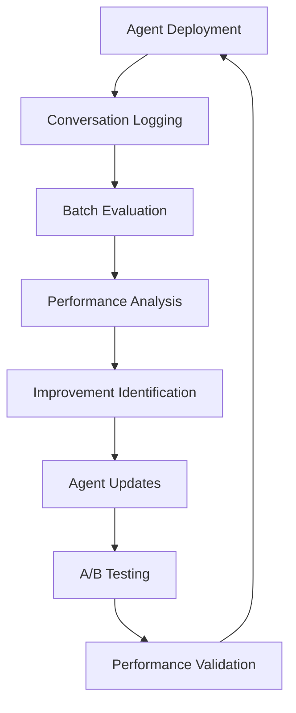

# AI Agent Evaluation and Improvement Guide

## How to Evaluate Conversational AI Agents and Drive Continuous Improvement

### Table of Contents

1. [Introduction](#introduction)
2. [Understanding Agent Evaluation Challenges](#understanding-agent-evaluation-challenges)
3. [NovaEval's Agent Evaluation Framework](#novaevals-agent-evaluation-framework)
4. [Setting Up Agent Evaluation](#setting-up-agent-evaluation)
5. [Core Evaluation Metrics](#core-evaluation-metrics)
6. [Evaluation Methodologies](#evaluation-methodologies)
7. [Interpreting Results](#interpreting-results)
8. [Improvement Strategies](#improvement-strategies)
9. [Continuous Improvement Workflow](#continuous-improvement-workflow)
10. [Best Practices](#best-practices)
11. [Case Studies](#case-studies)
12. [Troubleshooting Common Issues](#troubleshooting-common-issues)

---

## Introduction

Evaluating conversational AI agents is fundamentally different from evaluating single-turn Q&A systems. Agents operate in complex, multi-turn environments where they must:

- **Maintain context** across multiple conversation turns
- **Complete goals** that span several interactions
- **Handle interruptions** and topic changes gracefully
- **Utilize memory** effectively to provide personalized experiences
- **Maintain consistency** in personality and capabilities

This guide provides a comprehensive framework for evaluating and improving AI agents using NovaEval's advanced evaluation capabilities.

---

## Understanding Agent Evaluation Challenges

### Traditional Evaluation vs. Agent Evaluation

| **Traditional Evaluation** | **Agent Evaluation** |
|---------------------------|---------------------|
| Single input → Single output | Multi-turn conversations |
| Static context | Dynamic, evolving context |
| Simple accuracy metrics | Complex behavioral metrics |
| Isolated responses | Conversation flow and coherence |
| No memory requirements | Memory and context retention |

### Key Challenges in Agent Evaluation

#### 1. **Context Complexity**
- Agents must track information across multiple turns
- Context can span different topics and time periods
- Memory limitations can cause context loss

#### 2. **Goal-Oriented Behavior**
- Users often have complex, multi-step objectives
- Goals may evolve during the conversation
- Success requires completing the entire user journey

#### 3. **Conversation Dynamics**
- Natural conversation flow and transitions
- Handling interruptions and topic changes
- Maintaining engagement and helpfulness

#### 4. **Consistency Requirements**
- Factual consistency across all turns
- Personality and tone consistency
- Capability consistency (not claiming abilities it doesn't have)

#### 5. **Memory Utilization**
- Remembering user preferences and past interactions
- Referencing previous conversation elements appropriately
- Long-term memory across sessions

---

## NovaEval's Agent Evaluation Framework

### Architecture Overview

NovaEval's agent evaluation framework consists of several specialized components:

```
┌─────────────────────────────────────────────────────────────┐
│                    Agent Evaluation Framework               │
├─────────────────────────────────────────────────────────────┤
│  ┌─────────────────┐  ┌─────────────────┐  ┌──────────────┐ │
│  │ Conversation    │  │ Specialized     │  │ Simulation   │ │
│  │ Thread Tracking │  │ Judge Panels    │  │ Framework    │ │
│  └─────────────────┘  └─────────────────┘  └──────────────┘ │
│                                                             │
│  ┌─────────────────┐  ┌─────────────────┐  ┌──────────────┐ │
│  │ Multi-turn      │  │ Memory          │  │ Improvement  │ │
│  │ Metrics         │  │ Assessment      │  │ Analytics    │ │
│  └─────────────────┘  └─────────────────┘  └──────────────┘ │
└─────────────────────────────────────────────────────────────┘
```

### Core Components

#### 1. **ConversationThread**
Tracks complete conversations with metadata:
```python
thread = ConversationThread(
    thread_id="user_session_001",
    goal="Help user plan a vacation",
    messages=[...],
    context={"user_preferences": {...}},
    metadata={"session_start": "2024-01-01T10:00:00Z"}
)
```

#### 2. **Specialized Judge Panels**
Different panels for different evaluation aspects:
- **Context Evaluation Panel**: Memory and context retention
- **Goal Completion Panel**: Task achievement and intent resolution
- **Flow Assessment Panel**: Conversation coherence and transitions
- **Consistency Panel**: Response consistency and contradiction detection
- **Memory Utilization Panel**: Information retention and recall

#### 3. **Multi-turn Metrics**
Comprehensive metrics designed for conversational evaluation:
- Context Retention Score
- Goal Completion Rate
- Conversation Flow Quality
- Response Consistency
- Memory Utilization Effectiveness

---

## Setting Up Agent Evaluation

### 1. Installation and Setup

```bash
# Install NovaEval with agent evaluation capabilities
pip install "novaeval[agents]"

# Set up environment variables
export OPENAI_API_KEY="your-openai-key"
export ANTHROPIC_API_KEY="your-anthropic-key"
```

### 2. Basic Agent Evaluation Setup

```python
from novaeval.agents import ConversationalAgentEvaluator
from novaeval.agents.types import ConversationThread, ConversationMessage, ConversationRole

# Initialize the evaluator
evaluator = ConversationalAgentEvaluator()

# Create a conversation thread
thread = ConversationThread(
    thread_id="example_001",
    goal="Assist user with technical support",
    messages=[
        ConversationMessage(
            role=ConversationRole.USER,
            content="My laptop won't start. Can you help?"
        ),
        ConversationMessage(
            role=ConversationRole.ASSISTANT,
            content="I'll help you troubleshoot your laptop. Let's start with some basic checks..."
        ),
        # ... more messages
    ]
)

# Run evaluation
result = await evaluator.evaluate_conversation_thread(thread, your_agent_model)
```

### 3. Integration with Existing Systems

#### For Noveum.ai Integration:
```python
from novaeval.integrations.noveum import NoveumAgentEvaluator

# Create evaluator with Noveum.ai integration
evaluator = NoveumAgentEvaluator(
    ai_gateway_logs_path="./ai_gateway_logs.jsonl",
    selected_thread_ids=["thread_001", "thread_002"]
)

# Evaluate against logged conversations
results = await evaluator.evaluate_logged_conversations()
```

#### For Custom Agent Frameworks:
```python
# Adapt your agent's conversation format
def convert_agent_conversation(agent_conversation):
    return ConversationThread(
        thread_id=agent_conversation.id,
        messages=[
            ConversationMessage(
                role=ConversationRole(msg.role),
                content=msg.content,
                timestamp=msg.timestamp
            ) for msg in agent_conversation.messages
        ]
    )
```

---

## Core Evaluation Metrics

### 1. Context Retention Score (0.0 - 1.0)

**What it measures**: How well the agent remembers and uses information from earlier in the conversation.

**Evaluation criteria**:
- References to previous conversation elements
- Consistency with earlier statements
- Appropriate use of established context
- Avoiding repetition of already-provided information

**Example**:
```
User: "My name is Sarah and I work in marketing."
[... 5 turns later ...]
User: "What career advice do you have for me?"
Agent: "Given your background in marketing, Sarah, I'd recommend..." ✅
vs.
Agent: "What field do you work in?" ❌
```

### 2. Goal Completion Rate (0.0 - 1.0)

**What it measures**: How successfully the agent achieves the user's stated or implied objectives.

**Evaluation criteria**:
- Identification of user goals and intents
- Progress toward goal completion
- Successful resolution of user requests
- Appropriate task adherence

**Goal Types**:
- **Informational**: Providing requested information
- **Transactional**: Completing specific tasks
- **Conversational**: Engaging in meaningful dialogue
- **Problem-solving**: Resolving user issues

### 3. Conversation Flow Quality (0.0 - 1.0)

**What it measures**: How natural and coherent the conversation feels.

**Evaluation criteria**:
- Smooth topic transitions
- Logical conversation progression
- Natural response timing and pacing
- Appropriate conversation management

**Flow Patterns**:
- **Linear**: Straightforward progression toward a goal
- **Branching**: Handling multiple topics or subtasks
- **Circular**: Returning to previous topics appropriately
- **Adaptive**: Adjusting to user's changing needs

### 4. Response Consistency (0.0 - 1.0)

**What it measures**: How consistent the agent's responses are across the conversation.

**Consistency Types**:
- **Factual**: No contradictory information
- **Personality**: Consistent tone and character
- **Capability**: Consistent claims about abilities
- **Policy**: Consistent adherence to guidelines

### 5. Memory Utilization (0.0 - 1.0)

**What it measures**: How effectively the agent uses conversation history and user information.

**Memory Categories**:
- **Short-term**: Recent conversation context
- **Session**: Information from the current conversation
- **Long-term**: Information from previous sessions
- **Preference**: User preferences and personalization

---

## Evaluation Methodologies

### 1. Retrospective Evaluation

Evaluate completed conversations to understand agent performance.

```python
# Evaluate a completed conversation thread
result = await evaluator.evaluate_conversation_thread(completed_thread)

# Analyze results
print(f"Overall Score: {result.overall_score:.3f}")
print(f"Goal Completed: {result.goal_completion_status}")

for metric, score in result.metric_scores.items():
    print(f"{metric}: {score:.3f}")
```

### 2. Real-time Evaluation

Monitor agent performance during live conversations.

```python
# Real-time evaluation during conversation
class RealTimeAgentMonitor:
    def __init__(self, evaluator):
        self.evaluator = evaluator
        self.current_thread = None

    async def on_message_received(self, message):
        self.current_thread.add_message(message)

        # Evaluate every few turns
        if len(self.current_thread.messages) % 4 == 0:
            partial_result = await self.evaluator.evaluate_conversation_thread(
                self.current_thread
            )

            # Alert if performance drops
            if partial_result.overall_score < 0.6:
                await self.trigger_intervention()
```

### 3. Simulation-Based Evaluation

Use synthetic users to test agent behavior systematically.

```python
from novaeval.agents.simulation import SyntheticUserSimulator

# Create synthetic user scenarios
scenarios = [
    {
        "user_persona": "frustrated_customer",
        "goal": "get_refund",
        "complexity": "high"
    },
    {
        "user_persona": "curious_learner",
        "goal": "learn_about_product",
        "complexity": "medium"
    }
]

# Run simulations
simulator = SyntheticUserSimulator()
for scenario in scenarios:
    conversation = await simulator.simulate_conversation(
        agent=your_agent,
        scenario=scenario,
        max_turns=10
    )

    result = await evaluator.evaluate_conversation_thread(conversation)
    print(f"Scenario {scenario['goal']}: {result.overall_score:.3f}")
```

### 4. A/B Testing for Agent Improvements

Compare different agent versions or configurations.

```python
# A/B test different agent configurations
async def ab_test_agents(agent_a, agent_b, test_scenarios):
    results_a = []
    results_b = []

    for scenario in test_scenarios:
        # Test Agent A
        conversation_a = await simulate_conversation(agent_a, scenario)
        result_a = await evaluator.evaluate_conversation_thread(conversation_a)
        results_a.append(result_a.overall_score)

        # Test Agent B
        conversation_b = await simulate_conversation(agent_b, scenario)
        result_b = await evaluator.evaluate_conversation_thread(conversation_b)
        results_b.append(result_b.overall_score)

    # Statistical analysis
    from scipy import stats
    t_stat, p_value = stats.ttest_ind(results_a, results_b)

    print(f"Agent A average: {np.mean(results_a):.3f}")
    print(f"Agent B average: {np.mean(results_b):.3f}")
    print(f"Statistical significance: p={p_value:.4f}")
```

---

## Interpreting Results

### Understanding Score Ranges

| **Score Range** | **Performance Level** | **Interpretation** |
|----------------|----------------------|-------------------|
| 0.9 - 1.0 | Excellent | Agent performs exceptionally well |
| 0.8 - 0.9 | Good | Agent performs well with minor issues |
| 0.7 - 0.8 | Acceptable | Agent performs adequately but has room for improvement |
| 0.6 - 0.7 | Below Average | Agent has significant issues that need addressing |
| 0.0 - 0.6 | Poor | Agent requires major improvements |

### Metric-Specific Interpretation

#### Context Retention Score
- **High (0.8+)**: Agent consistently remembers and uses context
- **Medium (0.6-0.8)**: Agent sometimes forgets context or uses it inappropriately
- **Low (<0.6)**: Agent frequently loses context or ignores previous information

#### Goal Completion Rate
- **High (0.8+)**: Agent successfully completes most user objectives
- **Medium (0.6-0.8)**: Agent partially completes goals or requires multiple attempts
- **Low (<0.6)**: Agent frequently fails to achieve user objectives

#### Conversation Flow Quality
- **High (0.8+)**: Natural, smooth conversations with logical progression
- **Medium (0.6-0.8)**: Generally good flow with occasional awkward transitions
- **Low (<0.6)**: Choppy, unnatural conversations with poor transitions

### Turn-by-Turn Analysis

```python
# Analyze individual turns for detailed insights
for i, turn_score in enumerate(result.turn_by_turn_scores):
    print(f"Turn {turn_score['turn_number']}:")
    print(f"  Relevance: {turn_score['relevance']:.3f}")
    print(f"  Helpfulness: {turn_score['helpfulness']:.3f}")
    print(f"  Context Usage: {turn_score['context_usage']:.3f}")

    # Identify problematic turns
    if turn_score['overall'] < 0.6:
        print(f"  ⚠️ Low-performing turn - needs attention")
```

### Identifying Patterns

```python
# Analyze patterns across multiple conversations
def analyze_performance_patterns(evaluation_results):
    patterns = {
        "context_degradation": [],
        "goal_completion_failures": [],
        "consistency_issues": [],
        "flow_problems": []
    }

    for result in evaluation_results:
        # Check for context degradation over time
        turn_scores = [turn['context_usage'] for turn in result.turn_by_turn_scores]
        if len(turn_scores) > 3 and turn_scores[-1] < turn_scores[0] - 0.2:
            patterns["context_degradation"].append(result.thread_id)

        # Check for goal completion failures
        if not result.goal_completion_status:
            patterns["goal_completion_failures"].append(result.thread_id)

        # Check for consistency issues
        if result.metric_scores[AgentEvaluationMetric.CONSISTENCY] < 0.7:
            patterns["consistency_issues"].append(result.thread_id)

    return patterns
```

---

## Improvement Strategies

### 1. Context Retention Improvements

#### Problem: Agent forgets previous context
**Solutions**:
- **Improve memory architecture**: Implement better context summarization
- **Add explicit context references**: Train agent to explicitly reference previous information
- **Optimize context window usage**: Better prioritization of important context

```python
# Example: Context-aware prompt engineering
def build_context_aware_prompt(conversation_history, current_message):
    # Extract key context elements
    key_context = extract_key_information(conversation_history)

    prompt = f"""
    Previous conversation context:
    {key_context}

    Current user message: {current_message}

    Instructions: Reference relevant previous context in your response.
    """
    return prompt
```

#### Problem: Agent uses context inappropriately
**Solutions**:
- **Context relevance training**: Train on when to use vs. ignore context
- **Context validation**: Add checks for context appropriateness
- **Selective memory**: Implement mechanisms to forget irrelevant information

### 2. Goal Completion Improvements

#### Problem: Agent doesn't identify user goals correctly
**Solutions**:
- **Intent classification improvement**: Better training on intent recognition
- **Goal clarification prompts**: Ask clarifying questions when goals are unclear
- **Multi-step goal tracking**: Break complex goals into manageable steps

```python
# Example: Goal tracking system
class GoalTracker:
    def __init__(self):
        self.current_goals = []
        self.completed_goals = []

    def identify_goals(self, user_message):
        # Use NLP to extract potential goals
        potential_goals = extract_intents(user_message)
        for goal in potential_goals:
            if goal not in self.current_goals:
                self.current_goals.append(goal)

    def mark_goal_completed(self, goal):
        if goal in self.current_goals:
            self.current_goals.remove(goal)
            self.completed_goals.append(goal)
```

#### Problem: Agent starts tasks but doesn't complete them
**Solutions**:
- **Task persistence**: Maintain task state across turns
- **Progress tracking**: Monitor and report progress toward goals
- **Completion verification**: Confirm with user when tasks are completed

### 3. Conversation Flow Improvements

#### Problem: Awkward topic transitions
**Solutions**:
- **Transition phrase training**: Train on natural transition language
- **Topic modeling**: Better understanding of topic relationships
- **Flow planning**: Plan conversation structure in advance

```python
# Example: Smooth transition generation
def generate_transition(previous_topic, new_topic):
    transition_templates = {
        ("technical_support", "billing"): "Now that we've resolved the technical issue, let's address your billing question.",
        ("product_info", "purchase"): "Since you're interested in the product, would you like to proceed with a purchase?",
        # ... more templates
    }

    return transition_templates.get((previous_topic, new_topic),
                                  f"Moving on to {new_topic}...")
```

#### Problem: Repetitive or circular conversations
**Solutions**:
- **Conversation state tracking**: Monitor conversation progress
- **Repetition detection**: Identify and avoid repetitive responses
- **Progress indicators**: Show users how the conversation is advancing

### 4. Consistency Improvements

#### Problem: Contradictory information across turns
**Solutions**:
- **Fact checking**: Verify consistency with previous statements
- **Knowledge base integration**: Use consistent information sources
- **Contradiction detection**: Implement real-time consistency checking

```python
# Example: Consistency checker
class ConsistencyChecker:
    def __init__(self):
        self.stated_facts = {}

    def check_consistency(self, new_statement):
        # Extract facts from new statement
        new_facts = extract_facts(new_statement)

        for fact in new_facts:
            if fact.subject in self.stated_facts:
                if self.stated_facts[fact.subject] != fact.value:
                    return False, f"Contradiction detected: {fact.subject}"
            else:
                self.stated_facts[fact.subject] = fact.value

        return True, "Consistent"
```

#### Problem: Inconsistent personality or tone
**Solutions**:
- **Personality guidelines**: Clear personality and tone guidelines
- **Style consistency training**: Train on maintaining consistent style
- **Tone monitoring**: Real-time monitoring of response tone

### 5. Memory Utilization Improvements

#### Problem: Agent doesn't remember user preferences
**Solutions**:
- **Preference extraction**: Automatically extract and store preferences
- **Personalization engine**: Use preferences to customize responses
- **Preference confirmation**: Confirm preferences with users

```python
# Example: Preference management
class PreferenceManager:
    def __init__(self):
        self.user_preferences = {}

    def extract_preferences(self, conversation_history):
        # Extract preferences from conversation
        preferences = {}
        for message in conversation_history:
            if message.role == ConversationRole.USER:
                extracted = extract_preferences(message.content)
                preferences.update(extracted)

        return preferences

    def apply_preferences(self, response, user_id):
        user_prefs = self.user_preferences.get(user_id, {})
        # Customize response based on preferences
        return customize_response(response, user_prefs)
```

---

## Continuous Improvement Workflow

### 1. Evaluation Pipeline



### 2. Automated Improvement Loop

```python
class ContinuousImprovementPipeline:
    def __init__(self, evaluator, agent_trainer):
        self.evaluator = evaluator
        self.agent_trainer = agent_trainer
        self.performance_history = []

    async def run_improvement_cycle(self):
        # 1. Collect recent conversations
        recent_conversations = self.collect_recent_conversations()

        # 2. Evaluate performance
        evaluation_results = []
        for conversation in recent_conversations:
            result = await self.evaluator.evaluate_conversation_thread(conversation)
            evaluation_results.append(result)

        # 3. Analyze performance trends
        performance_analysis = self.analyze_performance_trends(evaluation_results)

        # 4. Identify improvement opportunities
        improvements = self.identify_improvements(performance_analysis)

        # 5. Generate training data for improvements
        training_data = self.generate_improvement_training_data(improvements)

        # 6. Update agent
        updated_agent = await self.agent_trainer.fine_tune(training_data)

        # 7. Validate improvements
        validation_results = await self.validate_improvements(updated_agent)

        # 8. Deploy if improvements are validated
        if validation_results.improvement_confirmed:
            await self.deploy_updated_agent(updated_agent)

        return validation_results
```

### 3. Performance Monitoring Dashboard

```python
# Example: Real-time performance monitoring
class AgentPerformanceDashboard:
    def __init__(self):
        self.metrics_history = []
        self.alert_thresholds = {
            "overall_score": 0.7,
            "goal_completion": 0.8,
            "context_retention": 0.7
        }

    def update_metrics(self, evaluation_result):
        self.metrics_history.append({
            "timestamp": datetime.now(),
            "overall_score": evaluation_result.overall_score,
            "goal_completion": evaluation_result.goal_completion_status,
            "context_retention": evaluation_result.metric_scores[AgentEvaluationMetric.CONTEXT_RETENTION]
        })

        # Check for alerts
        self.check_performance_alerts(evaluation_result)

    def check_performance_alerts(self, result):
        if result.overall_score < self.alert_thresholds["overall_score"]:
            self.send_alert(f"Overall performance below threshold: {result.overall_score:.3f}")

        if not result.goal_completion_status:
            self.send_alert("Goal completion failure detected")
```

---

## Best Practices

### 1. Evaluation Design

#### **Start with Clear Objectives**
- Define what "good" performance means for your specific use case
- Establish baseline performance metrics
- Set realistic improvement targets

#### **Use Representative Data**
- Evaluate on real user conversations when possible
- Include diverse conversation types and scenarios
- Consider edge cases and challenging interactions

#### **Balance Automation and Human Judgment**
- Use automated evaluation for scale and consistency
- Include human evaluation for nuanced assessment
- Validate automated metrics against human judgment

### 2. Metric Selection

#### **Choose Relevant Metrics**
- Focus on metrics that align with your agent's purpose
- Consider both technical and user experience metrics
- Balance leading and lagging indicators

#### **Avoid Metric Overload**
- Start with 3-5 core metrics
- Add additional metrics as needed
- Ensure metrics are actionable

### 3. Improvement Implementation

#### **Prioritize High-Impact Improvements**
- Focus on improvements that affect the most users
- Address fundamental issues before optimizing details
- Consider implementation complexity vs. impact

#### **Test Changes Thoroughly**
- Use A/B testing to validate improvements
- Monitor for unintended consequences
- Maintain rollback capabilities

#### **Iterate Continuously**
- Regular evaluation cycles (weekly/monthly)
- Gradual improvements over time
- Learn from both successes and failures

### 4. Data Management

#### **Maintain Data Quality**
- Clean and validate conversation data
- Handle privacy and security requirements
- Ensure data representativeness

#### **Version Control**
- Track agent versions and their performance
- Maintain evaluation result history
- Enable comparison across versions

---

## Case Studies

### Case Study 1: Customer Support Agent

**Challenge**: Customer support agent was losing context in long conversations, leading to frustrated customers.

**Evaluation Results**:
- Context Retention Score: 0.45 (Poor)
- Goal Completion Rate: 0.62 (Below Average)
- Customer Satisfaction: 2.8/5

**Improvements Implemented**:
1. **Enhanced Context Summarization**: Implemented conversation summarization at regular intervals
2. **Explicit Context References**: Trained agent to explicitly reference previous information
3. **Context Validation**: Added checks to ensure context relevance

**Results After Improvement**:
- Context Retention Score: 0.82 (Good)
- Goal Completion Rate: 0.89 (Good)
- Customer Satisfaction: 4.2/5

**Key Learnings**:
- Context retention is critical for customer satisfaction
- Explicit context references improve user confidence
- Regular context summarization prevents information loss

### Case Study 2: Educational Tutoring Agent

**Challenge**: Tutoring agent was not adapting to individual student learning styles and preferences.

**Evaluation Results**:
- Memory Utilization: 0.38 (Poor)
- Goal Completion (Learning Objectives): 0.55 (Poor)
- Student Engagement: 3.1/5

**Improvements Implemented**:
1. **Learning Style Detection**: Implemented automatic detection of student learning preferences
2. **Adaptive Response Generation**: Customized explanations based on learning style
3. **Progress Tracking**: Added comprehensive tracking of learning progress

**Results After Improvement**:
- Memory Utilization: 0.79 (Acceptable)
- Goal Completion: 0.84 (Good)
- Student Engagement: 4.5/5

**Key Learnings**:
- Personalization significantly improves educational outcomes
- Memory utilization is crucial for adaptive learning
- Progress tracking helps maintain student motivation

### Case Study 3: Sales Assistant Agent

**Challenge**: Sales agent was not effectively guiding customers through the sales funnel.

**Evaluation Results**:
- Goal Completion (Sales): 0.41 (Poor)
- Conversation Flow: 0.58 (Below Average)
- Conversion Rate: 12%

**Improvements Implemented**:
1. **Sales Funnel Awareness**: Trained agent on sales process stages
2. **Objection Handling**: Improved responses to common objections
3. **Closing Techniques**: Added natural closing and next-step suggestions

**Results After Improvement**:
- Goal Completion: 0.78 (Acceptable)
- Conversation Flow: 0.85 (Good)
- Conversion Rate: 28%

**Key Learnings**:
- Domain-specific training is essential for specialized agents
- Conversation flow directly impacts conversion rates
- Structured approaches to complex processes improve outcomes

---

## Troubleshooting Common Issues

### Issue 1: Low Context Retention Scores

**Symptoms**:
- Agent asks for information already provided
- Responses don't build on previous conversation
- Users express frustration about repetition

**Diagnostic Steps**:
1. Check conversation length vs. context window
2. Analyze context summarization quality
3. Review context reference patterns

**Solutions**:
- Implement better context summarization
- Increase context window size if possible
- Add explicit context reference training
- Implement context importance scoring

### Issue 2: Poor Goal Completion Rates

**Symptoms**:
- Conversations end without resolution
- Users abandon conversations mid-way
- Multiple conversations for the same issue

**Diagnostic Steps**:
1. Analyze goal identification accuracy
2. Check task completion tracking
3. Review conversation abandonment points

**Solutions**:
- Improve intent recognition training
- Add goal clarification prompts
- Implement progress tracking and reporting
- Add completion confirmation steps

### Issue 3: Inconsistent Agent Behavior

**Symptoms**:
- Contradictory information across turns
- Varying personality or tone
- Different responses to similar questions

**Diagnostic Steps**:
1. Check for factual contradictions
2. Analyze tone and personality consistency
3. Review response variation patterns

**Solutions**:
- Implement consistency checking
- Add personality guidelines to prompts
- Use knowledge base for factual consistency
- Add response validation steps

### Issue 4: Poor Conversation Flow

**Symptoms**:
- Abrupt topic changes
- Awkward transitions
- Unnatural conversation progression

**Diagnostic Steps**:
1. Analyze topic transition points
2. Check conversation structure
3. Review user feedback on flow

**Solutions**:
- Add transition phrase training
- Implement conversation planning
- Use topic modeling for better transitions
- Add flow validation checks

### Issue 5: Low Memory Utilization

**Symptoms**:
- Agent doesn't remember user preferences
- No personalization in responses
- Repeated requests for same information

**Diagnostic Steps**:
1. Check preference extraction accuracy
2. Analyze memory storage and retrieval
3. Review personalization effectiveness

**Solutions**:
- Improve preference extraction algorithms
- Implement better memory management
- Add personalization training data
- Create preference confirmation mechanisms

---

## Conclusion

Evaluating and improving conversational AI agents requires a comprehensive, systematic approach that goes far beyond traditional metrics. By implementing NovaEval's agent evaluation framework, you can:

1. **Gain Deep Insights** into agent behavior across multi-turn conversations
2. **Identify Specific Improvement Areas** with actionable metrics
3. **Implement Targeted Improvements** based on evaluation results
4. **Monitor Progress** through continuous evaluation cycles
5. **Ensure Consistent Quality** across all user interactions

The key to success is treating agent evaluation as an ongoing process, not a one-time assessment. Regular evaluation, analysis, and improvement cycles will help you build agents that truly excel at conversational AI.

Remember that great conversational agents are not just technically proficient—they create meaningful, helpful, and engaging experiences for users. Use this guide as your roadmap to building agents that users love to interact with.

---

## Additional Resources

- [NovaEval Agent Evaluation API Documentation](https://docs.novaeval.ai/agents)
- [Conversation Thread Schema Reference](https://docs.novaeval.ai/schemas/conversation-thread)
- [Panel of Judges Configuration Guide](https://docs.novaeval.ai/judges/configuration)
- [Agent Improvement Playbook](https://docs.novaeval.ai/playbooks/agent-improvement)
- [Community Examples and Templates](https://github.com/Noveum/NovaEval/tree/main/examples/agents)

For questions and support, visit our [GitHub Discussions](https://github.com/Noveum/NovaEval/discussions) or contact [support@noveum.ai](mailto:support@noveum.ai).
