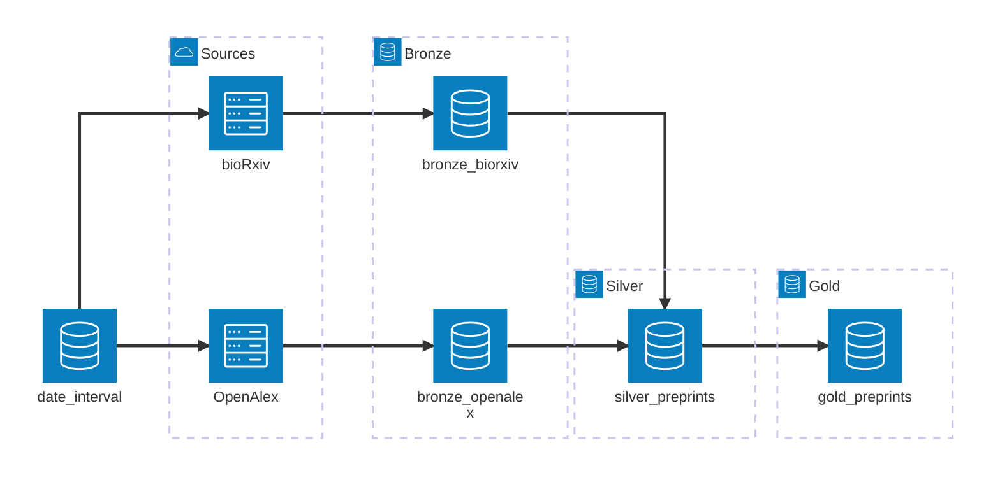

# pub-lake


Aggregate publication metadata from bioRxiv, OpenAlex, and more.

* PyPI package: https://pypi.org/project/pub-lake/
* Free software: MIT License

## Features

1. **bioRxiv preprints**: fetch metadata for preprints from the bioRxiv API and enrich it with OpenAlex topics.
2. **Checkpointed ingestion**: resume interrupted data ingestions without duplicating data.

## Installation

With uv (recommended):

```bash
uv add pub-lake
```

With pip:
```bash
pip install pub-lake
```

## Usage

### Command-Line Interface

```bash
# ingest preprints from the given dates into the database
uv run python -m pub_lake preprints fetch --start "2025-01-02" --end "2025-01-04" --polite "user@example.com"

# list preprints available in the database
uv run python -m pub_lake preprints list [--start "2025-01-02"] [--end "2025-01-04"]
```

### Python API

```python
from datetime import date
from pub_lake import config
from pub_lake.elt.pipeline import ingest_preprints
from pub_lake.interface.preprints import get_preprints
from pub_lake.models.preprints import DateInterval

# ingest preprints from these dates into the database
config.POLITE_EMAIL = "user@example.com"
interval = DateInterval(start=date(2025, 1, 2), end=date(2025, 1, 4))
ingest_preprints(interval)

# list preprints available in the database
preprints = get_preprints(interval)
print(preprints.df.to_string())
```

## How it works

The package follows an ELT (Extract, Load, Transform) architecture and stores data in a relational database (SQLite by default).
Key steps:
1. **Extract**: Fetch raw metadata from bioRxiv and OpenAlex APIs.
2. **Load**: Store the raw metadata in the database.
3. **Transform**: Clean, normalize, and aggregate the data.

Data can then be queried and returns a unified view of publication metadata.

### Ingestion Pipeline

Data ingestion uses the medallion architecture with Bronze, Silver, and Gold layers.

1. Raw preprint data is fetched from external sources (bioRxiv, OpenAlex) and loaded as-is into separate bronze-layer tables for each source.
2. Bronze preprints from each source are cleaned and deduplicated into a single silver-layer table with one row per source per preprint.
3. Silver preprints from each source are aggregated into a gold-layer table with one row per preprint, combining metadata from all sources.



Benefits of this architecture:
- **Modularity**: Each layer-to-layer transformation can be tested and run independently. Adding columns to the silver & gold layers does not require re-ingesting bronze data.
- **Data Provenance**: Raw data is preserved in the bronze layer for auditing. Gold-layer data can be traced back to its bronze source rows.

Drawbacks:
- **Storage Overhead**: Storing multiple layers increases database size.

## Development

### Project Structure

`src/pub_lake/` has the following structure:

-   `cli/`: command-line interface for interacting with the package.
-   `elt/`: core logic for the Extract, Load, Transform pipeline.
-   `models/`: database schema and data models.
-   `interface/`: methods for querying the final, cleaned data.
-   `config.py`: configuration, such as database connections and API keys.

### Releasing a New Version

To release a new version of `pub-lake` to PyPI:

1.  **Update the version number**:
    ```bash
    uv run --group publish bump2version --current-version [major|minor|patch] pyproject.toml
    ```
2.  **Update the uv.lock file**:
    ```bash
    uv lock
    ```
3.  **Update the changelog** in `docs/history.md`.
4.  **Build the distribution**:
    ```bash
    just clean
    uv run --group publish python -m build
    ```
5.  **Check the distribution**:
    ```bash
    uv run --group publish twine check dist/*
    ```
6.  **Upload to TestPyPI** (optional but recommended):
    ```bash
    uv run --group publish twine upload --repository testpypi dist/*
    ```
7.  **Upload to PyPI**:
    ```bash
    uv run --group publish twine upload dist/*
    ```

## Credits

This package was created with [Cookiecutter](https://github.com/audreyfeldroy/cookiecutter) and the [audreyfeldroy/cookiecutter-pypackage](https://github.com/audreyfeldroy/cookiecutter-pypackage) project template.
