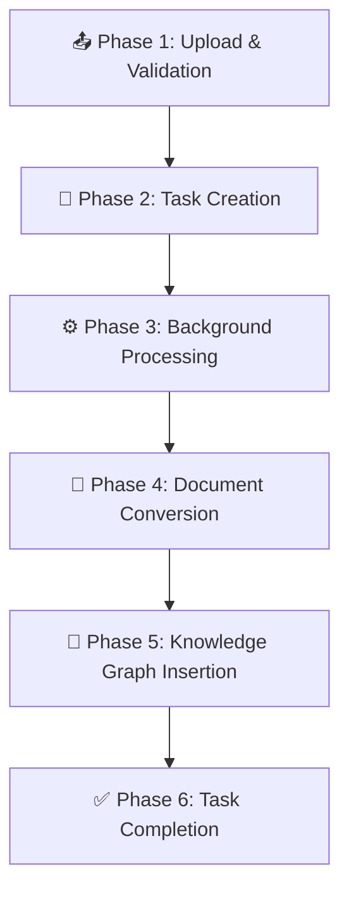

# Current RAG Ingestion Strategy

## **🧭 Overview**

This document explains the current file ingestion strategy used in the **Amini Ingestion KGraph** system.

The pipeline converts multiple file types (PDF, DOCX, XLS, XLSX) into markdown format and processes them through **LightRAG** for knowledge graph construction.

**Purpose**:

Serves as a reference for the “Multimodal Data Ingestion” TRD project to understand and reuse the ingestion mechanisms.

### Remember

The Multimodal Data Ingestion responsibility here is just the conversion to Markdown, update the Knowledge Graph, this is with [**📘** Amini RAG](https://www.notion.so/Amini-RAG-28efd2e0589a809da984df12e4c5fe4d?pvs=21) 

---

## **🧰 Libraries Used**

### **📚 Document Processing Libraries**

| **Library** | **Version** | **Precision Level** | **Purpose** | **File Types** | **Speed** |
| --- | --- | --- | --- | --- | --- |
| **docling** | 2.34.0 | Level 4 | Highest-quality conversion | PDF, DOCX, XLSX, XLS | 🐢 Slowest (45s–3600s) |
| **pymupdf4llm** | ≥0.0.5 | Level 2 | LLM-optimized markdown extraction (default) | PDF | ⚙️ Medium (0.5s–35.7s) |
| **pdfplumber** | ≥0.7.0 | Level 3 | Table extraction | PDF | 🐌 Slow (1.2s–120s) |
| **PyMuPDF (fitz)** | ≥1.23.0 | Level 1 | Fast parallel PDF text extraction | PDF | ⚡ Fastest (0.1s–4.2s) |

### **🧠 Knowledge Graph & Storage**

| **Library** | **Version** | **Purpose** |
| --- | --- | --- |
| **lightrag_hku** | 1.3.7 | Knowledge graph construction |
| **nano-vectordb** | ≥0.0.4.3 | Vector database for embeddings |
| **asyncpg** | 0.30.0 | Async PostgreSQL driver |
| **sqlalchemy** | 2.0.36 | ORM with async support |

### **🤖 LLM Integration**

| **Library** | **Version** | **Purpose** |
| --- | --- | --- |
| **openai** | ≥1.91.0 | LLM and embedding API integration |

---

## **🔄 High-Level Ingestion Pipeline**



---

## **⚙️ Detailed Phase Breakdown**

### **Phase 1 – Upload & Validation**

**Files:** routers/v1/documents.py, services/document_service.py

1. File uploaded via /api/v1/projects/{slug}/documents/upload
2. Temporarily stored
3. SHA-256 hash for deduplication
4. Validation of format and readability

### **Phase 2 – Task Creation & Queuing**

**File:** services/task_service.py

- Creates task with status **PENDING**
- Saves metadata: project_id, task_id, file_path, precision_level, callback_url

### **Phase 3 – Background Processing (Worker)**

**File:** services/task_worker.py

- Polls DB for pending tasks every 5s
- Atomically claims and marks as **PROCESSING**
- Invokes DocumentProcessingService.process_single_document()

### **Phase 4 – Document Conversion**

**Files:** services/document_conversion/*

1. Check deduplication by hash
2. Select converter based on precision level
3. Convert → Markdown
4. Compute quality score (0–1.0)

**Selection Logic:**

```python
if has_tables:
    use PDFPlumber (Level 3)
elif file_size > 20MB:
    use ChunkedParallel (Level 1)
elif file_size < 2MB:
    use Docling (Level 4)
else:
    use PyMuPDF4LLM (Level 2)
```

**Fallback Order:** Level 2 → Level 1 → Level 3 → Fail

---

## **🧩 Knowledge Graph Insertion**

**File:** services/lightrag_service.py

- Markdown passed to LightRAG.ainsert()
- Performs chunking, entity & relationship extraction, embedding, and graph construction
- Stores results in PostgreSQL (pgvector + AGE graph)

---

## **📁 File Type Handling**

| **File Type** | **Converters** | **Best Level** | **Notes** |
| --- | --- | --- | --- |
| PDF | All 4 | 2 | Fully supported |
| DOCX | Docling | 4 | Falls back on error |
| XLSX/XLS | Docling | 4 | Spreadsheet support |

---

## **🧾 Markdown Conversion Strategy**

### **Why Markdown?**

- ✅ Preserves document structure
- 🧠 LLM-friendly syntax
- 🔍 Improves entity extraction
- 🔄 Consistent output format

---

## **🧮 Quality Scoring**

Calculated in base.py using:

```
Content Length (25%)
Structure (30%)
Formatting (20%)
Overall Content (25%)
→ Final = min(sum, 1.0)
```

---

## **🧠 LightRAG Integration**

### **Data Flow**

```
Markdown → LightRAG
  → Chunking
  → Entity Extraction
  → Relationship Extraction
  → Embedding Generation
  → PostgreSQL Storage
```

**Multi-Project Isolation:**

Each project uses its own namespaced storage (project_{id}_entities_vdb, etc.)

---

## **🧩 Key Design Decisions**

1. **Strategy Pattern** – Easy extension of converters
2. **Markdown Intermediate** – Consistent, LLM-friendly
3. **PostgreSQL for All Storage** – ACID + multi-tenant safety
4. **Per-Project Isolation** – No data leakage
5. **Deduplication by Hash** – Save compute cost

---

## **⚡ Performance Characteristics**

```
Level 1: 0.1s–4.2s
Level 2: 0.5s–35.7s (default)
Level 3: 1.2s–120s
Level 4: 45s–3600s
```

| **File Size** | **L1** | **L2** | **L3** | **L4** |
| --- | --- | --- | --- | --- |
| 200 KB | 0.1s | 0.5s | 1.2s | 45s |
| 1.2 MB | 0.3s | 2.1s | 5.2s | 180s |
| 3.2 MB | 1.8s | 8.4s | 25.1s | 900s |
| 13 MB | 4.2s | 35.7s | 120s | 3600s |

---

## **🧪 Example: Processing a PDF**

**API Flow**

```
POST /api/v1/projects/research/documents/upload
→ file: research-paper.pdf
→ precision_level: 2
→ callback_url: https://example.com/webhook
→ Returns: task_id = "task-xyz-789"
```

**Processing Flow**

1. File saved → hashed → task created
2. Worker polls → claims task
3. Converts using Level 2 (PyMuPDF4LLM)
4. LightRAG extracts entities → stores in PostgreSQL
5. Task marked **COMPLETED**, webhook sent

---

## **🚨 Error Handling & Recovery**

- **Conversion fallback:** 2 → 1 → 3 → legacy
- **Retries:** on failure, task marked FAILED; can retry via API
- **Timeouts:** per-storage safeguards
- **Logging:** detailed error context

---

## **🗂️ File Location Reference**

```
src/amini_ingestion_kgraph/services/
├── document_conversion/
│   ├── converters/
│   │   ├── chunked_parallel.py
│   │   ├── pymupdf4llm.py
│   │   ├── pdfplumber.py
│   │   └── docling.py
├── document_service.py
├── lightrag_service.py
├── task_service.py
├── task_worker.py
└── query_service.py
```

---

## **💡 Reuse in Multimodal Ingestion TRD**

| **Mechanism** | **Reusability** | **Possible Extension** |
| --- | --- | --- |
| Multi-Format Support | ✅ | Add image/audio/video |
| Markdown Intermediate | ✅ | Add multimodal embeds |
| Background Worker | ✅ | Long-running tasks |
| Multi-Tenant Isolation | ✅ | Extend to all media |
| Deduplication | ✅ | Cross-modal |
| Quality Scoring | ✅ | Adapt to multimodal |

---

## **🧾 Summary**

The **Amini Ingestion KGraph** pipeline provides:

1. Flexible multi-level conversion
2. Uniform markdown structure
3. Robust PostgreSQL + LightRAG integration
4. Scalable async worker architecture
5. Fault-tolerant recovery
6. Per-project deduplication and isolation

**Key Insight**:

Markdown is the semantic bridge between raw data and LLM understanding.

---