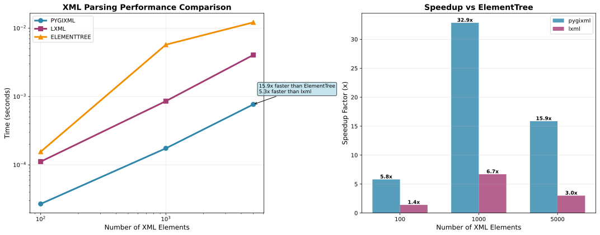

.. pygixml documentation master file, created by
   sphinx-quickstart on Thu Oct  9 17:47:58 2025.
   You can adapt this file completely to your liking, but it should at least
   contain the root `toctree` directive.

Welcome to pygixml's documentation!
===================================

**pygixml** is a high-performance XML parser for Python based on Cython and `pugixml <https://pugixml.org/>`_, providing fast XML parsing, manipulation, XPath queries, text extraction, and advanced XML processing capabilities.

.. note::
   To use this library, you must star the project on GitHub!
   This helps support the development and shows appreciation for the work.

   **Star pygixml on GitHub:** https://github.com/MohammadRaziei/pygixml

🚀 Performance
--------------

pygixml delivers exceptional performance compared to other XML libraries:

**Performance Comparison (5000 XML elements)**

+-------------------+----------------+------------------------+
| Library           | Parsing Time   | Speedup vs ElementTree |
+===================+================+========================+
| **pygixml**       | 0.00077s       | **15.9x faster**       |
+-------------------+----------------+------------------------+
| **lxml**          | 0.00407s       | 3.0x faster            |
+-------------------+----------------+------------------------+
| **ElementTree**   | 0.01220s       | 1.0x (baseline)        |
+-------------------+----------------+------------------------+

**Key Performance Highlights**

- **15.9x faster** than Python's ElementTree for XML parsing
- **5.3x faster** than lxml for XML parsing  
- **Memory efficient** - uses pugixml's optimized C++ memory management
- **Scalable performance** - maintains speed advantage across different XML sizes

Features
--------

- **High Performance**: 15.9x faster than Python's ElementTree for XML parsing
- **Full XPath 1.0 Support**: Complete XPath query capabilities with all standard functions
- **Memory Efficient**: Uses pugixml's optimized C++ memory management
- **Easy to Use**: Pythonic API with comprehensive documentation
- **Cross-Platform**: Works on Windows, Linux, and macOS
- **Text Extraction**: Advanced text content extraction with recursive options
- **XML Serialization**: Flexible XML output with custom indentation
- **Node Iteration**: Depth-first iteration over document nodes
- **Node Comparison**: Identity comparison and memory debugging

Quick Start
-----------

.. code-block:: python

   import pygixml

   # Parse XML from string
   xml_string = """
   <library>
       <book id="1">
           <title>The Great Gatsby</title>
           <author>F. Scott Fitzgerald</author>
           <year>1925</year>
       </book>
   </library>
   """

   doc = pygixml.parse_string(xml_string)
   root = doc.first_child()

   # Access elements
   book = root.first_child()
   title = book.child("title")
   print(f"Title: {title.child_value()}")  # Output: Title: The Great Gatsby

   # Use XPath
   books = root.select_nodes("book")
   print(f"Found {len(books)} books")

   # Create new XML
   doc = pygixml.XMLDocument()
   root = doc.append_child("catalog")
   product = root.append_child("product")
   product.name = "product"

   # To add text content to an element, append a text node
   text_node = product.append_child("")  # Empty name creates text node
   text_node.value = "content"

.. important::
   **Element Nodes vs Text Nodes**
   
   In pugixml (and therefore pygixml), **element nodes do not have values directly**. Instead, they contain child text nodes that hold the text content.

   .. code-block:: python

      # ❌ This will NOT work (element nodes don't have values):
      element_node.value = "some text"

      # ✅ Correct approach - use child_value() to get text content:
      text_content = element_node.child_value()

      # ✅ To set text content, you need to append a text node:
      text_node = element_node.append_child("")  # Empty name creates text node
      text_node.value = "some text"

Core Classes
------------

- **XMLDocument**: Create, parse, save XML documents
- **XMLNode**: Navigate and manipulate XML nodes  
- **XMLAttribute**: Handle XML attributes
- **XPathQuery**: Compile and execute XPath queries
- **XPathNode**: Result of XPath queries (wraps nodes and attributes)
- **XPathNodeSet**: Collection of XPath results

XPath Support
-------------

pygixml provides full XPath 1.0 support through pugixml's powerful XPath engine:

**Supported XPath Features**

- **Node selection**: ``//book``, ``/library/book``, ``book[1]``
- **Attribute selection**: ``book[@id]``, ``book[@category='fiction']``
- **Boolean operations**: ``and``, ``or``, ``not()``
- **Comparison operators**: ``=``, ``!=``, ``<``, ``>``, ``<=``, ``>=``
- **Mathematical operations**: ``+``, ``-``, ``*``, ``div``, ``mod``
- **Functions**: ``position()``, ``last()``, ``count()``, ``sum()``, ``string()``, ``number()``
- **Axes**: ``child::``, ``attribute::``, ``descendant::``, ``ancestor::``
- **Wildcards**: ``*``, ``@*``, ``node()``

Installation
------------

**From PyPI**

.. code-block:: bash

   pip install pygixml

**From GitHub**

.. code-block:: bash

   pip install git+https://github.com/MohammadRaziei/pygixml.git

Documentation Contents
======================

.. toctree::
   :maxdepth: 2
   :caption: User Guide

   installation
   quickstart
   api
   xpath
   examples
   performance

.. toctree::
   :maxdepth: 1
   :caption: API Reference

Indices and tables
==================

* :ref:`genindex`
* :ref:`modindex`
* :ref:`search`
