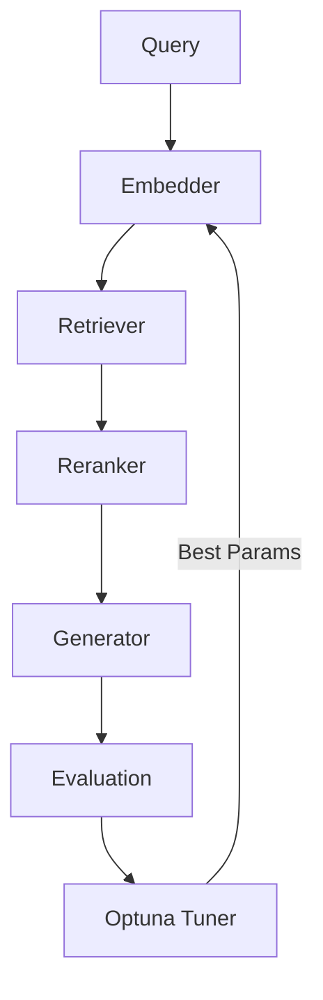

# Ragmint


**Ragmint** (Retrieval-Augmented Generation Model Inspection & Tuning) is a modular, developer-friendly Python library for **evaluating, optimizing, and tuning RAG (Retrieval-Augmented Generation) pipelines**.

It provides a complete toolkit for **retriever selection**, **embedding model tuning**, and **automated RAG evaluation** with support for **Optuna-based Bayesian optimization**.

---

## ✨ Features

- ✅ **Automated hyperparameter optimization** (Grid, Random, Bayesian via Optuna)  
- 🔍 **Built-in RAG evaluation metrics** — faithfulness, recall, BLEU, ROUGE, latency  
- ⚙️ **Retrievers** — FAISS, Chroma, ElasticSearch  
- 🧩 **Embeddings** — OpenAI, HuggingFace  
- 🧠 **Rerankers** — MMR, CrossEncoder (extensible via plugin interface)  
- 💾 **Caching, experiment tracking, and reproducibility** out of the box  
- 🧰 **Clean modular structure** for easy integration in research and production setups  

---

## 🚀 Quick Start

### 1️⃣ Installation

```bash
git clone https://github.com/andyolivers/ragmint.git
cd ragmint
pip install -e .
```

> The `-e` flag installs Ragmint in editable (development) mode.  
> Requires **Python ≥ 3.9**.

---

### 2️⃣ Run a RAG Optimization Experiment

```bash
python ragmint/main.py --config configs/default.yaml --search bayesian
```

Example `configs/default.yaml`:
```yaml
retriever: faiss
embedding_model: text-embedding-3-small
reranker:
  mode: mmr
  lambda_param: 0.5
optimization:
  search_method: bayesian
  n_trials: 20
```

---

### 3️⃣ Manual Pipeline Usage

```python
from ragmint.core.pipeline import RAGPipeline

pipeline = RAGPipeline({
    "embedding_model": "text-embedding-3-small",
    "retriever": "faiss",
})

result = pipeline.run("What is retrieval-augmented generation?")
print(result)
```

---

## 🧩 Folder Structure

```
ragmint/
├── core/
│   ├── pipeline.py         # RAGPipeline implementation
│   ├── retriever.py        # Retriever logic (FAISS, Chroma)
│   ├── reranker.py         # MMR + CrossEncoder rerankers
│   └── embedding.py        # Embedding backends
├── tuner.py                # Grid, Random, Bayesian optimization (Optuna)
├── utils/                  # Metrics, logging, caching helpers
├── configs/                # Default experiment configs
├── experiments/            # Saved experiment results
├── tests/                  # Unit tests for all components
├── main.py                 # CLI entrypoint for tuning
└── pyproject.toml          # Project dependencies & build metadata
```

---

## 🧪 Running Tests

To verify your setup:

```bash
pytest -v
```

Or to test a specific component (e.g., reranker):

```bash
pytest tests/test_reranker.py -v
```

All tests are designed for **Pytest** and run with lightweight mock data.

---

## ⚙️ Configuration via `pyproject.toml`

Your `pyproject.toml` automatically includes:

```toml
[project]
name = "ragmint"
version = "0.1.0"
dependencies = [
    "numpy",
    "optuna",
    "scikit-learn",
    "faiss-cpu",
    "chromadb",
    "pytest",
    "openai",
    "tqdm",
]
```

---

## 📊 Example Experiment Workflow

1. Define your retriever and reranker configuration in YAML  
2. Launch an optimization search (Grid, Random, or Bayesian)  
3. Ragmint evaluates combinations automatically and reports top results  
4. Export best parameters for production pipelines  

---

## 🧬 Architecture Overview



---

## 📘 Example Output

```
[INFO] Starting Bayesian optimization with Optuna
[INFO] Trial 7 finished: recall=0.83, latency=0.42s
[INFO] Best parameters: {'lambda_param': 0.6, 'retriever': 'faiss'}
```

---

## 🧠 Why Ragmint?

- Built for **RAG researchers**, **AI engineers**, and **LLM ops**  
- Works with **LangChain**, **LlamaIndex**, or standalone RAG setups  
- Designed for **extensibility** — plug in your own models, retrievers, or metrics  

---

## ⚖️ License

Licensed under the **Apache License 2.0** — free for personal, research, and commercial use.

---

## 👤 Author

**André Oliveira**  
[andyolivers.com](https://andyolivers.com)  
Data Scientist | AI Engineer
