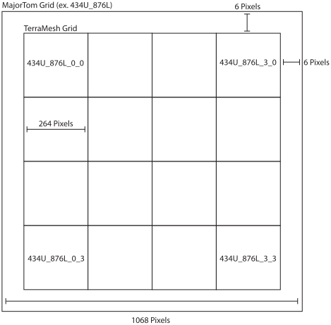

# SatChip

A package for satellite image AI data prep. This package "chips" data labels and satellite imagery into 264x264 image arrays following the TerraMind extension of the MajorTom specification.

## Usage
`SatChip` relies on a two-step process; chip your label train data inputs, then create corresponding chips for different remote sensing data sources.

### Step 1: Chip labels
The `chiplabel` CLI tool takes a GDAL-compatible image, a collection date, and an optional chip directory as input using the following format:

```bash
chiplabel PATH/TO/LABELS.tif DATE(UTC FORMAT) --chipdir CHIP_DIR
```
For example:
```bash
chiplabel LA_damage_20250113_v0.tif 2024-01-01T01:01:01 --chipdir chips
```
This will produce an output zipped Zarr store label dataset with the name `{LABEL}_{SAMPLE}.zarr.zip` (see the (Tiling Schema)[#tiling_schema] section for details on the `SAMPLE` name) to the `LABEL` directory in the specified chip directory (`--chipdir`). This file will be the input to the remote sensing data chipping step.

For more information on usage see `chiplabel --help`

### Step 2: Chip remote sensing data
The `chipdata` CLI tool takes a path to a directory containing chip labels, a dataset name, a date range and a set of optional parameters using the following format:
```bash
chipdata PATH/TO/LABEL DATASET Ymd-Ymd \ 
    --maxcloudpct MAX_CLOUD_PCT --strategy STRATEGY \
    --chipdir CHIPPUT_DIR --imagedir IMAGE_DIR
```
For example:
```bash
chipdata LABEL S2L2A 20250112-20250212 --maxcloudpct 20 --chipdir CHIP_DIR --imagedir IMAGES
```
Similarly to step 1, this will produce an output zipped Zarr store that contains chipped data for your chosen dataset with the name `{LABELS_{SAMPLE}_{DATASET}.zarr.zip`. The arguments are as follows:
- `PATH/TO/LABEL`: the path to your training labels
- `DATASET`: The satellite imagery dataset you would like to create labels for. See the list below for all current options.
- `Ymd-Ymd`: The date range to select imagery from. For example, `20250112-20250212` selects imagery between January 12 and February 12, 2025.
- `MAX_CLOUD_PCT`: For optical data, this optional parameter lets you set the maximum amount of cloud coverage allowed in a chip. Values between 0 and 100 are allowed. Cloud coverage is calculated on a per-chip basis. The default is 100 i.e., no limit.
- `STRATEGY`: Lets you selected what data inside your date range will be used to create chips. Specifying `BEST` (the default) will create a chip for the image closest to the beginning of your date range that has at least 95% spatial coverage. Specifying `ALL` will create chips for all images within your date range that have at least 95% spatial coverage.
- `CHIP_DIR`: Specifies the directory where the image chips will be saved. If not specified, this defaults to your current directory.
- `IMAGE_DIR`: Specifies the directory where the full-size satellite images will be downloaded to. If this argument is not provided, the images will be stored in the `IMAGES` directory within `CHIP_DIR`.

Currently supported datasets include:
- `S2L2A`: Sentinel-2 L2A data sourced from the [Sentinel-2 AWS Open Data Archive](https://registry.opendata.aws/sentinel-2/)
- `HLS`: Harmonized Landsat Sentinel-2 data sourced from [LP DAAC's Data Archive](https://www.earthdata.nasa.gov/data/projects/hls)
- `S1RTC`: OPERA Sentinel-1 Radiometric Terrain Corrected (RTC) data from [ASF DAAC's Data Archive](https://www.jpl.nasa.gov/go/opera/products/rtc-product/)
- `HYP3S1RTC`: Sentinel-1 Radiometric Terrain Corrected (RTC) data created using [ASF's HyP3 on-demand platform](https://hyp3-docs.asf.alaska.edu/guides/rtc_product_guide/)

## Tiling Schema

This package chips images based on the [TerraMesh grid system](https://huggingface.co/datasets/ibm-esa-geospatial/TerraMesh), which builds on the [MajorTOM grid system](https://github.com/ESA-PhiLab/Major-TOM).

The MajorTOM grid system provides a global set of fixed image grids that are 1068x1068 pixels in size. A MajorTOM grid can be defined for any tile size, but we fix the grid to 10x10 Km tiles. Tiles are named using the format:
```
ROW[U|D]_COL[L|R]
```
Where, `ROW` is indexed from the equator, with a suffix `U` (up) for tiles north of the equator and `D` (down) for tiles south of it, and `COL` is indexed from the prime meridian, with a suffix `L` (left) for tiles east of the prime meridian and `R` (right) for tiles west of it.

To support finer subdivisions, the TerraMesh grid system divides each MajorTOM grid into a 4x4 set of sub-tiles, each 264x264 pixels. The subgrid is centered within the parent tile, leaving a 6-pixel border around each sub-tile. Subgrid names extend the base format with two additional indices:
```
ROW[U|D]_COL[L|R]_SUBCOL_SUBROW
```
For instance, the bottom-left subgrid of MajorTOM tile `434U_876L` is named `434U_876L_0_3`. See the figure below for a visual description:



## Viewing Chips
Assessing chips after their creation can be challenging due to the large number of small images created. To address this issue, SatChip includes a `chipview` CLI tool that uses Matplotlib to quickly visualize the data included within the created zipped Zarr stores:
```bash
chipview PATH/TO/CHIP.zarr.zip --band BAND
```
Where `PATH/TO/CHIPS.zarr.zip` is the path to the chip file (labels or image data), and `BAND` is an OPTIONAL name of the band you would like to view. If no band is specified, an OPERA-style RGB decomposition will be shown for RTC data, and an RGB composite will be shown for optical data.

## License
`SatChip` is licensed under the BSD-3-Clause open source license. See the LICENSE file for more details.

## Contributing
Contributions to the `SatChip` are welcome! If you would like to contribute, please submit a pull request on the GitHub repository.
