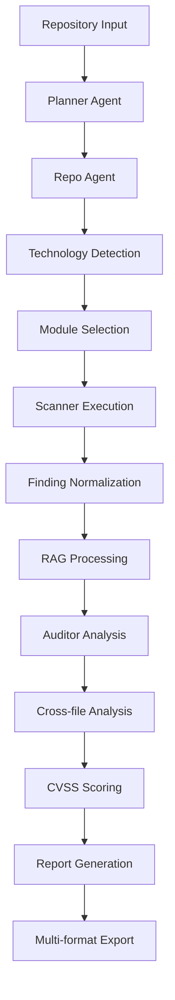

# SecureCLI Architecture Guide

This document provides a comprehensive technical overview of SecureCLI's architecture, design decisions, and implementation details.

## Table of Contents

1. [System Overview](#system-overview)
2. [Multi-Agent Architecture](#multi-agent-architecture)
3. [CLI Framework](#cli-framework)
4. [Module System](#module-system)
5. [RAG and Memory Systems](#rag-and-memory-systems)
6. [Security Tool Integration](#security-tool-integration)
7. [Reporting Pipeline](#reporting-pipeline)
8. [Configuration Management](#configuration-management)
9. [Data Flow](#data-flow)
10. [Performance Considerations](#performance-considerations)
11. [Extensibility](#extensibility)
12. [Design Patterns](#design-patterns)

## System Overview

SecureCLI is built on a modular, agent-based architecture that combines traditional security tools with AI-powered analysis. The system is designed for scalability, extensibility, and robust security analysis across diverse technology stacks.

### High-Level Architecture

```
┌─────────────────────────────────────────────────────────────────┐
│                        SecureCLI System                        │
├─────────────────────────────────────────────────────────────────┤
│                     🎮 CLI Interface Layer                     │
│  ┌─────────────────┐  ┌─────────────────┐  ┌─────────────────┐ │
│  │   REPL Engine   │  │   Command       │  │  Autocompletion │ │
│  │   (prompt_tk)   │  │   Router        │  │    Engine       │ │
│  └─────────────────┘  └─────────────────┘  └─────────────────┘ │
├─────────────────────────────────────────────────────────────────┤
│                   🧠 Multi-Agent Orchestration                 │
│  ┌─────────────────┐  ┌─────────────────┐  ┌─────────────────┐ │
│  │  Planner Agent  │  │   Repo Agent    │  │ Scanner Agent   │ │
│  └─────────────────┘  └─────────────────┘  └─────────────────┘ │
│  ┌─────────────────┐  ┌─────────────────┐  ┌─────────────────┐ │
│  │ Auditor Agent   │  │ Refactor Agent  │  │ Reporter Agent  │ │
│  └─────────────────┘  └─────────────────┘  └─────────────────┘ │
├─────────────────────────────────────────────────────────────────┤
│                     🔧 Module System                           │
│  ┌─────────────────┐  ┌─────────────────┐  ┌─────────────────┐ │
│  │   Scanner       │  │    Auditor      │  │    Tighten      │ │
│  │   Modules       │  │    Modules      │  │    Modules      │ │
│  └─────────────────┘  └─────────────────┘  └─────────────────┘ │
├─────────────────────────────────────────────────────────────────┤
│                   🛠️ Security Tools Layer                      │
│  ┌─────────────────┐  ┌─────────────────┐  ┌─────────────────┐ │
│  │    Semgrep      │  │    Gitleaks     │  │    Slither      │ │
│  └─────────────────┘  └─────────────────┘  └─────────────────┘ │
│  ┌─────────────────┐  ┌─────────────────┐  ┌─────────────────┐ │
│  │     Bandit      │  │     Gosec       │  │   Dependency    │ │
│  └─────────────────┘  └─────────────────┘  └─────────────────┘ │
├─────────────────────────────────────────────────────────────────┤
│                   🧠 RAG & Memory Systems                      │
│  ┌─────────────────┐  ┌─────────────────┐  ┌─────────────────┐ │
│  │ Vector Store    │  │  Code Chunking  │  │ Cross-Reference │ │
│  │ (FAISS/Chroma)  │  │   & Embedding   │  │    Tracking     │ │
│  └─────────────────┘  └─────────────────┘  └─────────────────┘ │
├─────────────────────────────────────────────────────────────────┤
│                    📊 Reporting Pipeline                       │
│  ┌─────────────────┐  ┌─────────────────┐  ┌─────────────────┐ │
│  │   Markdown      │  │   JSON/SARIF    │  │    Diagram      │ │
│  │   Generator     │  │   Exporters     │  │   Generator     │ │
│  └─────────────────┘  └─────────────────┘  └─────────────────┘ │
├─────────────────────────────────────────────────────────────────┤
│                  💾 Data & Configuration Layer                 │
│  ┌─────────────────┐  ┌─────────────────┐  ┌─────────────────┐ │
│  │   Workspace     │  │  Configuration  │  │   Schema        │ │
│  │   Management    │  │   Management    │  │  Validation     │ │
│  └─────────────────┘  └─────────────────┘  └─────────────────┘ │
└─────────────────────────────────────────────────────────────────┘
```

### Core Principles

1. **Modularity**: Each component is independently deployable and testable
2. **Extensibility**: Plugin architecture for easy integration of new tools
3. **Reliability**: Comprehensive error handling and graceful degradation
4. **Performance**: Parallel processing and intelligent caching
5. **Security**: Zero-trust architecture with secure credential handling

## Multi-Agent Architecture

SecureCLI employs a LangChain-based multi-agent system where specialized agents collaborate to perform comprehensive security analysis.

### Agent Overview

```python
class AgentArchitecture:
    """
    Multi-agent system for collaborative security analysis
    """
    agents = {
        'planner': PlannerAgent,      # Orchestration and workflow management
        'repo': RepoAgent,           # Repository analysis and understanding
        'scanner': ScannerAgent,     # Tool coordination and execution
        'auditor': AuditorAgent,     # AI-powered security analysis
        'refactor': RefactorAgent,   # Security hardening recommendations
        'reporter': ReporterAgent    # Report generation and formatting
    }
```

### Planner Agent

**Purpose**: Orchestrates the entire analysis workflow and coordinates agent interactions.

**Responsibilities**:
- Analyze repository structure and determine appropriate agents
- Create execution plans based on technology stack
- Manage agent dependencies and execution order
- Handle error recovery and fallback strategies

**Implementation**:
```python
class PlannerAgent(BaseAgent):
    async def create_analysis_plan(self, repo_context):
        # Technology detection
        technologies = await self.detect_technologies(repo_context)
        
        # Domain profile inference
        domains = self.infer_domains(technologies)
        
        # Agent selection and ordering
        execution_plan = self.create_execution_plan(domains)
        
        return execution_plan
```

### Repo Agent  

**Purpose**: Analyzes repository structure, dependencies, and technology stack.

**Responsibilities**:
- File enumeration and categorization
- Dependency analysis and vulnerability mapping
- Git history analysis for security patterns
- Technology stack detection and profiling

**Implementation**:
```python
class RepoAgent(BaseAgent):
    async def analyze_repository(self, repo_path):
        # File structure analysis
        file_tree = await self.enumerate_files(repo_path)
        
        # Technology detection
        technologies = await self.detect_technologies(file_tree)
        
        # Dependency analysis
        dependencies = await self.analyze_dependencies(repo_path)
        
        return RepoAnalysis(file_tree, technologies, dependencies)
```

### Scanner Agent

**Purpose**: Coordinates execution of automated security scanning tools.

**Responsibilities**:
- Tool selection based on technology stack
- Parallel tool execution and monitoring
- Output normalization and standardization
- Error handling and retry logic

**Implementation**:
```python
class ScannerAgent(BaseAgent):
    async def execute_scanners(self, context):
        # Select applicable scanners
        scanners = self.select_scanners(context.technologies)
        
        # Execute in parallel
        results = await asyncio.gather(*[
            scanner.scan(context) for scanner in scanners
        ])
        
        # Normalize outputs
        findings = self.normalize_findings(results)
        
        return findings
```

### Auditor Agent

**Purpose**: Performs AI-powered deep security analysis using LLMs.

**Responsibilities**:
- Code pattern analysis for security vulnerabilities
- Context-aware security reasoning
- Cross-file vulnerability detection
- False positive reduction through AI reasoning

**Implementation**:
```python
class AuditorAgent(BaseAgent):
    async def perform_audit(self, code_context, scanner_findings):
        # Prepare audit context
        audit_context = self.prepare_context(code_context, scanner_findings)
        
        # AI-powered analysis
        audit_findings = await self.llm_analysis(audit_context)
        
        # Confidence scoring and validation
        validated_findings = self.validate_findings(audit_findings)
        
        return validated_findings
```

### Refactor Agent

**Purpose**: Generates security hardening recommendations and remediation guidance.

**Responsibilities**:
- Security improvement recommendations
- Code refactoring suggestions
- Architecture improvement guidance
- Compliance and best practice recommendations

### Reporter Agent

**Purpose**: Generates comprehensive security reports in multiple formats.

**Responsibilities**:
- Executive summary generation
- Technical report compilation
- Multi-format export (Markdown, JSON, SARIF)
- Visualization and diagram generation

## CLI Framework

The CLI framework provides a Metasploit-style interactive interface built on `prompt_toolkit`.

### REPL Architecture

```python
class SecureCLIREPL:
    """
    Advanced REPL with context management and intelligent completion
    """
    def __init__(self):
        self.session = PromptSession(
            lexer=SecureCLILexer(),
            completer=SecureCLICompleter(),
            style=SecureCLIStyle(),
            history=FileHistory('.securecli_history')
        )
        self.command_router = CommandRouter()
        self.context_manager = ContextManager()
```

### Command System

Commands are organized hierarchically with context-aware routing:

```python
class CommandRouter:
    """
    Hierarchical command routing with context awareness
    """
    routes = {
        'use': UseCommand,           # Context switching
        'set': SetCommand,           # Configuration
        'show': ShowCommand,         # Information display
        'run': RunCommand,           # Execution
        'report': ReportCommand,     # Report generation
        'jobs': JobsCommand,         # Job management
        'sessions': SessionsCommand  # Session management
    }
```

### Context Management

```python
class ContextManager:
    """
    Manages CLI context and state transitions
    """
    contexts = {
        'global': GlobalContext,
        'workspace': WorkspaceContext,
        'scanner': ScannerContext,
        'auditor': AuditorContext,
        'reporter': ReporterContext
    }
```

### Autocompletion Engine

Intelligent autocompletion with context awareness:

```python
class SecureCLICompleter(Completer):
    """
    Context-aware autocompletion engine
    """
    def get_completions(self, document, complete_event):
        # Parse current context
        context = self.parse_context(document.text)
        
        # Generate context-specific completions
        completions = self.generate_completions(context)
        
        return completions
```

## Module System

The module system provides a plugin architecture for extending SecureCLI's capabilities.

### Module Types

```python
class ModuleType(Enum):
    SCANNER = "scanner"      # Automated security scanners
    AUDITOR = "auditor"      # AI-powered auditors
    TIGHTEN = "tighten"      # Security hardening
    REPORTER = "reporter"    # Report generation
```

### Base Module Interface

```python
class BaseModule(ABC):
    """
    Abstract base class for all modules
    """
    @abstractmethod
    async def execute(self, context: Dict[str, Any], workspace_path: str) -> List[Finding]:
        """Execute module and return findings"""
        pass
    
    @abstractmethod
    def is_applicable(self, context: Dict[str, Any]) -> bool:
        """Check if module applies to given context"""
        pass
```

### Module Registry

```python
class ModuleRegistry:
    """
    Registry for managing and discovering modules
    """
    def register_module(self, module: BaseModule):
        """Register a module with the system"""
        
    def get_applicable_modules(self, context: Dict[str, Any]) -> List[BaseModule]:
        """Get modules applicable to context"""
        
    def resolve_dependencies(self, modules: List[BaseModule]) -> List[BaseModule]:
        """Resolve module dependencies"""
```

### Domain Profiles

Modules are organized by domain-specific profiles:

```python
class DomainProfile(Enum):
    WEB2_FRONTEND = "web2_frontend"
    WEB2_BACKEND = "web2_backend"
    WEB2_API = "web2_api"
    WEB3_SMART_CONTRACT = "web3_smart_contract"
    WEB3_DEFI = "web3_defi"
    INFRASTRUCTURE = "infrastructure"
```

## RAG and Memory Systems

SecureCLI implements Retrieval-Augmented Generation (RAG) for intelligent code analysis and cross-file reasoning.

### Vector Store Architecture

```python
class CodeVectorStore:
    """
    Vector storage for code embeddings and retrieval
    """
    def __init__(self, backend: str = "faiss"):
        self.backend = self.create_backend(backend)
        self.chunker = CodeChunker()
        self.embedder = CodeEmbedder()
    
    async def store_code(self, file_path: str, content: str):
        # Chunk code intelligently
        chunks = self.chunker.chunk_code(content, file_path)
        
        # Generate embeddings
        embeddings = await self.embedder.embed_chunks(chunks)
        
        # Store in vector database
        await self.backend.store(chunks, embeddings)
```

### Code Chunking Strategy

```python
class CodeChunker:
    """
    Language-aware code chunking for optimal embedding
    """
    def chunk_code(self, content: str, file_path: str) -> List[CodeChunk]:
        # Detect language
        language = self.detect_language(file_path)
        
        # Use language-specific chunking
        if language == "python":
            return self.chunk_python(content)
        elif language == "javascript":
            return self.chunk_javascript(content)
        elif language == "solidity":
            return self.chunk_solidity(content)
        else:
            return self.chunk_generic(content)
```

### Memory Management

```python
class MemoryManager:
    """
    Manages conversation memory and context for AI agents
    """
    def __init__(self):
        self.conversation_memory = ConversationBufferWindowMemory(k=10)
        self.entity_memory = ConversationEntityMemory()
        self.vector_memory = VectorStoreRetrieverMemory()
    
    async def store_interaction(self, query: str, response: str, metadata: Dict):
        """Store agent interaction in memory"""
        
    async def retrieve_context(self, query: str) -> str:
        """Retrieve relevant context for query"""
```

## Security Tool Integration

SecureCLI integrates multiple security tools through a normalized interface.

### Tool Abstraction

```python
class SecurityTool(ABC):
    """
    Abstract base class for security tool integration
    """
    @abstractmethod
    async def scan(self, target_path: str, config: Dict) -> List[RawFinding]:
        """Execute security scan"""
        
    @abstractmethod
    def normalize_findings(self, raw_findings: List[RawFinding]) -> List[Finding]:
        """Convert tool output to standard format"""
```

### Supported Tools

```python
class ToolRegistry:
    tools = {
        'semgrep': SemgrepTool,        # Static analysis
        'gitleaks': GitleaksTool,      # Secret detection
        'slither': SlitherTool,        # Solidity analysis
        'bandit': BanditTool,          # Python security
        'gosec': GosecTool,            # Go security
        'npm_audit': NpmAuditTool,     # Node.js dependencies
        'safety': SafetyTool,          # Python dependencies
    }
```

### Finding Normalization

```python
class FindingNormalizer:
    """
    Normalizes diverse tool outputs into unified Finding schema
    """
    def normalize(self, tool_name: str, raw_output: str) -> List[Finding]:
        # Parse tool-specific output
        raw_findings = self.parse_output(tool_name, raw_output)
        
        # Convert to standard schema
        findings = []
        for raw_finding in raw_findings:
            finding = Finding(
                file=raw_finding.file,
                title=raw_finding.title,
                description=raw_finding.description,
                severity=self.map_severity(raw_finding.severity),
                cvss_v4=self.calculate_cvss(raw_finding),
                tool_evidence=[ToolEvidence.from_raw(raw_finding)]
            )
            findings.append(finding)
        
        return findings
```

## Reporting Pipeline

The reporting pipeline generates comprehensive security reports in multiple formats.

### Report Generation Architecture

```python
class ReportPipeline:
    """
    Multi-format report generation pipeline
    """
    def __init__(self):
        self.generators = {
            'markdown': MarkdownReporter,
            'json': JSONExporter,
            'sarif': SARIFExporter,
            'csv': CSVExporter
        }
        self.diagram_generator = MermaidDiagramGenerator()
        self.cvss_calculator = CVSSCalculator()
```

### Executive Summary Generation

```python
class ExecutiveSummaryGenerator:
    """
    AI-powered executive summary generation
    """
    async def generate_summary(self, findings: List[Finding], metadata: Dict) -> ExecutiveSummary:
        # Calculate risk metrics
        risk_score = self.calculate_risk_score(findings)
        
        # Identify key findings
        key_findings = self.identify_key_findings(findings)
        
        # Generate recommendations
        recommendations = await self.generate_recommendations(findings)
        
        return ExecutiveSummary(
            risk_score=risk_score,
            key_findings=key_findings,
            recommendations=recommendations
        )
```

### CVSS v4.0 Scoring

```python
class CVSSCalculator:
    """
    CVSS v4.0 vulnerability scoring
    """
    def calculate_score(self, vulnerability: Dict[str, str]) -> CVSSv4:
        # Extract CVSS metrics
        metrics = self.extract_metrics(vulnerability)
        
        # Calculate base score
        base_score = self.calculate_base_score(metrics)
        
        # Generate vector string
        vector = self.generate_vector(metrics)
        
        return CVSSv4(score=base_score, vector=vector)
```

## Configuration Management

SecureCLI uses a hierarchical configuration system with environment variable support.

### Configuration Hierarchy

```python
class ConfigManager:
    """
    Hierarchical configuration management
    """
    def load_config(self) -> Dict[str, Any]:
        config = {}
        
        # 1. Load defaults
        config.update(self.load_defaults())
        
        # 2. Load from file
        config.update(self.load_config_file())
        
        # 3. Load from environment
        config.update(self.load_environment())
        
        # 4. Load workspace overrides
        config.update(self.load_workspace_config())
        
        return config
```

### Schema Validation

```python
class ConfigValidator:
    """
    Configuration schema validation using Pydantic
    """
    def validate(self, config: Dict[str, Any]) -> ConfigSchema:
        try:
            return ConfigSchema(**config)
        except ValidationError as e:
            raise ConfigurationError(f"Invalid configuration: {e}")
```

## Data Flow

### Analysis Workflow



### Data Pipeline

```python
class AnalysisPipeline:
    """
    Main data processing pipeline
    """
    async def execute(self, repo_path: str, config: Dict) -> AnalysisResults:
        # 1. Repository analysis
        repo_analysis = await self.repo_agent.analyze(repo_path)
        
        # 2. Scanner execution
        scanner_findings = await self.scanner_agent.execute(repo_analysis)
        
        # 3. RAG processing
        code_context = await self.rag_system.process(repo_analysis)
        
        # 4. AI auditing
        audit_findings = await self.auditor_agent.audit(code_context, scanner_findings)
        
        # 5. Finding consolidation
        all_findings = self.consolidate_findings(scanner_findings, audit_findings)
        
        # 6. Report generation
        reports = await self.reporter_agent.generate_reports(all_findings)
        
        return AnalysisResults(findings=all_findings, reports=reports)
```

## Performance Considerations

### Parallel Processing

```python
class ParallelExecutor:
    """
    Manages parallel execution of analysis tasks
    """
    def __init__(self, max_workers: int = 4):
        self.executor = ThreadPoolExecutor(max_workers=max_workers)
        self.semaphore = asyncio.Semaphore(max_workers)
    
    async def execute_parallel(self, tasks: List[Callable]) -> List[Any]:
        async with self.semaphore:
            results = await asyncio.gather(*tasks)
        return results
```

### Caching Strategy

```python
class CacheManager:
    """
    Multi-level caching for performance optimization
    """
    def __init__(self):
        self.memory_cache = LRUCache(maxsize=1000)
        self.disk_cache = DiskCache('./cache')
        self.redis_cache = RedisCache() if REDIS_AVAILABLE else None
    
    async def get_or_compute(self, key: str, compute_func: Callable) -> Any:
        # Check memory cache
        if key in self.memory_cache:
            return self.memory_cache[key]
        
        # Check disk cache
        result = await self.disk_cache.get(key)
        if result:
            self.memory_cache[key] = result
            return result
        
        # Compute and cache
        result = await compute_func()
        self.memory_cache[key] = result
        await self.disk_cache.set(key, result)
        
        return result
```

### Memory Management

```python
class MemoryManager:
    """
    Manages memory usage during analysis
    """
    def __init__(self, memory_limit: int = 2048):  # MB
        self.memory_limit = memory_limit * 1024 * 1024  # Convert to bytes
        self.current_usage = 0
    
    def check_memory_usage(self):
        if self.current_usage > self.memory_limit:
            self.cleanup_memory()
    
    def cleanup_memory(self):
        # Implement memory cleanup strategies
        gc.collect()
        self.clear_caches()
```

## Extensibility

### Plugin System

```python
class PluginManager:
    """
    Dynamic plugin loading and management
    """
    def load_plugins(self, plugin_dir: str):
        for plugin_file in Path(plugin_dir).glob("*.py"):
            module = importlib.import_module(plugin_file.stem)
            if hasattr(module, 'register_plugin'):
                module.register_plugin(self)
    
    def register_module(self, module_class: Type[BaseModule]):
        """Register a new module type"""
        self.module_registry.register(module_class)
```

### Custom Tool Integration

```python
class CustomToolIntegration:
    """
    Framework for integrating custom security tools
    """
    def register_tool(self, tool_class: Type[SecurityTool]):
        """Register a custom security tool"""
        self.tool_registry.register(tool_class)
    
    def create_wrapper(self, tool_config: Dict) -> SecurityTool:
        """Create a wrapper for external tools"""
        return ExternalToolWrapper(tool_config)
```

## Design Patterns

### Observer Pattern for Event Handling

```python
class EventManager:
    """
    Event-driven architecture for loose coupling
    """
    def __init__(self):
        self.observers = defaultdict(list)
    
    def subscribe(self, event_type: str, callback: Callable):
        self.observers[event_type].append(callback)
    
    async def emit(self, event_type: str, data: Any):
        for callback in self.observers[event_type]:
            await callback(data)
```

### Strategy Pattern for Algorithm Selection

```python
class AnalysisStrategy(ABC):
    """
    Strategy pattern for different analysis approaches
    """
    @abstractmethod
    async def analyze(self, context: AnalysisContext) -> List[Finding]:
        pass

class QuickAnalysisStrategy(AnalysisStrategy):
    """Fast analysis using only automated tools"""
    
class ComprehensiveAnalysisStrategy(AnalysisStrategy):
    """Deep analysis including AI auditing"""
    
class DeepAnalysisStrategy(AnalysisStrategy):
    """Full analysis with hardening recommendations"""
```

### Factory Pattern for Module Creation

```python
class ModuleFactory:
    """
    Factory for creating module instances
    """
    @staticmethod
    def create_module(module_type: str, config: Dict) -> BaseModule:
        module_classes = {
            'semgrep_scanner': SemgrepScannerModule,
            'gitleaks_scanner': GitleaksSecretScannerModule,
            'llm_auditor': LLMAuditorModule,
        }
        
        if module_type not in module_classes:
            raise ValueError(f"Unknown module type: {module_type}")
        
        module_class = module_classes[module_type]
        return module_class(ModuleConfig(**config))
```

## Conclusion

SecureCLI's architecture is designed for flexibility, performance, and security. The multi-agent approach enables sophisticated analysis workflows, while the modular design allows for easy extension and customization. The combination of traditional security tools with AI-powered analysis provides comprehensive coverage for modern application security needs.

Key architectural benefits:

1. **Scalability**: Parallel processing and efficient resource management
2. **Extensibility**: Plugin architecture and well-defined interfaces  
3. **Reliability**: Comprehensive error handling and graceful degradation
4. **Performance**: Intelligent caching and optimized data processing
5. **Security**: Zero-trust design with secure credential handling

This architecture enables SecureCLI to provide enterprise-grade security analysis while remaining accessible to developers and security teams of all sizes.