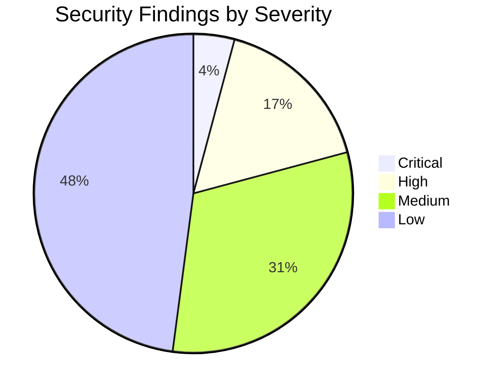

# SecureCLI Usage Guide

SecureCLI is an AI-powered security analysis platform that orchestrates **29 security tools** across **25+ programming languages**. This comprehensive guide covers all aspects of using SecureCLI for security analysis.

## Table of Contents

1. [Getting Started](#getting-started)
2. [Quick Start](#quick-start)
3. [CLI Interface](#cli-interface)
4. [Workspace Management](#workspace-management)
5. [Security Analysis](#security-analysis)
6. [Tool Management](#tool-management)
7. [Module System](#module-system)
8. [AI Integration & Finding Explanation](#ai-integration--finding-explanation)
9. [Reporting](#reporting)
10. [Configuration](#configuration)
11. [CI/CD Integration](#cicd-integration)
12. [Advanced Usage](#advanced-usage)
13. [Real-World Examples](#real-world-examples)
14. [Troubleshooting](#troubleshooting)
15. [Additional Resources](#additional-resources)

## Getting Started

### System Requirements

- **Python:** 3.8 or higher
- **Operating System:** Linux, macOS, Windows (WSL recommended) or WSL2
- **Memory:** 4GB RAM minimum (8GB recommended for comprehensive scans)

### Installation Methods

#### Docker (Recommended)
```bash
# Quick start with Docker
docker run -it --rm \
  -v $(pwd):/workspace \
  -e OPENAI_API_KEY=$OPENAI_API_KEY \
  securecli/securecli:latest
```

#### Local Installation

##### Install from PyPI
```bash
pip install securecli
```

##### Install from source
```bash
git clone https://github.com/securecli/securecli.git
cd securecli
pip install -e .
```

##### Quick Install (Linux/macOS/WSL)
```bash
# Clone the repository
git clone https://github.com/your-org/SecureCLI.git
cd SecureCLI

# Create and activate virtual environment
python3 -m venv .venv
source .venv/bin/activate  # On Windows WSL: source .venv/bin/activate

# Install Python dependencies
pip install -r requirements-dev.txt

# Install ALL 29 security tools (recommended)
chmod +x scripts/install-all-tools.sh
sudo ./scripts/install-all-tools.sh
```

##### Quick Install (Windows PowerShell - Run as Administrator)
```powershell
# Clone the repository
git clone https://github.com/your-org/SecureCLI.git
cd SecureCLI

# Create and activate virtual environment
python -m venv .venv
.venv\Scripts\Activate.ps1

# Install Python dependencies
pip install -r requirements-dev.txt

# Install ALL 29 security tools
Set-ExecutionPolicy Bypass -Scope Process -Force
.\scripts\install-security-tools.ps1
```

### Environment Setup

1. Copy the example environment file:
   ```bash
   cp .env.example .env
   ```

2. Update `.env` with your secrets and provider settings:
   ```bash
   # OpenAI integration (optional but recommended for AI features)
   OPENAI_API_KEY=sk-your-api-key-here

   # Local AI model (alternative to OpenAI)
   SECURE_LOCAL_MODEL_ENABLED=true
   SECURE_LOCAL_MODEL_MODEL_NAME=deepseek-coder-v2:16b
   SECURE_LOCAL_MODEL_BASE_URL=http://localhost:11434
   ```

### Verify Installation

```bash
# Activate virtual environment if not already active
source .venv/bin/activate    # Linux/macOS/WSL
# OR
.venv\Scripts\Activate.ps1   # Windows PowerShell

# Launch SecureCLI
securecli

# Inside SecureCLI, confirm tool availability
secureᶜˡⁱ(default)› tools check
```

### First-Time Setup

1. **Configure API Keys**:
   ```bash
   export OPENAI_API_KEY="sk-..."
   # OR
   export ANTHROPIC_API_KEY="sk-ant-..."
   ```

2. **Verify Installation**:
   ```bash
   securecli --version
   securecli --help
   ```

3. **Check Dependencies**:
   ```bash
   securecli doctor
   ```

## Quick Start

### Launch SecureCLI

```bash
# Activate your virtual environment first
source .venv/bin/activate    # Linux/macOS/WSL
# OR
.venv\Scripts\Activate.ps1   # Windows PowerShell

# Start the interactive shell
securecli
```

When the shell starts you will see:
```
🔒 SecureCLI v1.0 - AI-Powered Multi-Language Security Analysis
Type 'help' for available commands

secureᶜˡⁱ(default)›
```

### Your First Security Scan

```bash
# 1. Check available security tools
secureᶜˡⁱ(default)› tools check

# 2. Detect languages in your project
secureᶜˡⁱ(default)› languages ./my-project

# 3. Run a quick security scan
secureᶜˡⁱ(default)› scan quick ./my-project

# 4. Upgrade to comprehensive analysis with AI support
secureᶜˡⁱ(default)› scan comprehensive ./my-project

# 5. Generate full reports (Markdown, JSON, SARIF, CSV, CI summary)
secureᶜˡⁱ(default)› report all ci
```

### Quick Command Reference

```bash
help                # Show all available commands
status              # Display system status
tools check         # Verify all 29 security tools
scan quick          # Fast security scan
scan comprehensive  # Deep scan with all tools
report              # Generate Markdown/JSON reports for last scan
ai-status           # Check AI integration status
modules             # List scanner modules
exit                # Exit SecureCLI
```

## CLI Interface

SecureCLI provides a Metasploit-style interactive CLI with intelligent autocompletion and context-aware commands.

### Starting SecureCLI

```bash
# Interactive mode
securecli

# Headless mode
securecli --repo /path/to/repo --mode comprehensive

# CI mode
securecli --ci --repo . --fail-on-critical
```

### Core Commands

#### Navigation and Context
```bash
# Enter workspace context
use workspace

# Enter module context
use scanner/semgrep
use auditor/web3

# Return to previous context
back

# Exit SecureCLI
exit
```

#### Information Commands
```bash
# Show available workspaces
show workspaces

# Show available modules
show modules

# Show current options
show options

# Show running jobs
jobs

# Show active sessions
sessions
```

#### Configuration Commands
```bash
# Set target repository
set target /path/to/repo

# Set analysis mode
set mode quick|comprehensive|deep

# Set output directory
set output ./reports

# Set domain profile
set domain web2_backend,web3_smart_contract
```

#### Execution Commands
```bash
# Run analysis
run

# Run specific scanner
scan semgrep
scan gitleaks

# Generate reports
report markdown
report json
report sarif
```

### Autocompletion

SecureCLI provides intelligent autocompletion for:

- **Commands**: All available commands and subcommands
- **Modules**: Scanner, auditor, tighten, and reporter modules
- **Paths**: File and directory paths
- **Options**: Configuration options and values
- **Domains**: Available domain profiles

Example:
```bash
securecli> use <TAB>
workspace  scanner/   auditor/   tighten/   reporter/

securecli> set <TAB>
target     mode       output     domain     verbose

securecli> set mode <TAB>
quick      comprehensive      deep
```

## Workspace Management

Workspaces provide isolated environments for different analysis projects.

### Creating Workspaces

```bash
# Create new workspace
securecli> use workspace
securecli(workspace)> set name my-project
securecli(workspace)> set target /path/to/repo
securecli(workspace)> save
```

### Managing Workspaces

```bash
# List workspaces
show workspaces

# Load existing workspace
load my-project

# Export workspace
export my-project /path/to/backup.json

# Import workspace
import /path/to/backup.json

# Delete workspace
delete my-project
```

### Workspace Configuration

Each workspace maintains:
- Target repository path
- Analysis configuration
- Module settings
- Historical results
- Custom rules and filters

Example workspace structure:
```
workspaces/
├── my-project/
│   ├── config.yml
│   ├── results/
│   │   ├── scan_20231201_143022.json
│   │   └── scan_20231201_150145.json
│   ├── cache/
│   └── custom_rules/
```

## Security Analysis

### Analysis Modes

#### Quick Mode
- **Duration**: 2-5 minutes
- **Tools**: Automated scanners only
- **Coverage**: Basic security issues
- **Use Case**: Fast feedback, CI/CD integration

```bash
securecli> set mode quick
securecli> run
```

#### Comprehensive Mode  
- **Duration**: 10-30 minutes
- **Tools**: Scanners + AI auditors
- **Coverage**: Deep security analysis
- **Use Case**: Regular security reviews

```bash
securecli> set mode comprehensive
securecli> run
```

#### Deep Mode
- **Duration**: 30-60 minutes
- **Tools**: Scanners + Auditors + Hardening
- **Coverage**: Complete security assessment
- **Use Case**: Pre-release audits, compliance

```bash
securecli> set mode deep
securecli> run
```

**Scan Modes Explained:**
- **quick** – Fast scan using core tools (Bandit, Semgrep, Gitleaks); ideal for 1-2 minute feedback loops.
- **comprehensive** – Deep scan with the full toolset and AI auditors; expect 15-30 minutes for large repos.
- **deep** – Maximum coverage including auditors and hardening modules; schedule 30-60 minutes for release gates.

### Domain-Specific Analysis

SecureCLI automatically detects technology stacks and applies appropriate analysis:

#### Web2 Frontend
```bash
# Detected: React, Vue, Angular
Technologies: JavaScript, TypeScript, HTML, CSS
Focus Areas: XSS, CSRF, Client-side injection, CORS
Tools: Semgrep (JS/TS rules), ESLint security plugin
```

#### Web2 Backend
```bash
# Detected: Python, Java, Go, Node.js
Technologies: Django, Spring, Express, FastAPI
Focus Areas: SQL injection, Command injection, Auth bypass
Tools: Semgrep, Bandit, Gosec, Dependency scanners
```

#### Web3 Smart Contracts
```bash
# Detected: Solidity, Vyper
Technologies: Hardhat, Truffle, Foundry
Focus Areas: Reentrancy, Integer overflow, Access control
Tools: Slither, Mythril, Semgrep (Solidity rules)
```

### Analysis Workflow

1. **Repository Analysis**: File enumeration and technology detection
2. **Scanner Execution**: Parallel execution of security tools
3. **Finding Normalization**: Convert tool outputs to unified schema
4. **AI Analysis**: LLM-powered deep security review
5. **Cross-file Analysis**: Multi-file vulnerability detection
6. **Report Generation**: Comprehensive security reports

### Real-time Monitoring

```bash
# Monitor running analysis
securecli> jobs
ID    Module              Status      Progress
1     semgrep_scanner     Running     45%
2     gitleaks_scanner    Complete    100%
3     llm_auditor         Queued      0%

# Show detailed job status
securecli> jobs 1
Job ID: 1
Module: semgrep_scanner
Status: Running
Started: 2023-12-01 14:30:22
Progress: 45% (120/267 files)
Current: analyzing src/auth/models.py
```

## Tool Management

### Check & List Tools

```bash
tools check             # Verify availability of all 29 security tools
tools list              # List every tool SecureCLI can invoke
tools info <tool_name>  # Detailed information about a specific tool
```

Example status output:
```
Security Tools Status:
──────────────────────────────────────────────────
Core Tools:
  ✅ Bandit           Available (v1.7.5)
  ✅ Semgrep          Available (v1.45.0)
  ✅ Gitleaks         Available (v8.18.0)
  ✅ Gosec            Available (v2.18.2)
  ✅ Slither          Available (v0.10.0)
  ✅ NPM Audit        Available (v10.2.3)

Language Analyzers:
  ✅ Java (SpotBugs)  Available (v4.8.1)
  ✅ C# (DevSkim)     Available (v0.7.104)
  ✅ Rust (Clippy)    Available (v0.1.75)
  ... (all 29 tools)

Total: 29/29 tools available (100%)
```

### Tool Installation Status

```bash
# Check which tools are installed
secureᶜˡⁱ(default)› tools check

# Install missing tools on Linux/macOS/WSL
sudo ./scripts/install-all-tools.sh

# Install missing tools on Windows (PowerShell)
.\scripts\install-security-tools.ps1
```

Use `tools info <tool>` to confirm versions, supported languages, and troubleshooting hints for individual tools (e.g., `tools info slither`).

### Tool Inventory

SecureCLI orchestrates **29 security analysis tools** across **25+ programming languages**.

#### Core Universal Tools (6)

| Tool | Purpose | Languages |
|------|---------|-----------|
| **Bandit** | Python security linter | Python |
| **Semgrep** | Multi-language static analysis | Universal (30+ languages) |
| **Gitleaks** | Secret and credential detection | Universal (all text files) |
| **Gosec** | Go security scanner | Go |
| **Slither** | Smart contract analyzer | Solidity, Vyper |
| **NPM Audit** | Dependency vulnerability scanner | JavaScript, TypeScript |

#### Language-Specific Analyzers (23)

1. **Java** – SpotBugs, PMD, Find Security Bugs
2. **C# / .NET** – DevSkim, .NET CLI analyzers
3. **C++** – Clang-Tidy, CppCheck
4. **C** – Clang Static Analyzer
5. **Rust** – Clippy, Cargo Audit
6. **PHP** – PHPStan, Psalm
7. **Ruby** – Brakeman, RuboCop, bundler-audit
8. **Swift** – SwiftLint
9. **Kotlin** – Detekt
10. **Scala** – Scalafix, Scalastyle
11. **Go** – Go-critic, Staticcheck, Gosec
12. **Solidity** – Solc, Slither
13. **Vyper** – Vyper Compiler
14. **Dart/Flutter** – Dart Analyzer
15. **Haskell** – HLint
16. **Perl** – Perl::Critic
17. **Lua** – Luacheck
18. **Erlang/Elixir** – Dialyzer, Credo
19. **F#** – F# Compiler warnings
20. **Objective-C** – Clang Static Analyzer
21. **Cairo (StarkNet)** – Cairo Compiler
22. **Move (Sui/Aptos)** – Move Prover
23. **Clarity (Stacks)** – Clarity CLI analyzer

#### Language Coverage Highlights

- **Web Technologies:** Python, JavaScript/TypeScript, PHP, Ruby
- **Systems Programming:** C, C++, Rust, Go, Zig
- **Enterprise:** Java, C#, Scala, Kotlin
- **Mobile:** Swift, Kotlin, Dart/Flutter, Objective-C
- **Functional:** Haskell, F#, Erlang/Elixir, OCaml
- **Blockchain:** Solidity, Vyper, Cairo, Move, Clarity
- **Scripting:** Perl, Lua, Shell/Bash, PowerShell

## Module System

SecureCLI uses a modular architecture with four types of modules:

### Scanner Modules
Automated security scanning tools:

```bash
# Available scanners
show modules scanner

# Use specific scanner
use scanner/semgrep
set rulesets security,owasp-top-ten
set timeout 300
run

# Configure scanner
use scanner/gitleaks
set redact-secrets true
set config-path ./custom-gitleaks.toml
run
```

### Auditor Modules
AI-powered security analysis:

```bash
# Web2 auditors
use auditor/frontend
use auditor/backend
use auditor/api

# Web3 auditors  
use auditor/smart-contract
use auditor/defi

# Configure auditor
use auditor/backend
set max-files 10
set model gpt-4
set temperature 0.1
run
```

### Tighten Modules
Security hardening recommendations:

```bash
# Available tighten modules
use tighten/infrastructure
use tighten/dependencies
use tighten/configuration

# Generate hardening report
use tighten/infrastructure
run
```

### Reporter Modules
Report generation and export:

```bash
# Generate reports
use reporter/markdown
use reporter/json
use reporter/sarif

# Custom report configuration
use reporter/markdown
set include-diagrams true
set template executive
run
```

### Module Configuration

Each module supports configuration options:

```bash
# Show module options
use scanner/semgrep
show options

# Available options:
Option          Value           Description
timeout         300             Analysis timeout in seconds
rulesets        auto,security   Semgrep rulesets to use
custom-rules    []              Custom rule files
exclude         node_modules    Patterns to exclude
```

## AI Integration & Finding Explanation

SecureCLI can augment traditional scanning with AI-powered explanations, false-positive triage, and remediation guidance.

### Setting Up AI Integration

#### Option 1: OpenAI API (Cloud, Recommended)

1. Generate an API key at <https://platform.openai.com/api-keys>.
2. Store the key in your environment or `.env` file:
   ```bash
   OPENAI_API_KEY=sk-your-api-key-here
   SECURE_LLM_PROVIDER=openai
   ```
3. Validate the connection:
   ```bash
   secureᶜˡⁱ(default)› ai-status
   secureᶜˡⁱ(default)› ai test
   ```

#### Option 2: Local AI Model (Privacy-Focused)

1. Install [Ollama](https://ollama.ai/) or your preferred local inference server.
2. Pull a supported model:
   ```bash
   ollama pull deepseek-coder-v2:16b
   # or a smaller variant: ollama pull deepseek-coder:6.7b
   ```
3. Configure SecureCLI:
   ```bash
   SECURE_LOCAL_MODEL_ENABLED=true
   SECURE_LOCAL_MODEL_MODEL_NAME=deepseek-coder-v2:16b
   SECURE_LOCAL_MODEL_BASE_URL=http://localhost:11434
   SECURE_LLM_PROVIDER=local
   ```
4. Test local connectivity:
   ```bash
   secureᶜˡⁱ(default)› ai test-local
   ```

### How to Explain Security Findings with AI

#### Step 1: Run a Security Scan

```bash
secureᶜˡⁱ(default)› scan comprehensive ./my-project
```

Example output:
```
🚨 Security Assessment
──────────────────────────────────────────────────
📊 Total Issues: 7
🎯 Risk Level: 🟠 MEDIUM RISK

Issues by Severity:
  🔴 Critical: 2
  🟠 High: 1
  🟡 Medium: 3
  🔵 Low: 1

Finding #1: SQL Injection vulnerability in user_auth.py:45
Finding #2: Hardcoded API key in config.js:12
Finding #3: Command injection in file_handler.py:89
...
```

#### Step 2: Get AI-Powered Analysis

**Option A – Explain Individual Findings**

```bash
secureᶜˡⁱ(default)› explain 1    # Analyze Finding #1
secureᶜˡⁱ(default)› explain 5    # Analyze Finding #5
```

**Option B – Analyze All Findings Together**

```bash
secureᶜˡⁱ(default)› analyze ./my-project
```

Sample AI output:
```
🤖 AI-Powered Security Analysis
──────────────────────────────────────────────────
Finding #1: SQL Injection in user_auth.py:45
  📝 AI Explanation: Direct string interpolation in SQL query...
  🎯 Attack Scenario: admin' OR '1'='1
  🔧 Recommended Fix: Use parameterized queries
  ⚠️ False Positive Assessment: 0% (genuine)

Finding #2: Hardcoded API Key in settings.js:12
  📝 AI Explanation: API key committed to source control
  🔧 Recommended Fix: Rotate key and load from environment variables
  ⚠️ False Positive Assessment: 0%
```

### Understanding AI Analysis Components

| Component | Description |
|-----------|-------------|
| **📝 AI Explanation** | Plain-language summary of the vulnerability |
| **🎯 Attack Scenario** | Example exploit path to illustrate risk |
| **🔧 Recommended Fix** | Remediation guidance with code samples |
| **⚠️ False Positive Assessment** | Likelihood that the finding is noise |
| **Priority** | Suggested urgency for remediation |

### AI Commands Reference

```bash
ai-status               # Show AI integration status
ai test                 # Validate OpenAI/API connectivity
ai test-local           # Validate local model connectivity
explain <number>        # AI analysis for a single finding
analyze <path>          # Run AI explanations for all findings
config set llm.provider # Switch between openai and local
```

### Best Practices for AI Analysis

1. Run `scan comprehensive` before invoking AI commands to provide full context.
2. Review AI suggestions alongside source findings—treat AI as an assistant, not an oracle.
3. Document remediation decisions, especially when dismissing findings as false positives.
4. Prefer local models when privacy or cost constraints apply; use OpenAI for best accuracy.

### Troubleshooting AI Integration

- **AI Status shows Disabled**: Ensure `OPENAI_API_KEY` or local model settings are present in `.env`.
- **Generic AI responses**: Provide richer context with `scan comprehensive` before `analyze`.
- **Local model is slow**: Pull a smaller model (`ollama pull deepseek-coder:6.7b`) or increase hardware resources.
- **API rate limits/costs**: Switch to the local provider: `config set llm.provider local`.

## Reporting

### Report Types

#### Markdown Reports
Human-readable reports with diagrams and visualizations:

```bash
securecli> report markdown
Generated: ./output/security_report_20231201_143022.md
```

Features:
- Executive summary with risk scoring
- Detailed findings with CVSS scores
- Mermaid diagrams for visualization
- Remediation roadmap with timelines
- Code snippets and examples

#### JSON Reports
Machine-readable structured data:

```bash
securecli> report json
Generated: ./output/security_report_20231201_143022.json
```

Structure:
```json
{
  "version": "1.0",
  "generated_at": "2023-12-01T14:30:22",
  "metadata": {...},
  "executive_summary": {...},
  "findings": [...],
  "statistics": {...}
}
```

#### SARIF Reports
CI/CD integration format:

```bash
securecli> report sarif
Generated: ./output/security_results_20231201_143022.sarif
```

Compatible with:
- GitHub Security tab
- Azure DevOps
- GitLab Security Reports
- Visual Studio Code

#### CSV Reports
Spreadsheet-compatible summaries:

```bash
securecli> report csv
Generated: ./output/findings_summary_20231201_143022.csv
```

### Report Customization

```bash
# Configure report generation
set report-template executive|technical|compliance
set include-diagrams true
set max-findings 100
set group-by severity|file|category

# Generate custom report
report markdown
```

Available commands:
```bash
report [formats]      # Generate Markdown and JSON by default
report all ci         # Produce Markdown, JSON, SARIF, CSV, and CI summary
report markdown json  # Limit output to specific formats
```

### Diagrams and Visualizations

SecureCLI generates Mermaid diagrams for:

1. **Severity Distribution**: Pie chart of findings by severity
2. **File Heat Map**: Files with most security issues
3. **Attack Flow**: Potential attack vectors and paths
4. **OWASP Mapping**: Coverage of OWASP Top 10
5. **Remediation Timeline**: Recommended fix schedule

Example diagram:


## Configuration

### Configuration Methods

1. **Environment variables** – highest priority, ideal for CI/CD and secrets.
2. **Interactive commands** – session-scoped overrides while using the CLI.
3. **Config files** – project defaults committed with the repository.

### Configuration Hierarchy

1. **System Defaults**: Built-in configuration
2. **Config File**: `config.yml` or specified file
3. **Environment Variables**: `.env` file or system environment
4. **Workspace Config**: Per-workspace overrides
5. **CLI Arguments**: Runtime parameters

### Configuration File Structure

```yaml
# config.yml
mode: comprehensive

app:
  debug: false
  log_level: INFO

output:
  format: markdown
  dir: ./security-reports

tools:
  enabled:
    - bandit
    - semgrep
    - gitleaks
    - gosec
    - slither
    - java_analyzer
    - rust_analyzer
  timeout: 300

llm:
  provider: openai
  model: gpt-4
  temperature: 0.1

local_model:
  enabled: true
  engine: ollama
  model_name: deepseek-coder-v2:16b
  base_url: http://localhost:11434

rag:
  enabled: true
  chunk_size: 1000
  overlap: 200

scan:
  exclude_paths:
    - node_modules/
    - .venv/
    - venv/
    - __pycache__/
    - .git/
  max_file_size: 10485760  # 10MB
```

### Environment Variables

```bash
# Core Configuration
export SECURE_MODE=comprehensive
export SECURE_OUTPUT_FORMAT=json
export SECURE_OUTPUT_DIR=./security-reports

# AI Configuration - OpenAI
export OPENAI_API_KEY="sk-..."
export SECURE_LLM_PROVIDER=openai

# AI Configuration - Anthropic (optional)
export ANTHROPIC_API_KEY="sk-ant-..."

# AI Configuration - Local Model
export SECURE_LOCAL_MODEL_ENABLED=true
export SECURE_LOCAL_MODEL_ENGINE=ollama
export SECURE_LOCAL_MODEL_MODEL_NAME=deepseek-coder-v2:16b
export SECURE_LOCAL_MODEL_BASE_URL=http://localhost:11434

# Tool Configuration
export SECURE_TOOLS_ENABLED=bandit,semgrep,gitleaks
export SECURE_TOOLS_TIMEOUT=300

# Retrieval-Augmented Generation (RAG)
export SECURE_RAG_ENABLED=true

# Application Settings
export SECURECLI_DEBUG=false
export SECURECLI_LOG_LEVEL=INFO
export SECURECLI_CONFIG_PATH=./config.yml

# Tool Paths
export SEMGREP_BINARY=/usr/local/bin/semgrep
export GITLEAKS_BINARY=/usr/local/bin/gitleaks
```

### Interactive Configuration

```bash
# View current configuration
secureᶜˡⁱ(default)› config show

# Set configuration values
secureᶜˡⁱ(default)› config set output.format json
secureᶜˡⁱ(default)› config set output.dir ./reports
secureᶜˡⁱ(default)› config set llm.provider local

# Get specific value
secureᶜˡⁱ(default)› config get output.format

# Module-specific options (when a module is active)
secureᶜˡⁱ(default)› use bandit_scanner
secureᶜˡⁱ(bandit_scanner)› set target ./app
secureᶜˡⁱ(bandit_scanner)› show options
secureᶜˡⁱ(bandit_scanner)› run
```

### Advanced Configuration

#### Custom Rules
```yaml
modules:
  semgrep_scanner:
    custom_rules:
      - ./rules/custom-security.yml
      - ./rules/company-specific.yml
```

#### Model Selection
```yaml
llm:
  provider: anthropic
  model: claude-3-sonnet-20240229
  fallback_provider: openai
  fallback_model: gpt-3.5-turbo
```

#### Performance Tuning
```yaml
performance:
  max_workers: 4
  chunk_processing: true
  memory_limit: 2GB
  timeout_analysis: 3600
```

### Common Configuration Examples

#### Example 1: Fast Scanning for CI/CD
```bash
# .env for CI/CD
SECURE_MODE=quick
SECURE_OUTPUT_FORMAT=sarif
SECURE_OUTPUT_DIR=./build/security-reports
SECURE_TOOLS_ENABLED=bandit,semgrep,gitleaks
SECURE_TOOLS_TIMEOUT=180
```

#### Example 2: Deep Analysis with Local AI
```bash
# .env for thorough local analysis
SECURE_MODE=comprehensive
SECURE_LOCAL_MODEL_ENABLED=true
SECURE_LOCAL_MODEL_MODEL_NAME=deepseek-coder-v2:16b
SECURE_LLM_PROVIDER=local
SECURE_RAG_ENABLED=true
SECURE_OUTPUT_FORMAT=markdown
```

#### Example 3: Cloud AI Analysis
```bash
# .env for cloud-powered analysis
OPENAI_API_KEY=sk-your-api-key-here
SECURE_LLM_PROVIDER=openai
SECURE_MODE=comprehensive
SECURE_OUTPUT_FORMAT=json
```

### Output Formats

#### JSON Format
```bash
secureᶜˡⁱ(default)› config set output.format json
```

Output structure:
```json
{
  "scan_id": "scan_20231104_143052",
  "timestamp": "2023-11-04T14:30:52Z",
  "target": "/path/to/project",
  "findings": [
    {
      "id": "1",
      "severity": "critical",
      "tool": "bandit",
      "file": "app/auth.py",
      "line": 45,
      "message": "SQL injection vulnerability",
      "code_snippet": "query = f\"SELECT * FROM users WHERE username = '{username}'\"",
      "ai_explanation": "...",
      "remediation": "..."
    }
  ],
  "summary": {
    "total": 7,
    "critical": 2,
    "high": 1,
    "medium": 3,
    "low": 1
  }
}
```

#### Markdown Format
```bash
secureᶜˡⁱ(default)› config set output.format markdown
```

Generates a formatted report with executive summaries, tool execution details, and remediation guidance.

#### SARIF Format (Static Analysis Results Interchange Format)
```bash
secureᶜˡⁱ(default)› config set output.format sarif
```

Compatible with GitHub Code Scanning, Azure DevOps, GitLab Security Dashboard, and IDE integrations.

## CI/CD Integration

### GitHub Actions

```yaml
# .github/workflows/security.yml
name: Security Analysis
on: [push, pull_request]

jobs:
  security:
    runs-on: ubuntu-latest
    steps:
      - uses: actions/checkout@v3
      
      - name: SecureCLI Analysis
        uses: securecli/action@v1
        with:
          mode: 'comprehensive'
          fail-on-critical: true
          output-format: 'sarif'
        env:
          OPENAI_API_KEY: ${{ secrets.OPENAI_API_KEY }}
      
      - name: Upload SARIF
        uses: github/codeql-action/upload-sarif@v2
        with:
          sarif_file: ./output/security_results.sarif
```

### GitLab CI

```yaml
# .gitlab-ci.yml
security_analysis:
  stage: test
  image: securecli/securecli:latest
  script:
    - securecli --ci --repo . --mode comprehensive --output ./reports
  artifacts:
    reports:
      sast: reports/security_results.sarif
    paths:
      - reports/
  only:
    - merge_requests
    - main
```

### Azure DevOps

```yaml
# azure-pipelines.yml
trigger:
  - main

pool:
  vmImage: 'ubuntu-latest'

steps:
- task: Docker@2
  displayName: 'Security Analysis'
  inputs:
    command: 'run'
    image: 'securecli/securecli:latest'
    arguments: '--ci --repo $(Build.SourcesDirectory) --output $(Build.ArtifactStagingDirectory)'
    environmentVariables: |
      OPENAI_API_KEY=$(OPENAI_API_KEY)

- task: PublishBuildArtifacts@1
  inputs:
    pathToPublish: '$(Build.ArtifactStagingDirectory)'
    artifactName: 'security-reports'
```

### Exit Codes

- **0**: Success (no critical issues)
- **1**: Warning (high severity issues found)
- **2**: Failure (critical issues found)

### Configuration for CI

```yaml
ci:
  enabled: true
  fail_on_critical: true
  fail_on_high: false
  max_findings:
    critical: 0
    high: 5
    medium: 20
    low: 50
```

## Advanced Usage

### Custom Modules

Create custom analysis modules:

```python
# custom_scanner.py
from securecli.modules.base import BaseModule, ModuleConfig

class CustomScannerModule(BaseModule):
    async def execute(self, context, workspace_path):
        # Custom analysis logic
        findings = []
        # ... implement scanning logic
        return findings
    
    def is_applicable(self, context):
        return True  # Module applicability logic
```

### Integration with External Tools

```bash
# Custom tool integration
securecli> use scanner/custom
securecli(scanner/custom)> set tool-path /path/to/custom-tool
securecli(scanner/custom)> set config-path ./custom-config.json
securecli(scanner/custom)> run
```

### Batch Processing

```bash
# Analyze multiple repositories
for repo in repo1 repo2 repo3; do
  securecli --repo $repo --mode quick --output ./reports/$repo
done

# Parallel analysis
parallel securecli --repo {} --mode quick --output ./reports/{/} ::: repo1 repo2 repo3
```

### API Integration

```python
# Python API usage
from securecli import SecureCLI

cli = SecureCLI(config_path='./config.yml')
results = await cli.analyze_repository('/path/to/repo', mode='comprehensive')

print(f"Found {len(results.findings)} security issues")
for finding in results.findings:
    print(f"- {finding.title} ({finding.severity})")
```

## Real-World Examples

### Example 1: Quick Security Check

**Scenario:** You want a fast security check before committing code.

```bash
# Start SecureCLI
securecli

# Quick scan of current directory
secureᶜˡⁱ(default)› scan quick .

# Output:
🚨 Security Assessment
──────────────────────────────────────────────────
📊 Total Issues: 3
🎯 Risk Level: 🟡 LOW RISK
📁 Target: /home/user/project
⚙️  Mode: Quick

Issues by Severity:
  🟡 Medium: 2
  🔵 Low: 1

🔧 Tool Execution Summary
┌──────────────┬────────────┬──────────────┬──────────────┐
│ Security Tool│ Status     │ Issues Found │ Exec Time    │
├──────────────┼────────────┼──────────────┼──────────────┤
│ Bandit       │ ✅ Success │ 2            │ 1.2s         │
│ Semgrep      │ ✅ Success │ 1            │ 3.5s         │
│ Gitleaks     │ ✅ Clean   │ 0            │ 0.8s         │
└──────────────┴────────────┴──────────────┴──────────────┘

Total scan time: 5.5 seconds
```

### Example 2: Comprehensive Analysis with AI

**Scenario:** Deep security audit of a Python web application with AI explanations.

```bash
securecli

# Check AI configuration
secureᶜˡⁱ(default)› ai-status

# Detect languages first
secureᶜˡⁱ(default)› languages ./web-app

Detected Languages:
  • Python (65%) - 45 files
  • JavaScript (25%) - 18 files
  • HTML/CSS (10%) - 12 files

# Run comprehensive scan with all tools
secureᶜˡⁱ(default)› scan comprehensive ./web-app

# Then get AI analysis
secureᶜˡⁱ(default)› analyze ./web-app

🤖 AI-Powered Security Analysis
──────────────────────────────────────────────────
Analyzing 12 findings with AI...

Finding #1: SQL Injection in auth.py:67
──────────────────────────────────────────────────
📝 AI Explanation: Direct string interpolation in SQL query...
🔧 Recommended Fix: Use parameterized queries...
⚠️ False Positive: 0% - Genuine vulnerability

Finding #2: XSS vulnerability in templates/user.html:23
──────────────────────────────────────────────────
📝 AI Explanation: User input rendered without escaping...
🔧 Recommended Fix: Enable template auto-escaping...
⚠️ False Positive: 5% - Likely genuine
```

### Example 3: GitHub Repository Analysis

**Scenario:** Analyze an open-source project from GitHub.

```bash
securecli

# Analyze main branch
secureᶜˡⁱ(default)› github https://github.com/user/vulnerable-app

Cloning repository...
✓ Repository cloned to: /tmp/securecli/vulnerable-app
Detecting languages...
Running security scans...

📊 Repository Analysis Complete
──────────────────────────────────────────────────
Repository: user/vulnerable-app
Branch: main
Languages: Python, JavaScript, Dockerfile
Total Findings: 15
Risk Level: 🔴 HIGH RISK

# Analyze specific branch
secureᶜˡⁱ(default)› github https://github.com/user/repo --branch develop
```

### Example 4: Workspace Management for Multiple Projects

**Scenario:** Managing security scans for multiple projects.

```bash
securecli

# Create workspaces for different projects
secureᶜˡⁱ(default)› workspace create frontend-app
secureᶜˡⁱ(default)› workspace create backend-api
secureᶜˡⁱ(default)› workspace create mobile-app

# List workspaces
secureᶜˡⁱ(default)› workspace list
Available workspaces:
  • default (active)
  • frontend-app
  • backend-api
  • mobile-app

# Switch to frontend workspace
secureᶜˡⁱ(default)› workspace use frontend-app
secureᶜˡⁱ(frontend-app)›

# Configure and scan
secureᶜˡⁱ(frontend-app)› config set output.dir ./frontend-reports
secureᶜˡⁱ(frontend-app)› scan comprehensive ./apps/frontend

# Switch to another workspace
secureᶜˡⁱ(frontend-app)› workspace use backend-api
secureᶜˡⁱ(backend-api)› scan comprehensive ./apps/backend-api
```

### Example 5: Specific Tool Analysis

**Scenario:** Use a specific security tool for targeted analysis.

```bash
securecli

# List available modules
secureᶜˡⁱ(default)› modules
Available Scanner Modules:
  • bandit_scanner - Python security
  • semgrep_scanner - Universal scanner
  • java_scanner - Java analysis
  • rust_scanner - Rust security
  ... (31 total)

# Select Bandit for Python-specific analysis
secureᶜˡⁱ(default)› use bandit_scanner
secureᶜˡⁱ(bandit_scanner)›

# Configure options
secureᶜˡⁱ(bandit_scanner)› show options
Module Options:
  target: (not set)
  severity: high
  confidence: high

secureᶜˡⁱ(bandit_scanner)› set target ./src/api
secureᶜˡⁱ(bandit_scanner)› set severity medium

# Run specific scanner
secureᶜˡⁱ(bandit_scanner)› run

Running Bandit scanner on ./src/api...
✓ Scan complete
Found 5 issues:
  • 2 High severity
  • 3 Medium severity

# Return to main menu
secureᶜˡⁱ(bandit_scanner)› back
secureᶜˡⁱ(default)›
```

### Example 6: CI/CD Integration

**Scenario:** Run SecureCLI in a GitHub Actions workflow.

Create `.github/workflows/security-scan.yml`:

```yaml
name: Security Scan

on:
  push:
    branches: [main, develop]
  pull_request:
    branches: [main]

jobs:
  security-scan:
    runs-on: ubuntu-latest
    
    steps:
      - name: Checkout code
        uses: actions/checkout@v3
      
      - name: Set up Python
        uses: actions/setup-python@v4
        with:
          python-version: '3.11'
      
      - name: Install SecureCLI
        run: |
          pip install -r requirements-dev.txt
          sudo ./scripts/install-all-tools.sh
      
      - name: Run security scan
        env:
          SECURE_MODE: comprehensive
          SECURE_OUTPUT_FORMAT: sarif
          SECURE_OUTPUT_DIR: ./reports
        run: |
          securecli --non-interactive scan comprehensive .
      
      - name: Upload SARIF results
        uses: github/codeql-action/upload-sarif@v2
        with:
          sarif_file: ./reports/security-report.sarif
      
      - name: Upload report artifact
        uses: actions/upload-artifact@v3
        with:
          name: security-report
          path: ./reports/
```

Then in your CI pipeline:
```bash
# Scans run automatically on push/PR
# Results appear in GitHub Security tab
```

### Example 7: Custom Scan Script

**Scenario:** Automate a multi-step security workflow.

Create `security-workflow.txt`:

```bash
# My Security Scan Workflow
# Check system status
status
tools check

# Scan different parts of the project
languages ./frontend
scan quick ./frontend

languages ./backend
scan comprehensive ./backend

languages ./contracts
scan comprehensive ./contracts

# Get AI insights
ai-status
analyze ./backend

# Generate reports
config set output.format json
config set output.dir ./security-reports
```

Run it:
```bash
securecli

secureᶜˡⁱ(default)› script security-workflow.txt

Executing script: security-workflow.txt
──────────────────────────────────────────────────
[1/12] status
[2/12] tools check
[3/12] languages ./frontend
[4/12] scan quick ./frontend
...
Script execution complete!
```

### Example 8: Smart Contract Security

**Scenario:** Audit Ethereum smart contracts.

```bash
securecli

# Check Slither is available
secureᶜˡⁱ(default)› tools info slither

Tool: Slither
Status: ✅ Available (v0.10.0)
Languages: Solidity, Vyper
Description: Static analysis for smart contracts
Features:
  • Vulnerability detection
  • Code optimization
  • Information gathering
  • Detects 90+ vulnerability types

# Scan smart contracts
secureᶜˡⁱ(default)› languages ./contracts

Detected Languages:
  • Solidity (100%) - 8 files

# Comprehensive smart contract audit
secureᶜˡⁱ(default)› scan comprehensive ./contracts

🚨 Security Assessment
──────────────────────────────────────────────────
📊 Total Issues: 23
🎯 Risk Level: 🔴 HIGH RISK
📁 Target: ./contracts

Issues by Severity:
  🔴 Critical: 4  (Reentrancy, Integer overflow)
  🟠 High: 6      (Unchecked calls, Gas issues)
  🟡 Medium: 9    (Code quality, Best practices)
  🔵 Low: 4       (Informational)

🔧 Tool Execution Summary
┌──────────────┬────────────┬──────────────┐
│ Security Tool│ Status     │ Issues Found │
├──────────────┼────────────┼──────────────┤
│ Slither      │ ✅ Success │ 23           │
│ Solc         │ ✅ Success │ 0 warnings   │
└──────────────┴────────────┴──────────────┘

# Get AI explanation of findings
secureᶜˡⁱ(default)› analyze ./contracts

Finding #1: Reentrancy vulnerability in Token.sol:45
──────────────────────────────────────────────────
📝 AI Explanation:
The withdraw() function makes an external call before updating
the user's balance, allowing recursive calls to drain funds...

🔧 Recommended Fix:
Use the checks-effects-interactions pattern:
1. Check conditions
2. Update state
3. Make external calls
```

### Example 9: Multi-Language Project

**Scenario:** Full-stack application with multiple languages.

```bash
securecli

# Detect all languages
secureᶜˡⁱ(default)› languages ./full-stack-app

Detected Languages:
  • Python (35%) - Backend API
  • TypeScript (25%) - Frontend
  • Go (20%) - Microservices
  • Solidity (10%) - Smart contracts
  • Rust (5%) - Performance-critical modules
  • SQL (5%) - Database migrations

# Check available tools for all languages
secureᶜˡⁱ(default)› tools check

Core Tools:
  ✅ Bandit (Python)
  ✅ Semgrep (Universal)
  ✅ Gitleaks (Secrets)
  ✅ Gosec (Go)
  ✅ Slither (Solidity)
  ✅ NPM Audit (JavaScript/TypeScript)

Language Analyzers:
  ✅ Python Analyzer
  ✅ TypeScript Analyzer
  ✅ Go Analyzer
  ✅ Rust Analyzer (Clippy)
  ✅ Solidity Analyzer

Total: 29/29 tools available

# Comprehensive scan of entire project
secureᶜˡⁱ(default)› scan comprehensive ./full-stack-app

Scanning multi-language project...
Progress: [████████████████████████] 100%

📊 Total Issues: 47
By Language:
  • Python: 18 issues
  • TypeScript: 12 issues
  • Go: 9 issues
  • Solidity: 5 issues
  • Rust: 3 issues
```

### Example 10: Configuration Testing

**Scenario:** Test different configuration options.

```bash
securecli

# Test with OpenAI
secureᶜˡⁱ(default)› config set llm.provider openai
secureᶜˡⁱ(default)› ai test
Testing OpenAI API...
✓ Connection successful
✓ Model: gpt-4

# Test with local model
secureᶜˡⁱ(default)› config set llm.provider local
secureᶜˡⁱ(default)› ai test-local
Testing local model...
✓ Ollama running at http://localhost:11434
✓ Model: deepseek-coder-v2:16b
✓ Response time: 1.2s

# Test different output formats
secureᶜˡⁱ(default)› config set output.format json
secureᶜˡⁱ(default)› scan quick ./test-app
✓ Report saved: ./output/security-report.json

secureᶜˡⁱ(default)› config set output.format markdown
secureᶜˡⁱ(default)› scan quick ./test-app
✓ Report saved: ./output/security-report.md
```

## Troubleshooting

### Common Issues

#### 1. API Key Issues
```bash
# Verify API key
echo $OPENAI_API_KEY | cut -c1-10
# Should show: sk-proj-...

# Test API connection
curl -H "Authorization: Bearer $OPENAI_API_KEY" \
     https://api.openai.com/v1/models
```

#### 2. Tool Installation Issues
```bash
# Check tool availability
securecli doctor

# Install missing tools
pip install semgrep
# Follow installation guides for other tools
```

#### 3. Memory Issues
```bash
# Large repository analysis
securecli> set chunk-size 500
securecli> set max-files 1000
securecli> run
```

#### 4. Performance Issues
```bash
# Parallel processing
securecli> set max-workers 8
securecli> set cache-enabled true
securecli> run
```

#### 5. Tool Not Found
```bash
secureᶜˡⁱ(default)› tools check
# If specific tools are missing
./scripts/install-all-tools.sh          # Linux/macOS/WSL
.\scripts\install-security-tools.ps1   # Windows PowerShell
```

#### 6. AI Integration Issues
```bash
secureᶜˡⁱ(default)› ai-status
# Review .env for OPENAI_API_KEY or local model settings
```

#### 7. Permission Issues
```bash
# Ensure custom-installed tools are executable
sudo chmod +x /usr/local/bin/gitleaks
```

#### 8. Local Model Performance
```bash
# Use a smaller model or switch providers
ollama pull deepseek-coder:6.7b
config set llm.provider local
```

### Debug Mode

```bash
# Enable debug logging
export SECURECLI_DEBUG=true
export SECURECLI_LOG_LEVEL=DEBUG

# Run with verbose output
securecli --verbose --repo . --mode quick
```

### Log Analysis

```bash
# Check logs
tail -f ~/.securecli/logs/securecli.log

# Search for errors
grep ERROR ~/.securecli/logs/securecli.log

# Analyze performance
grep "Analysis completed" ~/.securecli/logs/securecli.log
```

### Getting Help

1. **Check Documentation**: Available commands and options
2. **Use Built-in Help**: `help` command in CLI
3. **Debug Output**: Enable debug mode for detailed logs
4. **GitHub Issues**: Report bugs and request features
5. **Community Discord**: Real-time support and discussions

### Support Channels

- **GitHub Issues**: Bug reports and feature requests
- **GitHub Discussions**: Community support and Q&A
- **Documentation**: Comprehensive guides and API reference
- **Email Support**: security@securecli.com

## Additional Resources

- [GitHub Repository](https://github.com/your-org/SecureCLI)
- [Security Best Practices](./docs/security-best-practices.md)
- [API Documentation](./docs/api.md)
- [Contributing Guide](./docs/contributing.md)

---

This usage guide covers the essential aspects of SecureCLI. For more detailed information, refer to the specific documentation sections for architecture, security model, and development guides.
