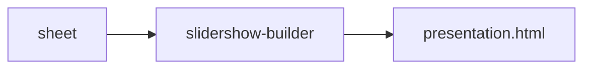

Build a [slidershow](https://github.com/CZ-NIC/slidershow/) media presentation from a sheet.

Just put file names into the sheet and we generate the HTML file.




# Features

* Find files on disk, evade hassling with the relative paths.

Ex. You just use the file name from Google Photos, slidershow-builder will find an original file within the given directories scope.

* auto-conversion

Some formats cannot be played in the browser; slidershow-builder will automatically creates a cache folder with the mp4 files, playable everywhere.

# Installation

```bash
pip install slidershow-builder
```

# Usage

```bash
$ slidershow-builder --help
usage: slidershow-builder [-h] [OPTIONS]

╭─ options ──────────────────────────────────────────────────────────────────╮
│ -h, --help                                                                 │
│     show this help message and exit                                        │
│ --verbose, -v                                                              │
│     verbosity level, can be used multiple times to increase                │
│ --file PATH                                                                │
│     (required)                                                             │
│ --sheet STR                                                                │
│     Sheet name to process. If None, all will be processed and multiple     │
│     files will be generated (if `--output` set).                           │
│                                                                            │
│                                                                            │
│        Format of the sheet                                                 │
│                                                                            │
│                                                                            │
│        Columns:                                                            │
│            comment   filename       start   commands                       │
│                                                                            │
│                                                                            │
│            Comment is an inserted HTML comment, displayed at the           │
│     presenter's notes.                                                     │
│                                                                            │
│                                                                            │
│        Text frame                                                          │
│          filename: <empty>                                                 │
│          start: header                                                     │
│          commands: subtitle                                                │
│                                                                            │
│                                                                            │
│        Image frame                                                         │
│          start: point                                                      │
│            [left = 0, top = 0, scale = 1, transition_duration = 0,         │
│     duration = 0, data-rotate = 0]                                         │
│            Ex: `[[], [100,100,5]]` will begin unzoomed, on the next frame  │
│     we zoom to 5.                                                          │
│                                                                            │
│                                                                            │
│            See:                                                            │
│     https://github.com/CZ-NIC/slidershow/?tab=readme-ov-file#data-step-poi │
│     nts                                                                    │
│                                                                            │
│                                                                            │
│            How to get the point? Go to the slidershow in the browser, open │
│     properties Alt+p and click on the new point.                           │
│                                                                            │
│                                                                            │
│        Video frame                                                         │
│            start                                                           │
│              * video start time, empty = 0:00                              │
│            commands                                                        │
│              * number is a timestamp, jehož akce určují následující buňky  │
│              * posouvací šipka, ex: `→60.5` skočí z momentu na 60.5        │
│              * rate a číslo změní rate momentu `rate 2`                    │
│              * mute, unmute                                                │
│              * R+number(M|U): rate. Ex: `R2` = rate 2, `R4M` = rate 4 +    │
│     mute                                                                   │
│              * P = rate 1, unmute                                          │
│              * F+number: faster rate. Ex `F2` = rate 1.2                   │
│              * comma character behaves like a cell-separator, these are    │
│     independent commands `rate 2, unmute` → `rate 2` a `unmute`            │
│              * poslední osamělé číslo je end                               │
│              * point command zooms, ex: `point:[0,0,2,null,null,270]` zoom │
│     and rotate. (Point musí být v buňce zvlášť.)                           │
│                                                                            │
│                                                                            │
│              Ex: `15, → 4, 1:10`: At 0:15, jump to 0:04, then end at 1:10. │
│                                                                            │
│                                                                            │
│        Section break                                                       │
│          comment: SECTION                                                  │
│                                                                            │
│                                                                            │
│          If the row starts with the word "SECTION", a new `<section>` is   │
│     inserted. (And the row is skipped.)                                    │
│                                                                            │
│                                                                            │
│        Rows:                                                               │
│          Parsing ends on the first empty row. (default: None)              │
│ --output PATH                                                              │
│     By default, the output is printed to the screen. (default: None)       │
│ --replace-in-filename {[STR STR [STR STR ...]]}                            │
│     If set, filename from the sheet will be replaced according to this.    │
│        Ex: --replace-filename /mnt/user /mnt/foo jpg JPG -> filename       │
│     /mnt/user/dir/img.jpg → /mnt/foo/dir/img.JPG (default: None)           │
│ --filename-autosearch {[PATH [PATH ...]]}                                  │
│     If the filename is without path and the file does not exist, try       │
│     finding the file within these dirs. (default: None)                    │
│ --no-filename-autosearch-cache                                             │
│     Use a cache file for filename_autosearch, persistent accress program   │
│     launches. (default: True)                                              │
╰────────────────────────────────────────────────────────────────────────────╯
╭─ convert options ──────────────────────────────────────────────────────────╮
│ Auto-convert for browser-compatible formats.                               │
│ Creates a cached copies with compatible JPG and MP4.                       │
│ ────────────────────────────────────────────────────────────────────────── │
│ --convert.enable                                                           │
│     The cache will be used for needy media. (default: False)               │
│ --convert.no-autogenerate                                                  │
│     If .enable, generate all the needy media to the cache. (default: True) │
│ --convert.cache-dir PATH                                                   │
│     (default: /tmp)                                                        │
│ --convert.no-heic                                                          │
│     Generate JPG from HEIC. (default: True)                                │
│ --convert.no-hevc                                                          │
│     Generate MP4 from HEVC. (default: True)                                │
│ --convert.no-hevc-in-mp4                                                   │
│     Check for HEVC codec in MP4 video files. (default: True)               │
╰────────────────────────────────────────────────────────────────────────────╯
╭─ slidershow options ───────────────────────────────────────────────────────╮
│ --slidershow.template PATH                                                 │
│     HTML template the presentation is made of. (default: ...)              │
│ --slidershow.url STR                                                       │
│     The URL to be used for generating. Ex. you might want to use an        │
│     offline local copy of the project. (default:                           │
│     https://cdn.jsdelivr.net/gh/CZ-NIC/slidershow@main/slidershow/slidersh │
│     ow.js)                                                                 │
╰────────────────────────────────────────────────────────────────────────────╯
```
