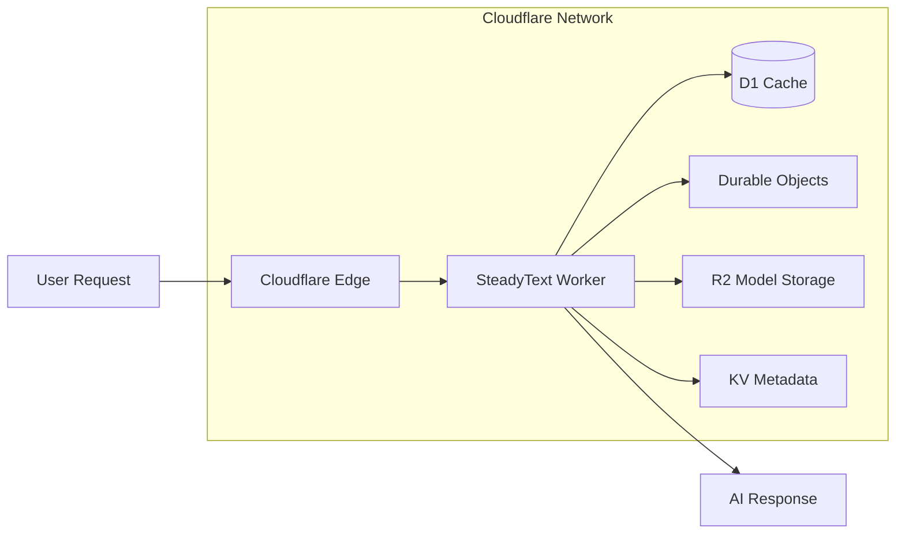

# Edge Deployment with Cloudflare Workers

Deploy SteadyText to the edge for global, low-latency AI inference using Cloudflare Workers and D1.

## Overview

Run SteadyText at the edge with:
- **Global distribution** across 300+ cities
- **Zero cold starts** with Workers
- **D1 database** for distributed caching
- **Durable Objects** for stateful AI operations
- **R2 storage** for model distribution

## Architecture



## Prerequisites

```bash
# Install Wrangler CLI
npm install -g wrangler

# Authenticate with Cloudflare
wrangler login

# Create a new project
wrangler init steadytext-edge
cd steadytext-edge
```

## Worker Implementation

### Basic Worker Setup

```javascript
// src/index.js
import { SteadyTextEdge } from '@steadytext/edge';

export default {
  async fetch(request, env, ctx) {
    const steadytext = new SteadyTextEdge({
      d1Database: env.STEADYTEXT_D1,
      kvNamespace: env.STEADYTEXT_KV,
      r2Bucket: env.STEADYTEXT_R2,
    });

    const url = new URL(request.url);
    
    // Handle different endpoints
    switch (url.pathname) {
      case '/generate':
        return handleGenerate(request, steadytext);
      
      case '/embed':
        return handleEmbed(request, steadytext);
      
      case '/health':
        return new Response('OK', { status: 200 });
      
      default:
        return new Response('Not Found', { status: 404 });
    }
  }
};

async function handleGenerate(request, steadytext) {
  try {
    const { prompt, max_tokens = 100 } = await request.json();
    
    if (!prompt) {
      return new Response(
        JSON.stringify({ error: 'Prompt required' }), 
        { 
          status: 400,
          headers: { 'Content-Type': 'application/json' }
        }
      );
    }
    
    // Check cache first
    const cacheKey = `gen:${prompt}:${max_tokens}`;
    const cached = await steadytext.getFromCache(cacheKey);
    
    if (cached) {
      return new Response(
        JSON.stringify({ 
          text: cached, 
          cached: true 
        }), 
        { 
          headers: { 'Content-Type': 'application/json' }
        }
      );
    }
    
    // Generate new response
    const result = await steadytext.generate(prompt, { max_tokens });
    
    // Cache the result
    ctx.waitUntil(
      steadytext.setCache(cacheKey, result)
    );
    
    return new Response(
      JSON.stringify({ 
        text: result, 
        cached: false 
      }), 
      { 
        headers: { 'Content-Type': 'application/json' }
      }
    );
  } catch (error) {
    return new Response(
      JSON.stringify({ error: error.message }), 
      { 
        status: 500,
        headers: { 'Content-Type': 'application/json' }
      }
    );
  }
}

async function handleEmbed(request, steadytext) {
  try {
    const { text } = await request.json();
    
    if (!text) {
      return new Response(
        JSON.stringify({ error: 'Text required' }), 
        { 
          status: 400,
          headers: { 'Content-Type': 'application/json' }
        }
      );
    }
    
    const embedding = await steadytext.embed(text);
    
    return new Response(
      JSON.stringify({ embedding }), 
      { 
        headers: { 'Content-Type': 'application/json' }
      }
    );
  } catch (error) {
    return new Response(
      JSON.stringify({ error: error.message }), 
      { 
        status: 500,
        headers: { 'Content-Type': 'application/json' }
      }
    );
  }
}
```

### Configuration (wrangler.toml)

```toml
name = "steadytext-edge"
main = "src/index.js"
compatibility_date = "2024-01-01"

# D1 Database binding
[[d1_databases]]
binding = "STEADYTEXT_D1"
database_name = "steadytext-cache"
database_id = "your-database-id"

# KV Namespace binding
[[kv_namespaces]]
binding = "STEADYTEXT_KV"
id = "your-kv-namespace-id"

# R2 Bucket binding
[[r2_buckets]]
binding = "STEADYTEXT_R2"
bucket_name = "steadytext-models"

# Durable Objects
[[durable_objects.bindings]]
name = "AI_ENGINE"
class_name = "SteadyTextEngine"
script_name = "steadytext-engine"

# Environment variables
[vars]
STEADYTEXT_MODEL = "gemma-3n-edge"
STEADYTEXT_MAX_TOKENS = "512"
STEADYTEXT_CACHE_TTL = "86400"

# Performance settings
[build]
command = "npm run build"

[miniflare]
kv_persist = true
d1_persist = true
r2_persist = true
```

## D1 Database Setup

### Create Schema

```sql
-- Create D1 database
wrangler d1 create steadytext-cache

-- Apply schema
wrangler d1 execute steadytext-cache --file=./schema.sql
```

```sql
-- schema.sql
CREATE TABLE IF NOT EXISTS generation_cache (
    cache_key TEXT PRIMARY KEY,
    prompt TEXT NOT NULL,
    parameters TEXT,
    result TEXT NOT NULL,
    token_count INTEGER,
    created_at INTEGER DEFAULT (unixepoch()),
    accessed_at INTEGER DEFAULT (unixepoch()),
    access_count INTEGER DEFAULT 1
);

CREATE INDEX idx_cache_created ON generation_cache(created_at);
CREATE INDEX idx_cache_accessed ON generation_cache(accessed_at);

CREATE TABLE IF NOT EXISTS embedding_cache (
    text_hash TEXT PRIMARY KEY,
    text TEXT NOT NULL,
    embedding BLOB NOT NULL,
    dimension INTEGER,
    created_at INTEGER DEFAULT (unixepoch())
);

CREATE TABLE IF NOT EXISTS request_metrics (
    id INTEGER PRIMARY KEY AUTOINCREMENT,
    endpoint TEXT NOT NULL,
    duration_ms INTEGER,
    cached BOOLEAN,
    timestamp INTEGER DEFAULT (unixepoch()),
    region TEXT
);
```

### Cache Management

```javascript
// src/cache.js
export class EdgeCache {
  constructor(d1, kv) {
    this.d1 = d1;
    this.kv = kv;
  }

  async get(key) {
    // Try KV first (faster)
    const kvResult = await this.kv.get(key);
    if (kvResult) {
      return JSON.parse(kvResult);
    }

    // Fall back to D1
    const { results } = await this.d1
      .prepare('SELECT result FROM generation_cache WHERE cache_key = ?')
      .bind(key)
      .first();

    if (results) {
      // Update access time and count
      await this.d1
        .prepare(`
          UPDATE generation_cache 
          SET accessed_at = unixepoch(), 
              access_count = access_count + 1 
          WHERE cache_key = ?
        `)
        .bind(key)
        .run();

      // Promote to KV if frequently accessed
      if (results.access_count > 10) {
        await this.kv.put(key, results.result, {
          expirationTtl: 3600 // 1 hour in KV
        });
      }

      return results.result;
    }

    return null;
  }

  async set(key, value, ttl = 86400) {
    // Store in D1 for persistence
    await this.d1
      .prepare(`
        INSERT OR REPLACE INTO generation_cache 
        (cache_key, prompt, result, created_at) 
        VALUES (?, ?, ?, unixepoch())
      `)
      .bind(key, key.split(':')[1], JSON.stringify(value))
      .run();

    // Also store in KV for fast access
    await this.kv.put(key, JSON.stringify(value), {
      expirationTtl: ttl
    });
  }

  async cleanup(maxAge = 2592000) { // 30 days
    const cutoff = Date.now() / 1000 - maxAge;
    
    await this.d1
      .prepare('DELETE FROM generation_cache WHERE accessed_at < ?')
      .bind(cutoff)
      .run();
  }
}
```

## Durable Objects for Stateful AI

```javascript
// src/engine.js
export class SteadyTextEngine {
  constructor(state, env) {
    this.state = state;
    this.env = env;
    this.model = null;
    this.initPromise = null;
  }

  async initialize() {
    if (this.model) return;
    
    if (!this.initPromise) {
      this.initPromise = this.loadModel();
    }
    
    await this.initPromise;
  }

  async loadModel() {
    // Load model from R2
    const modelData = await this.env.STEADYTEXT_R2.get('models/gemma-3n-edge.bin');
    
    if (!modelData) {
      throw new Error('Model not found in R2');
    }

    // Initialize model (simplified)
    this.model = await createModel(await modelData.arrayBuffer());
  }

  async fetch(request) {
    await this.initialize();

    const { method, params } = await request.json();

    switch (method) {
      case 'generate':
        return this.handleGenerate(params);
      
      case 'embed':
        return this.handleEmbed(params);
      
      default:
        return new Response(
          JSON.stringify({ error: 'Unknown method' }), 
          { status: 400 }
        );
    }
  }

  async handleGenerate({ prompt, max_tokens = 100 }) {
    // Use the model for generation
    const result = await this.model.generate(prompt, {
      max_tokens,
      temperature: 0, // Deterministic
      seed: 42
    });

    return new Response(
      JSON.stringify({ text: result }), 
      { 
        headers: { 'Content-Type': 'application/json' }
      }
    );
  }

  async handleEmbed({ text }) {
    const embedding = await this.model.embed(text);
    
    return new Response(
      JSON.stringify({ embedding: Array.from(embedding) }), 
      { 
        headers: { 'Content-Type': 'application/json' }
      }
    );
  }
}
```

## Model Distribution with R2

```bash
# Upload model to R2
wrangler r2 object put steadytext-models/models/gemma-3n-edge.bin \
  --file ./models/gemma-3n-edge.bin

# List models
wrangler r2 object list steadytext-models
```

### Model Version Management

```javascript
// src/models.js
export class ModelManager {
  constructor(r2Bucket, kvNamespace) {
    this.r2 = r2Bucket;
    this.kv = kvNamespace;
  }

  async getLatestModel(modelName) {
    // Check current version in KV
    const version = await this.kv.get(`model_version:${modelName}`);
    
    if (!version) {
      throw new Error(`Model ${modelName} not found`);
    }

    // Get model from R2
    const modelPath = `models/${modelName}-${version}.bin`;
    const model = await this.r2.get(modelPath);

    if (!model) {
      throw new Error(`Model file ${modelPath} not found`);
    }

    return {
      data: await model.arrayBuffer(),
      version,
      metadata: JSON.parse(model.customMetadata || '{}')
    };
  }

  async updateModelVersion(modelName, newVersion) {
    // Update version in KV
    await this.kv.put(
      `model_version:${modelName}`, 
      newVersion,
      {
        metadata: {
          updated: new Date().toISOString()
        }
      }
    );
  }
}
```

## Performance Optimization

### Request Coalescing

```javascript
// src/coalesce.js
export class RequestCoalescer {
  constructor() {
    this.pending = new Map();
  }

  async coalesce(key, fn) {
    // Check if request is already pending
    if (this.pending.has(key)) {
      return this.pending.get(key);
    }

    // Create new promise
    const promise = fn();
    this.pending.set(key, promise);

    try {
      const result = await promise;
      return result;
    } finally {
      this.pending.delete(key);
    }
  }
}

// Usage in worker
const coalescer = new RequestCoalescer();

async function handleGenerate(request, steadytext) {
  const { prompt, max_tokens } = await request.json();
  const key = `${prompt}:${max_tokens}`;

  const result = await coalescer.coalesce(key, async () => {
    return steadytext.generate(prompt, { max_tokens });
  });

  return new Response(JSON.stringify({ text: result }));
}
```

### Smart Routing

```javascript
// src/router.js
export class SmartRouter {
  constructor(env) {
    this.env = env;
  }

  async route(request) {
    const region = request.cf?.colo || 'unknown';
    const load = await this.getRegionLoad(region);

    if (load > 0.8) {
      // Route to nearby region
      return this.routeToAlternate(request);
    }

    // Process locally
    return this.processLocal(request);
  }

  async getRegionLoad(region) {
    const stats = await this.env.STEADYTEXT_KV.get(
      `load:${region}`,
      { type: 'json' }
    );
    
    return stats?.load || 0;
  }
}
```

## Monitoring and Analytics

### Request Tracking

```javascript
// src/analytics.js
export class EdgeAnalytics {
  constructor(d1) {
    this.d1 = d1;
    this.buffer = [];
    this.flushInterval = 10000; // 10 seconds
  }

  async track(event) {
    this.buffer.push({
      ...event,
      timestamp: Date.now(),
      region: event.cf?.colo || 'unknown'
    });

    if (this.buffer.length >= 100) {
      await this.flush();
    }
  }

  async flush() {
    if (this.buffer.length === 0) return;

    const events = this.buffer.splice(0);
    
    const stmt = this.d1.prepare(`
      INSERT INTO request_metrics 
      (endpoint, duration_ms, cached, timestamp, region) 
      VALUES (?, ?, ?, ?, ?)
    `);

    const batch = events.map(e => 
      stmt.bind(e.endpoint, e.duration, e.cached, e.timestamp, e.region)
    );

    await this.d1.batch(batch);
  }

  async getMetrics(hours = 24) {
    const since = Date.now() / 1000 - (hours * 3600);
    
    const { results } = await this.d1
      .prepare(`
        SELECT 
          endpoint,
          COUNT(*) as requests,
          AVG(duration_ms) as avg_duration,
          SUM(CASE WHEN cached THEN 1 ELSE 0 END) * 100.0 / COUNT(*) as cache_rate,
          region
        FROM request_metrics
        WHERE timestamp > ?
        GROUP BY endpoint, region
      `)
      .bind(since)
      .all();

    return results;
  }
}
```

### Grafana Integration

```javascript
// src/metrics.js
export async function handleMetrics(request, env) {
  const analytics = new EdgeAnalytics(env.STEADYTEXT_D1);
  const metrics = await analytics.getMetrics(1); // Last hour

  // Format as Prometheus metrics
  const output = metrics.map(m => `
steadytext_requests_total{endpoint="${m.endpoint}",region="${m.region}"} ${m.requests}
steadytext_duration_seconds{endpoint="${m.endpoint}",region="${m.region}"} ${m.avg_duration / 1000}
steadytext_cache_rate{endpoint="${m.endpoint}",region="${m.region}"} ${m.cache_rate}
  `).join('\n');

  return new Response(output, {
    headers: { 'Content-Type': 'text/plain' }
  });
}
```

## Deployment

### Deploy to Production

```bash
# Deploy to Cloudflare
wrangler deploy

# Deploy to specific environment
wrangler deploy --env production

# Test deployment
curl https://steadytext-edge.your-subdomain.workers.dev/health
```

### Custom Domain

```bash
# Add custom domain
wrangler domains add steadytext-api.yourdomain.com

# Update wrangler.toml
routes = [
  { pattern = "steadytext-api.yourdomain.com/*", zone_name = "yourdomain.com" }
]
```

## Cost Optimization

### Resource Limits

```toml
# wrangler.toml
[limits]
cpu_ms = 50  # 50ms CPU time per request
memory_mb = 128  # 128MB memory

[build]
minify = true
node_compat = false
```

### Caching Strategy

```javascript
// Aggressive caching for common queries
const CACHE_RULES = {
  '/generate': {
    common_prompts: 86400,    // 24 hours
    user_prompts: 3600,       // 1 hour
    max_cache_size: 10000
  },
  '/embed': {
    all: 604800,              // 7 days
    max_cache_size: 50000
  }
};
```

## Security

### API Key Authentication

```javascript
async function authenticate(request, env) {
  const apiKey = request.headers.get('X-API-Key');
  
  if (!apiKey) {
    return new Response('Unauthorized', { status: 401 });
  }

  // Verify against KV
  const valid = await env.STEADYTEXT_KV.get(`api_key:${apiKey}`);
  
  if (!valid) {
    return new Response('Invalid API key', { status: 403 });
  }

  return null; // Authentication successful
}

// Use in handler
export default {
  async fetch(request, env, ctx) {
    const authError = await authenticate(request, env);
    if (authError) return authError;
    
    // Continue with request handling...
  }
}
```

### Rate Limiting

```javascript
// src/ratelimit.js
export class RateLimiter {
  constructor(kv) {
    this.kv = kv;
  }

  async check(key, limit = 100, window = 60) {
    const now = Date.now();
    const windowKey = `rate:${key}:${Math.floor(now / (window * 1000))}`;
    
    const count = await this.kv.get(windowKey, { type: 'json' }) || 0;
    
    if (count >= limit) {
      return false;
    }

    await this.kv.put(
      windowKey, 
      count + 1, 
      { expirationTtl: window * 2 }
    );

    return true;
  }
}
```

## Testing

### Local Development

```bash
# Run locally with Miniflare
wrangler dev

# Test with local D1
wrangler d1 execute steadytext-cache --local --file=./test-data.sql

# Run tests
npm test
```

### Integration Tests

```javascript
// test/integration.test.js
import { unstable_dev } from 'wrangler';

describe('SteadyText Edge Worker', () => {
  let worker;

  beforeAll(async () => {
    worker = await unstable_dev('src/index.js', {
      experimental: { disableExperimentalWarning: true }
    });
  });

  afterAll(async () => {
    await worker.stop();
  });

  it('should generate text', async () => {
    const response = await worker.fetch('/generate', {
      method: 'POST',
      headers: { 'Content-Type': 'application/json' },
      body: JSON.stringify({
        prompt: 'Hello world',
        max_tokens: 10
      })
    });

    const result = await response.json();
    expect(result.text).toBeDefined();
    expect(response.status).toBe(200);
  });
});
```

## Troubleshooting

### Common Issues

1. **Model Loading Timeout**
```javascript
// Increase timeout for model loading
export default {
  async fetch(request, env, ctx) {
    ctx.waitUntil(
      Promise.race([
        handleRequest(request, env),
        new Promise((_, reject) => 
          setTimeout(() => reject(new Error('Timeout')), 25000)
        )
      ])
    );
  }
}
```

2. **D1 Connection Issues**
```javascript
// Retry logic for D1
async function withRetry(fn, retries = 3) {
  for (let i = 0; i < retries; i++) {
    try {
      return await fn();
    } catch (error) {
      if (i === retries - 1) throw error;
      await new Promise(r => setTimeout(r, 100 * Math.pow(2, i)));
    }
  }
}
```

3. **Memory Limits**
```javascript
// Stream large responses
function streamResponse(text) {
  const encoder = new TextEncoder();
  const stream = new ReadableStream({
    start(controller) {
      controller.enqueue(encoder.encode(text));
      controller.close();
    }
  });

  return new Response(stream, {
    headers: { 'Content-Type': 'text/plain' }
  });
}
```

## Next Steps

- [Production Deployment →](production.md)
- [API Reference →](../api/index.md)
- [Examples →](../examples/index.md)

---

!!! tip "Edge Best Practices"
    - Use KV for hot data, D1 for persistence
    - Implement request coalescing for identical prompts
    - Monitor CPU time to stay within limits
    - Pre-warm Durable Objects in high-traffic regions
    - Use Cloudflare Cache API for static responses