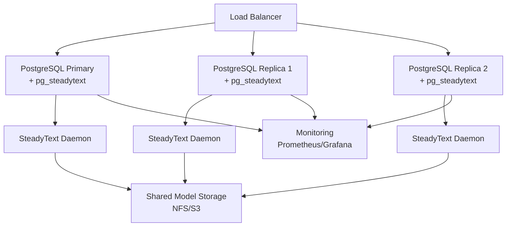

# Production Deployment Guide

Deploy SteadyText and pg_steadytext for production workloads with high availability, monitoring, and optimal performance.

## Architecture Overview



## System Requirements

### Hardware Recommendations

| Component | Minimum | Recommended | High Performance |
|-----------|---------|-------------|------------------|
| CPU | 4 cores | 8 cores | 16+ cores |
| RAM | 16 GB | 32 GB | 64+ GB |
| Storage | 100 GB SSD | 500 GB NVMe | 1+ TB NVMe |
| Network | 1 Gbps | 10 Gbps | 25+ Gbps |

### PostgreSQL Version
- PostgreSQL 14+ (15 or 16 recommended)
- TimescaleDB 2.10+ (if using time-series features)

## Installation Methods

### Method 1: Docker Compose (Recommended)

```yaml
version: '3.8'

services:
  postgres-primary:
    image: julep/pg-steadytext:latest
    container_name: steadytext-primary
    environment:
      POSTGRES_USER: postgres
      POSTGRES_PASSWORD: ${POSTGRES_PASSWORD}
      POSTGRES_DB: production
      STEADYTEXT_DAEMON_AUTOSTART: "true"
      STEADYTEXT_DAEMON_WORKERS: "4"
    volumes:
      - pgdata-primary:/var/lib/postgresql/data
      - steadytext-models:/var/lib/steadytext/models
      - ./postgresql.conf:/etc/postgresql/postgresql.conf:ro
    ports:
      - "5432:5432"
    deploy:
      resources:
        limits:
          cpus: '8'
          memory: 32G
        reservations:
          cpus: '4'
          memory: 16G
    healthcheck:
      test: ["CMD-SHELL", "pg_isready -U postgres"]
      interval: 10s
      timeout: 5s
      retries: 5

  postgres-replica1:
    image: julep/pg-steadytext:latest
    container_name: steadytext-replica1
    environment:
      POSTGRES_USER: postgres
      POSTGRES_PASSWORD: ${POSTGRES_PASSWORD}
      POSTGRES_MASTER_SERVICE: postgres-primary
      POSTGRES_REPLICATION_MODE: slave
      POSTGRES_REPLICATION_USER: replicator
      POSTGRES_REPLICATION_PASSWORD: ${REPLICATION_PASSWORD}
      STEADYTEXT_DAEMON_AUTOSTART: "true"
    volumes:
      - pgdata-replica1:/var/lib/postgresql/data
      - steadytext-models:/var/lib/steadytext/models:ro
    depends_on:
      postgres-primary:
        condition: service_healthy
    deploy:
      resources:
        limits:
          cpus: '8'
          memory: 32G

  pgpool:
    image: bitnami/pgpool:latest
    container_name: steadytext-pgpool
    environment:
      - PGPOOL_BACKEND_NODES=0:postgres-primary:5432,1:postgres-replica1:5432
      - PGPOOL_SR_CHECK_USER=postgres
      - PGPOOL_SR_CHECK_PASSWORD=${POSTGRES_PASSWORD}
      - PGPOOL_ENABLE_LOAD_BALANCING=yes
      - PGPOOL_MAX_POOL=100
      - PGPOOL_NUM_INIT_CHILDREN=32
    ports:
      - "5433:5432"
    depends_on:
      - postgres-primary
      - postgres-replica1

  prometheus:
    image: prom/prometheus:latest
    container_name: steadytext-prometheus
    volumes:
      - ./prometheus.yml:/etc/prometheus/prometheus.yml:ro
      - prometheus-data:/prometheus
    ports:
      - "9090:9090"

  grafana:
    image: grafana/grafana:latest
    container_name: steadytext-grafana
    environment:
      - GF_SECURITY_ADMIN_PASSWORD=${GRAFANA_PASSWORD}
    volumes:
      - grafana-data:/var/lib/grafana
      - ./grafana/dashboards:/etc/grafana/provisioning/dashboards:ro
    ports:
      - "3000:3000"

volumes:
  pgdata-primary:
  pgdata-replica1:
  steadytext-models:
  prometheus-data:
  grafana-data:
```

### Method 2: Kubernetes Deployment

```yaml
apiVersion: v1
kind: ConfigMap
metadata:
  name: postgres-config
data:
  postgresql.conf: |
    # Performance settings
    shared_buffers = 8GB
    effective_cache_size = 24GB
    maintenance_work_mem = 2GB
    work_mem = 256MB
    max_parallel_workers = 8
    max_parallel_workers_per_gather = 4
    
    # SteadyText optimizations
    max_connections = 200
    shared_preload_libraries = 'pg_steadytext,pg_stat_statements'

---
apiVersion: apps/v1
kind: StatefulSet
metadata:
  name: postgres-steadytext
spec:
  serviceName: postgres-steadytext
  replicas: 3
  selector:
    matchLabels:
      app: postgres-steadytext
  template:
    metadata:
      labels:
        app: postgres-steadytext
    spec:
      containers:
      - name: postgres
        image: julep/pg-steadytext:latest
        ports:
        - containerPort: 5432
        env:
        - name: POSTGRES_PASSWORD
          valueFrom:
            secretKeyRef:
              name: postgres-secret
              key: password
        - name: STEADYTEXT_DAEMON_AUTOSTART
          value: "true"
        resources:
          requests:
            memory: "16Gi"
            cpu: "4"
          limits:
            memory: "32Gi"
            cpu: "8"
        volumeMounts:
        - name: postgres-storage
          mountPath: /var/lib/postgresql/data
        - name: postgres-config
          mountPath: /etc/postgresql
        - name: model-storage
          mountPath: /var/lib/steadytext/models
  volumeClaimTemplates:
  - metadata:
      name: postgres-storage
    spec:
      accessModes: [ "ReadWriteOnce" ]
      resources:
        requests:
          storage: 500Gi
  - metadata:
      name: model-storage
    spec:
      accessModes: [ "ReadWriteMany" ]
      resources:
        requests:
          storage: 50Gi
```

### Method 3: Bare Metal Installation

```bash
# 1. Install PostgreSQL 16
sudo apt update
sudo apt install -y postgresql-16 postgresql-16-dev

# 2. Install Python dependencies
sudo apt install -y python3-pip python3-dev
pip3 install steadytext pyzmq numpy

# 3. Build and install pg_steadytext
git clone https://github.com/julep-ai/steadytext.git
cd steadytext/pg_steadytext
make && sudo make install

# 4. Configure PostgreSQL
sudo -u postgres psql <<EOF
ALTER SYSTEM SET shared_preload_libraries = 'pg_steadytext';
ALTER SYSTEM SET shared_buffers = '8GB';
ALTER SYSTEM SET effective_cache_size = '24GB';
ALTER SYSTEM SET work_mem = '256MB';
ALTER SYSTEM SET maintenance_work_mem = '2GB';
EOF

# 5. Restart PostgreSQL
sudo systemctl restart postgresql

# 6. Create systemd service for daemon
sudo tee /etc/systemd/system/steadytext-daemon.service > /dev/null <<EOF
[Unit]
Description=SteadyText Daemon
After=postgresql.service

[Service]
Type=simple
User=postgres
ExecStart=/usr/local/bin/st daemon start --foreground
Restart=always
RestartSec=10
Environment="STEADYTEXT_DAEMON_HOST=0.0.0.0"
Environment="STEADYTEXT_DAEMON_PORT=5555"
Environment="STEADYTEXT_DAEMON_WORKERS=4"

[Install]
WantedBy=multi-user.target
EOF

sudo systemctl enable steadytext-daemon
sudo systemctl start steadytext-daemon
```

## Performance Configuration

### PostgreSQL Tuning

```sql
-- postgresql.conf optimizations for AI workloads
-- Memory settings (adjust based on available RAM)
shared_buffers = '8GB'              # 25% of RAM
effective_cache_size = '24GB'       # 75% of RAM
work_mem = '256MB'                  # For complex queries
maintenance_work_mem = '2GB'        # For index creation

-- Parallel processing
max_parallel_workers = 8
max_parallel_workers_per_gather = 4
max_parallel_maintenance_workers = 4

-- Connection pooling
max_connections = 200
superuser_reserved_connections = 3

-- Write performance
checkpoint_completion_target = 0.9
wal_buffers = '64MB'
max_wal_size = '4GB'

-- SteadyText specific
shared_preload_libraries = 'pg_steadytext,pg_stat_statements'
pg_steadytext.cache_size = '10000'
pg_steadytext.daemon_timeout = '60000'  # 60 seconds
```

### SteadyText Daemon Configuration

```bash
# Environment variables for optimal performance
export STEADYTEXT_DAEMON_WORKERS=4
export STEADYTEXT_DAEMON_QUEUE_SIZE=1000
export STEADYTEXT_GENERATION_CACHE_CAPACITY=10000
export STEADYTEXT_GENERATION_CACHE_MAX_SIZE_MB=1000
export STEADYTEXT_EMBEDDING_CACHE_CAPACITY=20000
export STEADYTEXT_EMBEDDING_CACHE_MAX_SIZE_MB=2000
export STEADYTEXT_MAX_CONTEXT_WINDOW=32768

# Start daemon with production settings
st daemon start \
  --host 0.0.0.0 \
  --port 5555 \
  --workers $STEADYTEXT_DAEMON_WORKERS \
  --log-level info
```

## High Availability Setup

### Streaming Replication

```bash
# On primary server
sudo -u postgres psql <<EOF
CREATE ROLE replicator WITH REPLICATION LOGIN PASSWORD 'strong_password';
ALTER SYSTEM SET wal_level = 'replica';
ALTER SYSTEM SET max_wal_senders = 3;
ALTER SYSTEM SET wal_keep_size = '1GB';
EOF

# On replica server
sudo -u postgres pg_basebackup \
  -h primary_host \
  -D /var/lib/postgresql/16/main \
  -U replicator \
  -v -P -W \
  -X stream

# Configure recovery
sudo -u postgres tee /var/lib/postgresql/16/main/postgresql.auto.conf <<EOF
primary_conninfo = 'host=primary_host port=5432 user=replicator password=strong_password'
primary_slot_name = 'replica1'
EOF

sudo -u postgres touch /var/lib/postgresql/16/main/standby.signal
```

### Load Balancing with PgBouncer

```ini
# pgbouncer.ini
[databases]
production = host=localhost port=5432 dbname=production

[pgbouncer]
listen_addr = *
listen_port = 6432
auth_type = md5
auth_file = /etc/pgbouncer/userlist.txt
pool_mode = transaction
max_client_conn = 1000
default_pool_size = 50
reserve_pool_size = 25
reserve_pool_timeout = 5
server_lifetime = 3600
server_idle_timeout = 600
```

## Monitoring

### Prometheus Metrics

```yaml
# prometheus.yml
global:
  scrape_interval: 15s

scrape_configs:
  - job_name: 'postgres'
    static_configs:
      - targets: ['localhost:9187']
    
  - job_name: 'postgres_exporter'
    static_configs:
      - targets: ['localhost:9187']

  - job_name: 'steadytext_daemon'
    static_configs:
      - targets: ['localhost:9191']

  - job_name: 'node_exporter'
    static_configs:
      - targets: ['localhost:9100']
```

### Custom Monitoring Queries

```sql
-- SteadyText performance metrics
CREATE OR REPLACE VIEW steadytext_metrics AS
SELECT 
    'generation_requests' AS metric,
    COUNT(*) AS value
FROM pg_stat_user_functions
WHERE funcname LIKE 'steadytext_generate%'
UNION ALL
SELECT 
    'embedding_requests' AS metric,
    COUNT(*) AS value
FROM pg_stat_user_functions
WHERE funcname LIKE 'steadytext_embed%'
UNION ALL
SELECT 
    'cache_hit_rate' AS metric,
    (SELECT hit_rate FROM steadytext_cache_stats()) AS value;

-- Alert on slow AI queries
CREATE OR REPLACE FUNCTION check_slow_ai_queries()
RETURNS TABLE(query TEXT, duration INTERVAL, calls BIGINT) AS $$
BEGIN
    RETURN QUERY
    SELECT 
        query,
        mean_exec_time * interval '1 millisecond' AS duration,
        calls
    FROM pg_stat_statements
    WHERE query LIKE '%steadytext_%'
      AND mean_exec_time > 1000  -- Queries taking > 1 second
    ORDER BY mean_exec_time DESC
    LIMIT 10;
END;
$$ LANGUAGE plpgsql;
```

### Grafana Dashboard

```json
{
  "dashboard": {
    "title": "SteadyText Production Metrics",
    "panels": [
      {
        "title": "AI Requests/sec",
        "targets": [
          {
            "expr": "rate(steadytext_generation_requests_total[5m])"
          }
        ]
      },
      {
        "title": "Cache Hit Rate",
        "targets": [
          {
            "expr": "steadytext_cache_hit_rate"
          }
        ]
      },
      {
        "title": "Response Time (p95)",
        "targets": [
          {
            "expr": "histogram_quantile(0.95, steadytext_request_duration_seconds_bucket)"
          }
        ]
      },
      {
        "title": "Active Connections",
        "targets": [
          {
            "expr": "pg_stat_activity_count"
          }
        ]
      }
    ]
  }
}
```

## Security Best Practices

### 1. Database Security

```sql
-- Create dedicated user for application
CREATE ROLE steadytext_app WITH LOGIN PASSWORD 'strong_password';
GRANT CONNECT ON DATABASE production TO steadytext_app;
GRANT USAGE ON SCHEMA public TO steadytext_app;
GRANT EXECUTE ON ALL FUNCTIONS IN SCHEMA public TO steadytext_app;

-- Restrict pg_steadytext functions
REVOKE EXECUTE ON FUNCTION steadytext_config_set FROM PUBLIC;
GRANT EXECUTE ON FUNCTION steadytext_config_set TO postgres;

-- Enable SSL
ALTER SYSTEM SET ssl = on;
ALTER SYSTEM SET ssl_cert_file = '/path/to/server.crt';
ALTER SYSTEM SET ssl_key_file = '/path/to/server.key';
```

### 2. Network Security

```bash
# Firewall rules
sudo ufw allow from 10.0.0.0/8 to any port 5432  # PostgreSQL
sudo ufw allow from 10.0.0.0/8 to any port 5555  # SteadyText daemon
sudo ufw deny 5432  # Block external access
sudo ufw deny 5555
```

### 3. Model Security

```bash
# Secure model storage
sudo chown -R postgres:postgres /var/lib/steadytext/models
sudo chmod -R 750 /var/lib/steadytext/models

# Read-only mount for replicas
mount -o ro /nfs/steadytext/models /var/lib/steadytext/models
```

## Backup and Recovery

### Automated Backups

```bash
#!/bin/bash
# backup-steadytext.sh

BACKUP_DIR="/backup/postgres"
DATE=$(date +%Y%m%d_%H%M%S)

# Backup database
pg_dump -U postgres -d production -f "$BACKUP_DIR/production_$DATE.sql"

# Backup models (incremental)
rsync -av --link-dest="$BACKUP_DIR/models/latest" \
  /var/lib/steadytext/models/ \
  "$BACKUP_DIR/models/$DATE/"

ln -sfn "$BACKUP_DIR/models/$DATE" "$BACKUP_DIR/models/latest"

# Cleanup old backups (keep 30 days)
find "$BACKUP_DIR" -name "production_*.sql" -mtime +30 -delete
find "$BACKUP_DIR/models" -maxdepth 1 -type d -mtime +30 -exec rm -rf {} \;
```

### Disaster Recovery

```sql
-- Point-in-time recovery setup
ALTER SYSTEM SET archive_mode = on;
ALTER SYSTEM SET archive_command = 'test ! -f /archive/%f && cp %p /archive/%f';
ALTER SYSTEM SET restore_command = 'cp /archive/%f %p';
```

## Scaling Strategies

### Horizontal Scaling

```yaml
# Scale daemon instances
apiVersion: apps/v1
kind: Deployment
metadata:
  name: steadytext-daemon
spec:
  replicas: 10  # Scale based on load
  template:
    spec:
      containers:
      - name: daemon
        image: julep/steadytext-daemon:latest
        resources:
          requests:
            memory: "4Gi"
            cpu: "2"
```

### Vertical Scaling

```sql
-- Increase resources for heavy workloads
ALTER SYSTEM SET max_parallel_workers = 16;
ALTER SYSTEM SET work_mem = '512MB';
ALTER SYSTEM SET maintenance_work_mem = '4GB';

-- Restart required
SELECT pg_reload_conf();
```

## Troubleshooting

### Common Issues

1. **High Memory Usage**
```bash
# Check memory usage
sudo -u postgres psql -c "
SELECT 
    pid,
    usename,
    application_name,
    pg_size_pretty(pg_backend_memory_context_size(pid)) AS memory
FROM pg_stat_activity
WHERE pid <> pg_backend_pid()
ORDER BY pg_backend_memory_context_size(pid) DESC;"
```

2. **Slow Queries**
```sql
-- Find slow AI queries
SELECT 
    query,
    mean_exec_time,
    calls,
    total_exec_time
FROM pg_stat_statements
WHERE query LIKE '%steadytext%'
ORDER BY mean_exec_time DESC
LIMIT 20;
```

3. **Daemon Connection Issues**
```bash
# Test daemon connectivity
st daemon status
zmqc -c REQ 'tcp://localhost:5555' '{"method": "ping"}'

# Check daemon logs
journalctl -u steadytext-daemon -f
```

## Performance Benchmarks

```sql
-- Benchmark suite
CREATE OR REPLACE FUNCTION benchmark_steadytext()
RETURNS TABLE (
    operation VARCHAR,
    total_time INTERVAL,
    ops_per_second NUMERIC
) AS $$
DECLARE
    start_time TIMESTAMP;
    end_time TIMESTAMP;
    iterations INTEGER := 1000;
BEGIN
    -- Test generation speed
    start_time := clock_timestamp();
    PERFORM steadytext_generate('Test prompt', 100)
    FROM generate_series(1, iterations);
    end_time := clock_timestamp();
    
    RETURN QUERY
    SELECT 
        'generation'::VARCHAR,
        end_time - start_time,
        iterations / EXTRACT(EPOCH FROM (end_time - start_time));
    
    -- Test embedding speed
    start_time := clock_timestamp();
    PERFORM steadytext_embed('Test text')
    FROM generate_series(1, iterations);
    end_time := clock_timestamp();
    
    RETURN QUERY
    SELECT 
        'embedding'::VARCHAR,
        end_time - start_time,
        iterations / EXTRACT(EPOCH FROM (end_time - start_time));
END;
$$ LANGUAGE plpgsql;
```

## Maintenance Schedule

```sql
-- Weekly maintenance tasks
CREATE OR REPLACE FUNCTION weekly_maintenance()
RETURNS VOID AS $$
BEGIN
    -- Update table statistics
    ANALYZE;
    
    -- Reindex for performance
    REINDEX DATABASE production CONCURRENTLY;
    
    -- Clean up old cache entries
    DELETE FROM steadytext_cache WHERE created_at < NOW() - INTERVAL '30 days';
    
    -- Vacuum to reclaim space
    VACUUM ANALYZE;
END;
$$ LANGUAGE plpgsql;

-- Schedule with pg_cron
SELECT cron.schedule('weekly_maintenance', '0 2 * * 0', 'SELECT weekly_maintenance()');
```

## Next Steps

<!-- TODO: Add these guides
- [Monitoring Setup →](monitoring.md)
- [Backup Strategies →](backup.md)
- [Security Hardening →](security.md)
-->
- [Performance Tuning →](../examples/performance-tuning.md)
- [Cloudflare Edge Deployment →](cloudflare.md)
- [TimescaleDB Integration →](../integrations/timescaledb.md)

---

!!! warning "Production Checklist"
    - [ ] SSL/TLS enabled for all connections
    - [ ] Automated backups configured and tested
    - [ ] Monitoring and alerting active
    - [ ] Resource limits properly set
    - [ ] Security hardening completed
    - [ ] Disaster recovery plan tested
    - [ ] Performance benchmarks established