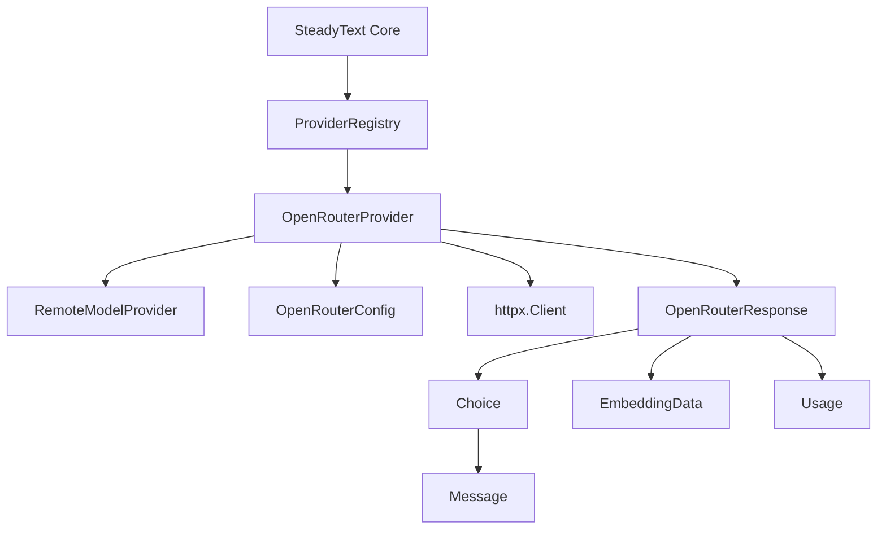

# Data Model: OpenRouter Provider

## Core Entities

### OpenRouterProvider
**Purpose**: Main provider class implementing RemoteModelProvider interface for OpenRouter API integration.

**Attributes**:
- `api_key: str` - OpenRouter API key from environment or constructor
- `model: str` - OpenRouter model identifier (e.g., "anthropic/claude-3.5-sonnet")
- `base_url: str` - OpenRouter API base URL (default: "https://openrouter.ai/api/v1")
- `timeout: Tuple[int, int]` - Connection and read timeouts (default: (30, 120))
- `_client: Optional[httpx.Client]` - HTTP client instance (lazy initialization)

**Validation Rules**:
- api_key must be non-empty string starting with "sk-or-" (OpenRouter key format)
- model must be valid OpenRouter model format (provider/model-name)
- base_url must be valid HTTP(S) URL
- timeout values must be positive integers

**State Transitions**:
- `Uninitialized` → `Configured` (on __init__ with valid parameters)
- `Configured` → `Available` (on successful is_available() check)
- `Available` → `Error` (on API failures, with fallback to deterministic behavior)
- `Error` → `Available` (on successful retry after temporary failure)

### OpenRouterResponse
**Purpose**: Internal model for parsing OpenRouter API responses.

**Attributes**:
- `id: str` - Response identifier
- `object: str` - Response type ("chat.completion" or "embedding")
- `created: int` - Unix timestamp
- `model: str` - Model used for generation
- `choices: List[Choice]` - Generation choices (for text generation)
- `data: List[EmbeddingData]` - Embedding data (for embedding requests)
- `usage: Usage` - Token usage information

**Validation Rules**:
- id must be non-empty string
- object must be one of supported types
- created must be positive integer
- choices or data must be present depending on request type

### Choice (Text Generation)
**Purpose**: Represents a single generation choice in OpenRouter response.

**Attributes**:
- `index: int` - Choice index
- `message: Message` - Generated message content
- `finish_reason: str` - Reason for completion ("stop", "length", "error")

### Message
**Purpose**: Message content structure.

**Attributes**:
- `role: str` - Message role ("assistant")
- `content: str` - Generated text content

### EmbeddingData (Embeddings)
**Purpose**: Represents embedding vector data.

**Attributes**:
- `object: str` - Object type ("embedding")
- `index: int` - Embedding index
- `embedding: List[float]` - Vector embedding values

**Validation Rules**:
- embedding must be non-empty list of floats
- all embedding values must be finite numbers

### Usage
**Purpose**: Token usage tracking.

**Attributes**:
- `prompt_tokens: int` - Input tokens consumed
- `completion_tokens: int` - Output tokens generated
- `total_tokens: int` - Total tokens used

**Validation Rules**:
- all token counts must be non-negative integers
- total_tokens should equal prompt_tokens + completion_tokens

## Configuration Model

### OpenRouterConfig
**Purpose**: Configuration container for OpenRouter provider settings.

**Attributes**:
- `api_key: Optional[str]` - API key (from OPENROUTER_API_KEY env var if None)
- `model: str` - Default model to use
- `base_url: str` - API base URL
- `timeout: Tuple[int, int]` - Connection and read timeouts
- `max_retries: int` - Maximum retry attempts for failed requests
- `retry_delay: float` - Base delay for exponential backoff

**Default Values**:
- `base_url`: "https://openrouter.ai/api/v1"
- `timeout`: (30, 120)
- `max_retries`: 3
- `retry_delay`: 1.0

## Error Model

### OpenRouterError
**Purpose**: Base exception class for OpenRouter-specific errors.

**Inherits**: `RuntimeError`

**Attributes**:
- `status_code: Optional[int]` - HTTP status code
- `response_data: Optional[dict]` - OpenRouter error response data

### OpenRouterAuthError
**Purpose**: Authentication/authorization failures.

**Inherits**: `OpenRouterError`

**Triggers**:
- Missing or invalid API key
- HTTP 401 responses
- API key format validation failures

### OpenRouterRateLimitError
**Purpose**: Rate limiting errors.

**Inherits**: `OpenRouterError`

**Attributes**:
- `retry_after: Optional[int]` - Suggested retry delay in seconds

**Triggers**:
- HTTP 429 responses
- Rate limit headers in response

### OpenRouterModelError
**Purpose**: Model-related errors.

**Inherits**: `OpenRouterError`

**Triggers**:
- Invalid model names
- Model not available
- HTTP 404 responses for model endpoints

## Integration Model

### ProviderRegistry Integration
**Purpose**: Integration point with existing provider registry system.

**Changes Required**:
- Add `"openrouter": OpenRouterProvider` to `PROVIDER_REGISTRY` dict
- Add OpenRouter API key validation in `get_provider()` function
- Update provider listing and model enumeration functions

**Registry Pattern**:
```python
# In registry.py
from .openrouter import OpenRouterProvider

PROVIDER_REGISTRY = {
    "openai": OpenAIProvider,
    "cerebras": CerebrasProvider,
    "voyageai": VoyageAIProvider,
    "jina": JinaProvider,
    "openrouter": OpenRouterProvider,  # New addition
}
```

## Model Support Matrix

### Supported Operations
| Operation | OpenRouter Support | Implementation |
|-----------|-------------------|----------------|
| Text Generation | ✓ | ChatCompletion API |
| Streaming Generation | ✓ | Server-Sent Events |
| Embeddings | ✓ | Embeddings API |
| Structured Generation | ✓ | JSON mode support |
| Temperature Control | ✓ | Parameter passing |
| Max Tokens | ✓ | Parameter passing |
| Top-p Sampling | ✓ | Parameter passing |

### Model Categories
| Category | Examples | Notes |
|----------|----------|-------|
| Chat Models | anthropic/claude-3.5-sonnet, openai/gpt-4 | Primary use case |
| Code Models | codellama/codellama-7b, openai/gpt-4-code | Specialized for code |
| Embedding Models | openai/text-embedding-3-small | Vector generation |
| Multimodal | anthropic/claude-3-vision, openai/gpt-4-vision | Image + text |

## Relationships



## Validation and Constraints

### API Key Validation
- Format: Must start with "sk-or-" (OpenRouter standard)
- Length: Minimum 20 characters
- Characters: Alphanumeric plus hyphens and underscores

### Model Name Validation
- Format: "provider/model-name" (e.g., "anthropic/claude-3.5-sonnet")
- Provider part: Must be valid OpenRouter provider
- Model part: Must be available model for that provider

### Request Validation
- Text generation: prompt must be non-empty string
- Embeddings: input must be non-empty string or list of strings
- Parameters: temperature (0-2), max_tokens (1-4096), top_p (0-1)

### Response Validation
- All API responses must include required fields
- Embedding vectors must have consistent dimensionality
- Token counts must be non-negative and logical