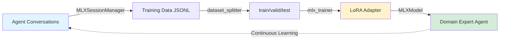

# strands-mlx

[](https://pypi.org/project/strands-mlx/)
[](https://github.com/cagataycali/strands-mlx/actions/workflows/agent.yml)

**Running Strands Agents locally on Apple Silicon - inference, fine-tuning, vision in Python**

MLX provider for [Strands Agents](https://strandsagents.com) with LoRA training pipelines.

---

**Requirements:** Python ≤3.13, macOS/Linux

```bash
# Text models
pip install strands-mlx

# With vision/audio/video
pip install "strands-mlx[vision]"

# Environment setup
uv venv --python 3.13 && source .venv/bin/activate

# Install dependencies
uv pip install strands-agents strands-mlx strands-agents-tools
```

---

## Quick Start

agent.py

```python
from strands import Agent
from strands_mlx import MLXModel
from strands_tools import calculator

model = MLXModel(model_id="mlx-community/Qwen3-1.7B-4bit")
agent = Agent(model=model, tools=[calculator])

agent("What is 29 * 42?")
```

```bash
# Run with uv
uv run agent.py
```

---

## Architecture



**The complete training cycle:** Agents collect their own training data → fine-tune themselves → become domain experts → continue learning.

---

## Train Your Own Model

**4 steps: Collect → Split → Train → Use**

### 1. Collect Training Data

```python
from strands import Agent
from strands_tools import calculator
from strands_mlx import MLXSessionManager, dataset_splitter, mlx_trainer

session = MLXSessionManager(session_id="my_training", storage_dir="./dataset")
agent = Agent(model=model, tools=[calculator, dataset_splitter, mlx_trainer], session_manager=session)

# Have conversations - auto-saved to JSONL
agent("Teach me about quantum computing")
agent("Calculate 15 * 7")

# Saved to: ./dataset/my_training.jsonl
```

### 2. Split Dataset

```python
agent.tool.dataset_splitter(
    input_path="./dataset/my_training.jsonl"
)
# Creates train.jsonl, valid.jsonl, test.jsonl (80/10/10 split)
```

### 3. Train with LoRA

```python
agent.tool.mlx_trainer(
    action="train",
    config={
        "model": "mlx-community/Qwen3-1.7B-4bit",
        "data": "./dataset/my_training",
        "adapter_path": "./adapter",
        "iters": 200,
        "learning_rate": 1e-5,
        "batch_size": 1
    }
)
```

### 4. Use Trained Model

```python
from strands import Agent
from strands_mlx import MLXModel

trained = MLXModel("mlx-community/Qwen3-1.7B-4bit", adapter_path="./adapter")
agent = Agent(model=trained)

agent("Explain quantum computing")  # Uses trained knowledge!
```

---

## Vision Models

```python
from strands_mlx import MLXVisionModel

model = MLXVisionModel(model_id="mlx-community/Qwen2-VL-2B-Instruct-4bit")
agent = Agent(model=model)

agent("Describe: <image>photo.jpg</image>")
agent("Transcribe: <audio>speech.wav</audio>")
agent("What happens: <video>clip.mp4</video>")
```

---

## Training Tools

| Tool | Purpose |
|------|---------|
| `mlx_trainer` | Background LoRA training |
| `dataset_splitter` | Split JSONL → train/valid/test |
| `validate_training_data` | Check format & token counts |
| `mlx_invoke` | Runtime model switching |
| `mlx_vision_invoke` | Vision as a tool |

---

## Advanced Training

**YAML config file:**

```yaml
model: mlx-community/Qwen3-1.7B-4bit
data: ./training_data
iters: 1000
learning_rate: 1e-5
lora_parameters:
  rank: 8
  scale: 16.0
lr_schedule:
  name: cosine_decay
  warmup: 100
optimizer: adamw
```

**Use config:**

```python
agent.tool.mlx_trainer(action="train", config="./lora_config.yaml")
```

---

## Popular Models

**Text:**
- `mlx-community/Qwen3-1.7B-4bit` (recommended)
- `mlx-community/Qwen3-4B-4bit`
- `mlx-community/Llama-3.2-1B-4bit`
- `mlx-community/gemma-2-2b-it-4bit`

**Vision:**
- `mlx-community/Qwen2-VL-2B-Instruct-4bit` (recommended)
- `mlx-community/Qwen2-Audio-7B-Instruct` (audio)
- `mlx-community/llava-v1.6-mistral-7b-4bit`

[Community models at mlx-community](https://huggingface.co/mlx-community)

---

## Troubleshooting

**Out of memory:**
```python
config = {
    "grad_checkpoint": True,
    "batch_size": 1,
    "max_seq_length": 1024
}
```

**Model degraded:**
```python
config = {
    "iters": 200,  # Lower for small datasets
    "learning_rate": 1e-5  # Conservative
}
```

---

## Resources

- [Strands Agents](https://strandsagents.com)
- [MLX](https://ml-explore.github.io/mlx/)
- [mlx-community models](https://huggingface.co/mlx-community)

---

## Citation

```bibtex
@software{strands_mlx2025,
  author = {Cagatay Cali},
  title = {strands-mlx: MLX Model Provider for Strands Agents},
  year = {2025},
  url = {https://github.com/cagataycali/strands-mlx}
}
```

**Apache 2 License** | Built with MLX, MLX-LM, and Strands Agents