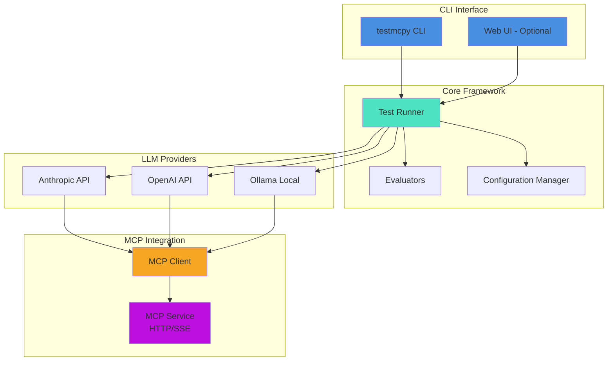

<p align="center">
  
</p>

<p align="center">
  <strong>Test and benchmark LLMs with MCP tools in minutes.</strong>
</p>

<p align="center">
  A testing framework for validating how LLMs call tools via Model Context Protocol (MCP) - compare Claude, GPT-4, Llama, and other models' accuracy, cost, and performance.
</p>

<p align="center">
  <a href="https://www.python.org/downloads/"></a>
  <a href="LICENSE"></a>
  <a href="https://pypi.org/project/testmcpy/"></a>
</p>

[Screenshot: CLI test runner with colorful progress bars and results]

[Screenshot: Web UI showing tool explorer and interactive chat]

[GIF: Running a test suite from command line with real-time progress]

---

**[Documentation](docs/)** • **[Examples](examples/)** • **[Contributing](CONTRIBUTING.md)** • **[Discussions](https://github.com/preset-io/testmcpy/discussions)**

---

## Why testmcpy?

- **Validate tool calling**: Ensure LLMs call the right tools with correct parameters
- **Compare models**: Find the best price/performance balance for your use case
- **Prevent regressions**: Catch breaking changes in your MCP service with CI/CD
- **Optimize costs**: Track token usage and identify the most cost-effective models

## Quick Start

```bash
# Install testmcpy
pip install testmcpy

# Run interactive setup
testmcpy setup

# Start testing
testmcpy chat                     # Interactive chat with MCP tools
testmcpy research                 # Test LLM tool-calling capabilities
testmcpy run tests/              # Run your test suite
```

That's it! No complex configuration needed to get started.

## Key Features

### Multi-Provider Support
Test with **Claude**, **GPT-4**, **Llama**, and other models. Works with both paid APIs and free local models via Ollama.

[Screenshot: Model selector showing Claude, GPT-4, and Ollama options]

### Built-in Evaluators
Comprehensive validation out of the box:
- **Tool Selection**: Did the LLM call the right tool?
- **Parameter Validation**: Were correct parameters passed?
- **Execution Success**: Did the tool call complete without errors?
- **Performance**: Response time and token usage tracking
- **Cost Analysis**: Monitor API costs across test runs

[Screenshot: Test results showing pass/fail for different evaluators]

### Beautiful CLI & Web UI
- **Rich terminal UI**: Progress bars, colored output, formatted tables
- **Optional web interface**: Visual tool explorer and interactive chat
- **Real-time feedback**: Watch tests execute with live updates

When you start testmcpy, you're greeted with a beautiful terminal interface:

```
  ▀█▀ █▀▀ █▀ ▀█▀ █▀▄▀█ █▀▀ █▀█ █▄█
   █  ██▄ ▄█  █  █ ▀ █ █▄▄ █▀▀  █

  🧪 Test  •  📊 Benchmark  •  ✓ Validate
  MCP Testing Framework
```

[Screenshot: Split view of CLI and Web UI running the same test]

### YAML Test Definitions
Define test suites as code for repeatable, version-controlled testing:

```yaml
version: "1.0"
name: "Chart Operations Test Suite"

tests:
  - name: "test_create_chart"
    prompt: "Create a bar chart showing sales by region"
    evaluators:
      - name: "was_mcp_tool_called"
        args:
          tool_name: "create_chart"
      - name: "execution_successful"
```

## Use Cases

Perfect for:

- **LLM Benchmarking**: Compare tool-calling accuracy across Claude, GPT-4, and Llama
- **MCP Service Testing**: Validate your MCP integrations work correctly
- **Regression Prevention**: Catch breaking changes in CI/CD pipelines
- **Model Selection**: Make data-driven decisions about which LLM to use
- **Cost Optimization**: Find the best price/performance balance for your workload
- **Parameter Validation**: Ensure LLMs pass correct parameters to your tools

## Architecture

testmcpy connects your LLM provider to your MCP service and validates the interactions:



**How it works:**
1. Define test cases in YAML with prompts and expected behavior
2. testmcpy sends prompts to your chosen LLM (Claude, GPT-4, Llama, etc.)
3. LLM calls tools via MCP protocol to your service
4. Evaluators validate tool selection, parameters, execution, and performance
5. Get detailed pass/fail results with metrics and cost analysis

## Installation

```bash
# Install base package
pip install testmcpy

# With web UI support
pip install 'testmcpy[server]'

# All optional features
pip install 'testmcpy[all]'
```

**Requirements:** Python 3.9-3.12 (3.13+ not yet supported)

## Getting Started

### 1. Configuration

Run the interactive setup wizard:

```bash
testmcpy setup
```

Or manually create `~/.testmcpy`:

```bash
# MCP Service
MCP_URL=http://localhost:5008/mcp/
MCP_AUTH_TOKEN=your_bearer_token

# LLM Provider (choose one)
DEFAULT_PROVIDER=anthropic
DEFAULT_MODEL=claude-haiku-4-5
ANTHROPIC_API_KEY=sk-ant-...
```

**Configuration priority:** CLI options > `.env` > `~/.testmcpy` > Environment variables > Defaults

### 2. Test Your MCP Service

```bash
# List available MCP tools
testmcpy tools

# Interactive chat to explore your tools
testmcpy chat

# Run automated research on tool-calling capabilities
testmcpy research --model claude-haiku-4-5
```

### 3. Create Test Suites

Define tests in YAML (`tests/my_tests.yaml`):

```yaml
version: "1.0"
name: "My MCP Service Tests"

tests:
  - name: "test_tool_selection"
    prompt: "Create a bar chart showing sales by region"
    evaluators:
      - name: "was_mcp_tool_called"
        args:
          tool_name: "create_chart"
      - name: "execution_successful"
      - name: "within_time_limit"
        args:
          max_seconds: 30
```

Run your tests:

```bash
testmcpy run tests/ --model claude-haiku-4-5
```

## Documentation

### Core Guides
- **[Evaluator Reference](docs/EVALUATOR_REFERENCE.md)** - All available evaluators and usage examples
- **[Client Usage Guide](docs/CLIENT_USAGE_GUIDE.md)** - Complete guide for testing your MCP service
- **[MCP Profiles](docs/MCP_PROFILES.md)** - Managing multiple MCP service configurations

### Examples
- **[Basic Tests](examples/)** - Simple test cases to get started
- **[CI/CD Integration](examples/ci-cd/)** - GitHub Actions and GitLab CI configurations
- **[Custom Evaluators](examples/)** - Building your own validation logic

### Commands Reference

| Command | Description |
|---------|-------------|
| `testmcpy setup` | Interactive configuration wizard |
| `testmcpy tools` | List available MCP tools |
| `testmcpy research` | Test LLM tool-calling capabilities |
| `testmcpy run <path>` | Execute test suite |
| `testmcpy chat` | Interactive chat with MCP tools |
| `testmcpy serve` | Start web UI server |
| `testmcpy report` | Compare test results across models |
| `testmcpy config-cmd` | View current configuration |
| `testmcpy doctor` | Diagnose installation issues |

## LLM Providers

### Anthropic (Recommended)
Best tool-calling accuracy, native MCP support:

```bash
ANTHROPIC_API_KEY=sk-ant-your-key
DEFAULT_MODEL=claude-haiku-4-5  # Fast & cost-effective
```

**Available models:** `claude-haiku-4-5`, `claude-sonnet-4-5`, `claude-opus-4-1`

### Ollama (Free, Local)
Perfect for development without API costs:

```bash
# Install Ollama
brew install ollama  # macOS
# or: curl -fsSL https://ollama.com/install.sh | sh

# Start Ollama and pull a model
ollama serve
ollama pull llama3.1:8b

# Configure testmcpy
DEFAULT_PROVIDER=ollama
DEFAULT_MODEL=llama3.1:8b
```

### OpenAI
```bash
OPENAI_API_KEY=sk-your-key
DEFAULT_MODEL=gpt-4-turbo
```

## Built-in Evaluators

testmcpy includes comprehensive evaluators for validating LLM behavior:

### Tool Calling
- `was_mcp_tool_called` - Verify specific tool was invoked
- `tool_call_count` - Validate number of tool calls
- `tool_called_with_parameter` - Check specific parameter was passed
- `tool_called_with_parameters` - Validate multiple parameters
- `parameter_value_in_range` - Ensure numeric parameters are valid

### Execution
- `execution_successful` - Check for errors or failures
- `within_time_limit` - Performance validation
- `final_answer_contains` - Validate response content

### Cost & Performance
- `token_usage_reasonable` - Cost efficiency validation
- Performance metrics automatically tracked

**Extensible:** Easily add custom evaluators for your domain-specific needs.

See **[Evaluator Reference](docs/EVALUATOR_REFERENCE.md)** for complete documentation.

## For MCP Service Developers

Integrate testmcpy into your MCP service for automated testing:

```bash
# Install testmcpy in your project
pip install testmcpy[all]

# Create tests for your MCP tools
cat > tests/my_service_tests.yaml <<EOF
version: "1.0"
name: "My MCP Service Tests"
tests:
  - name: "test_tool_selection"
    prompt: "List all items"
    evaluators:
      - name: "was_mcp_tool_called"
        args:
          tool_name: "list_items"
      - name: "execution_successful"
EOF

# Run tests in CI/CD
testmcpy run tests/ --model claude-haiku-4-5
```

**[Client Usage Guide](docs/CLIENT_USAGE_GUIDE.md)** - Complete integration guide for your MCP service

**[CI/CD Examples](examples/ci-cd/)** - GitHub Actions and GitLab CI configurations

## Web Interface

Optional React-based UI for visual testing:

[Screenshot: Web UI dashboard with tool explorer]

```bash
# Install with UI support
pip install 'testmcpy[server]'

# Start server
testmcpy serve
```

Features:
- Visual MCP tool explorer
- Interactive chat interface
- Test management and execution
- Real-time results display

Access at `http://localhost:8000`

## Examples

Check out the `examples/` directory for:

- **Basic test suites** - Simple examples to get started
- **CI/CD integration** - GitHub Actions and GitLab CI workflows
- **Custom evaluators** - Building domain-specific validation
- **Multi-model comparison** - Benchmarking different LLMs

## Contributing

We welcome contributions! Whether it's bug reports, feature requests, documentation improvements, or code contributions.

**[Read the Contributing Guide](CONTRIBUTING.md)** to get started.

Quick guidelines:
- Follow Black code formatting (100 char line length)
- Add tests for new features
- Ensure multi-provider compatibility (test with Ollama, Claude, GPT)
- Document your changes
- Be respectful and collaborative

## Contributors

Built with contributions from:

<!-- Add contributor images here when ready -->

Want to see your name here? Check out our [Contributing Guide](CONTRIBUTING.md)!

## Community & Support

- **Issues**: [Report bugs or request features](https://github.com/preset-io/testmcpy/issues)
- **Discussions**: [Ask questions and share ideas](https://github.com/preset-io/testmcpy/discussions)
- **Documentation**: Browse the [docs/](docs/) directory
- **Examples**: Explore [examples/](examples/) for sample code

## License

Apache License 2.0 - See [LICENSE](LICENSE) for details.

By contributing, you agree that your contributions will be licensed under Apache 2.0.

---

## Acknowledgments

Built by the team at [Preset](https://preset.io) to enable better LLM testing and integration with Apache Superset and beyond.

Special thanks to the MCP community and all our contributors!
