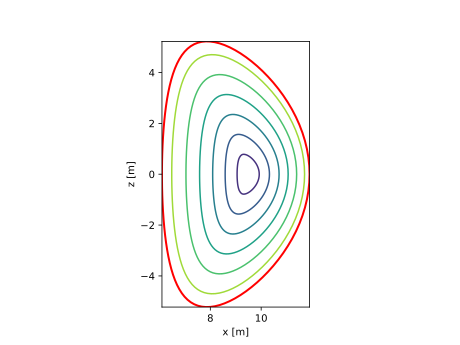
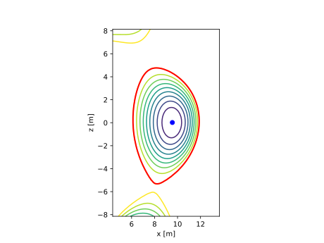

# Equilibrium information

A `TokamakNeutronSource` requires the specification of some distribution of poloidal magnetic flux in the poloidal plane. This is in order to determine the strength of the source at a given spatial location. The poloidal magnetic flux distribution is used to interpolate the 1-D plasma profiles (temperature and density) in 2-D cylindrical coordinates.

## Equilibrium parameterisations

By means of a parameterisation, such as the one described in (Fausser et al., 2012) and made available here via the `FausserFluxSurface` class.

This flux surface parameterisation is a simplified description of the poloidal magnetic flux in a tokamak and, rather unrealistically, maintains constant $\kappa(\psi_n)$ and $\delta(\psi_n)$ - constant elongation and triangularity as a function of normalised poloidal magnetic flux. Nevertheless it provides an easy way to specify a pseudo-equilibrium.

All that is required to specify a new parameterisation is the specification of a method that returns a spatial description of a closed flux surface as a function of a normalised $\psi_n$. This calculation must produce a C2 flux distribution (i.e. the flux surfaces may not overlap).

## Actual equilibrium

By means of an equilibrium file, typically an EQDSK file.

Here a free boundary equilibrium is shown. The source is only calculated within the last closed flux surface.
