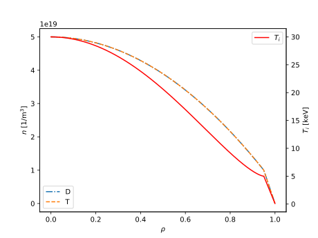
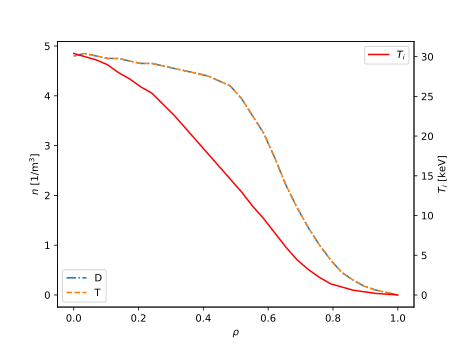

# Plasma profiles

Plasma ion temperature and fuel ion density profiles are required to calculate the neutron emission rates from the plasma.

These can be specified either by typical plasma profile parameterisations, or via actual profiles resulting from experiment or simulation.

## Profile parameterisations

Plasma profiles can be generated via common parameterisations, such as the parabolic-pedestal form found in various systems codes.

Here the fuel ion density composition is treated as constant across the profile.

## Actual profiles

One can instantiate the plasma profiles directly from data. Here the fuel ion densities must be specified, and need not have constant concentrations across the profile.

