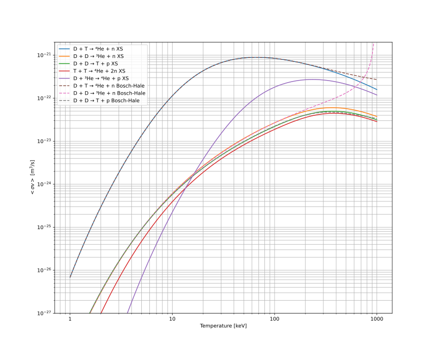
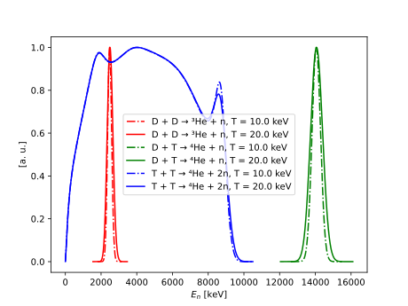

# Theory

## Fusion reactions

The following reactions are presently supported:

$$
\begin{aligned}
\textrm{D}+ \textrm{T} &\rightarrow \!{}^4_2\textrm{He}~(3.52~\textrm{MeV}) + \textrm{n} ~(14.06~\textrm{MeV}) \\
\textrm{D}+ \textrm{D} &\rightarrow \!{}^3_2\textrm{He}~(0.82~\textrm{MeV}) + \textrm{n} ~(2.45~\textrm{MeV}) \\
\textrm{D}+ \textrm{D} &\rightarrow \textrm{T}~(1.01~\textrm{MeV}) + \textrm{p}~(3.02~\textrm{MeV}) \\
\textrm{T} + \textrm{T} &\rightarrow \!{}^4_2\textrm{He} + 2\textrm{n}~(11.33~\textrm{MeV}) \\
\textrm{D} + \!{}^3_2\textrm{He} &\rightarrow \!{}^4_2\textrm{He}~(14.66~\textrm{MeV}) + \textrm{p}~(3.69~\textrm{MeV}) \\
\end{aligned}
$$

## Fusion reactivities

The reactivities $\langle \sigma\nu\rangle_{XY}$ are velocity-averaged assuming a Maxwellian distribution. Both Bosch-Hale and direct cross-section integral methods are available to calculate the reactivies.

## Neutron source strength

The local tokamak neutron source strength (the number of reactions) is calculated assuming reactions between two reactants X and Y with Maxwellian velocity distributions.

$$
\dfrac{N_{XY}}{dV} = \dfrac{1}{1+\delta_{XY}}n_X(\psi_n)n_Y(\psi_n)\langle\sigma\nu\rangle_{XY}(T_i(\psi_n))
$$

where:

* $N_{XY}$ is the number of reactions between reactants X and Y
* $\delta_{XY}$ is the Kronecker delta (0.0 for different reactants, and 1.0 for the same)
* $n_X, n_Y$ is the on density of reactants X and Y
* $\langle \sigma\nu\rangle_{XY}$ is the velocity-averaged reactivity of reaction X-Y

The total number of reactions is integrated across the whole plasma, all reactions, and all channels:

$$
N_{total} = \sum_R \sum_c \int \dfrac{1}{1+\delta_{XY}}n_X(\psi_n)n_Y(\psi_n)\langle\sigma\nu\rangle_{XY}(T_i(\psi_n))dV
$$

In practice, the aneutronic D-D channel is ignored, but is accounted for when renormalising a to a user-prescribed fusion power.

## Neutron energies

The neutron energies are provided in terms of probability density functions (PDFs). For the D-D and D-T reactions, these are calculated following [Ballabio et al., 1998](https://iopscience.iop.org/article/10.1088/0029-5515/38/11/310). For the T-T reaction (a three-body reaction with two neutrons), a single neutron spectrum is provided, interpolated from data kindly supplied from [Appelbe and Chittenden, 2016](https://www.sciencedirect.com/science/article/abs/pii/S1574181816300295).

## Plasma profiles

The plasma fuel ion density and temperature profiles are required in order to calculate the neutron source strength.

These profiles are 1-D in the normalised radial coordinates, which we call $\rho$ here. By convention $\rho$ is 0 at the magnetic axis, and 1 at the plasma boundary, which for our purposes is explicitly defined here as the last closed flux surface (LCFS).

To interact coherently with the plasma equilibrium description $\rho$ is converted to the normalised poloidal magnetic flux $\psi_n$ which follows the opposite convention, name $\psi_n$ is 1 at the magnetic axis and 0 at the plasma boundary. There are two commonly used conventions for $\psi_n$ which are supported here:

* $\psi_n = \dfrac{\psi_a - \psi}{\psi_a - \psi_b}$
* $\psi_n = \sqrt{\dfrac{\psi_a - \psi}{\psi_a - \psi_b}}$

These relate essentially to the preservation of area and volume across flux surfaces, respectively. Equilibrium solvers often use the former, transport solvers often use the latter. It is important that the plasma profiles are clearly specified with the appropriate convention for your use case.

## Plasma equilibrium

The plasma equilibrium description is used to position the neutron source. All that is required is a spatial description of $\psi_n$, and the coordinates of the LCFS. From this, one can calculate $\psi_n$ at an arbitrary location in cylindrical coordinates $(x, z)$ where, by axisymmetry, $\phi$ can be ignored.

The ion density and temperature can then be calculated at $(x, z)$ via interpolation of $\psi_n$, e.g. $T_i(\rho(\psi_n(x, z)))$.
