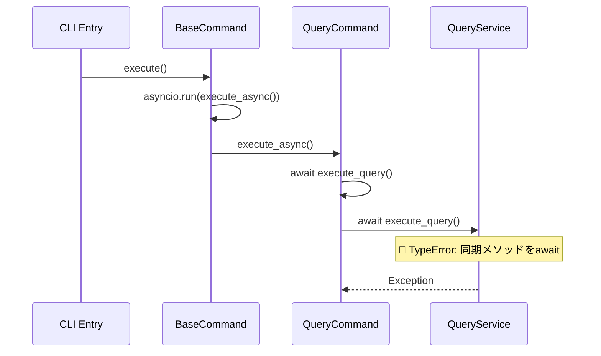
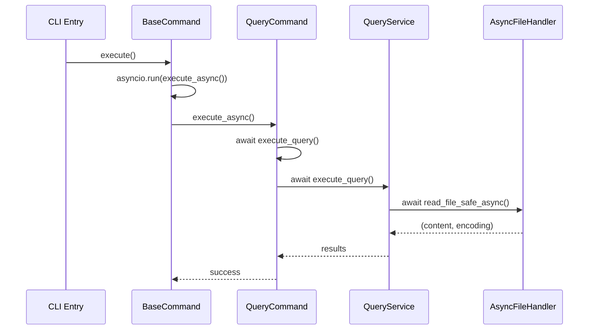
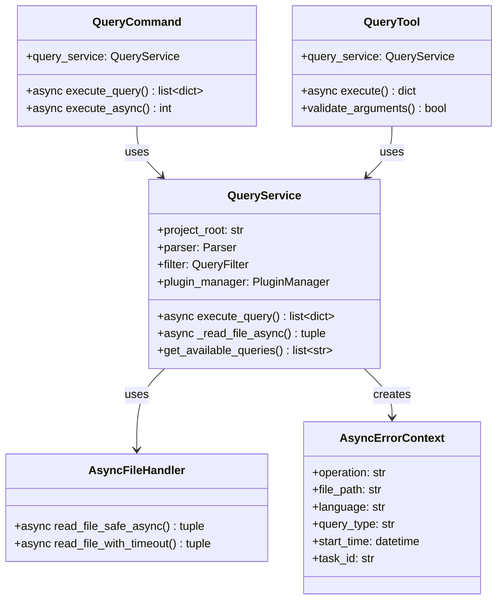
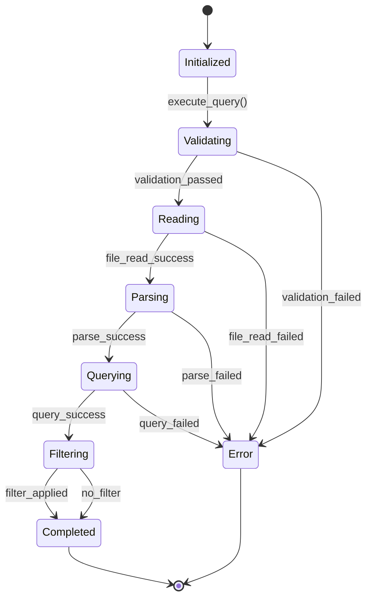
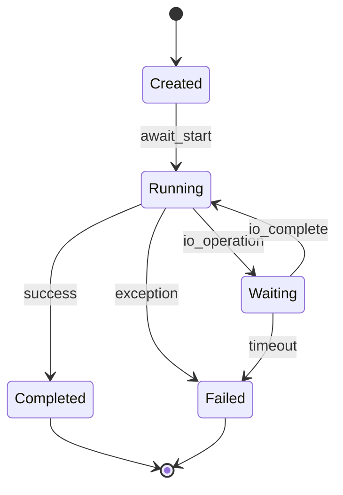

# Data Model: Async Query Service Fix

**Feature**: Async Query Service Fix  
**Date**: 2025-10-14  
**Related**: [spec.md](./spec.md) | [plan.md](./plan.md)

## Overview

非同期QueryServiceの修正に関連するデータモデルとコンポーネント設計を定義します。既存のアーキテクチャを最大限活用しつつ、非同期処理の一貫性を確保するための最小限の変更を行います。

## Core Entities

### QueryService (Modified)

非同期処理対応の中核サービスクラス

```python
class QueryService:
    """Unified query service providing tree-sitter query functionality"""
    
    # Core Properties
    project_root: str | None
    parser: Parser
    filter: QueryFilter
    plugin_manager: PluginManager
    
    # Methods (Modified)
    async def execute_query(
        self,
        file_path: str,
        language: str,
        query_key: str | None = None,
        query_string: str | None = None,
        filter_expression: str | None = None,
    ) -> list[dict[str, Any]] | None
    
    # New Methods
    async def _read_file_async(self, file_path: str) -> tuple[str, str]
    
    # Existing Methods (Unchanged)
    def get_available_queries(self, language: str) -> list[str]
    def get_query_description(self, language: str, query_key: str) -> str | None
```

**変更点**:
- `execute_query()`: 同期 → 非同期メソッド
- `_read_file_async()`: 新規追加（非同期ファイル読み込み）

**関係性**:
- `QueryCommand` → `QueryService.execute_query()` (await呼び出し)
- `QueryTool` → `QueryService.execute_query()` (await呼び出し)

### QueryCommand (Existing - No Changes)

既存の非同期実装を維持

```python
class QueryCommand(BaseCommand):
    """Command for executing queries."""
    
    # Properties
    query_service: QueryService
    
    # Methods (Already Async)
    async def execute_query(
        self, 
        language: str, 
        query: str, 
        query_name: str = "custom"
    ) -> list[dict] | None
    
    async def execute_async(self, language: str) -> int
```

**現在の状態**: 正しく非同期実装済み
**問題**: `await self.query_service.execute_query()` が同期メソッドを呼び出し

### QueryTool (Existing - Minimal Changes)

MCPツールの非同期対応

```python
class QueryTool(BaseMCPTool):
    """MCP query tool providing tree-sitter query functionality"""
    
    # Properties
    query_service: QueryService
    
    # Methods (Modified)
    async def execute(self, arguments: dict[str, Any]) -> dict[str, Any]
```

**変更点**:
- `execute()`: `self.query_service.execute_query()` → `await self.query_service.execute_query()`

### ErrorContext (New)

非同期処理のエラー情報管理

```python
@dataclass
class AsyncErrorContext:
    """非同期処理のエラー情報を管理するコンテキストクラス"""
    
    operation: str
    file_path: str
    language: str
    query_type: str
    start_time: datetime
    task_id: str | None = None
    error_message: str | None = None
    stack_trace: str | None = None
    duration: float | None = None
```

**用途**:
- 非同期処理のデバッグ情報収集
- エラー発生時のコンテキスト保持
- パフォーマンス監視

### AsyncFileHandler (New)

非同期ファイル処理ユーティリティ

```python
class AsyncFileHandler:
    """非同期ファイル読み込みを担当するユーティリティクラス"""
    
    @staticmethod
    async def read_file_safe_async(file_path: str) -> tuple[str, str]:
        """非同期でファイルを安全に読み込み"""
        
    @staticmethod
    async def read_file_with_timeout(
        file_path: str, 
        timeout: float = 30.0
    ) -> tuple[str, str]:
        """タイムアウト付きファイル読み込み"""
```

## Data Flow Architecture

### Current (Problematic) Flow



### Fixed (Target) Flow



## Component Relationships

### Class Diagram



## State Transitions

### QueryService Execution States



### Async Task Lifecycle



## Data Validation Rules

### Input Validation

| Field | Type | Constraints | Validation |
|-------|------|-------------|------------|
| file_path | str | 必須、非空 | セキュリティ検証、存在確認 |
| language | str | オプション | サポート言語リスト |
| query_key | str | オプション | 利用可能クエリリスト |
| query_string | str | オプション | 安全なパターン検証 |
| filter_expression | str | オプション | フィルター構文検証 |

### Output Validation

| Field | Type | Constraints | Description |
|-------|------|-------------|-------------|
| results | list[dict] | 非null | クエリ結果リスト |
| capture_name | str | 必須 | キャプチャ名 |
| node_type | str | 必須 | ノードタイプ |
| start_line | int | ≥1 | 開始行番号 |
| end_line | int | ≥start_line | 終了行番号 |
| content | str | 非null | コード内容 |

## Performance Considerations

### Async Optimization Strategies

1. **ファイルI/O最適化**
   ```python
   # Before (Blocking)
   content, encoding = read_file_safe(file_path)
   
   # After (Non-blocking)
   content, encoding = await asyncio.run_in_executor(
       None, read_file_safe, file_path
   )
   ```

2. **並行処理対応**
   ```python
   # Multiple queries in parallel
   tasks = [
       service.execute_query(file_path, lang, query)
       for query in queries
   ]
   results = await asyncio.gather(*tasks)
   ```

3. **リソース管理**
   ```python
   # Timeout protection
   async with asyncio.timeout(30.0):
       result = await service.execute_query(...)
   ```

### Memory Management

- **ストリーミング処理**: 大きなファイルの段階的読み込み
- **結果キャッシュ**: 同一クエリの結果再利用
- **ガベージコレクション**: 長時間実行時のメモリクリーンアップ

## Error Handling Strategy

### Exception Hierarchy

```python
class AsyncQueryError(Exception):
    """非同期クエリ処理の基底例外"""
    pass

class AsyncFileReadError(AsyncQueryError):
    """非同期ファイル読み込みエラー"""
    pass

class AsyncTimeoutError(AsyncQueryError):
    """非同期処理タイムアウトエラー"""
    pass

class AsyncValidationError(AsyncQueryError):
    """非同期処理バリデーションエラー"""
    pass
```

### Error Recovery Patterns

1. **Retry with Exponential Backoff**
   ```python
   for attempt in range(max_retries):
       try:
           return await operation()
       except RetryableError:
           await asyncio.sleep(2 ** attempt)
   ```

2. **Graceful Degradation**
   ```python
   try:
       return await fast_async_operation()
   except AsyncError:
       return await fallback_sync_operation()
   ```

3. **Circuit Breaker Pattern**
   ```python
   if error_rate > threshold:
       raise CircuitBreakerOpen()
   ```

## Testing Strategy

### Test Data Models

```python
@dataclass
class AsyncTestCase:
    """非同期テストケースの定義"""
    name: str
    file_path: str
    language: str
    query_key: str | None
    query_string: str | None
    expected_count: int
    timeout: float = 5.0
    should_fail: bool = False
```

### Mock Objects

```python
class MockAsyncQueryService:
    """テスト用モックサービス"""
    
    async def execute_query(self, *args, **kwargs):
        # Simulate async behavior
        await asyncio.sleep(0.1)
        return mock_results
```

## Migration Path

### Phase 1: Core Changes

1. **QueryService.execute_query()** → `async def`
2. **ファイル読み込み** → 非同期化
3. **基本テスト** → 動作確認

### Phase 2: Enhanced Features

1. **エラーハンドリング** → 非同期対応
2. **パフォーマンス監視** → メトリクス追加
3. **並行処理** → 最適化

### Phase 3: Quality Assurance

1. **包括的テスト** → 全シナリオ
2. **ドキュメント** → 更新
3. **リリース準備** → 最終確認

## Backward Compatibility

### API Compatibility

- **公開インターフェース**: 変更なし
- **メソッドシグネチャ**: `async`キーワード追加のみ
- **戻り値**: 同一形式維持

### Migration Support

```python
# Legacy sync wrapper (if needed)
def execute_query_sync(self, *args, **kwargs):
    """Backward compatibility wrapper"""
    return asyncio.run(self.execute_query(*args, **kwargs))
```

---

**Created**: 2025-10-14  
**Version**: 1.0  
**Status**: Draft  
**Next**: [contracts/](./contracts/) API definitions