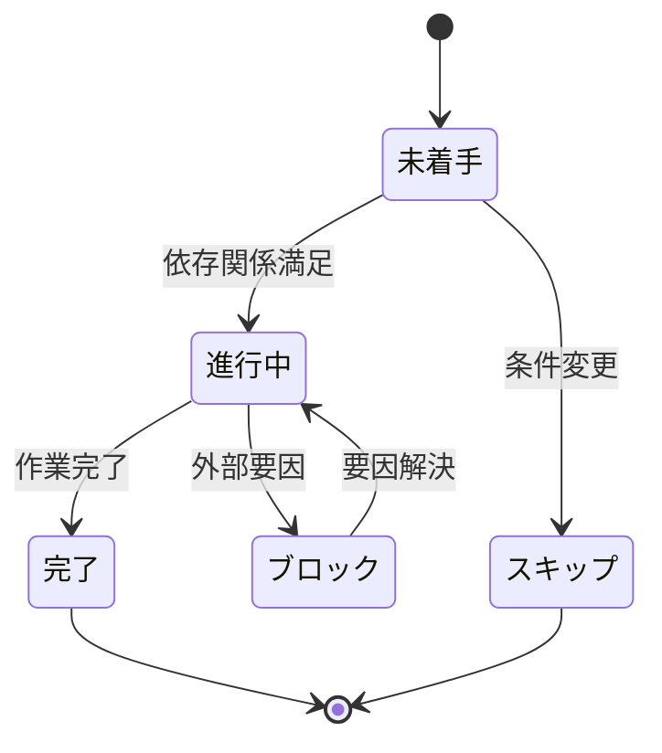
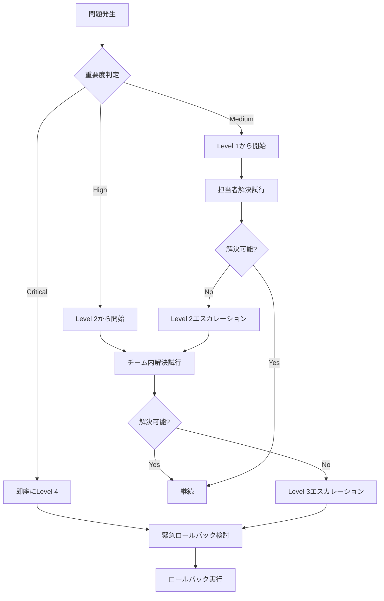

# Progress Management System: Async Query Service Fix

**Feature**: Async Query Service Fix  
**Date**: 2025-10-14  
**Status**: Planning Phase  

## 進捗管理システム概要

### 目的
- 15個の詳細タスクの進捗を効率的に追跡
- 3つのフェーズ（緊急修正、包括的テスト、品質保証）の完了状況を管理
- 並行実行可能なタスクの最適化
- 品質ゲートでの意思決定支援

### 管理レベル
1. **タスクレベル**: 個別タスクの詳細進捗
2. **フェーズレベル**: Phase 1-3の完了状況
3. **プロジェクトレベル**: 全体の進捗と品質指標

## タスク状態管理

### 状態定義
| 状態 | 記号 | 説明 | 次のアクション |
|------|------|------|----------------|
| 未着手 | [ ] | タスク未開始 | 依存関係確認後、開始 |
| 進行中 | [-] | 作業実行中 | 完了まで継続 |
| 完了 | [x] | タスク完了 | 次タスクの依存関係解除 |
| ブロック | [!] | 外部要因で停止 | ブロック要因の解決 |
| スキップ | [~] | 条件により不要 | 依存タスクの更新 |

### 状態遷移ルール


## 実装者割り当て

### 役割定義
| 役割 | 責任範囲 | 推奨スキル |
|------|----------|------------|
| **Lead Developer** | T001-T005 (緊急修正) | Python非同期、tree-sitter |
| **Test Engineer** | T006-T010 (テスト実装) | pytest-asyncio、統合テスト |
| **QA Engineer** | T011-T015 (品質保証) | mypy、ruff、ドキュメント |

### タスク割り当て表
| Task | 担当者 | 優先度 | 並行可能 | 依存関係 |
|------|--------|--------|----------|----------|
| T001 | Lead Developer | Critical | No | - |
| T002 | Lead Developer | Critical | No | T001 |
| T003 | Lead Developer | Critical | Yes | - |
| T004 | Lead Developer | Critical | No | T001,T002 |
| T005 | Lead Developer | Critical | No | T002,T004 |
| T006 | Test Engineer | High | No | T005 |
| T007 | Test Engineer | High | Yes | T005 |
| T008 | Test Engineer | High | Yes | T005 |
| T009 | Test Engineer | High | Yes | T005 |
| T010 | Test Engineer | High | No | T006-T009 |
| T011 | QA Engineer | Medium | No | T010 |
| T012 | QA Engineer | Medium | Yes | T010 |
| T013 | QA Engineer | Medium | Yes | T010 |
| T014 | QA Engineer | Medium | No | T011-T013 |
| T015 | QA Engineer | Medium | No | T014 |

## 完了条件と検証方法

### Phase 1: Emergency Fix
**完了条件**:
- [ ] T001-T005の全タスクが完了状態
- [ ] TypeErrorが100%解消
- [ ] 基本クエリ実行が正常動作

**検証方法**:
```bash
# 基本動作確認
python -m tree_sitter_analyzer query --file-path examples/sample.py --query-key function

# 期待結果: エラーなく結果表示
# 失敗条件: TypeError発生
```

### Phase 2: Comprehensive Testing
**完了条件**:
- [ ] T006-T010の全タスクが完了状態
- [ ] 新規テスト100%パス
- [ ] 既存テスト705個100%パス
- [ ] パフォーマンス要件達成

**検証方法**:
```bash
# 全テスト実行
pytest tests/ -v --tb=short

# パフォーマンステスト
pytest tests/test_async_performance.py -v -s

# 期待結果: All tests passed
# 失敗条件: Any test failed
```

### Phase 3: Quality Assurance
**完了条件**:
- [ ] T011-T015の全タスクが完了状態
- [ ] 型チェック100%パス
- [ ] コードスタイル統一
- [ ] ドキュメント更新完了

**検証方法**:
```bash
# 型チェック
python -m mypy tree_sitter_analyzer/core/query_service.py

# スタイルチェック
python -m ruff check tree_sitter_analyzer/

# 期待結果: No errors found
# 失敗条件: Any errors reported
```

## 時間見積もりと実績追跡

### 見積もり精度向上
| フェーズ | 初期見積もり | 調整係数 | 最終見積もり |
|----------|--------------|----------|--------------|
| Phase 1 | 44分 | 1.5x (緊急対応) | 66分 |
| Phase 2 | 210分 | 1.2x (テスト複雑性) | 252分 |
| Phase 3 | 65分 | 1.1x (品質確認) | 72分 |
| **合計** | **319分** | **1.23x** | **390分 (6.5時間)** |

### 実績追跡テンプレート
```markdown
## Daily Progress Report - YYYY-MM-DD

### Today's Completed Tasks
- [x] T001: QueryService async化 (実績: 8分, 見積: 5分)
- [x] T002: 非同期ファイル読み込み (実績: 18分, 見積: 15分)

### Today's Blocked Tasks
- [!] T006: 非同期テスト実装 (ブロック要因: pytest-asyncio設定問題)

### Tomorrow's Plan
- [ ] T003: asyncioインポート追加
- [ ] T004: MCP await修正
- [ ] T005: 基本動作確認

### Issues & Risks
- pytest-asyncio設定の調査が必要
- パフォーマンステストの環境準備

### Metrics
- 完了タスク: 2/15 (13.3%)
- 消化時間: 26分/390分 (6.7%)
- 進捗率: Phase 1 40%完了
```

## 品質ゲート管理

### Gate 1: Emergency Fix Checkpoint
**判定基準**:
- TypeErrorの完全解消
- 基本機能の動作確認
- 回帰テストなし

**意思決定オプション**:
1. **緊急リリース**: Phase 1のみでv1.8.1リリース
2. **継続開発**: Phase 2に進行
3. **ロールバック**: 問題発生時の前バージョン復帰

**判定者**: Lead Developer + Technical Lead

### Gate 2: Quality Assurance Checkpoint
**判定基準**:
- 全テスト100%パス
- パフォーマンス要件達成
- 非同期処理の安定性確認

**意思決定オプション**:
1. **品質保証済みリリース**: Phase 2完了でリリース
2. **最終品質向上**: Phase 3に進行
3. **部分ロールバック**: 特定機能のみ修正

**判定者**: Test Engineer + QA Engineer

### Gate 3: Production Ready Checkpoint
**判定基準**:
- 全品質チェック完了
- ドキュメント整備完了
- 本番環境での動作確認

**意思決定オプション**:
1. **正式リリース**: v1.8.1の本番デプロイ
2. **追加検証**: 更なる品質確認
3. **リリース延期**: 問題発見時の対応

**判定者**: QA Engineer + Product Owner

## リスク管理と緊急時対応

### リスク監視指標
| 指標 | 正常範囲 | 警告レベル | 緊急レベル |
|------|----------|------------|------------|
| 進捗遅延 | <10% | 10-25% | >25% |
| テスト失敗率 | 0% | <5% | ≥5% |
| パフォーマンス劣化 | <5% | 5-10% | >10% |
| ブロックタスク数 | 0個 | 1-2個 | ≥3個 |

### エスカレーション手順
1. **Level 1**: 担当者による自己解決 (30分以内)
2. **Level 2**: チーム内相談 (1時間以内)
3. **Level 3**: Technical Leadへの報告 (2時間以内)
4. **Level 4**: 緊急ロールバック判断 (4時間以内)

### 緊急時対応プロセス


## 成功指標とKPI

### 機能的成功指標
- [ ] QueryCommand TypeErrorの100%解消
- [ ] 全既存テスト（705個）の100%パス
- [ ] 新規非同期テストの100%パス
- [ ] CLI/MCPインターフェースの正常動作

### 技術的成功指標
- [ ] 非同期処理の一貫性確保
- [ ] パフォーマンス要件の達成（処理時間増加<5%）
- [ ] 型安全性の維持（mypy 100%パス）
- [ ] コードカバレッジ90%以上

### プロジェクト成功指標
- [ ] 緊急修正の時間内完了（Phase 1: 1-2時間）
- [ ] 全体完了時間の目標達成（4-8時間）
- [ ] 品質ゲート通過率100%
- [ ] ロールバック発生0件

### 継続的改善指標
- 見積もり精度: 実績/見積もり比率
- 並行実行効率: 並行タスクの時間短縮効果
- 品質向上度: 発見バグ数の減少
- チーム学習度: 類似タスクの効率化

---

**Created**: 2025-10-14  
**Last Updated**: 2025-10-14  
**Status**: Active  
**Next Review**: Phase 1完了時