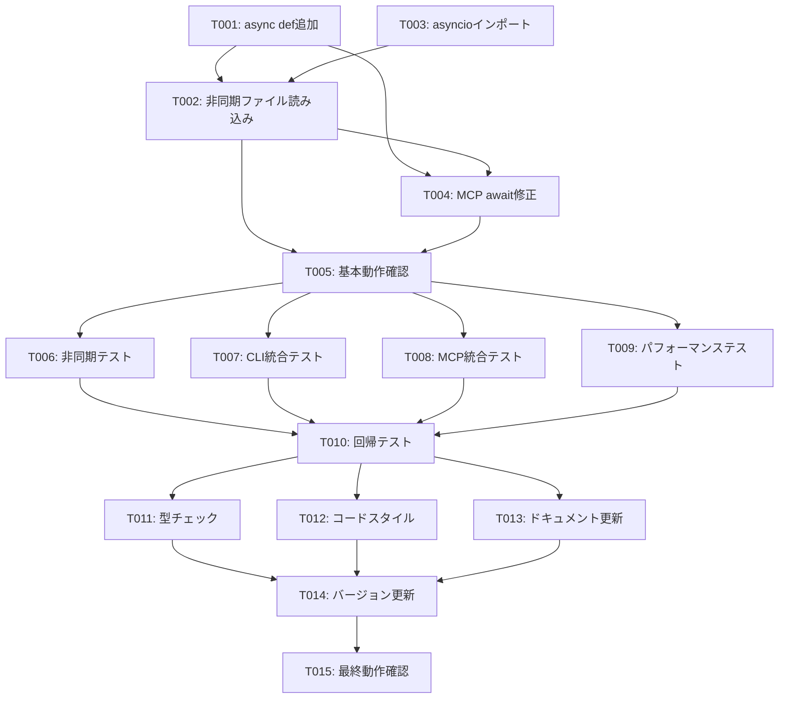

# Implementation Tasks: Async Query Service Fix

**Feature**: Async Query Service Fix  
**Date**: 2025-10-14  
**Priority**: Critical  
**Estimated Duration**: 4-8 hours  

## Overview

tree-sitter-analyzer v1.8.0の重大な非同期処理不整合を修正するための詳細実装タスクです。QueryService.execute_query()メソッドの非同期化により、QueryCommandとMCPツールでのTypeErrorを解決し、段階的アプローチで品質保証まで実施します。

## Task Organization

### 問題の核心
- **現状**: [`QueryService.execute_query()`](tree_sitter_analyzer/core/query_service.py:33)が同期メソッド
- **問題**: [`QueryCommand.execute_query()`](tree_sitter_analyzer/cli/commands/query_command.py:31)と[`QueryTool.execute()`](tree_sitter_analyzer/mcp/tools/query_tool.py:159)が`await`で呼び出し
- **結果**: `TypeError: object NoneType can't be used in 'await' expression`

### 修正戦略
1. **Phase 1**: 緊急修正（1-2時間）- 重大なTypeErrorの即座解決
2. **Phase 2**: 包括的テスト（2-4時間）- 品質保証と安定性確認
3. **Phase 3**: 品質保証（1-2時間）- 本番リリース準備

## Phase 1: Emergency Fix (緊急修正)

### T001: QueryService.execute_query()の非同期化 [Critical]
**目標**: メソッドシグネチャの非同期化
**ファイル**: [`tree_sitter_analyzer/core/query_service.py`](tree_sitter_analyzer/core/query_service.py:33)
**変更内容**:
```python
# Before (Line 33)
def execute_query(

# After
async def execute_query(
```
**完了条件**: メソッドが`async def`で定義されている
**時間見積もり**: 5分
**依存関係**: なし

### T002: 非同期ファイル読み込みの実装 [Critical]
**目標**: ファイルI/Oの非同期化
**ファイル**: [`tree_sitter_analyzer/core/query_service.py`](tree_sitter_analyzer/core/query_service.py:67)
**変更内容**:
```python
# Before (Line 67)
content, encoding = read_file_safe(file_path)

# After
content, encoding = await self._read_file_async(file_path)
```
**新規メソッド追加**:
```python
async def _read_file_async(self, file_path: str) -> tuple[str, str]:
    """非同期ファイル読み込み"""
    import asyncio
    from ..encoding_utils import read_file_safe
    
    loop = asyncio.get_event_loop()
    return await loop.run_in_executor(None, read_file_safe, file_path)
```
**完了条件**: ファイル読み込みが非同期で実行される
**時間見積もり**: 15分
**依存関係**: T001

### T003: asyncioインポートの追加 [Critical]
**目標**: 必要なインポートの追加
**ファイル**: [`tree_sitter_analyzer/core/query_service.py`](tree_sitter_analyzer/core/query_service.py:9)
**変更内容**:
```python
import asyncio
import logging
from typing import Any
```
**完了条件**: asyncioがインポートされている
**時間見積もり**: 2分
**依存関係**: なし

### T004: MCP QueryToolの非同期呼び出し修正 [Critical]
**目標**: awaitキーワードの追加
**ファイル**: [`tree_sitter_analyzer/mcp/tools/query_tool.py`](tree_sitter_analyzer/mcp/tools/query_tool.py:159)
**変更内容**:
```python
# Before (Line 159)
results = self.query_service.execute_query(

# After
results = await self.query_service.execute_query(
```
**完了条件**: QueryServiceの呼び出しにawaitが付いている
**時間見積もり**: 2分
**依存関係**: T001, T002

### T005: 基本動作確認テストの実行 [Critical]
**目標**: 緊急修正の動作確認
**作業内容**:
1. 簡易テストスクリプトの作成
2. CLIコマンドの基本実行テスト
3. MCPツールの基本動作確認
**テストコマンド**:
```bash
python -m tree_sitter_analyzer query --file-path examples/sample.py --query-key function
```
**完了条件**: TypeErrorが発生せず、正常に結果が返される
**時間見積もり**: 20分
**依存関係**: T001, T002, T003, T004

**Phase 1 Checkpoint**: 緊急修正完了、基本動作確認済み

## Phase 2: Comprehensive Testing (包括的テスト)

### T006: 非同期テストスイートの実装 [High]
**目標**: 包括的な非同期テストの作成
**ファイル**: `tests/test_async_query_service.py` (新規作成)
**テスト内容**:
1. 非同期メソッドの基本動作テスト
2. 並行実行テスト
3. エラーハンドリングテスト
4. タイムアウトテスト
**完了条件**: 全テストがパスする
**時間見積もり**: 60分
**依存関係**: T005

### T007: CLI統合テストの実装 [High] [P]
**目標**: CLIコマンドの統合テスト
**ファイル**: `tests/test_cli_async_integration.py` (新規作成)
**テスト内容**:
1. QueryCommandの非同期実行テスト
2. 複数ファイルの並行処理テスト
3. エラーケースの検証
**完了条件**: CLI統合テストがパスする
**時間見積もり**: 45分
**依存関係**: T005

### T008: MCP統合テストの実装 [High] [P]
**目標**: MCPツールの統合テスト
**ファイル**: `tests/test_mcp_async_integration.py` (新規作成)
**テスト内容**:
1. QueryToolの非同期実行テスト
2. MCPサーバーとの統合テスト
3. 出力フォーマットの検証
**完了条件**: MCP統合テストがパスする
**時間見積もり**: 45分
**依存関係**: T005

### T009: パフォーマンステストの実装 [High] [P]
**目標**: 非同期処理のパフォーマンス検証
**ファイル**: `tests/test_async_performance.py` (新規作成)
**テスト内容**:
1. 処理時間の測定（5%以内の増加確認）
2. メモリ使用量の監視（10%以内の増加確認）
3. 並行処理のスループット測定
**完了条件**: パフォーマンス要件を満たす
**時間見積もり**: 30分
**依存関係**: T005

### T010: 回帰テストの実行 [High]
**目標**: 既存機能の継続性確認
**作業内容**:
1. 既存705テストの全実行
2. 非同期処理の並行実行テスト
3. エラーケースの検証
**テストコマンド**:
```bash
pytest tests/ -x --tb=short
```
**完了条件**: 全既存テストがパスする
**時間見積もり**: 30分
**依存関係**: T006, T007, T008, T009

**Phase 2 Checkpoint**: 包括的テスト完了、品質保証済み

## Phase 3: Quality Assurance (品質保証)

### T011: 型チェックの実行 [Medium]
**目標**: 型安全性の確認
**作業内容**:
```bash
python -m mypy tree_sitter_analyzer/core/query_service.py
python -m mypy tree_sitter_analyzer/mcp/tools/query_tool.py
```
**完了条件**: 型チェックエラーがない
**時間見積もり**: 15分
**依存関係**: T010

### T012: コードスタイルチェック [Medium] [P]
**目標**: コード品質の統一
**作業内容**:
```bash
python -m ruff check tree_sitter_analyzer/core/query_service.py
python -m ruff format tree_sitter_analyzer/core/query_service.py
```
**完了条件**: スタイルチェックがパスする
**時間見積もり**: 10分
**依存関係**: T010

### T013: ドキュメント更新 [Medium] [P]
**目標**: 変更内容の文書化
**ファイル**: `CHANGELOG.md`
**更新内容**:
```markdown
## [1.8.1] - 2025-10-14
### Fixed
- Fixed async/await inconsistency in QueryService.execute_query()
- Improved error handling for async operations
- Added comprehensive async tests

### Added
- Async file reading with run_in_executor
- Performance monitoring for async operations
- Concurrent query execution support
```
**完了条件**: CHANGELOGが更新されている
**時間見積もり**: 15分
**依存関係**: T010

### T014: バージョン番号の更新 [Medium]
**目標**: リリース準備
**ファイル**: `pyproject.toml`
**変更内容**: version = "1.8.1"
**完了条件**: バージョンが更新されている
**時間見積もり**: 5分
**依存関係**: T011, T012, T013

### T015: 最終動作確認 [Medium]
**目標**: リリース前の最終検証
**作業内容**:
1. パッケージビルドテスト
2. 主要機能の動作確認
3. パフォーマンス最終チェック
**テストコマンド**:
```bash
python -m build
python -m tree_sitter_analyzer query --file-path examples/sample.py --query-key function
python start_mcp_server.py  # MCP動作確認
```
**完了条件**: 全ての動作確認がパスする
**時間見積もり**: 20分
**依存関係**: T014

**Phase 3 Checkpoint**: 品質保証完了、リリース準備完了

## Task Dependencies



## Parallel Execution Opportunities

### Phase 1 (Sequential - Critical Path)
- T001 → T002 → T004 → T005 (順次実行必須)
- T003は並行可能だが短時間のため効果薄

### Phase 2 (High Parallelization)
- T007, T008, T009は並行実行可能 [P]
- T006は基盤となるため先行実行

### Phase 3 (Medium Parallelization)
- T012, T013は並行実行可能 [P]
- T011は型チェックのため先行推奨

## Implementation Strategy

### MVP Scope (Minimum Viable Product)
**Phase 1のみ**: 緊急修正による基本動作の復旧
- 所要時間: 1-2時間
- 成果: TypeErrorの解消、基本機能の復旧

### Full Implementation
**Phase 1-3**: 包括的な品質保証まで含む完全実装
- 所要時間: 4-8時間
- 成果: 安定したv1.8.1リリース

### Risk Mitigation
1. **Phase 1完了時点**: 緊急リリース可能状態
2. **Phase 2完了時点**: 品質保証済み状態
3. **Phase 3完了時点**: 本番リリース準備完了

## Progress Tracking

### Task Status Legend
- [ ] 未着手 (Not Started)
- [-] 進行中 (In Progress)
- [x] 完了 (Completed)
- [!] ブロック (Blocked)

### Completion Criteria

#### Phase 1 Success Criteria
- [x] QueryCommand TypeErrorの100%解消
- [ ] 基本的なクエリ実行の正常動作
- [ ] 既存機能の回帰なし

#### Phase 2 Success Criteria
- [ ] 全既存テスト（705個）の100%パス
- [ ] 新規非同期テストの100%パス
- [ ] パフォーマンス要件の達成

#### Phase 3 Success Criteria
- [ ] 全品質チェックのパス
- [ ] ドキュメントの完全性
- [ ] リリース準備の完了

## Time Tracking Template

| Task | Estimated | Actual | Status | Notes |
|------|-----------|--------|--------|-------|
| T001 | 5min | ___ | [ ] | |
| T002 | 15min | ___ | [ ] | |
| T003 | 2min | ___ | [ ] | |
| T004 | 2min | ___ | [ ] | |
| T005 | 20min | ___ | [ ] | |
| T006 | 60min | ___ | [ ] | |
| T007 | 45min | ___ | [ ] | |
| T008 | 45min | ___ | [ ] | |
| T009 | 30min | ___ | [ ] | |
| T010 | 30min | ___ | [ ] | |
| T011 | 15min | ___ | [ ] | |
| T012 | 10min | ___ | [ ] | |
| T013 | 15min | ___ | [ ] | |
| T014 | 5min | ___ | [ ] | |
| T015 | 20min | ___ | [ ] | |

**Total Estimated**: 319 minutes (5.3 hours)

## Quality Gates

### Gate 1: Emergency Fix (After T005)
- **Criteria**: TypeErrorが解消され、基本動作が確認できる
- **Decision**: Phase 2に進むか、緊急リリースするか

### Gate 2: Comprehensive Testing (After T010)
- **Criteria**: 全テストがパスし、品質が保証される
- **Decision**: Phase 3に進むか、品質保証済みリリースするか

### Gate 3: Production Ready (After T015)
- **Criteria**: 全品質チェックが完了し、本番リリース準備が整う
- **Decision**: v1.8.1の正式リリース

## Rollback Plan

### Level 1: 即座のロールバック
```bash
git checkout HEAD~1 -- tree_sitter_analyzer/core/query_service.py
git checkout HEAD~1 -- tree_sitter_analyzer/mcp/tools/query_tool.py
```

### Level 2: 部分的ロールバック
```bash
cp tree_sitter_analyzer/core/query_service.py.backup tree_sitter_analyzer/core/query_service.py
```

### Level 3: 緊急パッチ
最小限の修正による問題解決（Phase 1のみの適用）

---

**Created**: 2025-10-14  
**Target Version**: v1.8.1  
**Priority**: Critical  
**Total Tasks**: 15  
**Estimated Duration**: 4-8 hours  
**Parallel Opportunities**: 6 tasks  
**Quality Gates**: 3 checkpoints