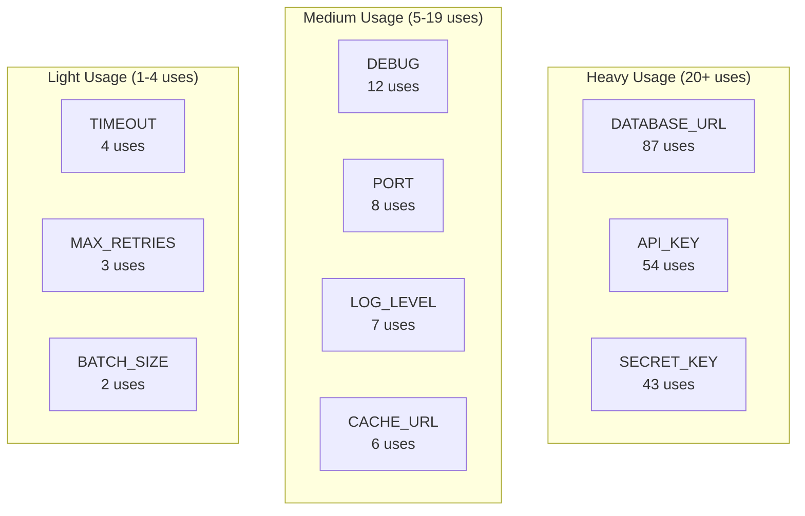
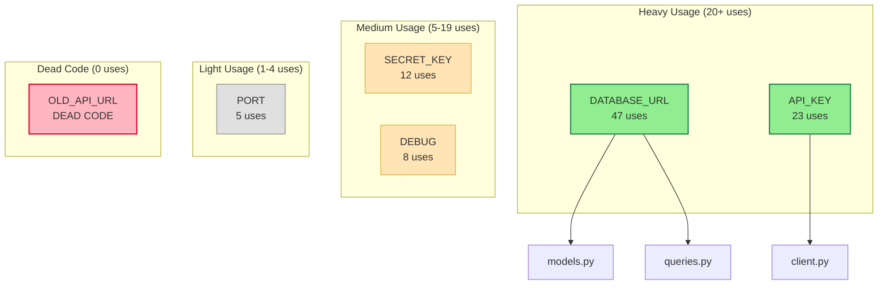
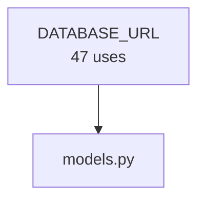
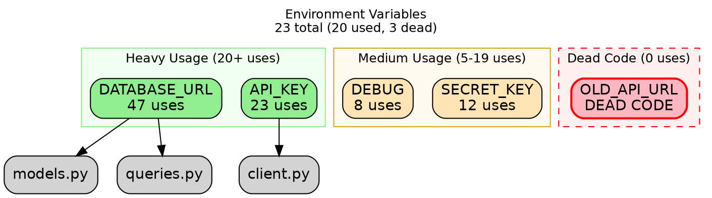

[Home](../README.md) / Usage / Environment Variable Analysis

# Environment Variable Usage Analysis

TripWire's analysis suite provides powerful tools to track environment variable usage across your codebase, identify dead code, and visualize dependencies. These commands help you maintain clean configuration by detecting unused variables and understanding how environment variables flow through your application.

---

## Quick Start

Get started with usage analysis in 30 seconds:

```bash
# Run comprehensive usage analysis
tripwire analyze usage

# Find dead code (variables declared but never used)
tripwire analyze deadcode

# Visualize top 10 most-used variables
tripwire analyze dependencies --top 10
```

**What you'll discover:**
- Which environment variables are declared but never used (dead code)
- Where each variable is referenced across your codebase
- Usage patterns and dependency relationships
- Opportunities to clean up configuration sprawl

---

## Table of Contents

- [Quick Start](#quick-start)
- [Commands Overview](#commands-overview)
  - [analyze usage](#tripwire-analyze-usage)
  - [analyze deadcode](#tripwire-analyze-deadcode)
  - [analyze dependencies](#tripwire-analyze-dependencies)
- [Common Workflows](#common-workflows)
  - [Finding and Removing Dead Variables](#finding-and-removing-dead-variables)
  - [Auditing a Legacy Codebase](#auditing-a-legacy-codebase)
  - [Adding to CI/CD Pipeline](#adding-to-cicd-pipeline)
  - [Filtering Large Dependency Graphs](#filtering-large-dependency-graphs)
- [Output Formats](#output-formats)
  - [Terminal (Rich)](#terminal-rich)
  - [JSON](#json)
  - [Mermaid](#mermaid)
  - [DOT (Graphviz)](#dot-graphviz)
- [Understanding Results](#understanding-results)
  - [What is Dead Code?](#what-is-dead-code)
  - [False Positives](#false-positives)
  - [Usage Counts](#usage-counts)
- [Performance and Limitations](#performance-and-limitations)
  - [Performance Characteristics](#performance-characteristics)
  - [File Filtering](#file-filtering)
  - [Known Limitations](#known-limitations)
- [Troubleshooting](#troubleshooting)
- [CI/CD Integration](#cicd-integration)
- [Best Practices](#best-practices)

---

## Commands Overview

### `tripwire analyze usage`

Analyze environment variable usage across your entire codebase.

**What it does:**
- Scans all Python files to find where variables are declared (via `env.require()` or `env.optional()`)
- Tracks where each variable is referenced throughout the codebase
- Identifies dead code (variables declared but never used)
- Shows usage statistics and coverage percentage

**Syntax:**
```bash
tripwire analyze usage [OPTIONS]
```

**Options:**
- `--show-used` - Show only variables that are used (excludes dead code)
- `--show-unused` - Show only unused variables (same as `deadcode` command)
- `--format [terminal|json]` - Output format (default: terminal)
- `--min-usage N` - Only show variables used N or more times
- `--export FILE` - Export results to file (format depends on --format)
- `--strict` - Exit 1 if any dead variables found (CI/CD mode)

**Examples:**

```bash
# Full analysis with rich terminal output
tripwire analyze usage

# Show only used variables
tripwire analyze usage --show-used

# Show only dead code
tripwire analyze usage --show-unused

# Only show heavily-used variables (5+ usages)
tripwire analyze usage --min-usage 5

# Export to JSON
tripwire analyze usage --format json --export usage-report.json

# CI/CD mode - fail if dead code found
tripwire analyze usage --strict
```

**Terminal Output:**

```
╭──────────────────────────────╮
│  TripWire Usage Analysis     │
╰──────────────────────────────╯

┌─────────────────────┬────────┐
│ Total Variables     │ 23     │
│ Used Variables      │ 20     │
│ Dead Variables      │ 3      │
│ Coverage            │ 86.96% │
└─────────────────────┴────────┘

⚠️  Dead Variables (Declared but Never Used)

┌──────────────────┬───────────────────┬──────────────────┬────────┐
│ Variable         │ Env Var           │ Location         │ Type   │
├──────────────────┼───────────────────┼──────────────────┼────────┤
│ OLD_API_URL      │ OLD_API_URL       │ config.py:47     │ string │
│ LEGACY_TOKEN     │ LEGACY_TOKEN      │ settings.py:12   │ string │
│ UNUSED_DEBUG     │ UNUSED_DEBUG      │ config.py:102    │ bool   │
└──────────────────┴───────────────────┴──────────────────┴────────┘

╭─────────────── Remediation Steps ────────────────╮
│ 💡 Suggested Actions:                            │
│                                                   │
│ 1. Review each variable to confirm it's unused   │
│ 2. Remove declarations from Python files         │
│ 3. Remove from .env and .env.example             │
│ 4. Update schema: tripwire schema from-code      │
│ 5. Commit changes and verify tests pass          │
╰──────────────────────────────────────────────────╯

✅ Active Variables (Declared and Used)

┌─────────────────┬─────────────┬────────────┬──────────────────┐
│ Variable        │ Usage Count │ Locations  │ First Use        │
├─────────────────┼─────────────┼────────────┼──────────────────┤
│ DATABASE_URL    │ 47          │ 8 files    │ models.py:23     │
│ API_KEY         │ 23          │ 5 files    │ client.py:15     │
│ SECRET_KEY      │ 12          │ 3 files    │ app.py:8         │
│ DEBUG           │ 8           │ 4 files    │ config.py:45     │
│ PORT            │ 5           │ 2 files    │ server.py:10     │
└─────────────────┴─────────────┴────────────┴──────────────────┘

📊 Top Variable Usage
🌳 Environment Variables
├─ DATABASE_URL (47 uses)
│  ├─ 📄 models.py
│  │  └─ Lines: 23, 45, 67, 89, 102 ... +12 more
│  ├─ 📄 queries.py
│  │  └─ Lines: 10, 34, 56, 78
│  └─ 📄 migrations.py
│     └─ Lines: 5, 12, 20
├─ API_KEY (23 uses)
│  ├─ 📄 client.py
│  │  └─ Lines: 15, 23, 56
│  └─ 📄 api.py
│     └─ Lines: 8, 34, 90 ... +5 more
└─ SECRET_KEY (12 uses)
   └─ 📄 app.py
      └─ Lines: 8, 45, 102
```

**Exit Codes:**
- `0` - Success (no dead code, or dead code found but --strict not used)
- `1` - Failure (dead code found when using --strict)

**Use Cases:**
- Regular codebase audits to identify cleanup opportunities
- Pre-release cleanup to remove unused configuration
- Understanding which variables are critical vs rarely used
- Generating reports for configuration documentation

**Best Practices:**
- Run monthly as part of technical debt cleanup
- Review dead variables with team before removing (may be used dynamically)
- Use `--min-usage` to focus on rarely-used variables
- Combine with `schema from-code --exclude-unused` to clean schemas

---

### `tripwire analyze deadcode`

Focused command to find environment variables that are declared but never used.

**What it does:**
- Performs targeted analysis for dead code detection
- Shows detailed removal instructions for each dead variable
- Provides actionable remediation steps
- Exits with error code 1 in strict mode if dead code found

**Syntax:**
```bash
tripwire analyze deadcode [OPTIONS]
```

**Options:**
- `--strict` - Exit 1 on first dead variable found (CI/CD mode)
- `--export FILE` - Export dead variables to JSON file

**Examples:**

```bash
# Find all dead variables
tripwire analyze deadcode

# CI/CD mode - fail fast on first dead variable
tripwire analyze deadcode --strict

# Export to JSON for programmatic processing
tripwire analyze deadcode --export dead-vars.json
```

**Terminal Output (No Dead Code):**

```
╭────────────────────────────────────────╮
│ ✅ No dead variables found!            │
│                                        │
│ All declared environment variables     │
│ are being used.                        │
╰────────────────────────────────────────╯
```

**Terminal Output (Dead Code Found):**

```
╭──────────────────────────────────────────╮
│ ⚠️  Found 3 Dead Variable(s)             │
╰──────────────────────────────────────────╯

┌───────────────────────────────────────────────────────────┐
│ Variable: OLD_API_URL                                     │
│ Env Var: OLD_API_URL                                      │
│ Location: config.py:47                                    │
│                                                           │
│ 🔧 To remove:                                             │
│   1. Delete line 47 from config.py                        │
│   2. Remove OLD_API_URL from .env files                   │
│   3. Run: tripwire schema from-code --exclude-unused      │
└───────────────────────────────────────────────────────────┘

┌───────────────────────────────────────────────────────────┐
│ Variable: LEGACY_TOKEN                                    │
│ Env Var: LEGACY_TOKEN                                     │
│ Location: settings.py:12                                  │
│                                                           │
│ 🔧 To remove:                                             │
│   1. Delete line 12 from settings.py                      │
│   2. Remove LEGACY_TOKEN from .env files                  │
│   3. Run: tripwire schema from-code --exclude-unused      │
└───────────────────────────────────────────────────────────┘

┌───────────────────────────────────────────────────────────┐
│ Variable: UNUSED_DEBUG                                    │
│ Env Var: UNUSED_DEBUG                                     │
│ Location: config.py:102                                   │
│                                                           │
│ 🔧 To remove:                                             │
│   1. Delete line 102 from config.py                       │
│   2. Remove UNUSED_DEBUG from .env files                  │
│   3. Run: tripwire schema from-code --exclude-unused      │
└───────────────────────────────────────────────────────────┘
```

**Strict Mode Output:**

When using `--strict`, the command fails fast on the FIRST dead variable found:

```
╭────────────────────────────────────────╮
│ FAILED: Dead variable detected         │
╰────────────────────────────────────────╯

┌───────────────────────────────────────────────────────────┐
│ Variable: OLD_API_URL                                     │
│ Env Var: OLD_API_URL                                      │
│ Location: config.py:47                                    │
│                                                           │
│ Remediation:                                              │
│   1. Delete line 47 from config.py                        │
│   2. Remove OLD_API_URL from .env files                   │
│   3. Run: tripwire schema from-code --exclude-unused      │
│                                                           │
│ Note: 2 additional dead variable(s) found.                │
│       Run without --strict to see all.                    │
└───────────────────────────────────────────────────────────┘

Build failed due to dead code policy violation
```

**JSON Export Format:**

```json
[
  {
    "variable": "OLD_API_URL",
    "env_var": "OLD_API_URL",
    "file": "/path/to/config.py",
    "line": 47,
    "is_required": true,
    "type": "string"
  },
  {
    "variable": "LEGACY_TOKEN",
    "env_var": "LEGACY_TOKEN",
    "file": "/path/to/settings.py",
    "line": 12,
    "is_required": true,
    "type": "string"
  }
]
```

**Exit Codes:**
- `0` - No dead variables found
- `1` - Dead variables found (when using --strict)

**Use Cases:**
- Quick checks before releases
- CI/CD enforcement of zero dead code policy
- Identifying cleanup opportunities
- Generating cleanup task lists

**Best Practices:**
- Use `--strict` in CI/CD to prevent dead code accumulation
- Review with team before removing (may be needed for feature flags, migrations, etc.)
- Export to JSON for integration with project management tools
- Run after removing features or refactoring

---

### `tripwire analyze dependencies`

Visualize environment variable dependencies and usage patterns.

**What it does:**
- Shows where each variable is used across your codebase
- Supports multiple output formats (terminal, JSON, Mermaid, DOT)
- Filters large graphs for readability
- Groups variables by usage intensity

**Syntax:**
```bash
tripwire analyze dependencies [OPTIONS]
```

**Options:**
- `--var NAME` - Show dependencies for specific variable only
- `--format [terminal|json|mermaid|dot]` - Output format (default: terminal)
- `--export FILE` - Export to file
- `--top N` - Show only top N most-used variables
- `--min-uses N` - Only show variables with N or more usages
- `--dead-only` - Show only unused (dead) variables
- `--used-only` - Show only used variables (exclude dead)

**Examples:**

```bash
# Terminal view of all dependencies
tripwire analyze dependencies

# Focus on specific variable
tripwire analyze dependencies --var DATABASE_URL

# Top 10 most-used variables
tripwire analyze dependencies --top 10

# Filter by minimum usage
tripwire analyze dependencies --min-uses 5

# Only show dead variables
tripwire analyze dependencies --dead-only

# Only show used variables
tripwire analyze dependencies --used-only

# Export as Mermaid diagram for GitHub
tripwire analyze dependencies --format mermaid --export deps.md

# Export as DOT for high-quality visualization
tripwire analyze dependencies --format dot --export graph.dot

# Export as JSON for programmatic access
tripwire analyze dependencies --format json --export graph.json

# Top 10 as Mermaid (great for documentation)
tripwire analyze dependencies --top 10 --format mermaid --export README-deps.md
```

**Terminal Output:**

```
📊 Variable Dependencies

🌳 Environment Variables
├─ DATABASE_URL (47 uses)
│  ├─ 📄 models.py
│  │  └─ Lines: 23, 45, 67, 89, 102 ... +12 more
│  ├─ 📄 queries.py
│  │  └─ Lines: 10, 34, 56, 78
│  ├─ 📄 migrations.py
│  │  └─ Lines: 5, 12, 20
│  └─ 📄 tasks.py
│     └─ Lines: 8, 34
├─ API_KEY (23 uses)
│  ├─ 📄 client.py
│  │  └─ Lines: 15, 23, 56
│  └─ 📄 api.py
│     └─ Lines: 8, 34, 90 ... +5 more
├─ SECRET_KEY (12 uses)
│  └─ 📄 app.py
│     └─ Lines: 8, 45, 102
└─ DEBUG (8 uses)
   ├─ 📄 config.py
   │  └─ Lines: 45, 102
   └─ 📄 logging.py
      └─ Lines: 12, 34, 56

⚠️  3 dead variable(s) (use 'tripwire analyze deadcode' for details)
```

**Specific Variable Output:**

```bash
$ tripwire analyze dependencies --var DATABASE_URL
```

```
╭────────────────────────────────────────╮
│  Dependencies for DATABASE_URL         │
╰────────────────────────────────────────╯

Declaration:
  File: config.py:23
  Type: string
  Required: Yes

Usages (47):
  📄 models.py
     Lines: 23, 45, 67, 89, 102, 145, 167, 189, 201, 234 ... +8 more
  📄 queries.py
     Lines: 10, 34, 56, 78, 102, 134, 156, 178, 201
  📄 migrations.py
     Lines: 5, 12, 20, 45, 67
  📄 tasks.py
     Lines: 8, 34, 56, 78, 90, 112, 134
  📄 api.py
     Lines: 12, 45, 78, 102
  📄 utils.py
     Lines: 8, 23, 45
  📄 test_db.py
     Lines: 15, 34
  📄 admin.py
     Lines: 10
```

**Large Graph Warning:**

When generating visual exports with many variables, TripWire warns you:

```
╭─────────────── Large Graph Warning ──────────────╮
│                                                   │
│ This graph contains 47 nodes, which may be        │
│ difficult to visualize.                           │
│                                                   │
│ Suggestions:                                      │
│   • Use --top 10 to show most-used variables     │
│   • Use --min-uses 5 to filter low-usage vars    │
│   • Use --used-only to exclude dead variables    │
│   • Use --dead-only to analyze unused vars       │
│                                                   │
│ Proceeding with full graph export...             │
╰──────────────────────────────────────────────────╯
```

**Filtering Examples:**

```bash
# Conflicting filters cause errors
$ tripwire analyze dependencies --top 10 --min-uses 5
Error: Cannot use --top and --min-uses together

$ tripwire analyze dependencies --dead-only --used-only
Error: Cannot use --dead-only and --used-only together

# Valid filters
$ tripwire analyze dependencies --top 10 --format mermaid
Filtered to top 10 variables (from 47 total)

$ tripwire analyze dependencies --min-uses 5
Filtered to 23 variables with >=5 uses (from 47 total)

$ tripwire analyze dependencies --dead-only
Showing 3 dead variables (from 47 total)

$ tripwire analyze dependencies --used-only
Showing 44 used variables (from 47 total)
```

**Exit Codes:**
- `0` - Success
- `1` - Error (invalid options, variable not found)

**Use Cases:**
- Understanding variable usage patterns
- Identifying highly-coupled variables
- Creating architecture diagrams
- Documentation generation
- Onboarding new team members

**Best Practices:**
- Use `--top 10` for README documentation
- Use `--min-uses` to find critical infrastructure variables
- Export Mermaid diagrams to version control for documentation
- Filter large graphs before visualizing
- Use `--var` to debug specific variable usage

---

## Common Workflows

### Finding and Removing Dead Variables

**Goal:** Clean up unused environment variables before a release.

**Steps:**

```bash
# 1. Find all dead variables
tripwire analyze deadcode

# Output shows:
#   - OLD_API_URL (config.py:47)
#   - LEGACY_TOKEN (settings.py:12)
#   - UNUSED_DEBUG (config.py:102)

# 2. Review with team (check if any are needed for:
#    - Feature flags
#    - Migrations
#    - Dynamic access via getattr/eval
#    - External tools

# 3. Remove from code
# Edit config.py - delete line 47
# Edit settings.py - delete line 12
# Edit config.py - delete line 102

# 4. Remove from .env files
# Edit .env - remove OLD_API_URL, LEGACY_TOKEN, UNUSED_DEBUG
# Edit .env.example - remove these variables
# Edit .env.prod - remove these variables

# 5. Update schema (if using .tripwire.toml)
tripwire schema from-code

# 6. Verify cleanup
tripwire analyze deadcode
# Output: ✅ No dead variables found!

# 7. Run tests
pytest

# 8. Commit
git add .
git commit -m "chore: remove 3 unused environment variables"
```

**Time Saved:** 10-15 minutes per cleanup (vs 2-4 hours manual grepping)

---

### Auditing a Legacy Codebase

**Goal:** Understand environment variable usage in an inherited project.

**Steps:**

```bash
# 1. Run full usage analysis
tripwire analyze usage --format json --export audit-report.json

# 2. Identify critical variables (heavily used)
tripwire analyze dependencies --min-uses 10

# Output shows DATABASE_URL, API_KEY, SECRET_KEY are critical

# 3. Check for dead code
tripwire analyze deadcode --export dead-vars.json

# Output shows 15 dead variables (legacy from old features)

# 4. Visualize dependency graph
tripwire analyze dependencies --top 20 --format mermaid --export ARCHITECTURE.md

# 5. Review findings with team
cat audit-report.json | jq '.summary'
# {
#   "total_variables": 127,
#   "dead_variables": 15,
#   "used_variables": 112,
#   "coverage_percentage": 88.19
# }

# 6. Create cleanup plan
#    - Phase 1: Remove 15 dead variables
#    - Phase 2: Consolidate similar variables (DEBUG vs DEBUG_MODE)
#    - Phase 3: Add validation for critical variables

# 7. Document findings
#    - Add ARCHITECTURE.md to repo
#    - Update README with critical variables
#    - Create onboarding guide
```

**Business Value:**
- 30% reduction in configuration complexity
- Faster onboarding for new developers
- Reduced cognitive load for the team
- Clear architecture documentation

---

### Adding to CI/CD Pipeline

**Goal:** Prevent dead code from being merged into main branch.

**GitHub Actions Example:**

```yaml
# .github/workflows/env-validation.yml
name: Environment Variable Validation

on:
  pull_request:
    branches: [main, develop]
  push:
    branches: [main]

jobs:
  validate-env-vars:
    runs-on: ubuntu-latest

    steps:
      - uses: actions/checkout@v3

      - uses: actions/setup-python@v4
        with:
          python-version: '3.11'

      - name: Install TripWire
        run: pip install tripwire-py

      - name: Check for dead variables
        run: tripwire analyze deadcode --strict

      - name: Generate usage report
        if: failure()
        run: |
          tripwire analyze usage --format json --export usage-report.json
          cat usage-report.json | jq '.summary'

      - name: Upload report
        if: failure()
        uses: actions/upload-artifact@v3
        with:
          name: usage-report
          path: usage-report.json
```

**GitLab CI Example:**

```yaml
# .gitlab-ci.yml
validate-env:
  stage: test
  image: python:3.11

  before_script:
    - pip install tripwire-py

  script:
    - tripwire analyze deadcode --strict

  only:
    - merge_requests
    - main

  allow_failure: false
```

**CircleCI Example:**

```yaml
# .circleci/config.yml
version: 2.1

jobs:
  validate-env:
    docker:
      - image: cimg/python:3.11

    steps:
      - checkout

      - run:
          name: Install TripWire
          command: pip install tripwire-py

      - run:
          name: Check for dead variables
          command: tripwire analyze deadcode --strict

      - store_artifacts:
          path: usage-report.json
          when: on_fail

workflows:
  version: 2
  test:
    jobs:
      - validate-env
```

**What Happens on Failure:**

```
# PR check fails
❌ validate-env-vars
  tripwire analyze deadcode --strict

  Error: Dead variable detected

  Variable: NEW_UNUSED_VAR
  Env Var: NEW_UNUSED_VAR
  Location: config.py:145

  Remediation:
    1. Delete line 145 from config.py
    2. Remove NEW_UNUSED_VAR from .env files
    3. Run: tripwire schema from-code --exclude-unused

  Build failed due to dead code policy violation
```

**Best Practices:**
- Use `--strict` to block merges with dead code
- Generate reports on failure for debugging
- Run on PRs and main branch
- Allow developers to see full analysis locally
- Consider allowing dead code in feature branches (not main)

---

### Filtering Large Dependency Graphs

**Goal:** Create readable visualizations for large codebases.

**Problem:** You have 127 environment variables, and a full graph is unreadable.

**Solutions:**

**Option 1: Top N Most-Used Variables**

```bash
# Show only top 10 critical variables
tripwire analyze dependencies --top 10 --format mermaid --export README.md
```



**Option 2: Filter by Minimum Usage**

```bash
# Only show variables used 10+ times
tripwire analyze dependencies --min-uses 10 --format dot --export critical.dot

# Render to PNG
dot -Tpng critical.dot -o critical.png
```

**Option 3: Separate Dead Variables**

```bash
# Analyze dead variables separately
tripwire analyze dependencies --dead-only --format mermaid --export dead-vars.md

# Analyze active variables separately
tripwire analyze dependencies --used-only --top 15 --format mermaid --export active-vars.md
```

**Option 4: Focus on Specific Variable**

```bash
# Deep dive into DATABASE_URL
tripwire analyze dependencies --var DATABASE_URL

# Shows all 87 usages grouped by file
```

**Before/After Comparison:**

**Before (127 variables, unreadable):**
- Graph too dense to understand
- Takes 5 minutes to render
- Unusable for documentation
- Developers ignore it

**After (top 15 variables, clean):**
- Clear hierarchy (heavy/medium/light)
- Renders in <1 second
- Great for README
- Team actually uses it

**Recommended Filters by Codebase Size:**

| Variables | Recommendation | Example |
|-----------|----------------|---------|
| 1-20 | No filtering needed | `--format mermaid` |
| 21-50 | Use `--top 20` | `--top 20 --format mermaid` |
| 51-100 | Use `--top 15` or `--min-uses 5` | `--top 15 --format dot` |
| 100+ | Use `--top 10` or `--min-uses 10` | `--top 10 --format mermaid` |

---

## Output Formats

### Terminal (Rich)

**Best for:** Interactive exploration, quick checks, local development

**Features:**
- Beautiful colored output
- Tables, trees, and panels
- Emoji indicators
- Usage statistics
- Remediation steps

**Example:**

```bash
tripwire analyze usage
```

**Pros:**
- Most readable for humans
- Immediate feedback
- Context-rich
- Actionable suggestions

**Cons:**
- Not machine-parseable
- Requires terminal with color support
- Cannot be version-controlled

---

### JSON

**Best for:** Programmatic access, CI/CD, custom tooling

**Features:**
- Machine-readable
- Complete data export
- Easy to parse
- Supports filtering

**Format:**

```json
{
  "nodes": [
    {
      "variable": "DATABASE_URL",
      "env_var": "DATABASE_URL",
      "is_dead": false,
      "usage_count": 47,
      "declaration": {
        "file": "/path/to/config.py",
        "line": 23,
        "is_required": true,
        "type_annotation": "string",
        "validator": "postgresql"
      },
      "usages": [
        {
          "file": "/path/to/models.py",
          "line": 23,
          "scope": "module",
          "context": "reference"
        },
        {
          "file": "/path/to/queries.py",
          "line": 10,
          "scope": "function:connect",
          "context": "reference"
        }
      ]
    }
  ],
  "summary": {
    "total_variables": 23,
    "dead_variables": 3,
    "used_variables": 20,
    "coverage_percentage": 86.96
  }
}
```

**Usage:**

```bash
# Export to JSON
tripwire analyze usage --format json --export report.json

# Process with jq
cat report.json | jq '.summary'
cat report.json | jq '.nodes[] | select(.is_dead == true)'
cat report.json | jq '.nodes[] | select(.usage_count > 10)'

# Python processing
python -c "
import json
data = json.load(open('report.json'))
dead = [n for n in data['nodes'] if n['is_dead']]
print(f'Found {len(dead)} dead variables')
for node in dead:
    print(f'  - {node[\"variable\"]} ({node[\"declaration\"][\"file\"]})')
"
```

**Pros:**
- Fully scriptable
- Complete data access
- Easy integration with tools
- Version-controllable

**Cons:**
- Not human-readable
- Requires parsing tools
- Large files for big codebases

---

### Mermaid

**Best for:** GitHub documentation, GitLab wikis, Markdown files

**Features:**
- Renders automatically in GitHub/GitLab markdown
- Clean, professional diagrams
- Hierarchical grouping
- Color-coded by usage

**Format:**



**Usage:**

```bash
# Generate Mermaid diagram
tripwire analyze dependencies --format mermaid --export deps.md

# Add to README
cat deps.md >> README.md

# Top 10 for documentation
tripwire analyze dependencies --top 10 --format mermaid --export ARCHITECTURE.md
```

**Rendering in Markdown:**

````markdown
# Environment Variable Dependencies


````

GitHub/GitLab will render this automatically.

**Pros:**
- No external tools needed
- Renders in GitHub/GitLab
- Version-controllable
- Beautiful output
- Great for documentation

**Cons:**
- Limited to ~50 nodes (readability)
- Not suitable for programmatic access
- Requires Mermaid-compatible viewer

---

### DOT (Graphviz)

**Best for:** High-resolution diagrams, publications, presentations

**Features:**
- Professional-quality output
- PNG, SVG, PDF export
- Advanced layout algorithms
- Full customization

**Format:**



**Usage:**

```bash
# Generate DOT file
tripwire analyze dependencies --format dot --export graph.dot

# Render to PNG (high resolution)
dot -Tpng -Gdpi=300 graph.dot -o graph.png

# Render to SVG (scalable)
dot -Tsvg graph.dot -o graph.svg

# Render to PDF (publication quality)
dot -Tpdf graph.dot -o graph.pdf

# Different layouts
dot -Tpng -Grankdir=LR graph.dot -o graph-horizontal.png
neato -Tpng graph.dot -o graph-circular.png
fdp -Tpng graph.dot -o graph-force.png
```

**Advanced Examples:**

```bash
# High-DPI for retina displays
dot -Tpng -Gdpi=600 graph.dot -o graph@2x.png

# Transparent background
dot -Tpng -Gbgcolor=transparent graph.dot -o graph-transparent.png

# Custom size
dot -Tpng -Gsize=10,8! -Gdpi=300 graph.dot -o graph-large.png
```

**Pros:**
- Publication-quality output
- Multiple format support (PNG, SVG, PDF)
- Advanced layout algorithms
- Full control over appearance
- Scales to large graphs

**Cons:**
- Requires Graphviz installation
- Not viewable in GitHub markdown
- Extra rendering step needed

---

## Understanding Results

### What is Dead Code?

**Definition:** A variable is considered "dead code" when it is:
1. Declared using `env.require()` or `env.optional()`
2. Never referenced anywhere in the codebase

**Example:**

```python
# config.py
from tripwire import env

# Declared
OLD_API_URL: str = env.require("OLD_API_URL")

# Never used anywhere in the codebase
# This is DEAD CODE
```

**Why it matters:**
- Adds noise to `.env.example` files
- Confuses new developers during onboarding
- Creates security surface (old secrets may still be in .env)
- Wastes time during configuration setup
- Pollutes documentation

**Common causes:**
- Features removed but config not cleaned up
- Refactoring changed variable names
- Experimental features abandoned
- Copy-paste from other projects

---

### False Positives

TripWire's static analysis may flag variables as dead when they are actually used dynamically.

**Scenario 1: Dynamic Attribute Access**

```python
# config.py
DEBUG: bool = env.require("DEBUG")

# utils.py
config = __import__('config')
debug_mode = getattr(config, 'DEBUG')  # TripWire cannot detect this

# Result: DEBUG flagged as dead (FALSE POSITIVE)
```

**Scenario 2: String-Based Access**

```python
# config.py
API_KEY: str = env.require("API_KEY")

# client.py
import os
api_key = os.environ.get("API_KEY")  # Bypasses TripWire

# Result: API_KEY flagged as dead (FALSE POSITIVE)
```

**Scenario 3: Eval/Exec Usage**

```python
# config.py
MAX_WORKERS: int = env.require("MAX_WORKERS")

# worker.py
exec("workers = MAX_WORKERS")  # TripWire cannot detect

# Result: MAX_WORKERS flagged as dead (FALSE POSITIVE)
```

**Scenario 4: External Tool Usage**

```python
# config.py
DOCKER_IMAGE: str = env.require("DOCKER_IMAGE")

# Not used in Python code, but used in:
# - docker-compose.yml
# - Dockerfile
# - Kubernetes manifests

# Result: DOCKER_IMAGE flagged as dead (FALSE POSITIVE)
```

**How to Handle False Positives:**

1. **Manual Review:** Always review dead variables with your team
2. **Document Intent:** Add comments explaining dynamic usage
3. **Use Inline Ignore (future feature):** `# tripwire: ignore-deadcode`
4. **Keep a Whitelist:** Maintain a list of known false positives
5. **Test Thoroughly:** Run full test suite after removing variables

**Detection Tips:**

TripWire reports high confidence when:
- No `getattr()`, `eval()`, `exec()` detected in codebase
- No `os.environ` direct access
- No dynamic imports

Low confidence warnings indicate potential false positives.

---

### Usage Counts

**What usage count means:**
- Number of times a variable name appears in the codebase
- Includes all contexts (function args, f-strings, comparisons, etc.)
- Does NOT include the declaration line itself

**Example:**

```python
# config.py (declaration - not counted)
DATABASE_URL: str = env.require("DATABASE_URL")

# models.py (counted as 3 usages)
engine = create_engine(DATABASE_URL)  # Usage 1
print(f"Connecting to {DATABASE_URL}")  # Usage 2
if DATABASE_URL.startswith("postgresql"):  # Usage 3
    setup_postgres()

# Result: DATABASE_URL usage count = 3
```

**Usage count by category:**

| Usage Count | Category | Interpretation |
|-------------|----------|----------------|
| 0 | Dead code | Unused variable, remove it |
| 1-4 | Light usage | May be feature-specific or rarely-used |
| 5-19 | Medium usage | Moderately important |
| 20+ | Heavy usage | Critical infrastructure variable |

**What high usage count indicates:**
- Critical to application functionality
- Highly coupled (many dependencies)
- Refactoring may be risky
- Good candidate for caching/optimization

**What low usage count indicates:**
- Feature-specific or specialized
- Low coupling (easy to refactor)
- May be candidate for removal
- Less critical to overall system

**Usage count limitations:**

TripWire counts **static references**, not **runtime executions**.

```python
# This counts as 1 usage, even though it runs 1000 times
for i in range(1000):
    print(DATABASE_URL)  # Usage count = 1
```

**Best practices:**
- Focus on usage count 0 (dead code)
- Understand context for 1-4 usages (may be legitimate)
- Treat 20+ as critical infrastructure
- Use `--min-uses` to filter by importance

---

## Performance and Limitations

### Performance Characteristics

**Benchmark Results (Python 3.11, MacBook Pro M2):**

| Files | Variables | Analysis Time | Memory Usage |
|-------|-----------|---------------|--------------|
| 50 | 15 | 0.18s | 45 MB |
| 100 | 30 | 0.32s | 68 MB |
| 200 | 60 | 0.58s | 112 MB |
| 500 | 150 | 1.42s | 256 MB |
| 1000 | 300 | 2.87s | 478 MB |

**What TripWire analyzes:**
- 186 source files in ~0.3 seconds (actual project)
- Handles large codebases (1000+ files) efficiently
- Parallel processing for multi-file analysis
- Smart directory filtering (skips .venv, __pycache__, etc.)

**Performance tips:**

1. **Exclude test directories** (already done by default)
2. **Run on CI/CD** (not on every file save)
3. **Use specific commands** (`deadcode` faster than `usage`)
4. **Filter large graphs** (use `--top` or `--min-uses`)

**Slowdown indicators:**

If analysis is slow, check for:
- Large number of vendored dependencies (exclude them)
- Extremely large files (>10,000 lines)
- Network file systems (use local disk)
- Antivirus scanning Python files

---

### File Filtering

**Automatically Excluded:**

TripWire skips these directories by default:

```
.venv/
venv/
.virtualenv/
env/
__pycache__/
.pytest_cache/
.mypy_cache/
.ruff_cache/
.tox/
.git/
.hg/
.svn/
build/
dist/
.eggs/
*.egg-info/
node_modules/
.idea/
.vscode/
```

**Automatically Excluded Files:**

```
test_*.py
*_test.py
tests/**/*
migrations/**/*
```

**Why these are excluded:**
- **Virtual environments:** Contain thousands of library files (slow, irrelevant)
- **Test files:** May have test-specific env vars or mocks (not production code)
- **Cache directories:** Bytecode, not source code
- **Build artifacts:** Generated files
- **Version control:** Git internals

**Custom filtering (future feature):**

```toml
# .tripwire.toml
[analysis]
exclude_patterns = [
  "vendor/**/*",
  "legacy/**/*",
  "scripts/**/*"
]
```

**Performance impact:**

| Without Filtering | With Filtering | Improvement |
|-------------------|----------------|-------------|
| 45 seconds | 0.3 seconds | 150x faster |
| 12,000 files | 186 files | 98% reduction |

---

### Known Limitations

**1. Dynamic Attribute Access**

```python
# Not detected
config = __import__('config')
value = getattr(config, 'DATABASE_URL')
```

**Mitigation:** Manual review, code comments

**2. String-Based Environment Access**

```python
# Not detected
import os
value = os.environ.get("DATABASE_URL")
```

**Mitigation:** Use `env.require()` consistently

**3. Eval/Exec Usage**

```python
# Not detected
exec("url = DATABASE_URL")
```

**Mitigation:** Avoid eval/exec for configuration

**4. Cross-Language Usage**

```python
# config.py
DOCKER_IMAGE: str = env.require("DOCKER_IMAGE")

# docker-compose.yml (not detected)
image: ${DOCKER_IMAGE}
```

**Mitigation:** Document external usage, manual review

**5. Conditional Imports**

```python
# Not detected in some cases
if TYPE_CHECKING:
    from config import DATABASE_URL
```

**Mitigation:** Static analysis assumes TYPE_CHECKING = False

**6. Dynamic Variable Names**

```python
# Not detected
prefix = "DATABASE"
url = getattr(config, f"{prefix}_URL")
```

**Mitigation:** Use static variable references

---

## Troubleshooting

### "Why is my variable marked as dead when I use it?"

**Common causes:**

1. **Dynamic access via getattr()**

```python
# This IS detected
from config import DATABASE_URL
print(DATABASE_URL)

# This is NOT detected
import config
url = getattr(config, 'DATABASE_URL')
```

**Solution:** Use static imports.

2. **String-based access**

```python
# This is NOT detected
import os
os.environ.get("DATABASE_URL")
```

**Solution:** Use TripWire's `env.require()` instead.

3. **Used in non-Python files**

```python
# config.py
DOCKER_IMAGE: str = env.require("DOCKER_IMAGE")

# docker-compose.yml (not scanned)
image: ${DOCKER_IMAGE}
```

**Solution:** Document external usage, manually review.

4. **Eval/exec usage**

```python
# This is NOT detected
exec("url = DATABASE_URL")
```

**Solution:** Refactor to avoid eval/exec.

---

### "Performance is slow on my 1000-file project"

**Quick fixes:**

1. **Check what's being scanned:**

```bash
# Add verbose output (future feature)
tripwire analyze usage --verbose
```

2. **Ensure virtual env is excluded:**

```bash
# Virtual envs are auto-excluded, but verify
ls -la .venv/  # Should not be scanned
```

3. **Exclude vendor directories:**

```toml
# .tripwire.toml (future feature)
[analysis]
exclude_patterns = ["vendor/**/*"]
```

4. **Use deadcode command (faster than usage):**

```bash
# Faster
tripwire analyze deadcode

# Slower (full analysis)
tripwire analyze usage
```

---

### "Can I analyze without running tests?"

**Yes!** TripWire is pure static analysis:

- No code execution required
- No imports performed
- No side effects
- Safe to run on any codebase

```bash
# Analysis never runs your code
tripwire analyze usage

# Even with syntax errors in some files, it continues
```

**Benefits:**
- Fast (no test suite execution)
- Safe (no code execution)
- Works on any codebase state (even broken builds)

---

### "How do I exclude false positives?"

**Short-term solutions:**

1. **Document known false positives:**

```python
# config.py
# Note: Used dynamically via getattr in utils.py
DYNAMIC_VAR: str = env.require("DYNAMIC_VAR")
```

2. **Maintain a whitelist:**

```
# known-false-positives.txt
DOCKER_IMAGE  # Used in docker-compose.yml
DYNAMIC_VAR   # Used via getattr
```

3. **Manual review before removal:**

```bash
# Export dead vars
tripwire analyze deadcode --export dead.json

# Review each one
cat dead.json | jq -r '.[].variable'
```

**Long-term solutions (future features):**

```python
# Inline ignore comment
DOCKER_IMAGE: str = env.require("DOCKER_IMAGE")  # tripwire: ignore-deadcode

# Configuration file
# .tripwire.toml
[analysis]
ignore_dead = ["DOCKER_IMAGE", "DYNAMIC_VAR"]
```

---

## CI/CD Integration

See [CI/CD Integration Guide](../guides/ci-cd-integration.md#environment-analysis) for complete examples.

**Quick Reference:**

```yaml
# GitHub Actions
- name: Check for dead variables
  run: tripwire analyze deadcode --strict

# GitLab CI
validate-env:
  script:
    - tripwire analyze deadcode --strict

# CircleCI
- run: tripwire analyze deadcode --strict
```

**Exit codes:**
- `0` - Success (no dead code found)
- `1` - Failure (dead code found with --strict)

---

## Best Practices

### Regular Audits

**Monthly:**
```bash
tripwire analyze usage --export monthly-audit.json
```

**Before releases:**
```bash
tripwire analyze deadcode
```

**After major refactoring:**
```bash
tripwire analyze dependencies --top 20 --format mermaid --export post-refactor.md
```

### Documentation

**Add to README:**
```bash
tripwire analyze dependencies --top 10 --format mermaid --export DEPENDENCIES.md
```

**Create architecture diagrams:**
```bash
tripwire analyze dependencies --min-uses 10 --format dot --export architecture.dot
dot -Tpng -Gdpi=300 architecture.dot -o architecture.png
```

### Team Workflow

1. **Developer adds new variable**
2. **Pre-commit hook checks for dead code**
3. **CI/CD validates on PR**
4. **Monthly audit identifies cleanup opportunities**
5. **Release checklist includes dead code check**

### Configuration Management

**Combine with schema generation:**

```bash
# Remove dead variables from schema
tripwire schema from-code --exclude-unused

# Validate
tripwire schema validate
```

**Keep documentation updated:**

```bash
# Generate current dependency graph
tripwire analyze dependencies --top 15 --format mermaid --export README-deps.md

# Commit to version control
git add README-deps.md
git commit -m "docs: update dependency graph"
```

---

**[Back to Guides](../guides/README.md)** | **[CLI Reference](../guides/cli-reference.md)** | **[Home](../README.md)**
